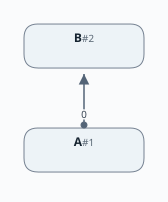
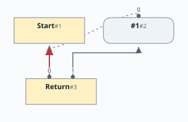

# 第1章：導入

[English](README.md) | 日本語

この文書は [Chapter 1: Introduction](README.md) の日本語訳です。

[はじめに](../README.ja.md) |
[次の章：第2章](../chapter02/README.ja.md)

# 目次

1. [実装言語](#実装言語)
2. [前提](#前提)
3. [アーキテクチャ](#アーキテクチャ)
4. [ノードのグラフとしての中間表現](#ノードのグラフとしての中間表現)
5. [ノードはグラフを構成する](#ノードはグラフを構成する)
6. [ノードの種類](#ノードの種類)
7. [一意なノード ID](#一意なノード-id)
8. [Start ノード](#start-ノード)
9. [Constant ノード](#constant-ノード)
10. [Return ノード](#return-ノード)
11. [表現](#表現)
12. [参考文献](#参考文献)

[linear](https://github.com/SeaOfNodes/Simple/tree/linear) ブランチの直線的な Git の変更履歴をたどって
[この章](https://github.com/SeaOfNodes/Simple/tree/linear-chapter01)を読むこともできます。

この章では、次のような単純なスクリプトをコンパイルすることを目指します。

```
return 1;
```

`return` 文を実装します。`return` 文は引数として `expression` を受け取ります。
上の例のように、扱える `expression` の種類は整数リテラルだけです。

この単純な言語を実装するために、いくつかの主要な構成要素とデータ構造を導入します。

この章の[言語の文法全体](docs/01-grammar.ja.md)はこちらです。

## 実装言語

実装言語は Java です。広く利用でき、多くの人に知られているため、Java を選びました。

## 前提

読者が従来の線形な中間表現を理解し、基本ブロック（Basic Block）や
制御フローグラフ（Control Flow Graph）などの用語に馴染みがあることを前提としています。
ここではこれらの話題を説明しません。必要であれば、標準的なコンパイラの教科書を参照してください。

## アーキテクチャ

言語を解析しながら、Sea of Nodes（SoN）の中間表現を直接構築します。
抽象構文木（AST）による表現は作りません。これは SoN IR の大きな利点の1つ、
つまり言語の解析中にさまざまな悲観的ピープホール最適化を行えることを示すためです。
この点は[第2章](../chapter02/README.ja.md)以降でさらに詳しく説明します。
最終的には、型解析のパスを必要とせずに、プログラム全体の型付けができるようになります。

### ノードのグラフとしての中間表現

中間表現は Node オブジェクトのグラフです。`Node` クラスは、IR グラフ内のオブジェクトの基底型です。
`Node` クラスは、すべてのサブタイプに継承される共通機能を提供します。
サブタイプは、それぞれに対応する意味を実装します。たとえば、AddNode は加算し、MulNode は乗算します。

各 `Node` は、従来の IR に現れるような「命令」を表します。

### ノードはグラフを構成する

Sea of Nodes IR の中心的な考え方は、各ノードが定義と使用（def-use）の依存関係によって
ほかのノードと結ばれていることです。これは IR の非常に重要で基本的な側面なので、
その実装方法と、グラフ図での表し方を理解することが重要です。

基底クラス `Node` は、そのノードへの入力となるノードのリストを保持します。
入力とは、「使用（use）」から「定義（def）」へのエッジです。
つまり、`B` が定義で、`A` が `B` を使用する場合、`B` には `B` から `A` への def→use エッジがあり、
それに対応して `A` には `A` から `B` への入力の use→def エッジがあります。

図では、「使用」から「定義」への矢印を描きます。次はその例です。



実装では、`Node` 型は両方向のリンクを保持します。上の例では、次のようになります。

* `A` は `B` の「使用」なので、`B` は `A` の入力リストに含まれます。
* 逆に、`B` は出力リストを保持し、そのリストには `A` が含まれます。
* これらのエッジが常に対応していることが、重要な不変条件です。

`Node` クラスでは、次のようになっています。

```java
public abstract class Node {

    /**
     * Inputs to the node. These are use-def references to Nodes.
     * <p>
     * Generally fixed length, ordered, nulls allowed, no unused trailing space.
     * Ordering is required because e.g. "a/b" is different from "b/a".
     * The first input (offset 0) is often a Control node.
     */
    public final ArrayList<Node> _inputs;

    /**
     * Outputs reference Nodes that are not null and have this Node as an
     * input.  These nodes are users of this node, thus these are def-use
     * references to Nodes.
     * <p>
     * Outputs directly match inputs, making a directed graph that can be
     * walked in either direction.  These outputs are typically used for
     * efficient optimizations but otherwise have no semantic meaning.
     */
    public final ArrayList<Node> _outputs;
}
```

### ノードの種類

中間表現には、2種類のノードがあります。

* **制御ノード**：コンパイルしたプログラムの制御フローグラフ（CFG）を表します。
* **データノード**：データの意味を表します。

この章には、次の制御ノードとデータノードが登場します。

| ノード名 | 種類 | 説明 | 入力 | 値 |
|----------|------|------|------|----|
| Start | 制御 | 関数の開始 | なし | まだ関数の引数がないため、現時点ではなし |
| Return | 制御 | 関数の終了を表す | 先行する制御ノードと、値を供給するデータノード | 関数の戻り値 |
| Constant | データ | 整数リテラルなどの定数を表す | なし。ただし、グラフをたどれるように Start ノードを入力に設定する | 定数の値 |

従来の基本ブロックでは、命令は順番に実行されます。Sea of Nodes モデルでは、
グラフのエッジとして明示されているノード間の依存関係（制御依存関係を含む）だけに基づく
スケジューリングアルゴリズムが、命令の正しい順序を決めます。
すべての依存関係を常に参照できるため、非常に低いコスト
（ほぼ常に小さな定数時間）で多くの最適化を行えます。

### 一意なノード ID

各ノードには、作成時に一意な、密に割り当てられた整数のノード ID を付けます。
この ID はデバッグや効率的な等価性の判定、たとえばビットベクトルへの添字として役立ちます。
ビットベクトルを使うと、循環を含む可能性のあるグラフを効率的に訪問できます。
ノードの等価性については[第9章](../chapter09/README.ja.md)で説明します。

### Start ノード

Start ノードは、関数の開始を表します。関数がまだパラメータを受け取らないため、現時点では Start に入力はありません。
パラメータを追加すると、Start の値はタプルになり、その値を取り出すために射影（Projection）が必要になります。
これについては[第4章](../chapter04/README.ja.md)で詳しく説明します。

### Constant ノード

Constant ノードは定数値を表します。現時点で許す定数は整数リテラルだけなので、Constant は整数値を保持します。
ほかの種類の定数を追加する際には、Constant の表現方法をリファクタリングします。

定数には意味上の入力はありません。ただし、グラフを順方向にたどれるようにするために、
Start を Constant の入力に設定します。このエッジには意味上の役割はなく、
ノードを訪問できるようにするため*だけ*に存在します。

Constant の値は、そこに格納されている値です。

### Return ノード

Return ノードには2つの入力があります。第1の入力は制御ノードで、
第2の入力は戻り値を供給するデータノードです。

この章では複数の `return` 文を使えないため、Return がプログラムを終了します。
Stop ノードは、`if` 文を実装する[第5章](../chapter05/README.ja.md)で導入します。

Return の出力は、データノードから得られる値です。

### 表現

次のプログラムを可視化します。

```
return 1;
```



* 制御ノードは、背景が薄い黄色の長方形で示しています。
* 制御エッジは赤色で、データエッジより太く描いています。
* Constant から Start へのエッジは、本当の制御エッジではないため、灰色の破線で示しています。
* 各エッジには、`_inputs` 配列内での位置をラベルとして付けています。したがって `0` は、そのエッジが `_inputs[0]` であることを意味します。

## 参考文献

データ構造は、次の論文で説明されている内容に基づいています。

* [From Quads to Graphs: An Intermediate Representation's Journey](http://softlib.rice.edu/pub/CRPC-TRs/reports/CRPC-TR93366-S.pdf)
* [Combining Analyses, Combining Optimizations](https://dl.acm.org/doi/pdf/10.1145/201059.201061)
* [A Simple Graph-Based Intermediate Representation](https://www.oracle.com/technetwork/java/javase/tech/c2-ir95-150110.pdf)
* [Global Code Motion Global Value Numbering](https://courses.cs.washington.edu/courses/cse501/06wi/reading/click-pldi95.pdf)
* [EasySSA](https://www.dropbox.com/scl/fi/0ww4sgl3ynep9hhe3i4xn/EasySSA.pdf?rlkey=2cp78hzxke62flkmyneiebzoz&dl=0)
* [SeaOfNodes](https://www.dropbox.com/scl/fi/cxykfvlzsmlcatyg6rlbt/SeaOfNodes.pdf?rlkey=z6o7y3rwr6atrejilcze6r8x0&e=1&dl=0)

これらに倣い、中間表現をオブジェクト指向のデータモデルで表します。
以降で、この表現の詳細を説明します。
