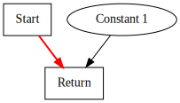

# Chapter 1

In this chapter we aim to compile simple scripts such as:

```
return 1;
```

We implement the `return` statement.
The `return` statement accepts an `expression` as an argument.
The only `expression` type is an integer literal, as shown in the example above. 

Here is the [complete language grammar](docs/01-grammar.md) for this chapter. 

To implement this simple language, we introduce a few key components and data structures.

## Implementation Language

Our implementation language is Java. We chose Java as it is widely available and understood.

## Assumptions

We assume that the reader is familiar with traditional linear intermediate representations, and is familiar with terms such as Basic Block, Control Flow Graph, etc. No attempt is made to explain these topics.
If necessary the reader can consult a standard compiler text book.

## Architecture

We design our parser and compiler to illustrate some key aspects of the Sea of Nodes
Intermediate Representation: 

* We construct the intermediate Sea of Nodes representation directly as we parse the language. There is no Abstract Syntax Tree representation.

* The compiler will perform a few basic local optimizations as we build the IR; this is a key benefit of the Sea of Nodes IR. This aspect is more fully explored from Chapter 2 onwards.

## Data Structures

Our data structures are based upon the descriptions provided in following papers:

* [From Quads to Graphs: An Intermediate Representation's Journey](http://softlib.rice.edu/pub/CRPC-TRs/reports/CRPC-TR93366-S.pdf)
* [Combining Analyses, Combining Optimzations](https://scholarship.rice.edu/bitstream/handle/1911/96451/TR95-252.pdf)
* [A Simple Graph-Based Intermediate Representation](https://www.oracle.com/technetwork/java/javase/tech/c2-ir95-150110.pdf)
* [Global Code Motion Global Value Numbering](https://courses.cs.washington.edu/courses/cse501/06wi/reading/click-pldi95.pdf)

Following the lead from above, we represent our intermediate representation using an object oriented data model. Details of the
representation follow.

### Intermediate Representation as a Graph of Nodes

The intermediate representation is a graph of Node objects. The `Node` class is the base type for objects in the IR graph.
The `Node` class provides common capabilities that are inherited by all subtypes. 
Each subtype implements semantics relevant to that subtype.

There are two types of Nodes in the representation.

* **Control Nodes** - these represent the control flow subgraph (CFG) of the compiled program
* **Data Nodes** - these capture the data semantics

The following control and data nodes appear in this chapter.

| Node Name | Type    | Description                                   | Inputs                                                           | Value                                                 |
|-----------|---------|-----------------------------------------------|------------------------------------------------------------------|-------------------------------------------------------|
| Start     | Control | Start of function                             | None                                                             | None for now as we do not have function arguments yet |
| Return    | Control | Represents the termination of a function      | Predecessor control node, Data node value                        | Return value of the function                          |
| Constant  | Data    | Represents constants such as integer literals | None, however Start node is set as input to enable graph walking | Value of the constant                                 |

All control nodes implement a marker interface named `Control`.

Within a traditional basic block, instructions are executed in sequence. In the Sea of Nodes model, the correct sequence of instructions is determined by a scheduling 
algorithm that depends only on dependencies between nodes (including control dependencies) that are explicit as edges in the graph. This enables a number of optimizations 
at very little cost (nearly always small constant time) because all dependencies are always available.

### Unique Node ID

Each node is assigned a unique dense integer Node ID when created. This ID is useful for debugging and e.g. as 
an index into a bit vector, which in turn is used to efficiently visit a (possibly cyclic) graph. 
The ID is also used to efficiently compute equality of nodes; a subject that we discuss in Chapter 8 Global Value Numbering. 

### Start Node

The Start node represents the start of the function. For now, we do not have any values in the Start node, this is because our function does not 
yet accept parameters. When we add parameters, the value of the Start node will be a tuple, and will require Projection nodes to extract the values. 
We discuss this in detail in Chapter 9: Functions and Calls.

### Constant Node

The Constant node represents a constant value. At present, the only constants that we allow are integer literals; therefore the Constant node contains
an integer value. As we add other types of constants, we will need to refactor how we represent Constant nodes.

The Constant node has no inputs. However, we set the Start node as an input to the Constant node to enable forward graph walk. This edge carries no semantic meaning,
it is present _solely_ to allow visitation.

The Constant node's output is the value stored in it.

### Return Node

The Return node has two inputs. The first input is a control node. The second input is the data node that supplies the return value.

The output of the Return node is the value it obtained from the data node.

### Representation

Here is visualization of the program:

```
return 1;
```



* Control nodes appear as square boxes
* Control edges are in bold red