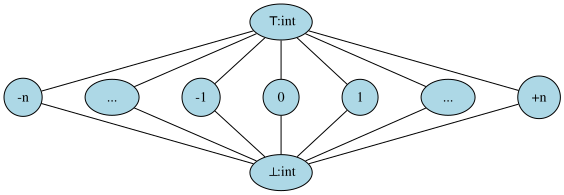
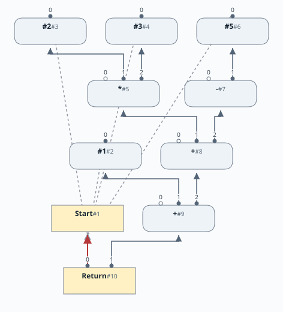
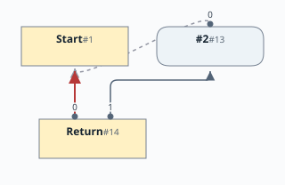
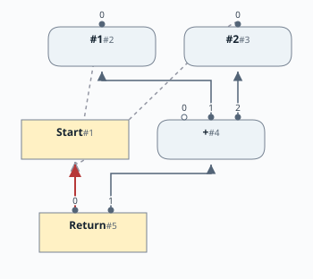
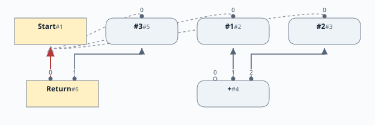
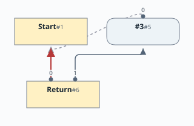

# 第2章：算術演算

[English](README.md) | 日本語

この文書は [Chapter 2: Arithmetic](README.md) の日本語訳です。

[前の章：第1章](../chapter01/README.ja.md) |
[次の章：第3章](../chapter03/README.ja.md)

# 目次

1. [中間表現の拡張](#中間表現の拡張)
2. [ピープホール最適化](#ピープホール最適化)
3. [定数畳み込みと定数伝播](#定数畳み込みと定数伝播)
4. [ピープホール最適化前のノード](#ピープホール最適化前のノード)
5. [ピープホール最適化後](#ピープホール最適化後)
6. [実例](#実例)
7. [実装上の注意](#実装上の注意)

[linear](https://github.com/SeaOfNodes/Simple/tree/linear) ブランチの直線的な Git の変更履歴をたどって
[この章](https://github.com/SeaOfNodes/Simple/tree/linear-chapter02)を読むことも、
前の章との[差分](https://github.com/SeaOfNodes/Simple/compare/linear-chapter01...linear-chapter02)を見ることもできます。

この章では言語の文法を拡張し、加算、減算、乗算、除算、単項マイナスといった算術演算を扱えるようにします。
これにより、次のような文を書けるようになります。

```
return 1 + 2 * 3 + -5;
```

この章の[言語の文法全体](docs/02-grammar.ja.md)はこちらです。

## 中間表現の拡張

次のノード型を追加して、ノードの種類を増やします。

| ノード名 | 種類 | 説明 | 入力 | 値 |
|----------|------|------|------|----|
| Add | データ | 2つの値を加算する | 2つのデータノード。値を加算する。順序は問わない | 加算の結果 |
| Sub | データ | ある値から別の値を減算する | 2つのデータノード。値を減算する。順序が重要 | 減算の結果 |
| Mul | データ | 2つの値を乗算する | 2つのデータノード。値を乗算する。順序は問わない | 乗算の結果 |
| Div | データ | ある値を別の値で除算する | 2つのデータノード。値を除算する。順序が重要 | 除算の結果 |
| Minus | データ | 値の符号を反転する | 1つのデータノード。値の符号を反転する | 単項マイナスの結果 |

[第1章](../chapter01/README.ja.md)のノードである Start、Return、Constant は引き続き使います。

## ピープホール最適化

グラフ内のノードには、ピープホール最適化を適用できます。
グラフの小さな部分を「のぞき穴（peephole）」から見るように調べ、
特定のパターンが見つかれば、その部分のグラフを書き換えます。

構文解析中は、こうしたピープホール最適化の条件を調べて適用することが特に簡単です。
解析したばかりの構文から作られたノードには、まだそれを使うノードがないため、
「書き換え」の手間がかからないからです。グラフに組み込む前に、その場でノードを置き換えるだけです。

この置き換えによって、置き換え前のノードの入力のうち、使われなくなったものを*削除（kill）*できる場合があります。
つまり、構文解析中に小規模なデッドコード除去を行うことになります。

たとえば、すでに定数 `1` と定数 `2` を解析したとします。
続いて `Add(1,2)` を解析すると、定数の計算に対するピープホール規則が Add を定数 `3` に置き換えます。
この時点で、使われなくなった `Add` も*削除*します。
その結果、使われなくなった定数 `1` と `2` も再帰的に*削除*できる場合があります。

## 定数畳み込みと定数伝播

この章と次の章では、ピープホール最適化の中でも定数畳み込みと定数伝播に注目します。
[第4章](../chapter04/README.ja.md)までは定数以外の値が登場しないため、
ここで主に示すのは定数畳み込みです。ただし、第4章への準備として、
この段階でコンパイラにいくつかの考え方を導入します。

プログラムのさまざまな箇所で、ノードの値が定数かどうかをコンパイラが把握していると便利です。
その情報を使うと、次のような最適化を行えます。

* コンパイル時に式を評価し、その式を定数に置き換える。
  この考え方はさまざまな形に拡張でき、[部分評価（Partial Evaluation）](https://en.wikipedia.org/wiki/Partial_evaluation)と呼ばれます。
* 条件分岐で常に同じ側の分岐が選ばれる場合などに、実行されず不要になったコード領域を特定する
  （[第6章](../chapter06/README.ja.md)）。
* ポインタが null でないと分かっている場合に、null チェックを省略する
  （[第10章](../chapter10/README.ja.md)）。
* 配列の添字が範囲内にあると分かっている場合に、範囲チェックを省略する。
* ノードが取り得る値の集合について詳しく分かれば、さらに多くの最適化が可能になる。

これらを実現するには、ノードが実行時にどのような値を取り得るのかを表す方法が必要です。
これを型（Type）と呼び、ノードに型を付与します。

型の付与には、2つの目的があります。

* ノードに対して許される操作の集合を定義する。
* ノードが取り得る値の集合を定義する。

型そのものは Java のクラスで表します。Java のクラスを使うと、型の構造を簡単に表せます。
すべての型は `Type` クラスのサブタイプです。現時点では、型の階層は次のものだけです。

```
Type
+-- TypeInteger
```

あるノードの型に対応する値の集合は、[束（lattice）](https://en.wikipedia.org/wiki/Lattice_(order))を使うと
扱いやすくなります。ここで使う束は次の構造を持ちます。



この束の要素は、次の3種類に分かれます。

* 最上位の要素は「トップ（top）」で、⊤ と表します。
  ⊤ を付与することは、そのノードの値がコンパイル時定数かもしれないし、そうでないかもしれないことを意味します。
* 中間の要素はすべて定数です。
* 最下位の要素は「ボトム（bottom）」で、⊥ と表します。
  ⊥ を付与することは、そのノードの値がコンパイル時定数では**ない**と分かっていることを意味します。

ピープホール最適化の不変条件の1つは、ノードの型が常に束の*上方向*（「トップ」の方向）に移動することです。
ピープホール最適化は*悲観的*で、より良い状態を証明できるまでは最悪の状態を仮定します。
後の章で扱う*楽観的*な最適化では、すべてのノードをトップから始め、
楽観的な仮定が誤りだと分かるにつれて、型を束の下方向に移動させます。

束はコンパイラに行わせたい主要な最適化の中核になることが多いため、
後の章ではこの束を拡張する方法を探ります。

すべてのノードに `_type` フィールドを追加し、現時点で計算された最も精度の高い `Type` を格納します。
このフィールドは、最適化処理の実行時間を線形に保つために必要です。
また、後の章で楽観的な定数伝播
（[疎な条件付き定数伝播（Sparse Conditional Constant Propagation）](https://en.wikipedia.org/wiki/Sparse_conditional_constant_propagation)）を行う際にも必要になります。

`Start` と `Return` にも `_type` フィールドを追加し、後にはすべての制御ノードに追加します。
Sea of Nodes は制御とデータを区別しないからです。
どちらのノードにも同じようにピープホール最適化が適用されます。
これについては[第4章](../chapter04/README.ja.md)と[第5章](../chapter05/README.ja.md)から説明します。

束には、「meet（交わり）」や「join（結び）」という演算子とその規則など、ほかにも重要な性質があります。
これらは[第4章](../chapter04/README.ja.md)と[第10章](../chapter10/README.ja.md)で説明します。

## ピープホール最適化前のノード

次の模式図は、ピープホール最適化による畳み込み前の演算を示しています。
パーサーは各ノードを構築した時点で最適化するので、この中間グラフ全体が保持されるわけではありません。

```java
return 1 + 2 * 3 + -5;
```



* 制御ノードは、背景が薄い黄色の長方形で示しています。
* 制御エッジは赤色です。
* Constant から Start へのエッジは、本当の制御エッジではないため、灰色の破線で示しています。
* 各エッジには、そのノードの入力リスト内での位置をラベルとして付けています。

## ピープホール最適化後



## 実例

最適化の動作を示すために、次のコードを考えます。

```
return 1+2;
```

これは次のように解析されます。

```java
        var lhs = parseMultiplication();
        if (match("+")) return new AddNode(lhs, parseAddition()).peephole();
```

AddNode ノードの `peephole` が呼ばれると、まず `compute` 関数を呼び出します。

```java
    public final Node peephole( ) {
        // Compute initial or improved Type
        Type type = _type = compute();
```

```java
    public Type compute() {
        if( in(1)._type instanceof TypeInteger i0 &&
            in(2)._type instanceof TypeInteger i1 ) {
            if (i0.isConstant() && i1.isConstant())
                return TypeInteger.constant(i0.value()+i1.value());
        }
        return Type.BOTTOM;
    }
```

この例では、両方のオペランド（`1` と `2`）が定数であり、その型は `TypeInteger` のインスタンスです。
`compute` は型を返します。両方のオペランドが定数だと分かっているので、
式の結果を計算する定数伝播・定数畳み込みを行い、`1+2` を `3` に置き換えられます。

`TypeInteger` クラスは `Type` を継承していますが、その型で確認された値を格納するフィールドも持っています。

```java
    private final long _con;
```

AddNode は次の構造を持ちます。



両方のオペランドの値が分かっているので、それらを加算し、
元のノードを、式の結果だけを保持する定数ノードに置き換えられます。

そのためには、ノードについて計算した型がすでに定数である一方、
ノード自体はまだ定数ノードのインスタンスではないことを検出する必要があります。

これは次のように判定できます。

```java
// Replace constant computations from non-constants with a constant node
if (!(this instanceof ConstantNode) && type.isConstant()) {
    ....
}
```

定数畳み込みの際に、定数を表す型を返していることに注目してください。

```java
return TypeInteger.constant(i0.value()+i1.value());
```

定数ノードは次のように作成できます。

```java
return new ConstantNode(type).peephole();
```

これによって、ピープホールのアルゴリズムが再帰的に呼び出されます。
結果は次のようになります。



定数値 `3` を保持する定数ノードが追加されたことに注目してください。
残っている加算ノードは使われていないので、削除できます。

先に `kill` 関数を呼び出すことができます。

```java
// Replace constant computations from non-constants with a constant node
if (!(this instanceof ConstantNode) && type.isConstant()) {
     kill();             // Kill `this` because replacing with a Constant
     return new ConstantNode(type).peephole();
```

これによって、取り残された加算ノードを削除します。

```java
public void kill( ) {
  assert isUnused();      // Has no uses, so it is dead
  for( int i=0; i<nIns(); i++ )
        setDef(i,null);  // Set all inputs to null, recursively killing unused Nodes

  _inputs.clear();
  _type=null;             // Flag as dead
  assert isDead();        // Really dead now
}
```

`isUnused` は、現在のノードに出力（このノードを使うノード）がないことを確認します。
この例では、return 文が加算式を使うため、通常なら出力が1つあるはずです。
しかし、最適化は Return ノードを作る前に行われるので、
この時点では加算ノードを使うノードはありません。

したがって、そのノードを問題なく削除できます。

```java
for(int i=0; i<nIns(); i++ )
    setDef(i,null);  // Set all inputs to null, recursively killing unused Nodes

_inputs.clear();
_type=null;
```

最終的に、次のようになります。



## 実装上の注意

### *値*の等価性と*参照*の等価性

Simple の大部分では、ノードの検索（`find()` の呼び出し）に*参照*の等価性を使います。
これが圧倒的に多いケースです。[第9章](../chapter09/README.ja.md)で初めて*値*の等価性を導入します。
どちらの場合も、値の等価性と参照の等価性のどちらを使うかは意図的に選んでいます。
「どちらか適当に選ぶ」ことが正しいケースは*決して*ありません。
迷ったら文脈を確認してください。値の等価性を使うのは*大域的値番号付け（Global Value Numbering）*だけです。
それ以外では、参照の等価性を意味しています。
