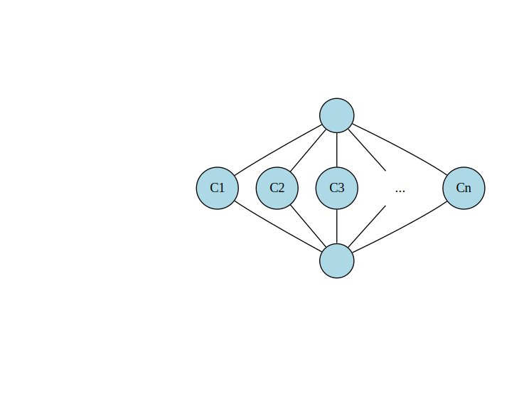

# Chapter 2

In this chapter we extend the language grammar to include arithmetic operations such as addition, subtraction,
multiplication, division, and unary minus. This allows us to write statements such as:

```
return 1 + 2 * 3 + -5;
```

Here is the [complete language grammar](docs/02-grammar.md) for this chapter. 

## Extensions to Intermediate Representation

In [Chapter 1](../chapter01/README.md) we introduced following nodes.

| Node Name | Type    | Description                        | Inputs                                                           | Value                                                 |
|-----------|---------|------------------------------------|------------------------------------------------------------------|-------------------------------------------------------|
| Start     | Control | Start of function                  | None                                                             | None for now as we do not have function arguments yet |
| Return    | Control | End of function                    | Predecessor control node, Data node value                        | Return value of the function                          |
| Constant  | Data    | Constants such as integer literals | None, however Start node is set as input to enable graph walking | Value of the constant                                 |

We extend the set of nodes by adding following additional node types.

| Node Name  | Type | Description                   | Inputs                                                     | Value                       |
|------------|------|-------------------------------|------------------------------------------------------------|-----------------------------|
| Add        | Data | Add two values                | Two data nodes, values are added, order not important      | Result of the add operation |
| Sub        | Data | Subtract a value from another | Two data nodes, values are subtracted, order matters       | Result of the subtract      |
| Mul        | Data | Multiply two values           | Two data nodes, values are multiplied, order not important | Result of the multiply      |
| Div        | Data | Divide a value by another     | Two data nodes, values are divided, order matters          | Result of the division      |
| UnaryMinus | Data | Negate a value                | One data node, value is negated                            | Result of the unary minus   |

## Peephole Optimizations

Nodes in the graph can be peephole-optimized.  The graph is viewed through a
"peephole", a small chunk of graph, and if a certain pattern is detected we
locally rewrite the graph.

During parsing, these peephole optimizations are particularly easy to check and
apply: there are no uses (yet) of a just-created Node from a just-parsed piece
of syntax, so there's no effort to the "rewrite" part of the problem. We just
replace in-place before installing Nodes into the graph.

This replacement might allow us to *kill* the unused inputs from the replaced
Node, basically doing a modest Dead Code Elimination during parsing.

E.g. Suppose we already parsed out a constant `1`, and a constant `2`; then when we
parse an `Add(1,2)`, the peephole rule for constant math replaces the Add with a
constant `3`.  At this point, we also *kill* the unused `Add`, which recursively
may *kill* the unused constants `1` and `2`.


## Constant Folding and Constant Propagation

In this chapter and next we focus on a particular peephole optimization:
constant folding and constant propagation.  Since we do not have non-constant values
until [Chapter 4](../chapter04/README.md), the main feature we demonstrate now is constant folding.
However, we introduce some additional ideas into the compiler at this stage, to
set the scene for Chapter 4.

It is useful for the compiler to know at various points of the program whether
a node's value is a constant. The compiler can use this knowledge to perform various
optimizations such as:

* Evaluate expressions at compile time and replace an expression with a constant
* The compiler may be able to identify regions of code that are dead and no
  longer needed, such as when a conditional branch always take one of the
  branches
* Pointers may be known to be not-null, and a null check can be skipped.
* Array indices may be known to be in-range, and a range check can be skipped
* Many additional optimizations are possible when the compiler learns more
  about the possible set of Node values

In order to achieve above, we annotate Nodes with Types.

The Type annotation serves two purposes:

* it defines the set of operations allowed on the Node
* it defines the set of values the Node takes on

The type itself is identified by the Java class sub-typing relationship; all
types are subtypes of the class `Type`.  For now, we only have the following
hierarchy of types:

```
Type
+-- TypeInteger
```

It turns out that the set of values associated with a Type at a specific Node
can be conveniently represented as a "lattice". Our lattice has the following
structure:



Our lattice elements can be one of three types:

* the highest element is "top", denoted by T.
* The lowest is bottom, denoted by ⊥,
* All elements in the middle are constants.

Assigning ⊥ means that the Node's value is known to be not a compile time
constant, whereas assigning T means that the Node's value may be some (as yet)
undetermined constant.  The transition of the Node's type can occur from T to
some constant to ⊥.

In later chapters we will explore extending this lattice, as it frequently
forms the heart of core optimizations we want our compiler to do.

There are other important properties of the Lattice that we discuss in [Chapter
4](../chapter04/README.md), such as the "meet" operator and its rules.


## Nodes Pre Peephole Optimization

The following visual shows how the graph looks like pre-peephole optimization:


* Control nodes appear as square boxes
* Control edges are in bold red
* The edges from Start to Constants are shown in dotted lines as these are not true def-use edges

## Post-peephole

