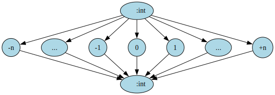
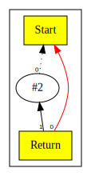

# Chapter 2: Arithmetic


# Table of Contents

1. [Extensions to Intermediate Representation](#extensions-to-intermediate-representation)
2. [Peephole Optimizations](#peephole-optimizations)
3. [Constant Folding and Constant Propagation](#constant-folding-and-constant-propagation)
4. [Nodes Pre Peephole Optimization](#nodes-pre-peephole-optimization)
5. [Post-peephole](#post-peephole)
6. [Demonstration](#demonstration)

You can also read [this chapter](https://github.com/SeaOfNodes/Simple/tree/linear-chapter02) in a linear Git revision history on the [linear](https://github.com/SeaOfNodes/Simple/tree/linear) branch and [compare](https://github.com/SeaOfNodes/Simple/compare/linear-chapter01...linear-chapter02) it to the previous chapter.


In this chapter we extend the language grammar to include arithmetic operations such as addition, subtraction,
multiplication, division, and unary minus. This allows us to write statements such as:

```
return 1 + 2 * 3 + -5;
```

Here is the [complete language grammar](docs/02-grammar.md) for this chapter.

## Extensions to Intermediate Representation

In [Chapter 1](../chapter01/README.md) we introduced following nodes.

| Node Name | Type    | Description                        | Inputs                                                           | Value                                                 |
|-----------|---------|------------------------------------|------------------------------------------------------------------|-------------------------------------------------------|
| Start     | Control | Start of function                  | None                                                             | None for now as we do not have function arguments yet |
| Return    | Control | End of function                    | Predecessor control node, Data node value                        | Return value of the function                          |
| Constant  | Data    | Constants such as integer literals | None, however Start node is set as input to enable graph walking | Value of the constant                                 |

We extend the set of nodes by adding following additional node types.

| Node Name | Type | Description                   | Inputs                                                     | Value                       |
|-----------|------|-------------------------------|------------------------------------------------------------|-----------------------------|
| Add       | Data | Add two values                | Two data nodes, values are added, order not important      | Result of the add operation |
| Sub       | Data | Subtract a value from another | Two data nodes, values are subtracted, order matters       | Result of the subtract      |
| Mul       | Data | Multiply two values           | Two data nodes, values are multiplied, order not important | Result of the multiply      |
| Div       | Data | Divide a value by another     | Two data nodes, values are divided, order matters          | Result of the division      |
| Minus     | Data | Negate a value                | One data node, value is negated                            | Result of the unary minus   |


## *Value* equality vs *Reference* equality

In much of Simple, Nodes are looked up (`find()` calls) via *reference*
equality.  This is by far the most common case.  In [Chapter
9](../chapter09/README.md) we introduce *value* equality for the first time.
In both cases the choice of value-vs-reference equality is intentional: it is
*never* correct to "just pick one or the other kind of equality".  When in
doubt check the context: only *Global Value Numbering* uses value equality;
everywhere we mean reference equality.


## Peephole Optimizations

Nodes in the graph can be peephole-optimized.  The graph is viewed through a
"peephole", a small chunk of graph, and if a certain pattern is detected we
locally rewrite the graph.

During parsing, these peephole optimizations are particularly easy to check and
apply: there are no uses (yet) of a just-created Node from a just-parsed piece
of syntax, so there's no effort to the "rewrite" part of the problem. We just
replace in-place before installing Nodes into the graph.

This replacement might allow us to *kill* the unused inputs from the replaced
Node, basically doing a modest Dead Code Elimination during parsing.

E.g. Suppose we already parsed out a constant `1`, and a constant `2`; then when we
parse an `Add(1,2)`, the peephole rule for constant math replaces the Add with a
constant `3`.  At this point, we also *kill* the unused `Add`, which recursively
may *kill* the unused constants `1` and `2`.


## Constant Folding and Constant Propagation

In this chapter and next we focus on a particular peephole optimization:
constant folding and constant propagation.  Since we do not have non-constant values
until [Chapter 4](../chapter04/README.md), the main feature we demonstrate now is constant folding.
However, we introduce some additional ideas into the compiler at this stage, to
set the scene for Chapter 4.

It is useful for the compiler to know at various points of the program whether
a node's value is a constant. The compiler can use this knowledge to perform various
optimizations such as:

* Evaluate expressions at compile time and replace an expression with a
  constant.  This idea can be extended in a number of ways and is called
  [Partial Evaluation](https://en.wikipedia.org/wiki/Partial_evaluation).
* The compiler may be able to identify regions of code that are dead and no
  longer needed, such as when a conditional branch always take one of the
  branches ([Chapter 6](../chapter06/README.md)).
* Pointers may be known to be not-null, and a null check can be skipped ([Chapter 10](../chapter10/README.md)).
* Array indices may be known to be in-range, and a range check can be skipped.
* Many additional optimizations are possible when the compiler learns more
  about the possible set of Node values.

In order to achieve above, we need a way to talk about what kinds of values a Node can take
on at runtime - we call these Types, and we annotate Nodes with Types.

The Type annotation serves two purposes:

* it defines the set of operations allowed on the Node
* it defines the set of values the Node takes on

The Type itself is represented as a Java class; the Java classes are used as
convenient to represent the Type's structure; all types are subtypes of the
class `Type`.  For now, we only have the following hierarchy of types:

```
Type
+-- TypeInteger
```

It turns out that the set of values associated with a Type at a specific Node
can be conveniently represented as a *lattice* 
[wiki/Lattice_(order)](https://en.wikipedia.org/wiki/Lattice_(order)).  Our lattice has the following structure:



Our lattice elements can be one of three types:

* The highest element is "top", denoted by ⊤; assigning ⊤ means that the Node's
  value may or may not be a compile time constant.
* All elements in the middle are constants.
* The lowest is "bottom", denoted by ⊥; assigning ⊥ means that we know that the
  Node's value is **not** a compile time constant.

An invariant of peephole optimizations is that the type of a Node always moves
*up* the lattice (towards "top"); peepholes are *pessmistic* assuming the worst
until they can prove better.  A later *optimistic* optimization will start all
Nodes at *top* and move Types *down* the lattice as eager assumptions are
proven wrong.

In later chapters we will explore extending this lattice, as it frequently
forms the heart of core optimizations we want our compiler to do.

We add a `_type` field to every Node, to store its current computed best
`Type`.  We need a field to keep the optimizer runtime linear, and later when
doing an optimistic version of constant propagation (called [Sparse Conditional
Constant Propagation](https://en.wikipedia.org/wiki/Sparse_conditional_constant_propagation)).

We add a `_type` field even to `Start` and `Return`, and later to all control
Nodes - because the Sea of Nodes does not distinguish between control and data.
Both nodes are equally peepholed and optimized, and this will be covered
starting in [Chapter 4](../chapter04/README.md) and [Chapter
5](../chapter05/README.md).


There are other important properties of the Lattice that we discuss in [Chapter
4](../chapter04/README.md) and [Chapter 10](../chapter10/README.md), such as the "meet" and "join" operators and their rules.


## Nodes Pre Peephole Optimization

The following visual shows how the graph looks like pre-peephole optimization:


* Control nodes appear as square boxes with yellow background
* Control edges are in bold red
* The edges from Constants to Start are shown in dotted lines as these are not true control edges
* We label each edge with its position in the node's list of inputs.


## Post-peephole




## Demonstration
To demonstrate how the optimisation works, let's consider the following code:
```
return 1+2;
```
This is parsed as: 
```java
        var lhs = parseMultiplication();
        if (match("+")) return new AddNode(lhs, parseAddition()).peephole();
```
When the peephole is called on the AddNode node it first calls the compute function:
```java
    public final Node peephole( ) {
        // Compute initial or improved Type
        Type type = _type = compute();
```
```java
    public Type compute() {
        if( in(1)._type instanceof TypeInteger i0 &&
            in(2)._type instanceof TypeInteger i1 ) {
            if (i0.isConstant() && i1.isConstant())
                return TypeInteger.constant(i0.value()+i1.value());
        }
        return Type.BOTTOM;
    }
```
In our case both of the operands(`1`, `2`) are constants, and instance of 
`TypeInteger`.
Since `compute` returns a type, and we know that both of our operands are constants, we can do
constant propagation/folding where we compute the result of the expression so that instead of having `1+2` we can 
have `3`.

The 'TypeInteger' interface inherits from type but also has a field that stores the value observed for that type.
```java
    private final long _con
```

AddNode has the layout:


Since, we already know the value of both of the operands, we can just add them together and replace the
old node with a constant node that just holds the result of the expression.

To do this - we have to recognize this happens when the type computed for the node is already a constant, but the node
is still not an instance of constant node.

This can be captured by:
```java
// Replace constant computations from non-constants with a constant node
if (!(this instanceof ConstantNode) && type.isConstant()) {
}
```
Note how we return a constant type when doing constant folding
```java
return TypeInteger.constant(i0.value()+i1.value());
```
We can create a constant node in the following way: 
```java
return new ConstantNode(type).peephole();
```
This recursively calls the peephole algorithm. 
Now, we end up with this:


Notice, how we added the constant node holding a constant value of `3`.
The remaining add node is unused and can be killed.

We can call the kill function before this way:
```java
// Replace constant computations from non-constants with a constant node
if (!(this instanceof ConstantNode) && type.isConstant()) {
     kill();             // Kill `this` because replacing with a Constant
     return new ConstantNode(type).peephole();
```
This is responsible for deleting the dangling add node.

```java
public void kill( ) {
  assert isUnused();      // Has no uses, so it is dead
  for( int i=0; i<nIns(); i++ )
        setDef(i,null);  // Set all inputs to null, recursively killing unused Nodes

  _inputs.clear();
  _type=null;             // Flag as dead
  assert isDead();        // Really dead now
}
```

`isUnused` - This makes sure the current node has no outputs.
Ideally, in our case there would be one output as the return statement is 
using the add expression.
However, the optimisation happens before even creating the return node, which means that at this point
there are no users of the add node.

We can now freely go ahead and delete the node. 

```java
for(int i=0; i<nIns(); i++ )
    setDef(i,null);  // Set all inputs to null, recursively killing unused Nodes

_inputs.clear();
_type=null;        
```

We finally end up with this:


