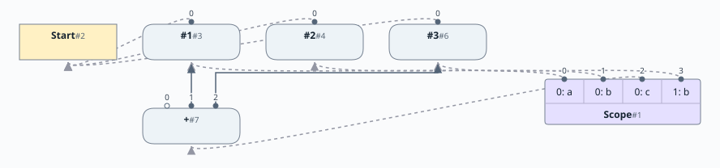
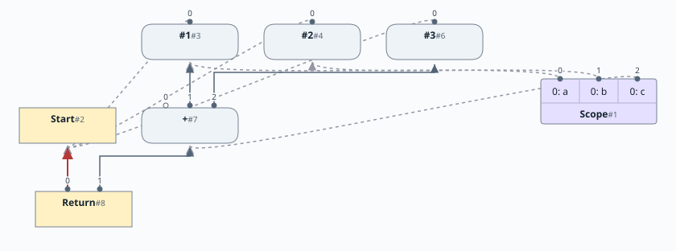
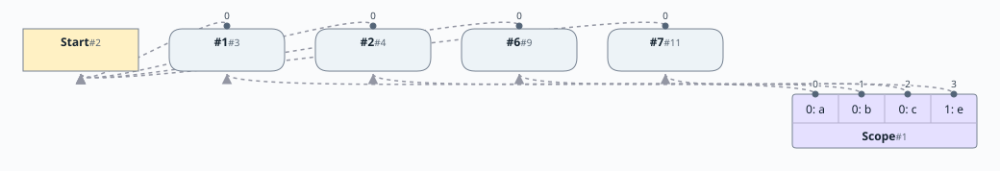
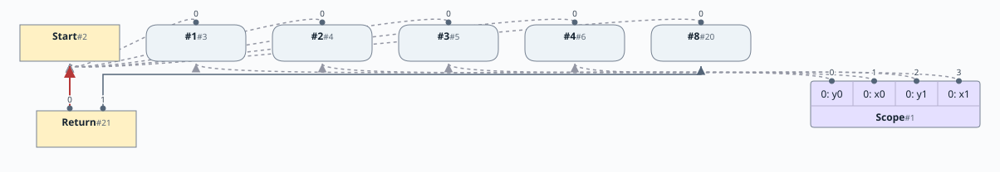

# 第3章: 変数宣言

[English](README.md) | 日本語

この文書は [原文](README.md) の日本語訳です。

[前の章: 第2章](../chapter02/README.ja.md) |
[次の章: 第4章](../chapter04/README.ja.md)

# 目次

1. [中間表現の拡張](#中間表現の拡張)
2. [シンボルテーブル](#シンボルテーブル)
3. [ScopeNode](#scopenode)
4. [実例](#実例)
5. [ピープホール最適化の有効化](#ピープホール最適化の有効化)

[linear](https://github.com/SeaOfNodes/Simple/tree/linear) ブランチの直線的な Git のリビジョン履歴で [この章](https://github.com/SeaOfNodes/Simple/tree/linear-chapter03) を読み、前の章と [比較](https://github.com/SeaOfNodes/Simple/compare/linear-chapter02...linear-chapter03) することもできます。

この章では、変数宣言を可能にするために言語の文法を拡張します。これにより、次のように書けます。

```
int a=1;
int b=2;
int c=0;
{
    int b=3;
    c=a+b;
}
return c;
```

この章の [完全な言語文法](docs/03-grammar.ja.md) はこちらです。

## 中間表現の拡張

この章では次のノードを導入します。

| ノード名 | 種類 | 説明 | 入力 | 値 |
|-----------|--------------|--------------------------------|---------------------------------|-------|
| Scope | シンボルテーブル | グラフ内のスコープを表す | 変数を定義するすべてのノード | なし |

前の章までのすべてのノードも引き続き使います。

## シンボルテーブル

変数宣言とレキシカルスコープをサポートするため、パーサーにシンボルテーブルを導入します。シンボルテーブルは名前をノードに対応付けます。

シンボルテーブルの *スタック* を管理します。新しいレキシカルスコープが作られると、新しいシンボルテーブルをスタックにプッシュします。スコープを抜けると、スタックの最上部にあるシンボルテーブルをポップします。

名前を宣言すると、現在のシンボルテーブルに追加されます。名前に代入すると、最も新しいシンボルテーブル内の対応付けが更新されます。名前を参照すると、シンボルテーブル内でその対応付けを検索します。検索はレキシカルな順序で、シンボルテーブルのスタックをさかのぼります。

## ScopeNode

ScopeNode は、レキシカルスコープの実装に使うシンボルテーブルのスタックをカプセル化します。

* レキシカルスコープ内の名前が参照するノードは、ScopeNode の入力になります。これにより ScopeNode がそれらの値の利用側となり、そのレキシカルスコープが生きている間、値も生存します。レキシカルスコープが終わると、これらの入力は取り除かれます。ピープホール最適化は死んだノードを削除し、新しいノードは生成直後には実質的に死んでいるため、これは極めて重要です。
* 分岐を実装する [第5章](../chapter05/README.ja.md) では、分岐点で ScopeNode を複製し、分岐が合流するときにマージします。これにより、それぞれの分岐で名前を独立して更新できます。マージ地点では、異なる値になった名前に Phi ノードが必要です。
* [第7章](../chapter07/README.ja.md) では、バックエッジからの Phi を扱う追加のロジックを導入します。
* ScopeNode は、[第4章](../chapter04/README.ja.md) からは制御トークン、[第10章](../chapter10/README.ja.md) からはメモリ全体など、ほかの値の追跡にも使われます。これらには特別な名前の束縛を使い、それぞれの名前を分岐をまたいで追跡し、マージ地点でマージします。
* [第10章](../chapter10/README.ja.md) では ScopeNode を拡張し、各名前の宣言された型も管理します。

実装上、各シンボルテーブルは `HashMap<String,Integer>` で表します。`String` は変数名で、`Integer` は ScopeNode の入力へのインデックスです。名前に対応するノードを取得するには、まずシンボルテーブルを調べ、次に ScopeNode の入力から必要なノードを取得します。シンボルテーブルのスタックは `Stack<HashMap<String,Integer>>` で表します。

レキシカルスコープを抜けるときは、そのスコープを表すシンボルテーブルをスタックからポップするだけでなく、対応する入力ノードも取り除きます。変数の式が Scope の対応付けのためだけに存在している場合（たとえば、その変数を使うコードをパーサーが解析する「かもしれない」ために保持していた場合）、この時点で式は死にます。

```
  int a=1;
  {
      int b=a*a*a;
  }  // When this scope closes and ends, b (and the cube of a) dies
  return a;
```

可視化では、ScopeNode を独立した紫色の箱で示します。各束縛には、そのレキシカルスコープの階層をラベルとして付けます。シンボルテーブルの各変数から、グラフ内の定義ノードへ向かうエッジを示します。

ScopeNode はデータノードでも制御ノードでもありません。シンボルテーブルの管理と名前の検索のための補助機構であり、どこに Phi ノードが必要かを決める重要な役割を果たします。ノードとして表すことで、Sea of Nodes の定義・使用（def-use）アーキテクチャを利用して、スコープ内の値の生存性を維持できます。

ScopeNode に出力はありません。

## 実例

次のコードから得られる出力を示します。

```
01      int a=1;
02      int b=2;
03      int c=0;
04      {
05          int b=3;
07          c=a+b;
08      }
09      return c;
```

* この例の解析を始めるとき、階層0のシンボルテーブルから始めます。変数 `a`、`b`、`c` をこのテーブルに登録します。
* 4行目では、入れ子のスコープを開始します。この時点で新しいシンボルテーブルを階層1にプッシュします。
* 5行目では、変数 `b` を宣言します。`b` を階層1のシンボルテーブルに登録し、2行目の同名の変数を隠します。
* 7行目では、変数 `c` を更新します。変数の検索では、階層0のシンボルテーブルにある `c` が見つかります。

次の模式図は、定数畳み込み前の変数の束縛と算術演算を示します。コンパイラはグラフを構築しながらピープホール最適化を適用するため、この例の実際の結果は `return 4;` です。



この図は ScopeNode の束縛をスコープの階層とともに示します。`b` の2つの束縛は、異なるレキシカルスコープに属しています。

* 8行目で入れ子のスコープを抜けると、階層1のシンボルテーブルをポップします。
* 9行目では、グラフは次のようになります。



この時点では、シンボルテーブルが1つだけ存在することがわかります。

プログラムの実行中には同じ階層のスコープが複数存在することもあります。ただし、各スコープ階層にはシンボルテーブルを1つしか保持できないため、同時に有効になるのは1つだけです。

たとえば、次のようになります。

```
01   int a=1;
02   int b=2;
03   int c=0;
04   {
05       int b=5;
06       c=a+b;
08   }
09   {
10       int e=6;
11       c = a+e;
13   }
14    return c;
```

ここでは `(04-08)` と `(09-13)` の2つのスコープは同じ階層にあります。

```java
public final Stack<HashMap<String, Integer>> _scopes;
```

`_scopes` スタックは入れ子のスコープを保持します。インデックス0が最上位の（グローバル）スコープを表し、より大きなインデックスがより深い入れ子のスコープを表します。ポップすると現在のスコープを返し、外側のスコープに移ります。各インデックスと対応するスコープには、直接の1対1の対応があります。

最初の入れ子のスコープ（04-08）:


2つ目の入れ子のスコープ（09-13）:



* どちらの場合も、スコープの深さを表すインデックスは1です。

## ピープホール最適化の有効化

ピープホール最適化を有効にすると、パーサーはすべての式を定数に簡約できます。次の例がその様子をよく示しています。

```
01      int x0=1;
02      int y0=2;
03      int x1=3;
04      int y1=4;
05      return (x0-x1)*(x0-x1) + (y0-y1)*(y0-y1);
```

この例のグラフを次に示します。



Return ノードのデータ値は定数 `8` です！ 解析が終わって階層0のスコープが取り除かれると、`return 8` だけが残ります。
