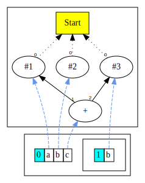
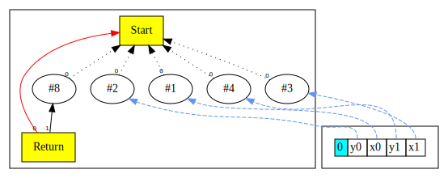

# Chapter 3: Variable Declarations

In this chapter we extend the language grammar to allow variable declarations. This allows us to write:

```
int a=1;
int b=2;
int c=0;
{
    int b=3;
    c=a+b;
}
return c;
```

Here is the [complete language grammar](docs/03-grammar.md) for this chapter.

## Extensions to Intermediate Representation

To recap, our list of Nodes are:

| Node Name | Type    | Description                        | Inputs                                                           | Value                                                 |
|-----------|---------|------------------------------------|------------------------------------------------------------------|-------------------------------------------------------|
| Start     | Control | Start of function                  | None                                                             | None for now as we do not have function arguments yet |
| Return    | Control | End of function                    | Predecessor control node, Data node value                        | Return value of the function                          |
| Constant  | Data    | Constants such as integer literals | None, however Start node is set as input to enable graph walking | Value of the constant                                 |
| Add       | Data    | Add two values                     | Two data nodes, values are added, order not important            | Result of the add operation                           |
| Sub       | Data    | Subtract a value from another      | Two data nodes, values are subtracted, order matters             | Result of the subtract                                |
| Mul       | Data    | Multiply two values                | Two data nodes, values are multiplied, order not important       | Result of the multiply                                |
| Div       | Data    | Divide a value by another          | Two data nodes, values are divided, order matters                | Result of the division                                |
| Minus     | Data    | Negate a value                     | One data node, value is negated                                  | Result of the unary minus                             |

In this chapter we introduce:

| Node Name | Type         | Description                    | Inputs                          | Value |
|-----------|--------------|--------------------------------|---------------------------------|-------|
| Scope     | Symbol Table | Represents scopes in the graph | All nodes that define variables | None  |


## Symbol Tables

To support variable declarations and lexical scopes, we introduce symbol tables
in the parser.  A symbol table maps names to nodes via a `HashMap<String,Integer>` 
where the `String` is the variable name, and the `Integer` is an index into a
`ArrayList<Node>`.

We maintain a *stack* of symbol tables, `Stack<HashMap<String,Integer>>`.
When a new lexical scope is created we push a new symbol table to the stack;
when scope exits the topmost symbol table is popped from the stack.

Declaring a name adds it to the current symbol table.  If a name is assigned
to, then its mapping in the most recent symbol table is updated.  If a name is
accessed, its mapping is looked up in the symbol tables.  The lookup goes up
the stack of symbol tables, in lexical order.

## ScopeNode

We wrap the stack of symbol tables in a `ScopeNode`, and the symbol table's
`Integer` is just an index in the `ScopeNode`.  When a name binding is added to
a symbol table, we also make the newly added node an input in the `ScopeNode`.
This means that the `ScopeNode` is a user of all nodes that define new names -
crucial, because the normal peepholes will remove dead Nodes and every new Node
is effectively dead at the instance of creation.

When a scope is exited, we not only pop the symbol table representing the
scope, but also remove the relevant input nodes.  If the variable's expression
only exists for the Scope mapping (e.g., "just in case" the Parser parses code
that uses the variable) this is when the expression dies:
```
  int a=1;
  {
      int b=a*a*a;
  }  // When this scope closes & ends, b (and the cube of a) dies
  return a;
```


In the visualization, we show the ScopeNode in a separate box running
underneath the main IR graph; the stack of symbol tables is shown inside the
box.  We show the edge from each variable in the symbol table to the defining
Node in the graph.


## Demonstration

We show the output from following code.

```
01      int a=1;
02      int b=2;
03      int c=0;
04      {
05          int b=3;
07          c=a+b;
08      }
09      return c;
```

* When we start parsing above, we start with a symbol table (at level 0).
The variables `a`, `b`, and `c` are registered in this table.
* On line 4, we start a nested scope. At this point, a new symbol table is pushed (at level 1).
* On line 5, a variable `b` is declared. `b` is registered in the symbol table at level 1. This then
hides the variable with the same name on line 2.
* On line 7, we update the variable `c`. Variable lookup will find it in the symbol table at level 0.
The node graph is shown below (note that peephole opts are switched off here so that we can
see the graph as its initially constructed).



The diagram shows the ScopeNode and the symbol tables in the bottom cluster.
Each table is annotated by its scope level, and shows the variables defined in that scope.

* When we exit the nested scope on line 8, the symbol table at level 1 is popped.
* At line 9, our graph looks like this:


As we see, only 1 symbol table is present at this point.

## Enabling peephole optimizations

Once we enable peephole optimizations, the parser is able to reduce all the expressions down to a
constant. This is illustrated nicely below.

```
01      int x0=1;
02      int y0=2;
03      int x1=3;
04      int y1=4;
05      return (x0-x1)*(x0-x1) + (y0-y1)*(y0-y1);
```

The graph for above, is displayed below.



The return node has the constant `8` as its data value!  When the parsing ends
and the scope at level 0 is removed, only the `return 8` remains.