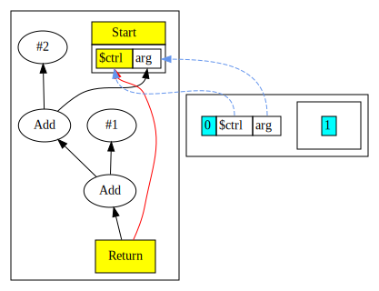

# Chapter 4

In this chapter we extend the language grammar with following features:

* The program receives a single argument named `arg` of integer type from external environment.
* Expressions support comparison operators.
* We introduce a scope sensitive name binding `$ctrl` for the current incoming
  control node.  Thus, our Return is no longer hard-wired to Start, instead it
  tracks the in scope `$ctrl` binding.

Here is the [complete language grammar](docs/04-grammar.md) for this chapter.

## Extensions to Intermediate Representation

In this chapter we add some new nodes and revise some existing nodes.
Following are revised or new nodes

| Node Name | Type             | Description                                    | Inputs                         | Value                                                                   |
|-----------|------------------|------------------------------------------------|--------------------------------|-------------------------------------------------------------------------|
| MultiNode | Abstract class   | A node that has a tuple result                 |                                | A tuple                                                                 |
| Start     | Control          | Start of function, now a MultiNode             | An input argument named `arg`. | A tuple with a ctrl token and an `arg` data node                        |
| Proj      | ?                | Projection nodes extract values from MultiNode | A MultiNode and index          | Result is the extracted value from the input MultiNode at offset index  | 
| Bool      | Data             | Represents results of a comparison operator    | Two data nodes                 | Result a comparison, represented as integer value where 1=true, 0=false |

Below is our list of Nodes from chapter 3:

| Node Name  | Type    | Description                        | Inputs                                                           | Value                        |
|------------|---------|------------------------------------|------------------------------------------------------------------|------------------------------|
| Return     | Control | End of function                    | Predecessor control node, Data node value                        | Return value of the function |
| Constant   | Data    | Constants such as integer literals | None, however Start node is set as input to enable graph walking | Value of the constant        |
| Add        | Data    | Add two values                     | Two data nodes, values are added, order not important            | Result of the add operation  |
| Sub        | Data    | Subtract a value from another      | Two data nodes, values are subtracted, order matters             | Result of the subtract       |
| Mul        | Data    | Multiply two values                | Two data nodes, values are multiplied, order not important       | Result of the multiply       |
| Div        | Data    | Divide a value by another          | Two data nodes, values are divided, order matters                | Result of the division       |
| UnaryMinus | Data    | Negate a value                     | One data node, value is negated                                  | Result of the unary minus    |

## Changes to Type System

In Chapter 2 we introduced the Type System.  Here is a summary of key points:

We annotate Nodes with Types.

The Type annotation serves two purposes:

* it defines the set of operations allowed on the Node, and
* it defines the set of values the Node takes on.

The type itself is identified by the Java class sub-typing relationship; all
types are subtypes of the class `Type`.

In this chapter we extend the Type hierarchy as follows:

```
Type
+-- TypeControl             (New - represents control token)
+-- TypeInteger             (Enhanced - now has Top and Bottom types)
+-- TypeBot
+-- TypeTuple               (New - represents multi-valued result)
```

We mentioned in Chapter 2 that the set of values associated with a Type at a specific Node
can be conveniently represented as a "lattice".

Our lattice elements can be one of three types:

* the highest element is "top", denoted by T.
* The lowest is bottom, denoted by ⊥,
* All elements in the middle are constants.

Assigning ⊥ means that the Node's value is known to be not a compile time
constant, whereas assigning T means that the Node's value may be some (as yet)
undetermined constant. The transition of the Node's type can occur from T to
some constant to ⊥.

In this chapter we introduce the possibility of a program input variable named
`arg`; this variable is usually unknown so ⊥ .

To support the requirements for non-constant integer values, we enhance `TypeInteger` to
allow it to represent `Top` and `Bot` integer types in addition to the earlier constant value.

Now that integer values may be constants or non-constants, we need to introduce the meet operator
in our lattice. The meet operator describes rules that define the resulting type when we combine
integer values.

|      | ⊥ | Con1 | Con2 | T    |
|------|---|------|------|------|
| ⊥    | ⊥ | ⊥    | ⊥    | ⊥    |
| Con1 | ⊥ | Con1 | ⊥    | Con1 |
| T    | ⊥ | Con1 | Con2 | T    | 


The `meet` of `Top` with anything is that thing.
The `meet` of `Bot` with anything is `Bot`.
The `meet` of anything with itself is that thing.
The `meet` of two unrelated constants is `Bot`.
Currently, all our integer valued nodes are either a constant or a Bottom integer type.
When we start optimizing loops, we will start seeing Top values.

## `$ctrl` name binding

In previous chapters, we had a hard coded control input edge from Start to
Return. In this chapter we no longer have such a hard-wired edge.  Instead, we
track the current in-scope control node via the name `$ctrl`.  This means that
when we need to create an edge to the predecessor control node, we simply
lookup this name in the current scope.

This introduces the idea that the control flow subgraph is a Petri net model.
The control token moves virtually from node to node as execution proceeds.  The
initial control token is in Start, it then moves via the Proj node to Return.
In later chapters we will see how the token moves across branches.

## More Peephole Optimizations

Now that we have non-constant integer values, we do additional optimizations, rearranging algebraic 
expressions to enable constant folding. For example:

```
return 1 + arg + 2;
```

We would expect the compiler to output `arg+3` here, but as it stands what we get is:



We need to perform some algebraic simplifications to enable better outcome. For example,  we need to rearrange the
expression as follows:

```
arg + (1 + 2)
```

Here is a (partial) list of peepholes introduced in this Chapter:

| Before                | After                 | Description                                    |
|-----------------------|-----------------------|------------------------------------------------|
| (arg + 0 )            |  arg                  | Add of zero identity                           |
| (arg * 1 )            |  arg                  | Multiple of one identity                       |
| (con + arg)           | (arg + con)           | Move constants to right, to encourage folding  |
| (con * arg)           | (arg * con)           | Move constants to right, to encourage folding  |
| (con1 + (arg + con2)) | (arg + (con1 + con2)) | Move constants to right, to encourage folding  |
| ((arg1 + con) + arg2) | ((arg1 + arg2) + con) | Move constants to right, to encourage folding  |
| (arg + arg)           | (arg * 2)             | Sum-of-products form                           |

## Code Walkthrough 

The peephole optimizations introduced in this chapter are local. They are triggered during parsing 
as new nodes are created, before the newly created node has any uses.

For example, when we parse a unary expression, and create a Node for the parsed expression,
`peephole()` is invoked on the newky created `MinusNode`:

```java
private Node parseUnary() {
    if (match("-")) return new MinusNode(parseUnary()).peephole();
    return parsePrimary();
}
```

As another example, here is the parsing of comparison operators, also introduced in this chapter:

```java
private Node parseComparison() {
    var lhs = parseAddition();
    if (match("==")) return new BoolNode.EQNode(lhs, parseComparison()).peephole();
    if (match("!=")) return new BoolNode.NENode(lhs, parseComparison()).peephole();
    if (match("<" )) return new BoolNode.LTNode(lhs, parseComparison()).peephole();
    if (match("<=")) return new BoolNode.LENode(lhs, parseComparison()).peephole();
    if (match(">" )) return new BoolNode.GTNode(lhs, parseComparison()).peephole();
    if (match(">=")) return new BoolNode.GENode(lhs, parseComparison()).peephole();
    return lhs;
}
```

The implementation of `peephole()` is in the main `Node` class, and is thus shared
by all subclasses of `Node`.

```java
public final Node peephole( ) {
    // Compute initial or improved Type
    Type type = _type = compute();
    
    // Replace constant computations from non-constants with a constant node
    if (!(this instanceof ConstantNode) && type.isConstant())
        return deadCodeElim(new ConstantNode(type).peephole());

    // Ask each node for a better replacement
    Node n = idealize();
    if( n != null )         // Something changed
        // Recursively optimize
        return deadCodeElim(n.peephole());
    
    return this;            // No progress
}
```

The peephole method does following:

* Compute a Type for the node
* If the Type is a Constant, replace with a ConstantNode, recursively invoking peephole on the new node
* Otherwise, ask the Node for a better replacement via a call to `idealize()`.  The "better replacement" is things like `(1+2)` becomes `3` and `1+(x+2))` becomes
  `(x+(1+2))`.  By canonicalizing expressions we fold common addressing math constants, remove algebraic identities and generally simplify the code.
  * Each Node subtype is responsible for deciding what the `idealize()` step should do. If there is a better replacement then the node returns a non `null` value.
  * If we see a non `null` value, something changed, so we invoke `peephole()` again and then also run dead code elimination.

`peephole()` calls `removeDeadCode()` which is shown below.

```java
// m is the new Node, self is the old.
// Return 'm', which may have zero uses but is alive nonetheless.
// If self has zero uses (and is not 'm'), {@link #kill} self.
private Node removeDeadCode(Node m) {
    // If self is going dead and not being returned here (Nodes returned
    // from peephole commonly have no uses (yet)), then kill self.
    if( m != this && isDead() ) {
        // Killing self - and since self recursively kills self's inputs we
        // might end up killing 'm', which we are returning as a live Node.
        // So we add a bogus extra null output edge to stop kill().
        m.addUse(null); // Add bogus null use to keep m alive
        kill();            // Kill self because replacing with 'm'
        m.delUse(null);    // Remove bogus null.
    }
    return m;
}
```

Note the temporary add of a bogus user to the Node `m`.
The reason this is done is that we know `m` is the new replacement and is alive,
but since it is not yet part of the graph up the tree, it has no users yet.
By adding a bogus user we prevent it being mistaken for dead and being killed.
