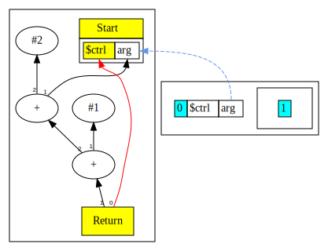

# Chapter 4

In this chapter we extend the language grammar with following features:

* The program receives a single argument named `arg` of integer type from external environment.
* Expressions support comparison operators.
* We introduce a scope sensitive name binding `$ctrl` for the current incoming control node. Thus, our Return is no longer hard-wired to Start, instead it tracks the in scope `$ctrl` binding. 

Here is the [complete language grammar](docs/04-grammar.md) for this chapter.

## Extensions to Intermediate Representation

In this chapter we add some new nodes and revise some existing nodes.
Following are revised or new nodes

| Node Name | Type             | Description                                          | Inputs                            | Value                                                                                |
|-----------|------------------|------------------------------------------------------|-----------------------------------|--------------------------------------------------------------------------------------|
| MultiNode | Marker interface | Marks a node that has a tuple result                 | None                              | None                                                                                 |
| Start     | Control          | Start of function, now a MultiNode                   | An input argument named `arg`.    | A tuple with 1) ctrl token and 2) `arg` data node                                    |
| Proj      | ?                | Projection node that extracts a value from MultiNode | A MultiNode and an index position | Result is the extracted value from the input MultiNode at offset index               | 
| Bool      | Data             | Represents results of a comparison operator          | Two data nodes                    | Result of the comparison operation, represent as integer value where 1=true, 0=false |

Below is our list of Nodes from chapter 3:

| Node Name  | Type    | Description                        | Inputs                                                           | Value                        |
|------------|---------|------------------------------------|------------------------------------------------------------------|------------------------------|
| Return     | Control | End of function                    | Predecessor control node, Data node value                        | Return value of the function |
| Constant   | Data    | Constants such as integer literals | None, however Start node is set as input to enable graph walking | Value of the constant        |
| Add        | Data    | Add two values                     | Two data nodes, values are added, order not important            | Result of the add operation  |
| Sub        | Data    | Subtract a value from another      | Two data nodes, values are subtracted, order matters             | Result of the subtract       |
| Mul        | Data    | Multiply two values                | Two data nodes, values are multiplied, order not important       | Result of the multiply       |
| Div        | Data    | Divide a value by another          | Two data nodes, values are divided, order matters                | Result of the division       |
| UnaryMinus | Data    | Negate a value                     | One data node, value is negated                                  | Result of the unary minus    |

## Changes to Type System

In Chapter 2 we introduced the Type System. Here is a summary of key points.

We annotate Nodes with Types.

The Type annotation serves two purposes:

* it defines the set of operations allowed on the Node
* it defines the set of values the Node takes on

The type itself is identified by the Java class sub-typing relationship; all
types are subtypes of the class `Type`.

In this chapter we extend the Type hierarchy as follows:

```
Type
+-- TypeControl             (New - represents control token)
+-- TypeInteger             (Enhanced - now has Top and Bottom types)
+-- TypeBot
+-- TypeTuple               (New - represents multi-valued result)
```

We mentioned in Chapter 2 that the set of values associated with a Type at a specific Node
can be conveniently represented as a "lattice".

Our lattice elements can be one of three types:

* the highest element is "top", denoted by T.
* The lowest is bottom, denoted by ⊥,
* All elements in the middle are constants.

Assigning ⊥ means that the Node's value is known to be not a compile time
constant, whereas assigning T means that the Node's value may be some (as yet)
undetermined constant. The transition of the Node's type can occur from T to
some constant to ⊥.

In this chapter we introduce the possibility of a program input variable named
`arg`. This variable may or may not be a constant value.

To support the requirements for non-constant integer values, we enhance `TypeInteger` to
allow it to represent `Top` and `Bottom` integer types in addition to the earlier constant value.

Now that integer values may be constants or non-constants, we need to introduce the meet operator
in our lattice. The meet operator describes rules that define the resulting type when we combine
integer values.

|      | ⊥ | Con1 | Con2 | T    |
|------|---|------|------|------|
| ⊥    | ⊥ | ⊥    | ⊥    | ⊥    |
| Con1 | ⊥ | Con1 | ⊥    | Con1 |
| T    | ⊥ | Con1 | Con2 | T    | 

Thus, once a node has a Bottom type, it stays that way.
Currently, all our integer valued nodes are either a constant or a Bottom integer type.
When we introduce loops, we will start seeing Top values.

## `$ctrl` name binding

In previous chapters, we had a hard coded control input edge from Start to Return. In this chapter we no longer have such a 
hard-wired edge. Instead, we track the current in-scope control node via the name `$ctrl`. This means that when we need to
create an edge to the predecessor control node, we simply lookup this name in the current scope. 

This introduces the idea that the control flow subgraph is a Petri net model (p. 131). The control token moves virtually from node to
node as execution proceeds. The initial control token is in Start, it then moves via the Proj node to Return.
In later chapters we will see how the token moves across branches.

## More Peephole Optimizations

Now that we have non-constant integer values, we do additional optimizations, rearranging algebraic 
expressions to enable constant folding. For example:

```
return 1 + arg + 2;
```

We would expect the compiler to output `arg+3` here, but as it stands what we get is:



We need to perform some algebraic simplifications to enable better outcome. For example,  we need to rearrange the
expression as follows:

```
return 1 + 2 + arg;
```

This can then further simplify to:

```
return 3 + arg;
```


