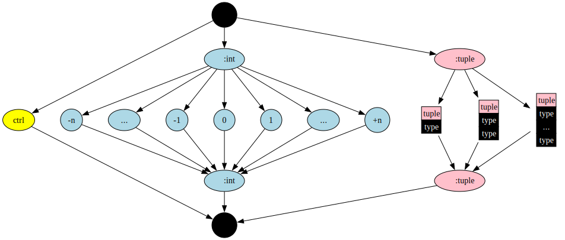
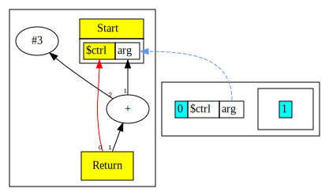

# Chapter 4: External Argument and Comparisons

In this chapter we extend the language grammar with following features:

* The program receives a single argument named `arg` of integer type from external environment.
* Expressions support comparison operators.
* We introduce a scope sensitive name binding `$ctrl` for the current incoming
  control node.  Thus, our Return is no longer hard-wired to Start, instead it
  tracks the in scope `$ctrl` binding.

Here is the [complete language grammar](docs/04-grammar.md) for this chapter.

You can also read [this chapter](https://github.com/SeaOfNodes/Simple/tree/linear-chapter04) in a linear Git revision history on the [linear](https://github.com/SeaOfNodes/Simple/tree/linear) branch and [compare](https://github.com/SeaOfNodes/Simple/compare/linear-chapter03...linear-chapter04) it to the previous chapter.

## Extensions to Intermediate Representation

In this chapter we add some new nodes and revise some existing nodes.
Following are revised or new nodes

| Node Name | Type           | Description                                    | Inputs                | Value                                                                      |
|-----------|----------------|------------------------------------------------|-----------------------|----------------------------------------------------------------------------|
| MultiNode | Abstract class | A node that has a tuple result                 |                       | A tuple                                                                    |
| Start     | Control        | Start of function, now a MultiNode             |                       | A tuple with a ctrl token and an `arg` data node                           |
| Proj      | Data           | Projection nodes extract values from MultiNode | A MultiNode and index | Result is the extracted value from the input MultiNode at offset index     |
| Bool      | Data           | Represents results of a comparison operator    | Two data nodes        | Result is a comparison, represented as integer value where 1=true, 0=false |
| Not       | Data           | Logical not                                    | One data node         | Result converts 0 to 1 and vice versa                                      |

Below is our list of Nodes from [Chapter 3](../chapter03/README.md):

| Node Name | Type         | Description                        | Inputs                                                           | Value                        |
|-----------|--------------|------------------------------------|------------------------------------------------------------------|------------------------------|
| Return    | Control      | End of function                    | Predecessor control node, Data node value                        | Return value of the function |
| Constant  | Data         | Constants such as integer literals | None, however Start node is set as input to enable graph walking | Value of the constant        |
| Add       | Data         | Add two values                     | Two data nodes, values are added, order not important            | Result of the add operation  |
| Sub       | Data         | Subtract a value from another      | Two data nodes, values are subtracted, order matters             | Result of the subtract       |
| Mul       | Data         | Multiply two values                | Two data nodes, values are multiplied, order not important       | Result of the multiply       |
| Div       | Data         | Divide a value by another          | Two data nodes, values are divided, order matters                | Result of the division       |
| Minus     | Data         | Negate a value                     | One data node, value is negated                                  | Result of the unary minus    |
| Scope     | Symbol Table | Represents scopes in the graph     | All nodes that define variables                                  | None                         |

## Projection Nodes

We add projection nodes that are used to extract a specific tuple member from a multi-valued node.
Each projection node contains an index of the field to extract from its input node.
Projection nodes allow us to maintain labeled use-def edges as simple Node references.

In the visuals, projection nodes are shown as rectangular boxes inside the node to which they are attached.

### Visualisation


In the visual above, the projection nodes have been tagged by the names
associated with the outputs of the Start node. Both MultiNode that contain
Control and Control nodes are yellow.  `$ctrl` and `arg` are outputs(users) of
StartNode(`START`) and have their MultiNode as their only input in slot 0.  The
`label` has no semantics and is used during debug printing.

```java 
public ProjNode(MultiNode ctrl, int idx, String label) {
    super(ctrl);
```

```java
_scope.define(ScopeNode.CTRL, new ProjNode(START, 0, ScopeNode.CTRL).peephole());
_scope.define(ScopeNode.ARG0, new ProjNode(START, 1, ScopeNode.ARG0).peephole());
```

These projection nodes are going to extract the types for `CTRL` and `ARG0` from the `START` MultiNode.
The MultiNode holds the types as a TypeTuple:

```java
public StartNode(Type[] args) {
    super();
    _args = new TypeTuple(args);
```

Extracting the types is based on the `_idx`:
```java
return t instanceof TypeTuple tt ? tt._types[_idx] : Type.BOTTOM;
```

### Initial values

An argument is always provided, and defaults to `TypeInteger.BOT`.  Individual
tests can (and do) pass in other integer values by calling `new Parser` with
an argument:

```java
Parser parser = new Parser("return arg; #showGraph;", TypeInteger.constant(2));
```

The graph:


- `$ctrl` and `arg` are both defined in the outermost symbol table, at lexical depth 0.
- There is an empty global-scope symbol table created at depth 1; in the future
  global variables will be defined here.
- There is no line for the scope `$ctrl` because control is dead after the
  return.  It is manually set to null, which calls `setDef` to kill the node
  (and killed nodes are not part of the program and not visualized).

```
    ctrl(null);             // Kill control
```

- The `arg` projection node is not included in the cluster because arg is a
  constant.  The `arg` was originally defined by a ProjNode; but when peephole
  is called the computed type is a constant, and the ProjNode gets replaced
  with a ConstantNode:
    
```java
public final Node peephole( ) {
    Type type = _type = compute(); 
    /*   type = {TypeInteger@1527} "2"  */

    if (_disablePeephole)
        return this;
    
    // ProjNode is not a constant unlike its type.
    if (!(this instanceof ConstantNode) && type.isConstant())
        /* Create Constant(2) */
        return deadCodeElim(new ConstantNode(type).peephole());
    
    /* won't get called */
    ...
```

If you don't pass an argument you get `TypeInteger.BOT`

```java 
    Parser parser = new Parser("return arg; #showGraph;");
    ...
    
public Parser(String source) {
    this(source, TypeInteger.BOT);
}
    
```

We clearly see this is not a constant:

```java
public final static TypeInteger BOT = new TypeInteger(false, 1); 
   /* _is_con = false */
```

So the `arg` projection node remains in the cluster:


#### When Is Control Not-Null?

In later chapters, `$ctrl`  will point to other control nodes, such as
`If` and `Region` (and `Loop`), but for now with no other control flow it always gets set to null after a `Return`.

#### Note Regarding Visualizations

From this chapter onwards we omit the edges from Constants to Start node, mainly to reduce
clutter and help draw reader's attention to the more important aspects of the graph.


## Changes to Type System

In [Chapter 2](../chapter02/README.md) we introduced the Type System.

We have annotated Nodes with Types and the Type annotation serves two purposes:

* It defines the set of operations allowed on the Node, and
* it defines the set of values the Node takes on.

We mentioned in [Chapter 2](../chapter02/README.md) that the set of values
associated with a Type at a specific Node can be conveniently represented as a
[lattice](https://en.wikipedia.org/wiki/Lattice_(order)).

The type itself is identified by the Java class `Type` and subtypes.  The type
implementation uses Java classes as convenient to deal with a Types' internal
structure - but the Java classes have no relation to a Type's place in the
lattice.

In this chapter we extend the Type hierarchy as follows:

```
Type              (Enhanced - now has Control, and a global Top and Bottom)
+-- TypeInteger   (Enhanced - now has Top and Bottom types)
+-- TypeTuple     (New - represents multi-valued result)
```

Our enhanced Lattice looks like this:




In this chapter we introduce the possibility of a program input variable named
`arg`; all we know about this variable is that it is some integer value, but we
do not know whether it is a constant or not.

To support the requirements for non-constant integer values, we enhance
`TypeInteger` to allow it to represent `IntTop` and `IntBot` integer types in
addition to the earlier constant value.

Now that integer values may be constants or non-constants, we need to introduce
the *meet* operator over our lattice. The `meet` operator describes rules that
define the resulting type when we combine integer values.  In the lattice
diagram you can start from the two elements being `meet` and follow the
two arrows down the graph to the first point they meet.

|        | IntBot | Con1   | Con2   | IntTop |
|--------|--------|--------|--------|--------|
| IntBot | IntBot | IntBot | IntBot | IntBot |
| Con1   | IntBot | Con1   | IntBot | Con1   |
| IntTop | IntBot | Con1   | Con2   | IntTop |

In the table above `Con1` and `Con2` represent two distinct integer values, and serve to explain the rules below.

* The `meet` of `IntTop` with any integer constant is that constant.
* The `meet` of `IntBot` with any integer value is `IntBot`.
* The `meet` of any integer with itself is that integer.
* The `meet` of two unrelated integer constants is `IntBot`.

Currently, all our integer valued nodes are either a constant or a `IntBot` integer type.
When we start optimizing loops, we will start seeing `IntTop` values.


### Tuple Types

Tuple types need a little more explaination: they are a fixed-size grouping of
types; literally a `Type[]`.  Tuples represent a collection of otherwise
unrelated types, and come from `MultiNode`s.  `ProjNode`s will take the
appropriate `Type` array element out of a Tuple.  The `StartNode` now produces
a 2-element `TypeTuple` with control and the type of `arg`: `[ctrl, TypeInteger.INTBOT]`

The lattice `meet` operator on Tuples is done element by element; each array
element recursively calls `meet`.  Tuples of mixed sizes are a internal
compiler error, and the `meet` uses Bottom for them.


## `$ctrl` name binding

In previous chapters, we had a hard coded control input edge from Start to
Return. In this chapter we no longer have such a hard-wired edge.  Instead, we
track the current in-scope control node via the name `$ctrl`.  This means that
when we need to create an edge to the predecessor control node, we simply look
up this name in the current scope.

This introduces the idea that the control flow subgraph is a Petri net model.[^1]
The control token moves virtually from node to node as execution proceeds.  The
initial control token is in Start, it then moves via the Proj node to Return.
In later chapters we will see how the token moves across branches.


## More Peephole Optimizations

Now that we have non-constant integer values, we can do additional
optimizations, rearranging algebraic expressions to enable constant
folding. For example:

```
return 1 + arg + 2;
```

We would expect the compiler to output `arg+3` here, but as it stands what we get is:


We need to perform some algebraic simplifications to enable better outcome. For
example, we need to rearrange the expression as follows:

```
arg + (1 + 2)
```

This then enables constant folding and the final outcome is shown below.  By
canonicalizing expressions we fold common addressing math constants, remove
algebraic identities and generally simplify the code.



Here is a list of peepholes introduced in this Chapter, more will be introduced in later chapters:

| Before                | After                 | Description                                    |
|-----------------------|-----------------------|------------------------------------------------|
| (arg + 0 )            |  arg                  | Add of zero identity                           |
| (arg * 1 )            |  arg                  | Multiple of one identity                       |
| (con + arg)           | (arg + con)           | Move constants to right, to encourage folding  |
| (con * arg)           | (arg * con)           | Move constants to right, to encourage folding  |
| (con1 + (arg + con2)) | (arg + (con1 + con2)) | Move constants to right, to encourage folding  |
| ((arg1 + con) + arg2) | ((arg1 + arg2) + con) | Move constants to right, to encourage folding  |
| (arg + arg)           | (arg * 2)             | Sum-of-products form                           |
| (arg - arg)           | 0                     | Sub of same is 0
| (con / 1)             | con                   | Division by one
| (arg == arg)          | 1                     | Compare of same
| (arg != arg)          | 0                     | Compare of same
| (arg < arg)           | 0                     | Compare of same
| (arg > arg)           | 0                     | Compare of same
| (arg <= arg)          | 1                     | Compare of same
| (arg >= arg)          | 1                     | Compare of same


## Peephole Walkthrough

The peephole optimizations introduced in this chapter are local. They are triggered during parsing
as new nodes are created, before the newly created node has any uses.

For example, when we parse a unary expression, and create a Node for the parsed expression,
`peephole()` is invoked on the newly created `MinusNode`:

```java
private Node parseUnary() {
    if (match("-")) return new MinusNode(parseUnary()).peephole();
    return parsePrimary();
}
```

As another example, here is the parsing of comparison operators, also introduced in this chapter:

```java
private Node parseComparison() {
    var lhs = parseAddition();
    if (match("==")) return new BoolNode.EQNode(lhs, parseComparison()).peephole();
    if (match("!=")) return new BoolNode.NENode(lhs, parseComparison()).peephole();
    if (match("<=")) return new BoolNode.LENode(lhs, parseComparison()).peephole();
    if (match("<" )) return new BoolNode.LTNode(lhs, parseComparison()).peephole();
    if (match(">=")) return new BoolNode.GENode(lhs, parseComparison()).peephole();
    if (match(">" )) return new BoolNode.GTNode(lhs, parseComparison()).peephole();
    return lhs;
}
```

The implementation of `peephole()` is in the main `Node` class, and is thus shared
by all subclasses of `Node`.

```java
public final Node peephole( ) {
    // Compute initial or improved Type
    Type type = _type = compute();

    // Replace constant computations from non-constants with a constant node
    if (!(this instanceof ConstantNode) && type.isConstant())
        return deadCodeElim(new ConstantNode(type).peephole());

    // Ask each node for a better replacement
    Node n = idealize();
    if( n != null )         // Something changed
        // Recursively optimize
        return deadCodeElim(n.peephole());

    return this;            // No progress
}
```

The peephole method does following:

- Compute a Type for the node.
- If the Type is a Constant and the node is not a ConstantNode, replace with a
  ConstantNode, recursively invoking peephole on the new constant.
- Otherwise, ask the Node for a better replacement via a call to `idealize()`.
  The "better replacement" is things like `(1+2)` becomes `3` and `1+(x+2))`
  becomes `(x+(1+2))`.
- - Each Node subtype is responsible for deciding what the `idealize()` step
  should do. If there is a better replacement then the node returns a non
  `null` value.
- - If we see a non `null` value, something changed, so we invoke `peephole()`
  again and then also run dead code elimination on the (now dead and replaced)
  `this` node.

`peephole()` calls `deadCodeElim()` which is shown below.


## Dead Code Elimination(DCE)

We call `kill` every time a Node makes the 1-user-to-0-users transition during
graph editing.  This commonly happens when replacing via peeps and exiting
scopes.  This recursive `kill` amounts to Dead Code Elimination in many other
compilers; here we call it in a very fine-grained way.  Many Nodes will be
created by the parser, only to be killed before the very next lexeme is parsed.

For more information please read the [appendix section](appendix/dce.md#appendix) on dead code elimination.

The suggestively called `deadCodeElim` function is a thin wrapper over `kill`
used by `peepholeOpt` to avoid prematurely killing a Node which only briefly
makes the 1->0 users transition.

```java
// m is the new Node, self is the old.
// Return 'm', which may have zero uses but is alive nonetheless.
// If self has zero uses (and is not 'm'), {@link #kill} self.
private Node deadCodeElim(Node m) {
    // If self is going dead and not being returned here (Nodes returned
    // from peephole commonly have no uses (yet)), then kill self.
    if( m != this && isUnused() ) {
        // Killing self - and since self recursively kills self's inputs we
        // might end up killing 'm', which we are returning as a live Node.
        // So we add a bogus extra null output edge to stop kill().
        m.addUse(null); // Add bogus null use to keep m alive
        kill();            // Kill self because replacing with 'm'
        m.delUse(null);    // Remove bogus null.
    }
    return m;
}
```

Note the temporary add of a bogus user to the Node `m`.  The reason this is
done is that we know `m` is the new replacement and is alive, but since it is
not yet hooked into the graph, it has no users yet.  By adding a bogus user we
prevent it being mistaken for dead and being killed.

[^1]: Click, C. (1995).
   Combining Analyses, Combining Optimizations, 131.
