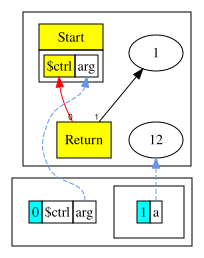
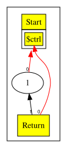
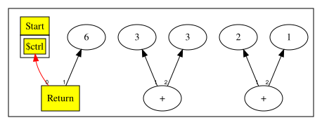

# 付録

[English](dce.md) | 日本語

この文書は [原文](dce.md) の日本語訳です。

## デッドコード除去（DCE）

デッドコード除去は、死んだ（使われていない）ノードを取り除く処理です。

この章には、2種類のデッドコード除去があります。

* スコープをポップするときに、使われていないノードを削除する。
* よりよい置き換えを見つけた後（`idealize()` の呼び出し後）に、古いノードを削除する。

どちらの方法もノードを再帰的に削除します。ただし、最初のケースは `peephole` を呼ぶかどうかにかかわらず発生します。

### スコープをポップするときに使われていないノードを削除する

出力（利用側）のないノードは、使われていません。

### 例1

  ``` 
  int a = 12; // the only output it has is the scope itself
  return 1;
  ```

`a` が使われていないことは明らかです。これから得られる、DCE なしのグラフは次のとおりです。



`a` を削除するため、スコープのポップ時に次の方法を導入します。

  ```java
  var ret = (ReturnNode) parseBlock();
  _scope.pop();
  ```

現時点ではプログラムの終わりは return に固定されており、解析を終えたらスコープをポップします。ポップ前のスコープの状態は次のとおりです。

  ```
  _scope = {ScopeNode@1422} "Scope[$ctrl:null, arg:arg][a:12]"
  1 = {ProjNode@1528} "arg"
  2 = {ConstantNode@1529} "12"
  _inputs = {ArrayList@1523}  size = 3
  ```

`a` の出力:

  ```
  _outputs = {ArrayList@1544}  size = 1
  0 = {ScopeNode@1422} "Scope[$ctrl:null, arg:arg][a:12]"
  ```

`a` の唯一の出力はスコープ自身であることに注目してください。`a` を導入するとき、スコープの入力に追加するとともに、スコープを `a` の出力に追加します（使用・定義の連鎖を思い出してください）。

`a` は戻り値ではないため、使われておらず、削除できます。

`_scope.pop`:

```java
public void pop() { popN(_scopes.pop().size());  }
```

`_scope.popN`（使われていないノードを *再帰的に* 削除する処理）:

```java 
void popN(int n) {
    for (int i = 0; i < n; i++) {
        Node old_def = _inputs.removeLast(); // start from the back
        if (old_def != null &&        // If it exists and
            old_def.delUse(this)) {   // If we removed the last use, the old def is now dead
            old_def.kill();           // Kill the old def
        }
    }
}
```

まず、スコープの入力をループでたどります（スコープもほかと同じノードであり、スコープのシンボルが入力であることを *思い出してください*）。`removeLast` が返すノードが null でなく、`old_def` の唯一の利用側が現在のノードなら、削除できます。

`old_def.delUse(this)` は、`old_def` の出力から *this* を削除します。

```java
protected boolean delUse( Node use ) {
  Utils.del(_outputs, Utils.find(_outputs, use));
  return _outputs.isEmpty();
                                     }
```

`use` の削除後に `_outputs` が空になれば true を返します。`old_def.kill()` は再帰的な削除処理を開始します。

`old_def.kill()`:

```java 
public void kill( ) {
      assert isUnused();      // Has no uses, so it is dead
      popN(nIns());           // Set all inputs to null, recursively killing unused Nodes
      _type=null;             // Flag as dead
      assert isDead();        // Really dead now
    }
```

再び `popN` を呼びます。目的は、`a` を解放した結果、同様に削除できるノードを探すことです。`a` の唯一の入力は、値12の定数ノードです。ほかのノードと同様に、`ConstantNode` も最初の入力として制御ノード（`Start`）を取ります。`ConstantNode` の入力から `Start` ノードを取り除いたら、

``` 
Node old_def = _inputs.removeLast();
```

`Start` の出力から `ConstantNode`（`this`）も取り除けます。

``` 
old_def.delUse(this) 
```

### 例2

```
int a = 12; 
int b = a + 1; 
return 1; 
```

* 現在のスコープで `popN` を呼びます。
* `b = a + 1;` に利用側がないとわかるので、削除できます。
* kill 関数では再び `popN` を呼べますが、今回は `b = a + 1;` の入力を対象にします（再帰的な削除を始めます）。
* 末尾から削除処理を始め、まず「1」を調べます。これには `AddNode` 以外の出力がありません。`this = AddNode` なので、`delUse` を呼ぶと「1」が死んだ状態になります。
* 「1」を削除し、1つの入力（制御ノード）に対して `popN` を呼べます。
* 次に「a」を調べます。この時点ではスコープと `AddNode` の2つの利用側があります。`this = AddNode` なので、出力から `AddNode` を取り除きますが、まだスコープが利用側として残るため、ここでは削除できません。
* `a = 12` に進みます。「a」の利用側は1つ（スコープ）だけで、`this = scope` なので、容易に削除できます。
* 前と同じように「a」の入力をたどり、制御ノードの出力からそれらを削除します。



## よりよい置き換えを見つけた後に古いノードを削除する

次のコードを考えます。

```
return (2+1)+3; 
```

`idealize` の呼び出し後に DCE を行わなければ、次のようになります。



式 (2 + 1) + 3 に対して、より最適な置き換え値（6）を見つけた後、その値を保持する定数ノードを作りました。しかし、元の式を取り除かなかったため、構造内に不要なノードが残っています。

これを直すため、使われていないノードを削除する `deadCodeElim` の呼び出しを追加します。

```java
public final Node peephole( ) {
    ...
    if (!(this instanceof ConstantNode) && type.isConstant())
        return new deadCodeElim(ConstantNode(type).peephole());

    ...
  
    Node n = idealize();
    if( n != null )         // Something changed
        // Recursively optimize
        return deadCodeElim(n.peephole());
   
   ...
}
``` 

> 訳注: 上の原文コードの `return new deadCodeElim(ConstantNode(type).peephole());` は、そのままでは Java の構文として正しくありません。コードは原文どおり保持しています。章本文の対応するコードでは `return deadCodeElim(new ConstantNode(type).peephole());` となっています。

```java
// m is the new Node, self is the old.
// Return 'm', which may have zero uses but is alive nonetheless.
// If self has zero uses (and is not 'm'), {@link #kill} self.
private Node deadCodeElim(Node m) {
    // If self is going dead and not being returned here (Nodes returned
    // from peephole commonly have no uses (yet)), then kill self.
    if( m != this && isUnused() ) {
        // Killing self - and since self recursively kills self's inputs we
        // might end up killing 'm', which we are returning as a live Node.
        // So we add a bogus extra null output edge to stop kill().
        m.addUse(null); // Add bogus null use to keep m alive
        kill();            // Kill self because replacing with 'm'
        m.delUse(null);    // Remove bogus null.
    }
    return m;
}
```
