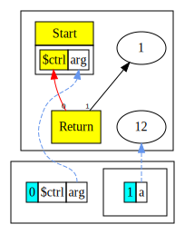
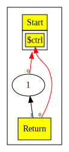
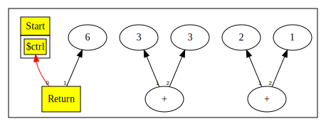

# Appendix
## Dead Code Elimination(DCE)
Dead Code Elimination is the process or removing nodes that are dead(unused).

There are two kinds of dead code eliminations present in this chapter.
- Delete unused nodes when popping the scope.
- Delete old nodes after finding a better replacement(after idealize call).

Both of the methods mentioned above delete the nodes recursively. However, the first case happens
regardless of whether `peephole` is called or not.

### Delete unused nodes when popping the scope
A node is unused if it has no outputs(users).

### Example 1:
  ``` 
  int a = 12; // the only output it has is the scope itself
  return 1;
  ```
We clearly see `a` is unused.
This gives us the following graph(without DCE):



To remove `a` we introduce the following technique when popping the scope.

  ```java
  var ret = (ReturnNode) parseBlock();
  _scope.pop();
  ```
As of now the end of the program is hard-wired to return, after finishing parsing we pop the scope.
The state of the scope before popping it:
  ```
  _scope = {ScopeNode@1422} "Scope[$ctrl:null, arg:arg][a:12]"
  1 = {ProjNode@1528} "arg"
  2 = {ConstantNode@1529} "12"
  _inputs = {ArrayList@1523}  size = 3
  ```
The output(s) of `a`
  ```
  _outputs = {ArrayList@1544}  size = 1
  0 = {ScopeNode@1422} "Scope[$ctrl:null, arg:arg][a:12]"
  ```
Notice how the only output of `a`is the scope itself. When `a` is introduced, it is added to the
inputs of the scope, and the scope is added to the outputs of `a`(recall use-def chains).

Since `a` is not being returned - it is unused and can be killed.

`_scope.pop`:
```java
public void pop() { popN(_scopes.pop().size());  }
```
`_scope.popN`(responsible for killing the unused nodes *recursively*):
```java 
void popN(int n) {
    for (int i = 0; i < n; i++) {
        Node old_def = _inputs.removeLast(); // start from the back
        if (old_def != null &&        // If it exists and
            old_def.delUse(this)) {   // If we removed the last use, the old def is now dead
            old_def.kill();           // Kill the old def
        }
    }
}
```
First, we start off by looping through the inputs of the scope(*remember*: scope is just a node like any other, the symbols of the scope are the inputs).
If the node returned by `removeLast` is not null, and if the only user of `old_def` is the current Node then we can delete it.

`old_def.delUse(this)` - delete *this* from `old_def`'s outputs.
```java
protected boolean delUse( Node use ) {
  Utils.del(_outputs, Utils.find(_outputs, use));
  return _outputs.isEmpty();
                                     }
```
Returns true if `_outputs` becomes empty after deleting `use`.
`old_def.kill()` starts the killing process recursively.

`old_def.kill()`
```java 
public void kill( ) {
      assert isUnused();      // Has no uses, so it is dead
      popN(nIns());           // Set all inputs to null, recursively killing unused Nodes
      _type=null;             // Flag as dead
      assert isDead();        // Really dead now
    }
```
`popN` is called again, our goal is to look for nodes that might also get deleted once `a` is freed.
The only input `a` has is the constant node with value 12. As every other node a `ConstantNode` takes in the control node first(`Start`), once we
drop the `Start` node from the inputs of `ConstantNode`:
``` 
Node old_def = _inputs.removeLast();
```
we can also get rid of `ConstantNode`(`this`) from the outputs of `Start`:
``` 
old_def.delUse(this) 
```
### Example 2:
```
int a = 12; 
int b = a + 1; 
return 1; 
```
- Call `popN` on current scope.
- Realize that `b = a + 1;` has no uses - so we can kill it.
- In the kill function we can call `popN` but this time with the inputs of `b = a + 1;`(start killing them recursively)
- We start the killing process from the back and examine "1" first. This has no output other than the `AddNode`. Since `this = AddNode` calling `delUse` will mark "1" as dead.
- We now can kill "1" and call the `popN` function with one input(the control node).
- Now we examine "a" which has 2 uses at this point, the scope and `AddNode`. Since `this = AddNode` we will remove `AddNode` from its outputs, it will still have the scope as a user - so we can't delete it just yet.
- We move onto`a = 12`, since "a" has only one user left(the scope) and `this = scope` it can get killed easily.
- Same as before, we go through the inputs of "a" and will delete them from the outputs of the control node.

*A constant node pointing to "Start"(ignored by the graph visualizer) but still maintains a connection:*



## Delete old nodes after finding a better replacement
Consider the following code:
```
return (2+1)+3; 
```
Without DCE after the `idealize` call we would end up with:


After identifying a more optimal replacement value (6) for the expression (2 + 1) + 3,
we created a constant node to store this value.
However, we did not remove the original expression,
resulting in dangling nodes in our structure.

To fix this, we introduce an extra `deadCodeElim` call that is responsible for deleting unused nodes.


```java
public final Node peephole( ) {
    ...
    if (!(this instanceof ConstantNode) && type.isConstant())
        return new deadCodeElim(ConstantNode(type).peephole());

    ...
  
    Node n = idealize();
    if( n != null )         // Something changed
        // Recursively optimize
        return deadCodeElim(n.peephole());
   
   ...
}
``` 

```java
// m is the new Node, self is the old.
// Return 'm', which may have zero uses but is alive nonetheless.
// If self has zero uses (and is not 'm'), {@link #kill} self.
private Node deadCodeElim(Node m) {
    // If self is going dead and not being returned here (Nodes returned
    // from peephole commonly have no uses (yet)), then kill self.
    if( m != this && isUnused() ) {
        // Killing self - and since self recursively kills self's inputs we
        // might end up killing 'm', which we are returning as a live Node.
        // So we add a bogus extra null output edge to stop kill().
        m.addUse(null); // Add bogus null use to keep m alive
        kill();            // Kill self because replacing with 'm'
        m.delUse(null);    // Remove bogus null.
    }
    return m;
}
```