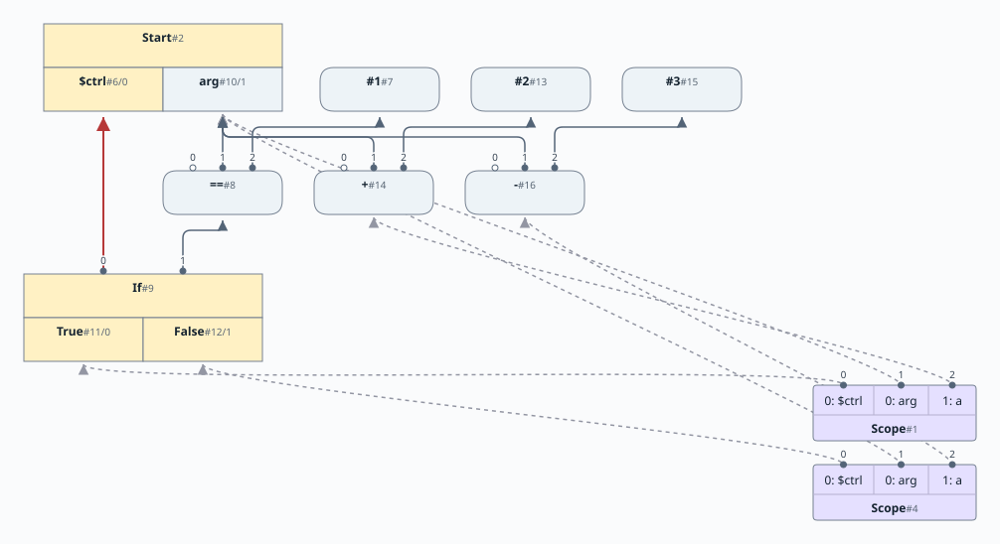
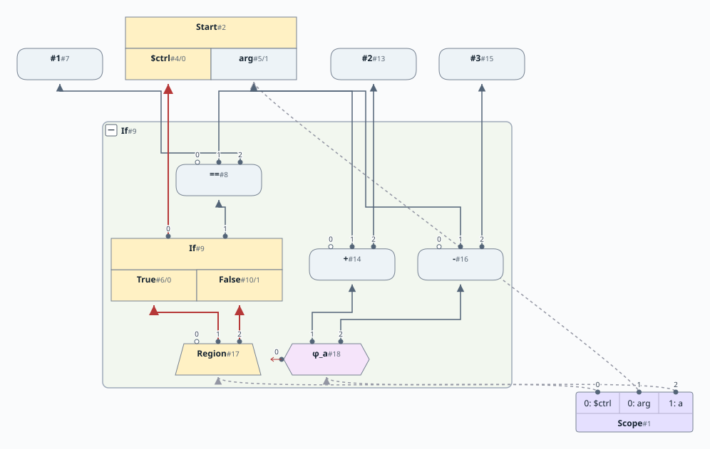
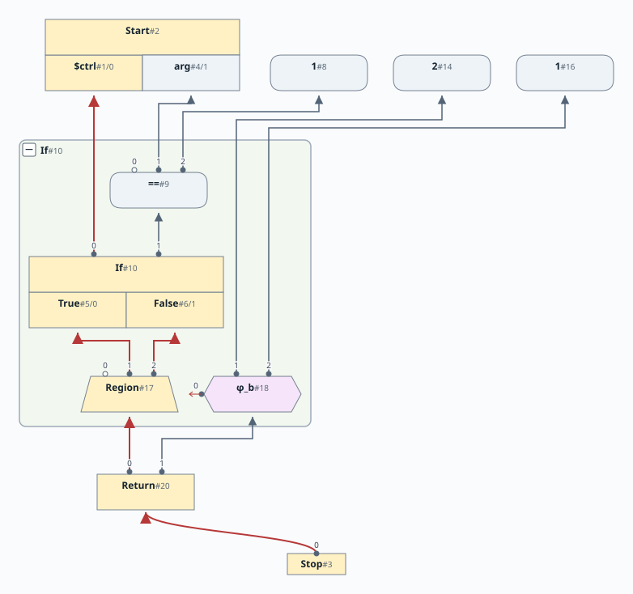
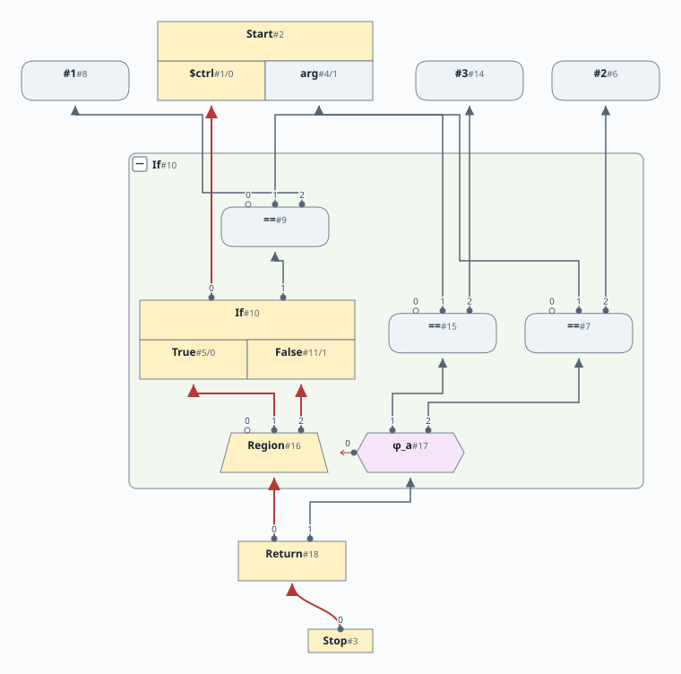
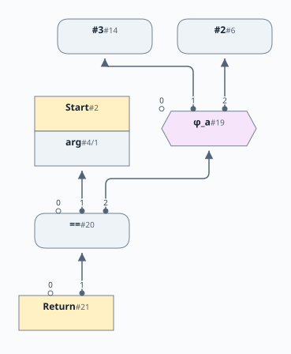
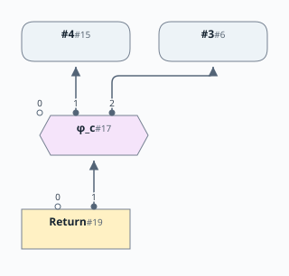
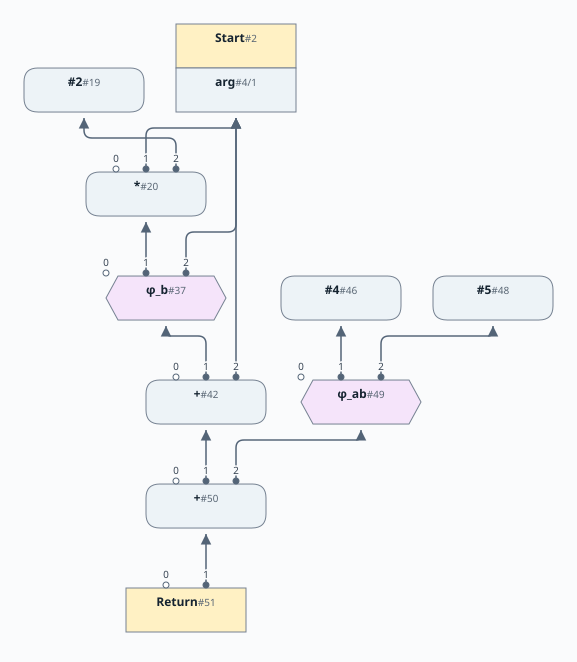
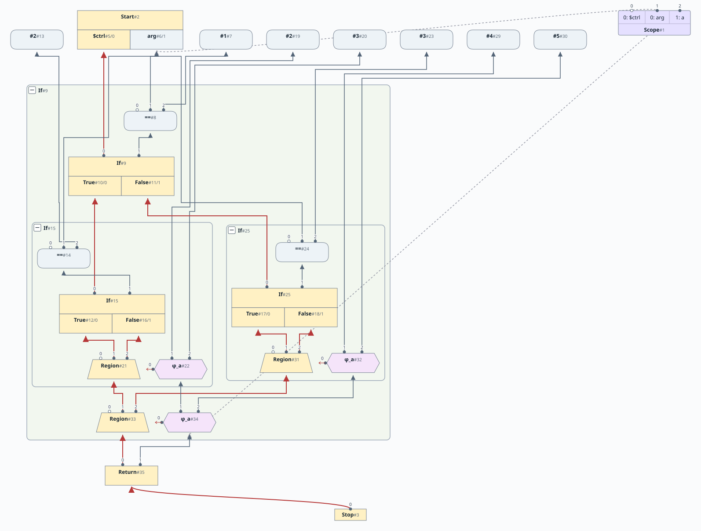

# 第5章: If 文、Phi、Region

[English](README.md) | 日本語

この文書は [原文](README.md) の日本語訳です。

[前の章: 第4章](../chapter04/README.ja.md) |
[次の章: 第6章](../chapter06/README.ja.md)

# 目次

1. [新しいノード](#新しいノード)
2. [`IfNode`](#ifnode)
3. [`PhiNode`](#phinode)
4. [`RegionNode`](#regionnode)
5. [固定されたデータノード](#グラフ内のすべてのデータノードに制御エッジを結び付けるわけではない)
6. [`Stop` ノード](#stop-ノード)
7. [`if` 文の解析](#if-文の解析)
8. [ScopeNode に対する操作](#scopenode-に対する操作)
9. [ScopeNode の複製](#scopenode-の複製)
10. [2つの ScopeNode のマージ](#2つの-scopenode-のマージ)
11. [例1](#例1)
12. [マージ前](#マージ前)
13. [マージ後](#マージ後)
14. [最後に](#最後に)
15. [例2](#例2)
16. [例3](#例3)
17. [Phi を通して加算を押し上げる](#phi-を通して加算を押し上げる)
18. [さらにいくつかの例](#さらにいくつかの例)

[linear](https://github.com/SeaOfNodes/Simple/tree/linear) ブランチの直線的な Git のリビジョン履歴で [この章](https://github.com/SeaOfNodes/Simple/tree/linear-chapter05) を読み、前の章と [比較](https://github.com/SeaOfNodes/Simple/compare/linear-chapter04...linear-chapter05) することもできます。

この章では、言語の文法を拡張して次の機能を追加します。

* `if` 文を導入します。
* 制御フローの分岐とマージをサポートするため、新しいノード `Region` と `Phi` を導入します。
* 戻り地点が複数になりうるため、終端を表す `Stop` ノードも導入します。

この章の [完全な言語文法](docs/05-grammar.ja.md) はこちらです。

## 新しいノード

この章では、次の新しいノードを導入します。

| ノード名 | 種類 | 章 | 説明 | 入力 | 値 |
|-----------|---------|---------|----------------------------------------------------|------------------------------------------------|----------------------------------------------------|
| If | 制御 | 5 | 分岐の判定。`MultiNode` のサブタイプ | 制御ノードと条件式のデータノード | true 用と false 用の2つの値のタプル |
| Region | 制御 | 5 | 複数の制御フローのマージ地点 | マージする制御フローそれぞれの入力 | マージされた制御 |
| Phi | データ | 5 | 制御フローに応じて値を選択する phi 関数 | Region と各制御経路のデータノード | 通過した制御フローの経路に依存する |
| Stop | 制御 | 5 | プログラムの終端 | 関数のすべての Return ノード | なし |

前の章までのすべてのノードも引き続き使います。

#### `IfNode`

`If` ノードは制御とデータ（条件式）の両方を入力とし、true と false の `Proj` ノードが表す2つの制御フローのどちらかに、制御トークンを振り分けます。

#### `PhiNode`

`Phi` はデータと制御の両方を読み取り、データ値を出力します。`Phi` の制御入力は `Region` ノードを指します。`Phi` のデータ入力は、その `Region` の制御入力それぞれに1つずつ対応します。`Phi` が計算する結果は、データとそれに対応する制御入力の両方に依存します。`Region` の制御入力は同時には最大1つしか有効にならず、`Phi` はその入力に対応するデータ値を通します。[^1]

型は、データ入力の型の meet です。異なる2つの整数定数をマージすると `TypeInteger.BOT` になります。値は不明でも、整数であることは変わりません。整数の算術演算も同様に、畳み込めない場合は整数の結果型を保持します。

#### `RegionNode`

この Sea of Nodes には制御フローグラフが埋め込まれています。通常の CFG と同じように、2つの基本ブロックが1つへ流れ込むマージ地点があります。`Region` ノードは、先行する各制御（ブロック）の制御を入力として受け取り、マージされた制御を出力します。[^2]

`Return` と `If` は、どちらもスロット0に制御を取ります。`PhiNode` は、データ値をいつマージするか判断するために対応する `RegionNode` が必要なので、やはりスロット0を設定し、スロット1以降にデータ値を置きます。`RegionNode` の制御入力は `PhiNode` と対応を保つため、制御入力をスロット1以降に置きます。

#### グラフ内のすべてのデータノードに制御エッジを結び付けるわけではない

通常の命令が所属する基本ブロックを追跡したければ、制御入力（常にスロット0）に制御を生成するノードを設定します。通常はこれを追跡する必要も、追跡したい理由もないので、多くのデータ演算では制御を `null` にします。そのようなデータ演算の正しさは、残りのデータ依存関係だけで決まります。その演算と、それに依存するノード、それが依存するノードは、ほとんど制御構造のないノードの「海」に存在します。

ノードの「海」は最適化に便利ですが、CFG のような従来の中間表現ではありません。グラフを逐次的な順序に並べ、制御依存関係を復元する方法が必要です。[第13章](../chapter13/README.ja.md) では、単純な大域的コード移動（Global Code Motion）[^3] アルゴリズムによってこれを行います。

#### `Stop` ノード

`StopNode` の入力は `ReturnNode` だけです。プログラムの終端を示します。

## `if` 文の解析

`if` 文を解析すると、その地点で制御フローが分岐します。`if` 文の各部分で更新される名前を追跡し、最後にマージする必要があります。実装は *Combining Analyses, Combining Optimizations* の説明に従います。[^4]

処理は次のとおりです。

1. 現在の制御トークン、すなわち `$ctrl` に対応付けられたノードと、`if` の条件式を入力として `IfNode` を作ります。
2. `True` 分岐用（`ifT` と呼びます）と `False` 分岐用（`ifF` と呼びます）の2つの `ProjNode` を追加します。これらは `IfNode` のタプルの結果から値を取り出します。
3. 現在の `ScopeNode` を複製します。複製した `ScopeNode` は、元と同じシンボルテーブルすべてと、同じエッジを持ちます。
4. 制御トークンを `True` 射影ノード `ifT` に設定し、`if` 文の true 側の分岐を解析します。
5. 複製した `ScopeNode` を現在のスコープにします。
6. 制御トークンを `False` 射影ノード `ifF` に設定し、`else` 文があれば解析します。
7. この時点で2つの `ScopeNode` があります。元のスコープは `True` 分岐で更新されている可能性があり、複製は `False` 分岐で更新されている可能性があります。
8. マージ地点を表す `Region` ノードを作ります。
9. 2つの `ScopeNode` を *マージ* します。束縛が異なる名前に `Phi` ノードを作ります。`Phi` ノードは、制御入力として `Region` ノードを、データ入力として各 `ScopeNode` からの2つのデータノードを取ります。名前の束縛を更新して `Phi` ノードを指すようにします。
10. 最後に、制御トークンを `Region` ノードに設定し、複製した `ScopeNode` を破棄します。

実装は [`Parser` の `parseIf` メソッド](https://github.com/SeaOfNodes/Simple/blob/main/chapter05/src/main/java/com/seaofnodes/simple/Parser.java#L149-L185) にあります。

## ScopeNode に対する操作

上で説明したように、ScopeNode を複製し、後でマージします。実装には、確認しておく価値のある細かな点があります。

### ScopeNode の複製

ScopeNode を複製するコードを以下で示します。

目標は次のとおりです。

1. スタックのすべての階層にわたって名前の束縛を複製する。
2. 新しい ScopeNode を、束縛されたすべてのノードの利用側にする。
3. マージを容易にするため、複製内の定義の順序が元と同じになるようにする。

実装は [`scopeNode.dup()`](https://github.com/SeaOfNodes/Simple/blob/main/chapter05/src/main/java/com/seaofnodes/simple/node/ScopeNode.java#L142-L154) を参照してください。

### 2つの ScopeNode のマージ

マージ地点では2つの ScopeNode をマージします。目標は次のとおりです。

1. 2つのノード間で束縛が変わった名前をマージする。そのような名前ごとに、元の2つのデータノードを参照する Phi ノードを作る。
2. マージされた制御フローを表す新しい Region ノードを作る。Phi は、この Region ノードを最初の入力に持つ。
3. マージが完了したら、複製した `ScopeNode` をエッジとともに破棄する。

マージのロジックでは、2つの ScopeNode が入力リスト内で束縛されたノードを同じ順序で保持していることを利用します。これは ScopeNode の複製時に保証しています。名前の最も内側の出現に対応する束縛しか変更できませんが、入力リスト内のすべてのノードを走査し、束縛が変わっていないものを単に無視します。

実装は [`ScopeNode.mergeScopes()`](https://github.com/SeaOfNodes/Simple/blob/main/chapter05/src/main/java/com/seaofnodes/simple/node/ScopeNode.java#L164-L173) を参照してください。

## 例1

次のコード片のグラフを示します。

```java
int a = 1;
if (arg == 1)
    a = arg+2;
else
    a = arg-3;
return a;
```

### マージ前

次の図は、`if` 文の2つの分岐を `Region` ノードでマージする直前のグラフです。



グラフに2つの `ScopeNode` があることに注目してください。一方の `$ctrl` は `True` 射影を、もう一方の `$ctrl` は `False` 射影を指します。変数 `a` は `True` 分岐では `Add` ノードに、`False` 分岐では `Sub` ノードに束縛されています。そのため、2つのスコープをマージするときに `a` に `Phi` ノードが必要です。

### マージ後

次の図は、`Region` ノードを作り、`a` の2つの定義を `Phi` ノードでマージした後のグラフです。



複製した `ScopeNode` はもう一方にマージされ、破棄されました。両方のスコープで `a` の定義が異なっていたので、`Phi` ノードを作り、`a` はそれを参照するようになりました。`Phi` ノードの入力は `Region` ノード、`True` 分岐の `Add` ノード、`False` 分岐の `Sub` ノードです。`arg` には代入されておらず、両スコープで値が同じなので、`arg` に `Phi` は不要です。

### 最後に

`return` 文を解析し処理した後のグラフを示します。


## 例2

次のコード片を考えます。

```java
int b = 0;
int c = 0;
if (arg == 1) {
    b = 2;
    c = 1;
}
else {
    b = 1;
}
return b;
```

`b` の値は、制御フローがどの経路を通ったかに依存します。これを解決するため、Φ（Phi）関数を挿入します。

```
b = Phi(Region,2, 1); // values vary
c = Phi(Region,1, 0); // values vary, but dead
```

`c` の `Phi` は、`c` が定義されたスコープが死ぬときに死にます。これはマージ時ではなく、`return` の後に起こります。`return` が `b` を使うため、`b` は生き続けます。

if 文の解析を進める前に、スコープを複製します。

```java
ScopeNode fScope = _scope.dup();
/* Scope[$ctrl:$ctrl, arg:arg][b:0, c:0]*/
```

続いて、if 文の最初の分岐を解析します。

```java
// Parse the true side
ctrl(ifT);    // set ctrl token to ifTrue projection
parseStatement();  // Parse true-side
ScopeNode tScope = _scope;

/* Scope[$ctrl:True, arg:arg][b:2, c:1]*/
```

この分岐では、シンボルテーブルに存在する両方のシンボルを変更し、新しい値を設定したことに注目してください。ここで、スコープを最初の状態（`ifT` が行った変更を含まない状態）に戻します。

```java
_scope = fScope;
```

続いて、if 文の2つ目の分岐を解析します。

```java
if (matchx("else")) {
    parseStatement();
    fScope = _scope;

    /* Scope[$ctrl:False, arg:arg][b:1, c:0]*/
}
```

両方の分岐が `b` を変更しましたが、`c` を変更したのは true 側だけです。分岐の各部分もレキシカルスコープなので、現在の（外側の）スコープに新しいシンボルを導入することはできません。そのため、名前の束縛の順序は変わりません。最初の制御ノードを除いてループし、同じ名前の束縛に対応するノードを比較します。異なる場合は、この違いを表す phi ノードを作ります。

```java
    /*      in(i); 2 */
    /* that.in(i); 1 */
    if( in(i) != that.in(i) ) // No need for redundant Phis
        setDef(i, new PhiNode(ns[i], r, in(i), that.in(i)).peephole());
```



## 例3

Phi は、次の例が示すピープホール最適化を実装しています。

```java
int a=arg==2;
if( arg==1 )
{
    a=arg==3;
}
return a;
```

次の2つの図は値の書き換えに焦点を当てています。変わらない `if` と Region は省略しています。Phi の入力1は true 側、入力2は false 側です。コンパイラのグラフでは、Phi は引き続き同じ Region を使います。

ピープホール最適化前:



ピープホール最適化後:



共通の演算子を外へ引き出し、Phi ノードをオペランドだけに適用しました。`==` の第2オペランドだけが変わり、第1オペランド（`arg`）は同じままであることに注目してください。実装は [`PhiNode.idealize()`](src/main/java/com/seaofnodes/simple/node/PhiNode.java) にあります。

全体を通じて `r` が同じ Region を表すとすると、グラフの記法では次のようになります。

```text
Phi(r, a+b, c+d)  ->  Phi(r, a, c) + Phi(r, b, d)
```

これを、Phi を通して **演算を下へ引き下げる** と呼びます。共通の演算を、流入する経路からマージ後に移します。新しい各 Phi は、同じ経路から対応するオペランドを選びます。上の `arg` のようにオペランドが共有されていれば、その Phi はそのオペランドに簡約されます。

## Phi を通して加算を押し上げる

逆方向に移すと定数畳み込みの機会が現れることがあります。たとえば、次のコードです。

```java
int x = 1;
if( arg ) x = 2;
return (arg+x)+3;
```

マージによって `x` は定数の Phi になります。`x` 自体は定数ではありませんが、取りうる値それぞれへの3の加算はコンパイル時に計算できます。加算のピープホール最適化は式の結合を変え、流入する経路へ **加算を上に押し上げます**。

```text
(arg + Phi(r, 2, 1)) + 3
    -> arg + Phi(r, 2+3, 1+3)
    -> arg + Phi(r, 5, 4)
```

この実装は、`(x + Phi(constants)) + constant` の形に対する [`AddNode.idealize()`](src/main/java/com/seaofnodes/simple/node/AddNode.java) として、ここで初めて登場します。最後のオペランドが別の定数の Phi でも構いません。ただし、対応する各分岐が同じ経路を表すよう、両方の Phi は **同じ Region** を使わなければなりません。

なぜすべての演算を Phi の向こうへ押し上げないのでしょうか。それでは流入する経路間で処理が重複し、引き下げるピープホール最適化がすぐに元に戻す可能性があります。2つの書き換えを繰り返すと、いつまでも終わりません。ここでは、結果の Phi を作る **前に** 新しい加算がすべて定数に畳み込まれます。その Phi が下へ引き戻せる新しい加算は残らず、実行時の加算が1つ消えます。畳み込めることという条件が、この最適化の利点と、逆向きの書き換えの組が停止する理由の両方を与えます。

## さらにいくつかの例

次の2つの単純な `if` の例でも、結果の値を強調するために制御フローを省略しています。Phi の入力は、上と同じ true/false の順序を保ちます。

```java
int c = 3;
int b = 2;
if (arg == 1) {
    b = 3;
    c = 4;
}
return c;
```



```java
int a=arg+1;
int b=arg+2;
if( arg==1 )
    b=b+a;
else
    a=b+1;
return a+b;
```



入れ子の分岐では、各 Phi に流入する経路を明確にするため、制御経路と Region を示します。

```java
int a=1;
if( arg==1 )
    if( arg==2 )
        a=2;
    else
        a=3;
else if( arg==3 )
    a=4;
else
    a=5;
return a;
```



[^1]: Click, C. (1995).
  Combining Analyses, Combining Optimizations, 132.

[^2]: Click, C. (1995).
  Combining Analyses, Combining Optimizations, 129.

[^3]: Click, C. (1995).
  Combining Analyses, Combining Optimizations, 86.

[^4]: Click, C. (1995).
  Combining Analyses, Combining Optimizations, 102-103.
