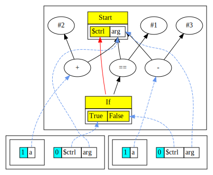
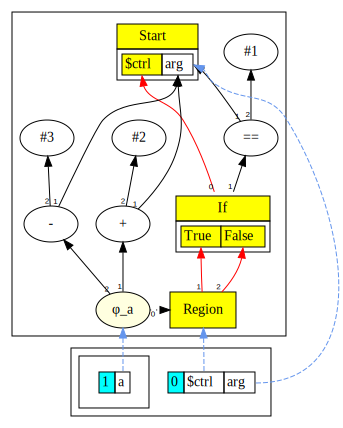
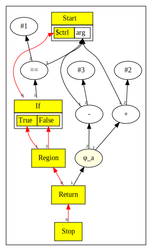
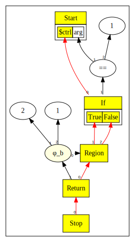
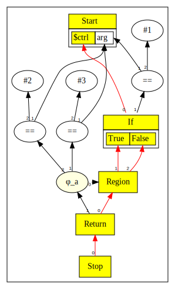
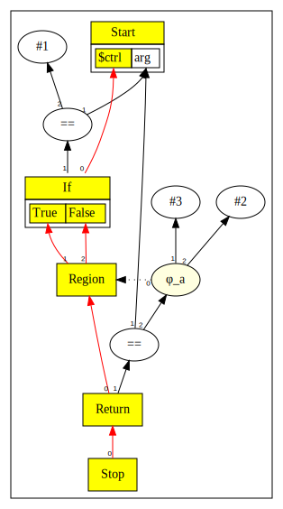
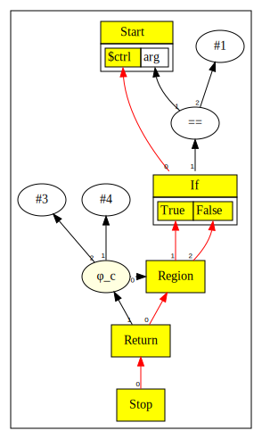
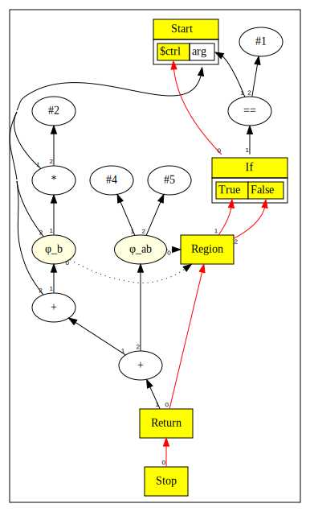
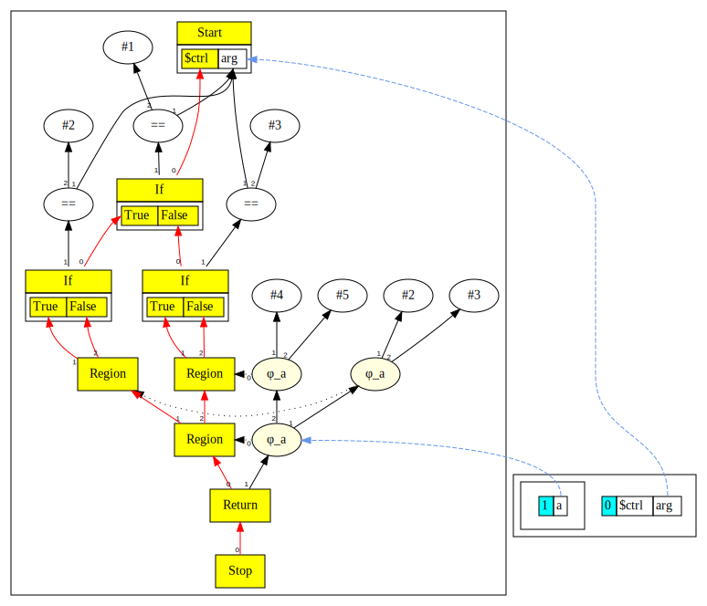

# Chapter 5: If Statement, Phi, and Region

In this chapter we extend the language grammar with the following features:

* We introduce the `if` statement.
* To support splitting of control flow and merging, we introduce new nodes: `Region` and `Phi`.
* Since we can now have multiple return points, we also introduce the `Stop` node as the termination.

Here is the [complete language grammar](docs/05-grammar.md) for this chapter.

## Recap

Here is a recap of the nodes introduced in previous chapters:

| Node Name | Type           | Chapter | Description                                    | Inputs                                                                        | Value                                                                      |
|-----------|----------------|---------|------------------------------------------------|-------------------------------------------------------------------------------|----------------------------------------------------------------------------|
| Multi     | Abstract class | 4       | A node that has a tuple result                 |                                                                               | A tuple                                                                    |
| Start     | Control        | 1       | Start of function, now a MultiNode             |                                                                               | A tuple with a ctrl token and an `arg` data node                           |
| Proj      | Data           | 4       | Projection nodes extract values from MultiNode | A MultiNode and index                                                         | Result is the extracted value from the input MultiNode at offset index     |
| Bool      | Data           | 4       | Represents results of a comparison operator    | Two data nodes                                                                | Result is a comparison, represented as integer value where 1=true, 0=false |
| Not       | Data           | 4       | Logical not                                    | One data node                                                                 | Result converts 0 to 1 and vice versa                                      |
| Return    | Control        | 1       | End of function                                | Predecessor control node and a data node for the return value of the function | Return value of the function                                               |
| Constant  | Data           | 1       | Represents constants such as integer literals  | None, however Start node is set as input to enable graph walking              | Value of the constant                                                      |
| Add       | Data           | 2       | Add two values                                 | Two data nodes without restrictions on the order                              | Result of the add operation                                                |
| Sub       | Data           | 2       | Subtract a value from another                  | Two data nodes, the first one is subtracted by the second one                 | Result of the subtraction                                                  |
| Mul       | Data           | 2       | Multiply two values                            | Two data nodes without restrictions on the order                              | Result of the multiplication                                               |
| Div       | Data           | 2       | Divide a value by another                      | Two data nodes, the first one is divided by the second one                    | Result of the division                                                     |
| Minus     | Data           | 2       | Negate a value                                 | One data node which value is negated                                          | Result of the negation                                                     |
| Scope     | Symbol Table   | 3       | Represents scopes in the graph                 | Nodes that represent the current value of variables                           | None                                                                       |

## New Nodes

The following new nodes are introduced in this chapter:

| Node Name | Type    | Chapter | Description                                        | Inputs                                         | Value                                              |
|-----------|---------|---------|----------------------------------------------------|------------------------------------------------|----------------------------------------------------|
| If        | Control | 5       | A branching test, sub type of `MultiNode`          | A control node and a data predicate node       | A tuple of two values: one for true, one for false |
| Region    | Control | 5       | A merge point for multiple control flows           | An input for each control flow that is merging | Merged control                                     |
| Phi       | Data    | 5       | A phi function picks a value based on control flow | A Region, and data nodes for each control path | Depends on control flow path taken                 |
| Stop      | Control | 5       | Termination of the program                         | All return nodes of the function               | None                                               |

#### `IfNode`

`If` node takes in both control and data (predicate expression) and routes the
control token to one of the two control flows, represented by true and false
`Proj` nodes.

#### `PhiNode`

A `Phi` reads in both data and control, and outputs a data value.  The control
input to the `Phi` points to a `Region` node.  The data inputs to the `Phi` are
one for each of the control inputs to that `Region`.  The result computed by a
`Phi` depends both on the data and the matching control input.  At most one
control input to the `Region` can be active at a time, and the `Phi` passes
through the data value from the matching input.[^1]

#### `RegionNode`

In this Sea of Nodes, there is an embedded Control Flow Graph - and like a
normal CFG there are merge points where two basic blocks flow into one.  The
`Region` node takes control from each predecessor control (block) as input and
produces a merged control as an output.[^2]  

Both `Return` and `If` take control in slot 0.  `PhiNode`s need their
corresponding `RegionNode` to know when to merge data values, so again slot 0
is set, and data values show up in slots 1 and onward.  `RegionNode`s keep
their control inputs in sync with `PhiNode`s, so again their control inputs show up
in slots 1 and onward.

#### We do not associate a control edge on every data node in the graph

If we want to track the basic block a normal instruction is in, we will set the
control input (always slot 0) to some control-producing Node.  Typically we do
not need to (nor want to) track this - so control is `null` for most data ops.
The correctness of such a data op is solely determined by the remaining data
dependencies.  It, and the Nodes that depend on it or on which it depends,
exists in a “sea” of Nodes, with little control structure.

The “sea” of Nodes is useful for optimization, but does not represent any
traditional intermediate representation such as a CFG.  We need a way to
serialize the graph and get back the control dependences. We do this with a
simple global code motion algorithm.[^3]

#### `Stop` Nodes
`StopNode`s only have `ReturnNode` inputs. They mark the program termination.


## Parsing an `if` Statement

When we parse an `if` statement, the control flow splits at that point.  We
must track the names being updated in each part of the `if` statement, and then
merge them at the end.  The implementation follows the description in *Combining Analyses, Combining Optimizations*[^4].

This involves following:

1. We create an `IfNode` with the current control token, i.e. the node mapped to
  `$ctrl`, and the `if` predicate expression as inputs.
2. We add two `ProjNodes` - one for the `True` branch (call it `ifT`), and the
  other for the `False` branch (call it `ifF`) - these extract values from the
  tuple result of the `IfNode`.
3. We duplicate the current `ScopeNode`.  The duplicated `ScopeNode` contains
  all the same symbol tables as the original, and has the same edges.
4. We set the control token to the `True` projection node `ifT`, and parse the true
  branch of the `if` statement.
5. We set the duplicated `ScopeNode` as the current one.
6. The control token is set to the `False` projection node `ifF`, and if there is an
  `else` statement we parse it.
7. At this point we have two `ScopeNode`s; the original one, potentially updated
  by the `True` branch, and the duplicate one, potentially updated by the
  `False` branch.
8. We create a `Region` node to represent a merge point.
9. We *merge* the two `ScopeNode`s. We create `Phi` nodes for any names whose
  bindings differ.  The `Phi` nodes take the `Region` node as the control input
  and the two data nodes from each of the `ScopeNode`s.  The name binding is
  updated to point to the `Phi` node.
10. Finally, we set the `Region` node as the control token, and discard the duplicated `ScopeNode`.

Implementation is in [`parseIf` method in `Parser`](https://github.com/SeaOfNodes/Simple/blob/main/chapter05/src/main/java/com/seaofnodes/simple/Parser.java#L149-L185).

## Operations on ScopeNodes

As explained above, we duplicate ScopeNodes and merge them at a later point. There are some
subtleties in how this is implemented that is worth going over.

### Duplicating a ScopeNode

Below is the code for duplicating a ScopeNode.

Our goals are:
1) Duplicate the name bindings across all stack levels
2) Make the new ScopeNode a user of all the bound nodes
3) Ensure that the order of defs in the duplicate is the same to allow easy merging

For implementation [see `scopeNode.dup()`](https://github.com/SeaOfNodes/Simple/blob/main/chapter05/src/main/java/com/seaofnodes/simple/node/ScopeNode.java#L142-L154)

### Merging two ScopeNodes

At the merge point we merge two ScopeNodes. The goals are:

1) Merge names whose bindings have changed between the two nodes. For each such name, a Phi node is created, referencing the two original data nodes.
2) A new Region node is created representing the merged control flow. The phis have this region node as the first input.
3) After the merge is completed, the duplicate is discarded, and its use of each of the nodes is also deleted.

The merging logic takes advantage of that fact that the two ScopeNodes have the bound nodes in the same order in the list of inputs. This was ensured during duplicating the ScopeNode.
Although only the innermost occurrence of a name can have its binding changed, we scan all the nodes in our input list, and simply ignore ones where the binding has not changed.

For implementation [see `ScopeNode.mergeScopes()`](https://github.com/SeaOfNodes/Simple/blob/main/chapter05/src/main/java/com/seaofnodes/simple/node/ScopeNode.java#L164-L173)


## Example #1

We show the graph for the following code snippet:
```java
int a = 1;
if (arg == 1)
    a = arg+2;
else
    a = arg-3;
return a;
```

### Before Merging

Following shows the graph just before we merge the two branches of the `if` statement in a `Region` node.



Note the two `ScopeNode`s in the graph.
One has its `$ctrl` pointing to the `True` projection, while the other has `$ctrl` pointing to `False` projection.
The variable `a` is bound to the `Add` node in the `True` branch, whereas it is bound to the `Sub` node in the `False` branch.
Thus `a` will need a `Phi` node when merging the two scopes.

### After Merging

Below is the graph after we created a `Region` node and merged the two definitions of `a` in a `Phi` node.



The duplicate `ScopeNode` has been discarded and was merged into the other one.
Since `a` had two different definitions in both scopes a `Phi` node was created and is now referenced from `a`.
The `Phi` node's inputs are the `Region` node and the `Add` node from the `True` branch, and `Sub` node from the `False` branch.

### Finally

Here is the graph after the `return` statement was parsed and processed.




## Example #2

Consider the following code snippet:
```java 
int b = 0;
int c = 0;
if (arg == 1) {
    b = 2;
    c = 1;
}
else {
    b = 1;
}
return b;
```

The value of `b` depends on which path the control flow took.
To resolve this, a Φ (Phi) function is inserted.

``` 
b = Phi(Region,2, 1); // values vary
c = Phi(Region,1, 0); // valuse vary, but dead
```

The `Phi` for `c` will die when the scope where `c` is defined dies.  This does
not happen when merging but after the `return`.  `return` is using `b` so `b`
stays alive.

Before, we go ahead and parse down the if statement we duplicate the scope:
```java
ScopeNode fScope = _scope.dup();
/* Scope[$ctrl:$ctrl, arg:arg][b:0, c:0]*/
```

We then will proceed and parse down the first branch of the if statement:
```java
// Parse the true side
ctrl(ifT);    // set ctrl token to ifTrue projection
parseStatement();  // Parse true-side
ScopeNode tScope = _scope;

/* Scope[$ctrl:True, arg:arg][b:2, c:1]*/
```

Notice, this branch modified and set a new value for both symbols currently existing in the symbol table.
Now, we set the scope back to where we started (without the modifications that `ifT` made)

```java
_scope = fScope; 
```

We then will proceed and parse down the second branch of the if statement:
```java
if (matchx("else")) {
    parseStatement();
    fScope = _scope;
    
    /* Scope[$ctrl:False, arg:arg][b:1, c:0]*/
}
```

This branch modified the values of `b` and `c`.  Since the branch arms are also
lexical scopes, they cannot introduce new symbols in the current (outer) scope.
This means that the order of the name bindings stayed the same.  Excluding the
first control node, we loop through and compare the nodes corresponding to the
same name binding to see if the nodes are different, if so we create a phi node
representing this conflict:

```java
    /*      in(i); 2 */
    /* that.in(i); 1 */
    if( in(i) != that.in(i) ) // No need for redundant Phis
        setDef(i, new PhiNode(ns[i], r, in(i), that.in(i)).peephole());
```




## Example #3

Phi's implement a peephole illustrated in the example:

```java
int a=arg==2;
if( arg==1 )
{
    a=arg==3;
}
return a;
```

Pre-peephole we have:



Post-peephole:



The common operator was pulled out and the Phi node only got applied to the
operands.  Notice how only the second operand of the `==` changes, the first
one stays the same (`arg`).  The implementation is in
[`PhiNode.idealize()`](https://github.com/SeaOfNodes/Simple/blob/main/chapter05/src/main/java/com/seaofnodes/simple/node/PhiNode.java#L31-L71)


## More examples
```java
int c = 3;
int b = 2;
if (arg == 1) {
    b = 3;
    c = 4;
}
return c;
```



```java
int a=arg+1;
int b=arg+2;
if( arg==1 )
    b=b+a;
else
    a=b+1;
return a+b;
```



```java
int a=1;
if( arg==1 )
    if( arg==2 )
        a=2;
    else
        a=3;
else if( arg==3 )
    a=4;
else
    a=5;
return a;
```




[^1]: Click, C. (1995).
  Combining Analyses, Combining Optimizations, 132.

[^2]: Click, C. (1995).
  Combining Analyses, Combining Optimizations, 129.

[^3]: Click, C. (1995).
  Combining Analyses, Combining Optimizations, 86.

[^4]: Click, C. (1995).
  Combining Analyses, Combining Optimizations, 102-103.
