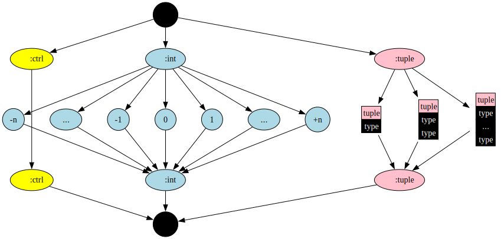
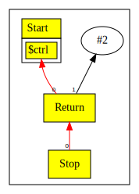
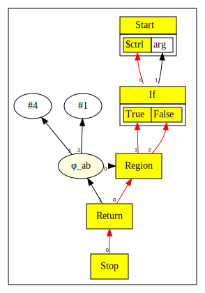

# Chapter 6

In this chapter we do not add new language features. Our goal is to add peephole optimization to `if` statements.

## Type System Revision

We now need to extend the type system to introduce another lattice structure, in addition to the Integer sub-lattice.
As before we denote  "Top" by T and "Bottom" by ⊥.

* "Ctrl" represents a live control, whereas "~Ctrl" represents a dead control.
* "INT" refers to an integer value, note that integer values have their own sub-lattice.

|       | ⊥ | Ctrl | ~Ctrl | T     | INT |
|-------|---|------|-------|-------|-----|
| T     | ⊥ | Ctrl | ~Ctrl | T     | INT |
| Ctrl  | ⊥ | Ctrl | Ctrl  | Ctrl  | ⊥   |
| ~Ctrl | ⊥ | Ctrl | ~Ctrl | ~Ctrl | ⊥   |
| ⊥     | ⊥ | ⊥    | ⊥     | ⊥     | ⊥   |

* "Top" meets any type is that type,
* "Bottom" meets any type is "Bottom",
* "Top", "Bottom", "Ctrl", "~Ctrl" are classed as simple types,
* "Ctrl" meets "~Ctrl" is "Ctrl"
* Unless covered above, a simple type meets non-simple results in "Bottom"

The entire revised Lattice is shown below:




## Peephole of `if`

* Our general strategy is to continue parsing the entire `if` statement even if we know that one branch is dead.
* This approach creates dead nodes which get cleaned up by dead code
  elimination.  The benefits are that we do not introduce special logic during
  parsing, the normal graph building machinery takes care of cleaning up dead
  nodes.
* When we peephole an `If` node we test if the predicate is a constant.  If so,
  then one branch or the other dead, depending on if the constant is `0` or not.
* When we add the `Proj` nodes, in this scenario, we already know one of the projections is dead.  The peephole of the
  relevant `Proj` node replaces the `Proj` with a `Constant` of type "~Ctrl" indicating dead control.
* At this point our dead code elimination would kill the `If` node since it has no uses
   - but we cannot do that because we need to continue the parse.  The
  important observation is that *we __can__ kill the `If` node after __both__
  the `Proj` nodes have been created*, because any subsequent control flow can
  only see the `Proj` nodes.
* To ensure this, we add a dummy user to `If` before creating the first `Proj` and remove it immediately after, allowing the
  second `Proj` to trigger a dead code elimination of the `If`.
* The live `Proj` gets replaced by the parent of `If`, whereas the dead `Proj` gets replaced by "~Ctrl".
* The parsing then continues as normal.
* The other changes are when we reach the merge point with a dead control.
* Again keeping with our strategy we merge as normal, including creating `Phi` nodes.
* The `Region` may have have one of its inputs as "~Ctrl".  This will be seen
  by the `Phi` which then optimizes itself.  If the `Phi` has just one live
  input, the `Phi` peephole replaces itself with the remaining input.
* Finally, at the end, when the `Region` node is peepholed, we see that it has only one live input and no Phi uses
  and can be replaced with its one live input.

## `Region` and `Phi`

One of the invariants we maintain is that the for each control input to a
`Region` every `Phi` has a 1-to-1 relationship with a data input.  Thus, if a
`Region` loses a control input, every `Phi`'s corresponding data input must be
deleted.  Conversely, we cannot collapse a Region until it has no dependent
`Phi`s.

When processing `If` we do not remove control inputs to a `Region`, instead the
dead control input is simply set to `Constant(~Ctrl)`.  The peephole logic in
a `Phi` notices this and replaces itself with the live input.

## Discussion

With the changes above, our peephol optimization is able to fold dead code when
an `if` statement has a condition that evaluates to `true` or `false` at compile time.

Let's look at a simple example below:

```java
if( true ) return 2;
return 1;
```

Before peephole:


After peephole:



Another example:

```java
int a=1;
if( true )
  a=2;
else
  a=3;
return a;
```

Before peephole:


After peephole:


## Expanding Peephole Beyond Constant Expressions

While our peephole of the `CFG` collapses dead code when the expression is
a compile time constant. it does not do as well as it could with following example:

```java
int a = 0;
int b = 1;
if( arg ) {
    a = 2;
    if( arg ) { b = 2; }
    else b = 3;
}
return a+b;
```

In this example, `arg` is defined externally, and we have to assume it is not a constant.
However, the code repeats the `if( arg )` condition in the inner `if` statement.
We know that if the outer `if( arg )` is true, then the *inner `if` must also evaluate to true*.

Our peephole at present cannot see this:


What we would like is for our peephole to see that the inner `if` is fully determined by the
outer `if` and thus, the code can be simplified as follows:

```java
int a = 0;
int b = 1;
if ( arg ) {
    a = 2;
    b = 2;
}
return a+b;
```

That is, the final outcome is either `4` if `arg` happens to be true, or `1` if `arg` happens to be false.

## Dominators

The key to implementing this peephole is the observation that the inner `if` is completely determined by the
outer `if`. In compiler parlance, we say that the outer `if` dominates the inner `if`.

There is a generic way to determine this type of domination; it involves constructing a dominator
tree. For details of how to do this, please refer to the paper `A Simple, Fast Dominance Algorithm`.[^1]

However, constructing a dominator tree is an expensive operation; one that we would not like to
do in the middle of parsing. Fortunately, since we do not have loops yet, we do not
have back edges in our control flow graph. Our control flow graph is essentially hierarchical, tree like.
Thus, a simple form of dominator identification is possible.

The main idea is that we can assign a `depth` to each control node, this represents the node's depth
in the hierarchy. We can compute this depth incrementally as we need to. The nodes that are deeper in the hierarchy
have a greater depth than the ones above.

Secondly we know that for our control nodes, except for `Region`s, there is only one incoming control edge,
which means that most control nodes have a single immediate dominating control node. `Region` nodes are different
as they can have one or more control edges; but, we know that for `if` statements, a `Region` node has exactly two
control inputs, one from each branch of the `if`. To find the immediate dominator of a `Region` node in the
limited scenario of an `if`, we can follow the immediate dominator of each branch until we find the common ancestor
node that dominates both the branches.

If this ancestor node is also an `if` and its predicate is the same as the current `if`, then we know that
the outcome of the present `if` is fully determined.

The code that does this check is in the [`compute` method of the `if`](https://github.com/SeaOfNodes/Simple/blob/main/chapter06/src/main/java/com/seaofnodes/simple/node/IfNode.java#L38-L45).

The `idom` method in `Node` provides a default implementation of the depth based immediate dominator calculation.
`Region`'s [override this](https://github.com/SeaOfNodes/Simple/blob/main/chapter06/src/main/java/com/seaofnodes/simple/node/RegionNode.java#L57-L74) to implement the more complex search described above.

It turns out that to simplify the example above, we need a [further peephole in our `Add` node](https://github.com/SeaOfNodes/Simple/blob/main/chapter06/src/main/java/com/seaofnodes/simple/node/AddNode.java#L64-L67).

With all these changes, the outcome of the peephole is just what we would like to see!



[^1]: Cooper, K. D. Cooper, Harvey, T. J., and Kennedy, K. (2001).
  A Simple, Fast Dominance Algorithm.
