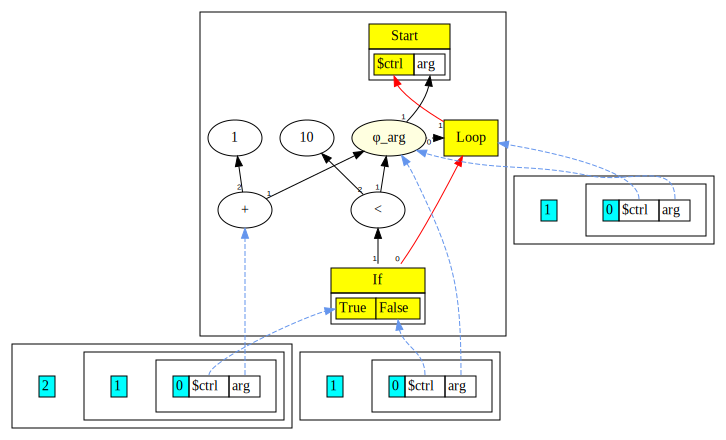

# Chapter 7

In this chapter we introduce the `while` statement.

Here is the [complete language grammar](docs/07-grammar.md) for this chapter.

## Dealing With Back Edges

The complication introduced by looping constructs is that variables flow back into the body of the loop on iteration.
For example:

```java
while(arg < 10) {
    arg = arg + 1;
}
return arg;
```

The variable `arg` is assigned a new value inside the body of the loop, and this then flows back into the body of the loop.

In general, we will rewrite the looping construct as follows:

```java
loop_head:
if( !(arg < 10) ) 
    goto loop_exit;
arg = arg + 1;
goto loop_head;

loop_exit:
```

Above is for illustration only, we do not have labels and `goto` statements in the language.

From an SSA[^1] point of view, since `arg` flows back, it requires a `phi` node at the head. Conceptually we would like the outcome to be:

```java
// arg1 represents incoming arg
//
loop_head:
arg2 = phi(arg1, arg3);
if( !(arg2 < 10) ) 
    goto loop_exit;
arg3 = arg2 + 1;
goto loop_head;

loop_exit:
```

Notice that the phi for `arg2` refers to `arg3`, which is not known at the time we parse the `while` loop predicate. This is the crux of the problem that we need 
to solve in order to successfully construct the Sea of Nodes graph, which is always in SSA form.

Recall from [Chapter 5](../chapter05/README.md) that when parsing `if` statements, we clone the symbol tables as we go past the `if` predicate.
Later we merge the two sets of symbol tables at a `Region` - creating phis for all names that encountered a change in definition within the two 
branches of the `if` statement. In the case of the `if` statement, the phis are created at the merge point when we already know the definitions
that are being merged.

The essential idea for loop constructs is to eagerly create phis for all names in the symbol tables *before* we enter the loop's `if` condition,
since we do not know which names will be redefined inside the body of the loop. When the loop terminates, we go back and remove unnecessary
phis. We call this approach the "eager phi" approach.[^2]

In [Chapter 8](../chapter08) we will implement a "lazy phi" approach that creates phis only when we encounter redefinition of a name.

## New Node Types

Our list of nodes remains the same as in [Chapter 5](../chapter05/README.md), however, we create a subtype of `Region` named `Loop` to better
encapsulate some of the additional logic required. A key aspect of this is to temporarily disable peepholes of the `Region` and any phis
created until we complete parsing the loop body. This is because our phis are not fully constructed until the loop end.

## Detailed Steps

1. We start by creating a new subclass of `Region`, the `Loop`. The `Loop` gets two control inputs, 
   the first is the entry point, i.e. the current binding to `$ctrl`, and second (`null`) is a placeholder for the back edge that is 
   set after loop is parsed. The absence of a back edge is used as an indicator to switch off peepholes of the region and
   associated phis. 

    ```java
    ctrl(new LoopNode(ctrl(),null).peephole());
    ```

   The newly created region becomes the current control.

2. We duplicate the current Scope node. This involves duplicating all the symbols at
   every level with the scope, and creating phis for every symbol except the `$ctrl` binding.

    ```java
    // Make a new Scope for the body.
    _scope = _scope.dup(true);
    ```
   
   Note that the `dup` call is given an argument `true`. This triggers creating phis. The code
   that creates the phis in the `dup()` method is shown below.

    ```java
    // boolean loop=true if this is a loop region
    
    String[] names = reverseNames(); // Get the variable names
    dup.add_def(ctrl());      // Control input is just copied
    for( int i=1; i<nIns(); i++ ) {
       if ( !loop ) { dup.add_def(in(i)); }
       else {
          // Loop region
          // Create a phi node with second input as null - to be filled in
          // by endLoop() below
          dup.add_def(new PhiNode(names[i], ctrl(), in(i), null).peephole());
          // Ensure our node has the same phi in case we created one
          set_def(i, dup.in(i));
       }
    }
    ```
   
   Inside the `else` block both the duplicated scope and the original scope get the same phi node.

3. Next we set up the `if` condition, very much like we do with regular ifs.

    ```java
    // Parse predicate
    var pred = require(parseExpression(), ")");
    // IfNode takes current control and predicate
    IfNode ifNode = (IfNode)new IfNode(ctrl(), pred).<IfNode>keep().peephole();
    // Setup projection nodes
    Node ifT = new ProjNode(ifNode, 0, "True" ).peephole();
    ifNode.unkeep();
    Node ifF = new ProjNode(ifNode, 1, "False").peephole();
    ```

4. We make another clone of the current scope. This will be the exit scope that will live after the loop ends, 
   therefore `$ctrl` in the exit scope is set to the `False` projection. 
   The exit scope captures any side effects of the loop's predicate.

    ```java
    // The exit scope, accounting for any side effects in the predicate
    var exit = _scope.dup();
    exit.ctrl(ifF);
    ```

5. We now set the control to the `True` projection and parse the loop body.

    ```java
    // Parse the true side, which corresponds to loop body
    ctrl(ifT);              // set ctrl token to ifTrue projection
    parseStatement();       // Parse loop body
    ```

6. After the loop body is parsed, we go back and process all the phis we created earlier.
   
    ```java
    // The true branch loops back, so whatever is current control gets
    // added to head loop as input
    head.endLoop(_scope, exit);
    ```

   The `endLoop` method sets the second control of the loop region to the control from the back edge.
   It then goes through all the phis and sets the second data input on the phi to the corresponding entry
   from the loop body; phis that were not used are peepholed and get replaced by the original input.

    ```java
    Node ctrl = ctrl();
    ctrl.set_def(2,back.ctrl());
    for( int i=1; i<nIns(); i++ ) {
       PhiNode phi = (PhiNode)in(i);
       assert phi.region()==ctrl && phi.in(2)==null;
       phi.set_def(2,back.in(i));
       // Do an eager useless-phi removal
       Node in = phi.peephole();
       if( in != phi )
          phi.subsume(in);
    }
    ```

7. Finally, both the original scope (head) we started with, and the duplicate created for the body are killed.
   At exit the false control is the current control (step 4), and exit scope is set as the current scope. 

   ```java
   // At exit the false control is the current control, and
   // the scope is the exit scope after the exit test.
   return (_scope = exit);
   ```

### Visualization

The example quoted above is shown below at an intermediate state:



* Three Scopes are shown, reading clockwise, the loop head, exit and the body.

The final graph looks like this:


## More Complex Examples

### Nested Loops

```java
int sum = 0;
int i = 0;
while(i < arg) {
    i = i + 1;
    int j = 0;
    while( j < arg ) {
        sum = sum + j;
        j = j + 1;
    }
}
return sum;
```


### Loop With Nested If

```java
int a = 1;
int b = 2;
while(a < 10) {
    if (a == 2) a = 3;
    else b = 4;
}
return b;
```


[^1]: Cytron, R. et al (1991).
    Efficiently computing static single assignment form and the control dependence graph, in ACM Transactions on Programming Languages and Systems, 13(4):451-490, 1991.

[^2]: Click, C. (1995).
    Combining Analyses, Combining Optimizations, 103.