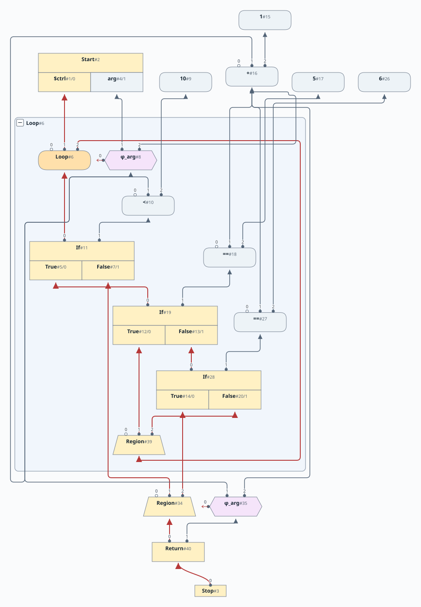
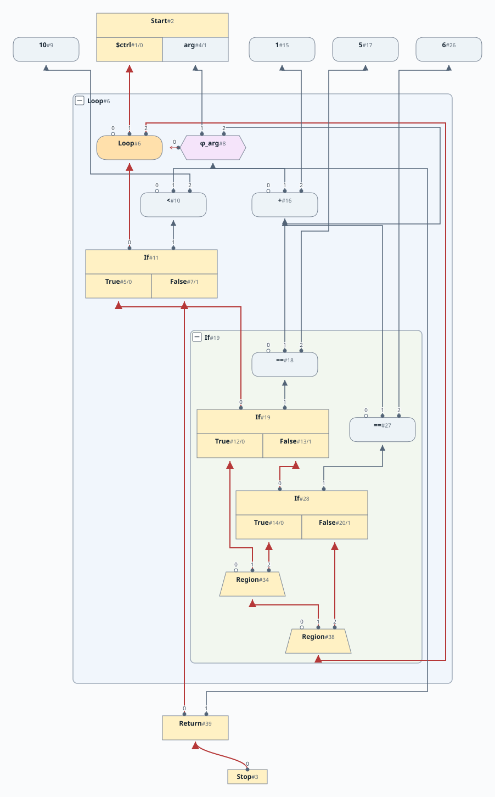
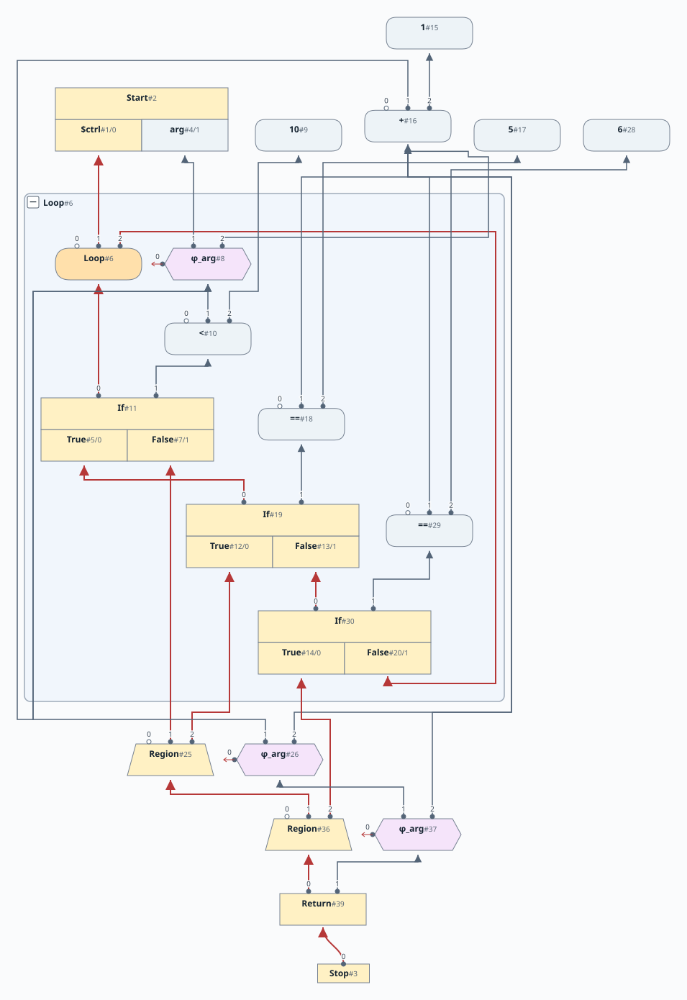

# 第8章: 遅延生成する Phi、Break、Continue、評価器

[English](README.md) | 日本語

この文書は [原文](README.md) の日本語訳です。

[前の章: 第7章](../chapter07/README.ja.md) |
[次の章: 第9章](../chapter09/README.ja.md)

# 目次

1. [Phi の遅延生成](#phi-の遅延生成)
2. [`continue` 文](#continue-文)
3. [`break` 文](#break-文)
4. [パーサーでの考慮事項](#パーサーでの考慮事項)
5. [例](#例)
   - [例1](#例1)
   - [例2](#例2)
   - [例3](#例3)
6. [Sea of Nodes グラフ評価器](#sea-of-nodes-グラフ評価器)

[linear](https://github.com/SeaOfNodes/Simple/tree/linear) ブランチの直線的な Git のリビジョン履歴で [この章](https://github.com/SeaOfNodes/Simple/tree/linear-chapter08) を読み、前の章と [比較](https://github.com/SeaOfNodes/Simple/compare/linear-chapter07...linear-chapter08) することもできます。

この章では次のことを行います。

* ループ内の `Phi` の作成を、先行生成から遅延生成へ移します。
* `break` 文と `continue` 文のサポートを追加します。
* Sea of Nodes グラフ評価器を実装します。

この章の [完全な言語文法](docs/08-grammar.ja.md) はこちらです。

## Phi の遅延生成

[第7章](../chapter07/README.ja.md) では、ループ先頭にすべての変数の `PhiNode` を先行して作成しました。この方法では不要な Phi も作りますが、冗長な Phi は後で削除されます。

この章では、`PhiNode` の遅延生成をサポートします。

`PhiNode` を遅延生成する際の主な難しさは、Phi を作るとき、先行生成していた場合に作られるはずだった最も内側のループ先頭のスコープで作らなければならないことです。`if` 文と `while` 文ではスコープを複製するため、単に現在のスコープに Phi を作るわけにはいきません。

`PhiNode` を遅延生成する最も簡単な方法は、名前の検索にその処理を組み込むことだとわかります。しかし、名前を参照するとき、Phi を作る必要があるとどう判断するのでしょうか。特定の名前の対応付けを、検索時に `PhiNode` に変換すべきだと示す仕組みが必要です。

次のように実現します。

* `ScopeNode.dup()` で、ループ先頭のために Scope を複製する場合、名前の定義を元のノードに設定する代わりに、Scope 自身に設定します。これが番兵（sentinel）として機能します。

    ```java
            // For lazy phis on loops we use a sentinel
            // that will trigger phi creation on update
            dup.addDef(loop ? this : in(i));
    ```

* その後、検索で名前にアクセスするとき、定義が Scope ノードを指していることを検出し、その時点で `PhiNode` を作ります。対応する実装は `ScopeNode.update()` にあります。

    ```java
        if( old instanceof ScopeNode loop ) {
            // Lazy Phi!
            old = loop.in(idx) instanceof PhiNode phi && loop.ctrl()==phi.region()
                // Loop already has a real Phi, use it
                ? loop.in(idx)
                // Set real Phi in the loop head
                // The phi takes its one input (no backedge yet) from a recursive
                // lookup, which might have inserted a Phi in every loop nest.
                : loop.setDef(idx,new PhiNode(name,loop.ctrl(),loop.update(name,null,nestingLevel),null).peephole());
            setDef(idx,old);
        }
    ```

* スコープをマージするときは、定義に直接アクセスする代わりに名前で検索し、正しい内側のスコープ階層で遅延生成する `PhiNode` が作られるようにします。

    ```java
           if( in(i) != that.in(i) ) // No need for redundant Phis
                // If we are in lazy phi mode we need to do a lookup
                // by name as it will trigger a phi creation
                setDef(i, new PhiNode(ns[i], r, this.lookup(ns[i]), that.lookup(ns[i])).peephole());
    ```

* 最後に `ScopeNode.endLoop()` で残った番兵を片付け、ループ先頭からの入力に置き換えます。

    ```java
        for( int i=1; i<nIns(); i++ ) {
            if( back.in(i) != this ) {
                PhiNode phi = (PhiNode)in(i);
                assert phi.region()==ctrl && phi.in(2)==null;
                phi.setDef(2,back.in(i));
                // Do an eager useless-phi removal
                Node in = phi.peephole();
                if( in != phi )
                    phi.subsume(in);
            }
            if( exit.in(i) == this ) // Replace a lazy-phi on the exit path also
                exit.setDef(i,in(i));
        }
    ```

## `continue` 文

第7章では、ループ末尾から先頭に戻るバックエッジは1本だけでした。

`continue` 文の追加により、ループ先頭に戻るバックエッジが複数になることがあります。

このバックエッジの実装には、いくつかの方法があります。

1. 従来の方法では、各 `continue` のバックエッジをループ先頭にマージします。Phi はエッジの数だけ入力を必要とします。欠点は、Loop が単純な入れ子構造ではなくなることです。これにより、より多くのループ不変式を外に持ち上げるためにループを「部分的に巻き戻す」など、多くの種類のピープホールによるループ最適化が難しくなります。
2. 別の方法は、すべての `continue` を1つのマージ地点（`Region`）に集め、continue の `Region` からループ先頭へ流れるバックエッジを1本作ることです。
3. 3つ目の方法は、continue の `Region` を1つ作る代わりに、そのスタックを作ることです。この方法では、Phi を現在と同じ2入力の単純な形に保てる利点があります。ほかの方法では Phi に3つ以上の入力が必要です。一方、`continue` 文と同じ数の continue `Region` と、それに対応する積み重なった Phi ができることになります。

この章では、基本的な `while` ループのアーキテクチャに最も簡単に実装できる方法3を採用します。[^1]

実装ではスコープを慎重に扱う必要があります。`continue` 用の `PhiNode/RegionNode` を必要な場合だけ生成したいからです。

[基本的なループのアーキテクチャ](../chapter07/README.ja.md) では、ループのバックエッジに到達した時点ですべての入れ子のブロックやスコープを抜けています。現在のスコープと制御を Loop のスコープと制御につなぎ、必要に応じて `PhiNode` を作れば十分です。

しかし、`continue` は入れ子のスコープ（入れ子の `if` 文など）の中にも現れます。continue の `Region` を遅延生成したいので、最初に `continue` に遭遇したら、先頭スコープを複製し、現在のスコープをそこへマージして、continue の Scope と `Region` を生成する必要があります。その後、別の `continue` に遭遇したら、新しい `Region` を作り、それまでの continue Scope と現在の Scope をマージします。

実装は、上記の方法の変形です。

* 最初の `continue` によって現在のスコープを複製します。先頭スコープより深い入れ子のレキシカルスコープを切り詰め、先頭スコープでは見えなかった名前の束縛を取り除きます。これは本質的に、入れ子のスコープを「抜ける」ことを保証しています。

  continue スコープの初期値を null にします。

    ```java
        // No continues yet
        _continueScope = null;
    ```

  continue を解析するとき、最初は `_continueScope` が null です。

    ```java
        private Node parseContinue() { return (_continueScope = require(jumpTo( _continueScope ),";"));  }

        private ScopeNode jumpTo(ScopeNode toScope) {
            ScopeNode cur = _scope.dup();
            ctrl(new ConstantNode(Type.XCONTROL).peephole()); // Kill current scope
            // Prune nested lexical scopes that have depth > than the loop head
            // We use _breakScope as a proxy for the loop head scope to obtain the depth
            while( cur._scopes.size() > _breakScope._scopes.size() )
                cur.pop();
            // If this is a continue then first time the target is null
            // So we just use the pruned current scope as the base for the
            // continue
            if (toScope == null)
                return cur;
            // toScope is either the break scope, or a scope that was created here
            assert toScope._scopes.size() <= _breakScope._scopes.size();
            toScope.mergeScopes(cur);
            return toScope;
        }
    ```

* continue スコープは、後続の `continue` 文の基準となるスコープになり、こうして continue スコープと Region のスタックを形成します。
* ループが終わった後、ループ内で continue スコープを作っていたなら、現在のスコープを continue スコープへマージし、その continue スコープを有効なスコープにする必要があります。

    ```java
        // Merge the loop bottom into other continue statements
        if (_continueScope != null) {
            _continueScope = jumpTo(_continueScope);
            _scope.kill();
            _scope = _continueScope;
        }
    ```

## `break` 文

`break` の実装は `continue` より簡単です。ループ本体の解析前に出口スコープを作っており、これが初期の `break` スコープになります。`break` に遭遇したら、入れ子のレキシカルスコープを切り詰めた後、現在のスコープを現在の break スコープにマージします。その結果の新しいスコープが、有効な break スコープになります。

## パーサーでの考慮事項

`continue` や `break` の対象は、それを直接囲む `while` ループです。そのため、`continue` と `break` のスコープのスタックを管理します。`while` ループの解析前にそれまでの `continue` や `break` のスコープを保存し、解析後に復元することで実現します。

## 例

### 例1

```java
while(arg < 10) {
    arg = arg + 1;
    if (arg == 5)
        continue;
    if (arg == 6)
        break;
}
return arg;
```



### 例2

```java
while(arg < 10) {
    arg = arg + 1;
    if (arg == 5)
        continue;
    if (arg == 6)
        continue;
}
return arg;
```



### 例3

```java
while(arg < 10) {
    arg = arg + 1;
    if (arg == 5)
        break;
    if (arg == 6)
        break;
}
return arg;
```



## Sea of Nodes グラフ評価器

評価器は、プログラムの開始点から制御フローを前向きにたどり、Return ノードに到達するか、最大ループ回数を超えるまで、与えられたグラフを直接評価します。

評価器は呼び出されると、最初にグラフを走査して Start ノードを見つけ、準備を行います。プログラムが特別なパラメーター `arg` を使っている場合、渡されたパラメーター値を、そのパラメーターを表すノードに束縛します。

この簡単な準備が済むと、Start ノードからの制御の射影をたどり、プログラムの「実行」を始められます。

この時点で制御フローはプログラムの最初の Region にありますが、ほかの Region とまったく同じように扱います。各 Region で行うべき処理は2つあります。まずすべての phi を具体的な値に解決し、次に制御フローの次の行き先を決めます。

もっと処理が必要に思えるかもしれません。しかし phi ノードを解決すれば、その Region の制御フロー経路に固有のロジックはすべて解決されます。それ以外の処理は、後で必要に応じて解決されます。プログラムの実行には、これで十分です！

Region の後の制御フローの行き先は簡単に見つけられます。Region を使う制御ノードは1つだけだからです。そのため、Region の利用側の中からそのノードを探します。

そのノードを見つけたら、到達した制御フローノードの種類によって動作を変えます。可能性は `RegionNode`、`IfNode`、`ReturnNode` の3つだけです。別の `RegionNode` なら、同じ処理を繰り返します。`ReturnNode` なら、戻り値の式を解決してプログラムの値を返せます。最後に `IfNode` の場合、まず判定式を解決し、true（射影0）または false（射影1）の分岐を選択します。`IfNode` のどちらの射影を選んでも、その射影を通って、それを使う制御ノード（`RegionNode`）に進みます。

上ではノードを「解決する」と述べましたが、それは何を意味するのでしょうか。ノードは、値を持つ（たとえば定数）か、すでに解決されて値がキャッシュされているか、あるいは自身が使うノードに対して演算を行います。最後の場合、その入力ノードを解決する必要があります。入力が解決されたら、それらに対してノードの演算を行えます。たとえば `AddNode` の値は、2つの入力の和です。値を解決したら、その値を返します。

これで、ループのない単純なプログラムを評価できます。

ループもほぼこのままで動作し、少しだけ追加の処理が必要です。制御が `LoopNode` を通るたびに、評価器はループの反復回数を使い切っていないか確認します。使い切っていたら、タイムアウトを示す RuntimeException を投げます。

最後に、ループ Region の `PhiNode` の値を計算するときは、どのキャッシュ値も更新する前に、すべての新しい値を計算するよう注意が必要です。ループの反復では、すべての `PhiNode` の値が同じ時点の値になるようにしなければならないからです。新しい値をすべて計算し終えたら、それらのキャッシュを一度に更新できます。これを説明するため、次のコードを考えます。

```java
int t = 0;
while(arg < 10) {
    t = arg;
    arg = arg + 1;
}
return t;
```

このコードでは、グラフはループ内の2つの文をどちらの順序でも評価できるため、`t` に以前の `arg` の値を設定する前に、`arg` の新しい値をキャッシュしないようにする必要があります。

この評価方法は、命令選択、レジスタ割り当て、コード生成を気にせずプログラムを実行できるため、テストに便利です。通常のピープホール最適化で生成したグラフを実行します。後の章では、異なるワークリストの順序で最適化したグラフを評価器で比較し、結果の不一致を検出できます。この章のファザーは、生成したプログラムについて、コンパイラと評価器の失敗をチェックします。

``` java
arg=arg+arg;
arg=arg+arg;
...
arg=arg+arg;
return arg;
```

一方、このエンジンは特に高速になるようには設計していません！ すべての式をキャッシュするわけではないため、直前の例のように実行時間が指数的になるプログラムを作ることができます。

[^1]: 方法2も試しました。この別の解法を見たい読者のため、その実装を持つ別のブランチを用意しています。
