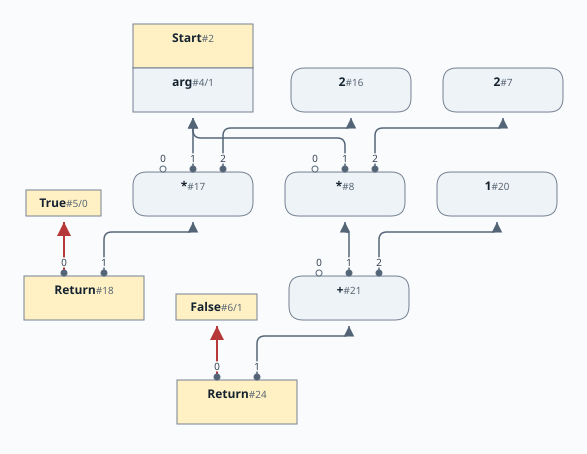
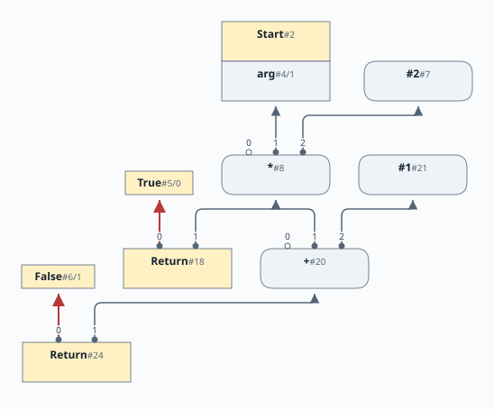
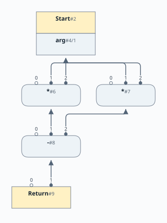
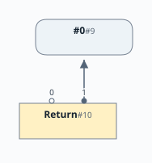
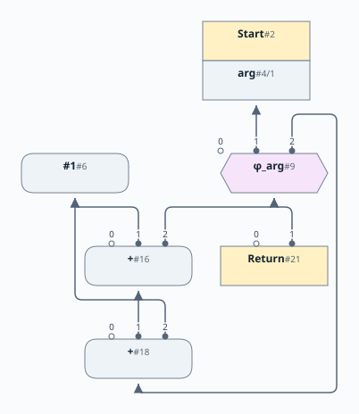
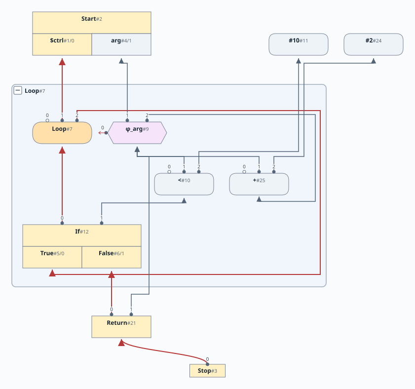

# 第9章: 大域的値番号付けと反復的なピープホール最適化

[English](README.md) | 日本語

この文書は [原文](README.md) の日本語訳です。

[前の章: 第8章](../chapter08/README.ja.md) |
[次の章: 第10章](../chapter10/README.ja.md)

文法は[第8章](../chapter08/docs/08-grammar.ja.md)から変わりません。

# 目次

1. [ピープホール最適化の基盤づくり](#ピープホール最適化の基盤づくり)
2. [大域的値番号付け](#大域的値番号付け)
3. [解析後の反復的なピープホール最適化](#解析後の反復的なピープホール最適化)
4. [遠くの隣接ノード](#遠くの隣接ノード)
5. [今後の課題](#今後の課題)
6. [GVN による共通部分式](#gvn-による共通部分式)
   - [例1](#例1)
   - [例2](#例2)
7. [解析後の反復最適化](#解析後の反復最適化)

[linear](https://github.com/SeaOfNodes/Simple/tree/linear) ブランチの直線的な Git のリビジョン履歴で [この章](https://github.com/SeaOfNodes/Simple/tree/linear-chapter09) を読み、前の章と [比較](https://github.com/SeaOfNodes/Simple/compare/linear-chapter08...linear-chapter09) することもできます。

この章では次のことを行います。

* 大域的値番号付け（共通部分式除去）を追加します。
* 解析後にピープホール最適化を不動点まで反復する最適化を追加します。

この章に言語の変更はなく、最適化だけを追加します。

## ピープホール最適化の基盤づくり

第9章の目標は、ピープホール最適化を「仕上げる」ことです。これ以上ピープホール最適化が登場しないという意味ではありません。むしろ、今後もたくさん登場します。ここで作るのは、それらを整理し、安全で扱いやすく実装し、不動点に到達するまで適用するための基盤です。

本当の目標は、新しいピープホール最適化を恐れずに追加できるようにすることです。間違っていれば、すぐにアサーションで失敗します。正しければ、新しい最適化はほかのすべての最適化と一緒に動き、お互いに効果を高め合います。

## 大域的値番号付け

大域的値番号付け（GVN）は、従来のハッシュテーブルを使い、ノードのオペコードと入力からハッシュを計算します。2つのノードが同じ入力に同じ処理を行うなら、結果も同じなので、共有できます。

* Node にグローバルな静的ハッシュテーブル `GVN` を追加します。
* `Node.equals` を追加します。2つのノードは、同じ入力に対し同じオペコード、すなわち同じ Java クラスを持つ場合に等価です。
* ノードのオペコード（代用としてノード名の文字列）と入力に基づく `hashCode` を追加します。
* `ConstantNode` などいくつかのノードでは、追加の固有情報が必要です。定数17と99は同じではありませんが、どちらも同じ `ConstantNode` クラスとラベルを持ちます。`eq` と `hash` は、この追加情報を確認（またはハッシュ化）します。

ここでは意図的に *値の等価性* を使っていることに注意してください。Simple の多くの箇所では *参照の等価性* を使います。たとえば、ノードとエッジの管理は値の等価性ではなく参照の等価性で行い、`Utils.find()` も参照で検索します。Simple プロジェクト全体で、ノードを検索するときは、それが *値の等価性* か *参照の等価性* かに注意してください。常に明示されているわけではありませんが、文脈から明らかであるはずです。

グラフは頻繁に編集するため、ノードの入力が変わることがあります。それによってハッシュも変わるので、GVN テーブル内で見つからなくなります。たとえば、次の `Add` を `Con` に置き換える場合です。

    (Mul (Add 4 8) x) // Fold the constant
    (Mul    12     x) // The `Mul` changes hash and inputs

対策として、エッジを変更するときにはノードが `GVN` テーブルに存在していないことを要求します。何らかの「エッジのロック」が必要です。「エッジがロックされている」なら、エッジの変更前にまずノードを `GVN` から取り除く必要があります。

* `_hash` フィールドを、キャッシュされたハッシュコードとエッジのロックの両方に使います。0ならノードはロックされておらず、`GVN` にもありません。0以外ならノードの「エッジがロックされており」、`GVN` に存在します。
* `hashCode` 関数はキャッシュされたハッシュがあれば使い、偶然ハッシュが0になることは許しません。
* エッジを変更する前にノードを `GVN` から取り除く `unlock()` を追加します。ノードのエッジを操作するすべての呼び出しの前に挿入します。エッジを変更するすべてのコード経路は、すでにノードを再度ピープホール最適化することを保証しているため、その再訪時にノードを `GVN` テーブルへ再挿入します。

この新しい `GVN` テーブルは、`peepholeOpt()`（および `peephole()`）で、ピープホール最適化するすべてのノードについて共通部分式を探すために使います。ノードのハッシュが0なら、以前の同一ノードとの一致を探します。見つかれば、その以前のノードを使い、現在のノードはデッドコード除去で削除します。見つからなければ、現在のノードを「代表インスタンス」として `GVN` に挿入します。ノードのハッシュがすでに0以外なら、それが「代表インスタンス」だとわかるので、`GVN` を検索する必要はありません。

この最適化全体は、`iter()` の十数行と、共有の `equals`、`hashCode`（コメントを含めてさらに約50行）で実現できます。

不変条件の1つは、ピープホール最適化の実行中に型が単調に上がることです。GVN はこれを一時的に破る場合があります。2つの等価なノードのうち、一方の `_type` はすでに引き上げられ、もう一方はまだかもしれません。どちらを残すかによって、「より低い」`_type` のノードを選ぶ可能性があります。この「低い」は、型の束における意味です。両方の型が正しい必要があり、両ノードの `compute()` は同じ型を返さなければなりません。その型は JOIN に等しい必要があります。対策は、2つのノードの型について（MEET ではなく）JOIN を計算することです。

## 解析後の反復的なピープホール最適化

解析後の `IterPeeps` は、ピープホール最適化を不動点、すなわち適用できる最適化がなくなるまで反復します。ピープホール最適化がコードサイズを増やすことはまれ（まったくない？）なので、これは線形時間になるはずです。グラフは何らかの尺度、通常はサイズについて単調に小さくなるはずです。MulNode やロード/ストアノードの数などが減り、より「高価な」ノードを安価なノードに置き換える場合もあります。

理論上、ワークリストの処理は単純です。次の項目を取って処理します。グラフが変わったら、隣接ノードをワークリストに入れます。この手順を、ワークリストが空になるまで繰り返します。

扱う必要のある主な問題は次のとおりです。

* ノードには利用側があります。あるノード群を別のものに置き換えるには、さらにグラフを組み替える必要があります。高度に難しいわけではありませんが、細かな扱いが面倒です。少数のグラフ操作ユーティリティと、ピープホール最適化の間ではグラフが安定し正しいという強い不変条件が役に立ちます。ここでは、従来の安定したノードのユーティリティを基に、`Node.subsume` が操作の大部分を行います。
* ノードの変更は、グラフの「近傍」も変えます。隣接ノードにもピープホール最適化を適用できるか確認し、その先にも同様に続ける必要があります。ピープホール最適化やグラフ更新の後では、ノードの利用側と定義側をワークリストに入れます。
* 強い不変条件は、すべてのノードについて、ワークリスト上にあるか、適用できるピープホール最適化がないか、のどちらかであることです。確認は簡単ですが、高コストです。通常の「不動点までのピープホール最適化の反復」は基本的に線形時間ですが、この確認は各最適化ステップで線形時間なので、全体では二次時間になります。便利なアサーションですが、アルゴリズム全体が安定したら無効にし、新しく追加したピープホール最適化が誤動作するときに再び有効にできます。このコードは `IterPeeps.iterate` の `assert progressOnList(stop);` として有効になっています。

## 遠くの隣接ノード

一部のピープホール最適化では、「近傍」は直接の利用側や定義側より遠くまで及びます。そのため、より長距離の関係を扱う方法が必要です。たとえば、ある最適化が「this -> A -> B -> C」を調べ、自身を「D」に置き換えようとしても、「B」の何らかの判定で失敗する場合があります。「B」が更新されたら、「this」を再訪し、ピープホール最適化を再確認したいはずです。そこで、「B」に「this」の依存関係を記録します。「B」の更新時に、依存リスト（「this」）を「処理待ち」リストへ追加します。

遠くの隣接ノードの確認の例が `AddNode` にあります。`(Add (Add x 2) 1)` という重なった定数を探し、`(Add x 3)` にしたいとします。調べた結果、代わりに `(Add (Phi (Add x 2) self) 1)` が見つかったとします。`Phi` は `Add` ではないため、当然この確認はそこで打ち切られます。しかし、`(Phi y self)` は一意な入力を1つしか持たず、いずれそれ自体が `y` にピープホール最適化されます。そうなれば、重なった `Add` の最適化を適用できます。そこで、失敗した Add の最適化は `phi.addDep(Add)` を呼び、`Phi` への依存を登録します。実際に後で `Phi` が最適化されたら、その依存ノード（たとえば `Add`）を `IterPeeps` のワークリストへ戻し、重なった Add の最適化を再試行します。

一般的な規則は次のとおりです。

* **ピープホール最適化のパターンが遠くのノードを調べるなら、依存リストに登録しなければなりません！**
* `node.in(1).in(2)` を `node.in(1).in(2).addDep(node)` にします。

この章では、次のパターンでこれを使います。

* 一部の最適化は `Phi` の入力と関係します。直接の場合も間接の場合もあり、たとえば `(Add Add( (Phi x) 2 ) 1)` です。`Phi` の入力がすべて `Constant` なら最適化を進められるため、そのノードを `Phi` の入力の依存側にします。また、`Phi` の Region の依存側にもします。`Node.allCons()` と `PhiNode.allCons()` を参照してください。
* `(Add (Add x 1) 2)` のパターンでは、`x` が定数になれば処理が進むため、外側の `Add` を `x` の依存側として追加します。`AddNode.idealize()` を参照してください。
* `Phi` の型を計算するとき、対応する Region の該当する制御が生きていれば、`Phi` を Region の制御入力の依存側として追加します。その制御が死ねば、`Phi` にピープホール最適化を適用できるからです。`PhiNode.compute()` と `PhiNode.singleUniqueInput()` を参照してください。

変更点:

* Node に `ArrayList<Node> _deps` フィールドを追加します。初期値は null です。
* 一部のピープホール最適化（上記参照）は、遠くのノードの確認に失敗したら `distant.addDep(this)` を呼び、依存を追加します。`addDep` は `_deps` を作り、各種の重複した追加を除外します。
* `IterPeeps` のループは、変更を見つけたら、依存側もすべてワークリストへ移します。

# 例

## GVN による共通部分式

これらの図は値の依存関係に焦点を当てています。通常の制御フローは省略しています。最初の例では、小さな True/False の射影で2つの Return を区別します。空の制御スロットは、コンパイラの入力の欠如ではなく、省略した文脈を表す場合があります。

### 例1

GVN がどのように共通部分式を見つけるかを示す小さな例です。

```java
int x = arg + arg;
if(arg < 10) {
    return arg + arg;
}
else {
    x = x + 1;
}
return x;
```

GVN を使う前には、次のグラフになります。`arg+arg` を `arg*2` に変換していることに注目してください。



GVN を追加すると、次のようになります。`arg*2` の式が2回現れる代わりに、再利用されるようになったことに注目してください。



### 例2

共通の式を再利用できると、さらに最適化が可能になります。単純な例を示します。

```java
return arg*arg-arg*arg;
```

GVN がなければ、ピープホール最適化は減算の両辺が同じ値だと認識できません。



* 各乗算（*）ノードは、`arg` に向かうエッジを2本持ちます。
* 入力スロットのラベルが、同じ定義を使うこの2つの使用を区別します。

GVN があれば、ピープホール最適化はよりよい結果を得られます。



## 解析後の反復最適化

ワークリストに基づく解析後の最適化は、解析中にはできなかった最適化を可能にします。たとえば、次のコードです。

```java
int step = 1;
while (arg < 10) {
    arg = arg + step + 1;
}
return arg;
```

`while` ループの解析中には、`step` が定数で、変化しないことはまだわかりません。そのため、解析後の最適化がなければ次のようになります。

両方の図で、ループの判定と制御のバックエッジは省略しています。Phi のデータのバックエッジは残しているため、繰り返される加算とその置き換えを比較しやすくなっています。その入力1は入口の値、入力2は次の反復の値です。



解析後のワークリストに基づく最適化を有効にすると、次のようになります。グラフのループ本体内に `arg+2` が現れたことに注目してください。



## 今後の課題

後の章で扱いたい問題がさらにあります。

* 順序を考えずにピープホール最適化を実行すると、いくつかの欠点があります。
  - 死んでいるものや、もうすぐ死ぬものを最適化してから削除する場合があります。無駄な処理です。
  - 死んだ無限ループは、ピープホール最適化の無限の循環を引き起こすことがよくあります。死んだループの「根元」を処理すれば、全体を畳み込めるのに、そこに到達できません。
  - 一部の最適化はグラフを直接小さくします。ほかの最適化はサイズを保ったまま別のものを減らします（たとえば2倍の Mul を Shift に置き換える場合）。さらに、簡約する前に一時的にグラフを大きくしようとする最適化も出てくるかもしれません。
* したがって、まずグラフを直接小さくする最適化（デッドコード除去など）を行い、次に別のものを減らす最適化を行い、最後にそれ以外を行うことには利点があります。これはソートされたワークリストを意味しますが、順序の種類はごく限られるため、基数ソートだけで十分です。ピープホール最適化を、たとえば次のような分類に分ける必要があります。
  - 「厳密に小さくする」もの。
  - 「ノード数は同じだが、たとえば `Mul` を `Shift` に置き換える」もの。
  - 自由度を増やすもの（エッジの迂回）。
  - 「後で小さくなるため、今は大きくする」もの（インライン化はこの分類です）。
* リストのどちらかの端から常に取り出すのを避ける利点もあります。一方または他方の端から処理すると、多くの最適化パターンが二次時間になるかもしれません。何かを変更してリストに戻すと、それがすぐに再び取り出されるためです。つまり、同じ最適化を繰り返すループに陥り、たとえば左側に連なる加算木を、少しずつ右側に連なる加算木に移すことになります。擬似ランダムな取り出しは、ランダム化によって悪い最適化パターンを避けます。
* なぜ `IterPeeps` は、`addDeps` の仕組みを備えたワークリストを使う代わりに、全ノードを1回か2回走査するだけではないのでしょうか。定義側を利用側より先に訪問する順序（たとえば逆後順）で巡回することさえできます。

  ループがなければ、そのような1回の走査で局所的なピープホール最適化をすべて見つけられます。実際、パーサーはすでにこれを行っています。しかし、ループやさらに遠くのケースでの機会は見つけられません。ループ周辺の最適化を得るには、再訪が必要です。各回 O(N) のコストで O(N) 回の走査を必要とするケースは簡単に作れ、アルゴリズムはすぐに二次時間になります。

  `addDeps` の解法は、ピープホール最適化を書く際のコストをいくらか増やす代わりに、この二次時間のコストを避けます。
