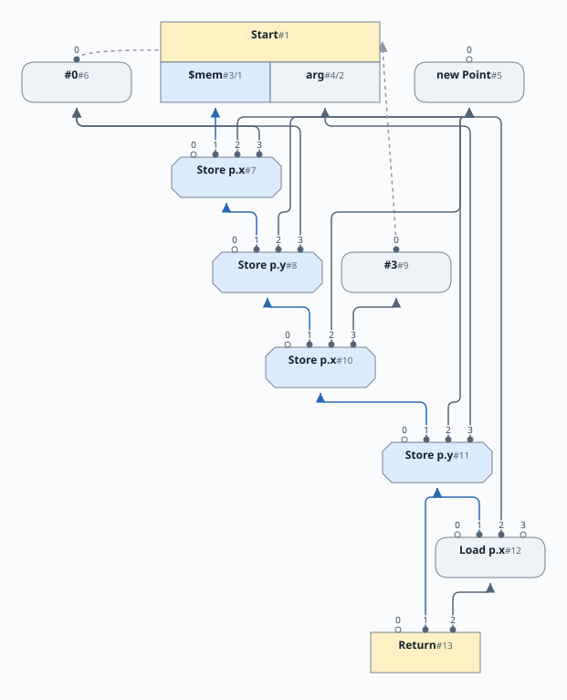
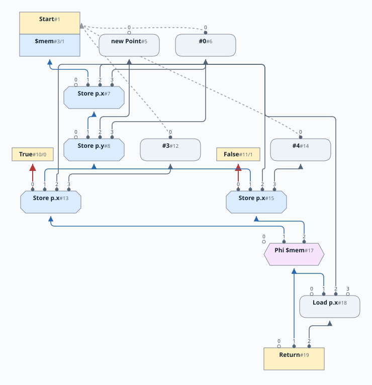
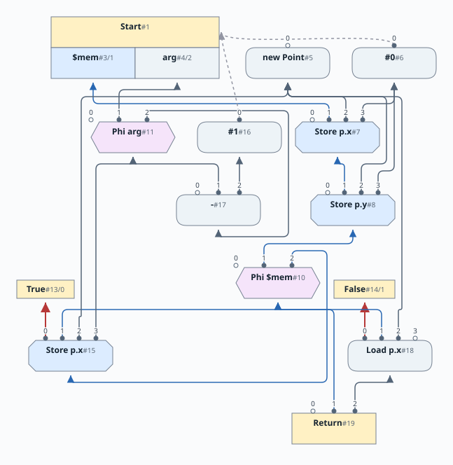
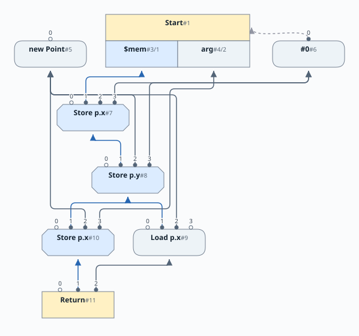

# 第10章: 構造体とメモリ

[English](README.md) | 日本語

[前: 第9章](../chapter09/README.ja.md) |
[次: 第11章](../chapter11/README.ja.md)

この文書は [原文](README.md) の日本語訳です。

この章では、ユーザー定義の構造体、ポインタ、割り当て、フィールドのロードとストア、null チェックを追加します。また、メモリへの作用も含めてグラフを実行する評価器を導入します。[文法](docs/10-grammar.ja.md)は第10章と第11章で共通です。次の章ではメモリの表現を改善します。

## 参照

構造体は、名前と型を持つフィールドの集まりです。C や Java とよく似た、ごく伝統的なものです。新しい構造体は `new` キーワードで作ります。これはメモリを割り当て、参照を生成します。メモリの解放は後の章で扱います。フィールドへのアクセスには `.` 記法を使います。フィールドには、ほかの構造体への参照も含め、任意のスカラー値を格納でき、相互再帰も可能です。参照フィールドは通常の変数と同じように、null を許容することも禁止することもできます。

```java
struct Person {
   String last;    // Last name, must exist
   String? middle; // Optional middle name
   int age;
};
```

ここには、null にならない final な String の `last`、null を許容する final な String の `middle`、そして `int age` があります。`int` として宣言されたすべてのフィールドと同じく、`age` は変更可能です。後の章では、変更可能な参照フィールドと不変の整数フィールドの両方を扱えるようにします。当面はこの選択で、よくある用途の大部分をカバーします。

フィールドにアクセスするには参照が必要です。静的フィールドは後の章で追加します。

フィールドへの参照には、必ず null でないポインタを使わなければなりません。これは型システムが直接チェックします。つまり Simple は、設計によって null ポインタ例外を禁止します。使用前に null をチェックする例を示します。

```java
print(ptr.age); // ERROR!  ptr might be null

if( ptr ) print(ptr.age); // Test before use

// Field use can be far removed, as long as the check dominates
if( ptr ) { 
    S1;   // Other statements
    while( other ) { ...ptr.age... } 
}; 
```

割り当てとストアが加わるため、メモリへの作用を扱う必要が生じます。

## 1つのメモリ値

算術ノードは使用する値に依存します。同じように、ロードはメモリを観測する時点にも依存します。この章では、各ストアは直前のメモリ状態を消費し、次の状態を生成します。ロードはメモリを消費しますが、変更しません。これによって、ソースプログラムのメモリ順序がグラフに明示されます。

```java
struct Point { int x; int y; }
Point p = new Point;
p.x = 3;
p.y = arg;
return p.x;
```

`NewNode` はポインタを生成します。パーサーはまず両フィールドにゼロを書き込むストアを出力し、次に `x` に 3、`y` に `arg` を格納します。最後のロードは、`y` へのストア後のメモリを観測します。異なるフィールドは独立ですが、この章では意図的にこの依存関係を残します。第11章で取り除きます。



グラフは局所的な畳み込み前の依存関係を示しています。メモリに注目するため、制御エッジの大部分を省略し、合流が重要な箇所に最小限の True/False ノードだけを残しています。また、この配置は実行スケジュールではなく、依存関係を示します。

| ノード | 入力 | 結果 |
|---|---|---|
| `New` | 制御と構造体の型 | 新しい、null でないオブジェクトポインタ |
| `Store` | メモリ、ポインタ、フィールド名、値 | 更新されたメモリ全体の状態 |
| `Load` | メモリ、ポインタ、フィールド名 | フィールドの値 |
| `Start` | 外部からの入口 | 制御、初期メモリ、`arg` |
| `Return` | 制御、メモリ、結果 | それまでの作用をすべて保持した完了 |

制御とメモリをともに消費または生成するノードでは、制御がスロット 0、メモリがスロット 1 を占めます。Start の出力は `{ctrl, $mem, arg}`、Return の入力は `{ctrl, $mem, result}` です。

メモリエッジは依存関係であり、ヒープのコピーではありません。グラフは合法な実行順序を決めます。ハードウェアでは Store が物理メモリを直接更新します。評価器では、Store がオブジェクトに付随するメモリ配列を更新します。

## メモリは SSA 変数

パーサーは `$mem` という名前の隠れた束縛を1つ保持します。ソースの識別子に `$` は含められないため、ユーザーコードからこの名前は使えません。メモリの読み出しと更新には、局所変数と同じ `ScopeNode` の検索・更新操作を使います。

`if` の2つの分岐は、異なるメモリ値で終了する可能性があります。通常の Phi が、実行された分岐のメモリを選択します。

```java
struct Point { int x; int y; }
Point p = new Point;
if( arg ) p.x = 3; else p.x = 4;
return p.x;
```



ループには第8章の遅延 Phi 構築を再利用します。ループ内で `$mem` を読み出すか更新すると、最初は未完成のメモリ Phi を作ります。ループを閉じると、その後退エッジが与えられます。`break`、`continue`、入れ子のループ、早期 return でも、スカラー変数と同じスコープの仕組みを使います。

```java
struct Point { int x; int y; }
Point p = new Point;
while( arg ) {
    p.x = arg;
    arg = arg-1;
};
return p.x;
```



すべての Return は現在のメモリ全体の値を消費します。返されるスカラーがストアに依存しない場合や、プログラムが変更したオブジェクト自体を返す場合でも、これによってストアが生き残ります。

## 拡張された型の束

この章では、Simple の型の束を大きく改訂します。


図では **トップ** に `⊤`、**ボトム** に `⊥` を使います。接尾辞は領域を表します。`⊤:struct` は*構造体トップ*で、単独の `⊤` は全体のトップです。本文ではこれらの言葉を使い、コード例では実際の Java 定数を使います。実装の `$TOP` と `$BOT` という名前を図に表示する必要はありません。

| 図 | 本文 | Java 定数 | 内部の構造体名 |
|---|---|---|---|
| `⊤:struct` | 構造体トップ | `TypeStruct.TOP` | `$TOP` |
| `⊥:struct` | 構造体ボトム | `TypeStruct.BOT` | `$BOT` |

図のエッジは束の順序を示し、トップはボトムの上にあります。省略記号を含む箱は、さらに並列の選択肢があることを省略して示すもので、追加の共用体型ではありません。フィールドとタプル要素の型の束は省略しています。フィールドの型には任意のスカラー型（Integer または Pointer）を使え、Tuple の型には Control や Memory を含む*任意の*束の型を使えます。

型の束には、以下の領域があります。

*  は制御フローを表します。制御トップは到達不能な制御、制御ボトムは到達可能な制御です。
*  には整数トップ、整数ボトムと、その間に並列に配置された定数があります。省略記号はほかの整数定数を表します。
* （新規）は構造体の型と null 許容性を組み合わせます。
  * 接頭辞 `*` は、その型へのポインタを意味します。`*Person` は Person への null でないポインタです。接尾辞 `?` は null を含むため、`*Person?` は Person ポインタまたは null を許容します。
  * ポインタ領域には構造体の束全体が2つ含まれます。1つは null を含まず、もう1つは null を含みます。図は両方について名前付きの選択肢を展開しています。単に2つのポインタ型があるわけではありません。
  * `null` は構造体トップと null 許容フラグを組み合わせたもので、null でないオブジェクトの選択肢を持ちません。図では `null` とともに `*⊤:struct?` と表記しています。
  * 構造体ボトムへのポインタは任意の構造体を指せます。図では null でない形式を `*⊥:struct`、null を許容する形式を `*⊥:struct?` と示します。後者がポインタボトムで、ポインタトップは `*⊤:struct` です。
  * null は false、null でないポインタは true と評価されます。

  > C との類推: 構造体ボトムへの null でないポインタは `void *` に似ています。ただし C の `void *` は null にもなれます。Simple はこの定数を `TypeMemPtr.VOIDPTR` と名付け、`*void` と表示します。構造体ボトム自体は、構造体の型に共通する下界であって、C の `void` 型ではありません。

* （新規）は、ユーザー定義の名前付き構造体を表します。この章のフィールドは整数型です。
  * 構造体トップはすべての名前付き構造体の上に、構造体ボトムはすべての名前付き構造体の下にあります。トップは高位の空の構造体の選択肢で、ボトムは保守的に任意の構造体名を含みます。
  * `Person`、`s1`、`s2`、さらにほかの名前は、並列の選択肢です。継承はないため、異なる名前の構造体は、同じフィールドを持っていても互いの下に入りません。
  * プログラムが宣言できる名前に固定の上限はありません。図の省略記号は、特別な無名構造体ではなく、さらに名前付きの選択肢があることを示します。各名前付きの箱は、それぞれのフィールド型の束を省略して表しています。
* （新規）はメモリ全体のトークンを表します。メモリトップとメモリボトムは `TypeMem.TOP` と `TypeMem.BOT` です。どちらも個別のフィールドに格納された値を記録しません。
*  は、Start の制御、メモリ、引数のように、1つのノードから出る結果の集まりを表します。ピンク色の見出しは長さの異なるタプルを区別します。縦に積まれた黒い `type` の各セルは、別のタプルを含む可能性も含め、型の束全体を再び表しています。

束には以下の操作を使います。

* **Meet（交わり）** は最大下界を計算します。これらの例では、入力が表す選択肢を組み合わせるものと考えてください。
  * `Person` と `s1` の meet は構造体ボトムです。この2つの名前だけを表す別の型はありません。
  * `*Person` と `*s1` の meet は、構造体ボトムへの null でないポインタです。
  * `*Person` と `null` の meet は `*Person?` です。
  * 構造体ボトムへの null でないポインタと `null` の meet はポインタボトムです。
  * `1` と `2` の meet は整数ボトムです。
* **Dual（双対）** は束を中心線に対して反転します。トップとボトムが入れ替わり、dual を2回適用すると元の型に戻ります。
  * 構造体トップと構造体ボトムは双対です。
  * `null` と、構造体ボトムへの null でないポインタは双対です。
  * ポインタの dual は、その構造体のフィールドにも dual を適用し、null 許容性を反転します。したがって `*Person` の dual は、一般には元の `*Person?` ではありません。フィールドの型も双対にする必要があります。図ではフィールドの詳細を省略しています。
* **Join（結び）** は最小上界を計算します。meet と dual を通して `JOIN(x,y) = MEET(x.dual(),y.dual()).dual()` と定義されます。
  * `Person` と `s1` の join は構造体トップです。
  * `*Person` と `*s1` の join はポインタトップです。
  * 構造体ボトムへの null でないポインタと `null` の join はポインタトップです。
  * `1` と `2` の join は整数トップです。

Sea of Nodes グラフの構築中には、値が生成された領域の中に留まることを保証します。つまり、ポインタフィールドに整数が入ることは（当然ながら）なく、汎用の `TOP` や `BOT` さえ入りません。強調しておきたい細かい点がいくつかあります。

* Phi を作るとき、その初期型は最初の入力の宣言型に基づきます。ほかにどんな型との meet を取るかはまだわからないため、これは悲観的な型の割り当てです。
* Phi の入力がすべてわかったら、宣言型の局所的なトップから始め、すべての入力型の meet を計算します。この計算により、Phi の型をより精密にします。

## パーサーの拡張

これまでの章で使える型は Integer だけでした。今では変数を Integer 型にも、Struct 型へのポインタにもできます。このため、パーサーは変数の宣言型を追跡するようになりました（以前は Integer だけでした）。変数の宣言型は、その変数に合法的に代入できる値の集合を定義します。Sea of Nodes グラフは、変数に代入された値の実際の型も追跡します。これらの型の遷移は前節で説明した型の束によって定義されます。

## null ポインタ解析

Simple 言語の構文では、ポインタ変数が null を許容すると指定できます。そのうえで、null ポインタ例外が発生することを防ぎます。コンパイラは null チェックが必要かどうかを判定し、必要なのに存在しなければプログラムを拒否します（ユーザーに null チェックの挿入を求めます）。

パーサーは、ポインタ変数の真偽を調べる条件に遭遇すると、その知識を使って以降の分岐で型情報を絞り込みます。

動機となる例を2つ示します。

```java
struct Bar { int a; }
Bar? bar = new Bar;
if (arg) bar = null;
if( bar ) bar.a = 1;
```

上で `bar` が `null` でなければ、`bar.a` への代入を許可したいところです。最後の行に null チェックがなく、たとえば単に `bar.a = 1;` だった場合、`Java` はこのプログラムをコンパイルしますが NPE を投げます。Simple は null チェックが必要だと指摘して、プログラムを拒否します。

```java
struct Bar { int a; }
Bar? bar = new Bar;
if (arg) bar = null;
int rez = 3;
if( !bar ) rez=4;
else bar.a = 1;
```

`bar` が `null` なら、`!bar` を `true` と評価したいところです。else 分岐では `bar` が null でないとわかるため、`bar.a` への代入は許可されるべきです。

この動作を可能にするため、以下の拡張を行います。

* 型システムでポインタが null かどうかを追跡します。したがって、ptr 型が流れるすべての Node でも追跡します。
* `If` ノードの述語が ptr 値なら、その述語をアップキャストで「包みます」。アップキャストは true 分岐で null の可能性を取り除き、ポインタを使えるようにします。
* アップキャストには、構造体ボトムへの null でないポインタ（`TypeMemPtr.VOIDPTR`）への `Cast` を使います。元のポインタ型とこの型の join を取ります。これは図の `*⊥:struct` に対応します。この JOIN 操作は、ptr についてすでにわかっていることをすべて保持し、ptr が null でないという新しい知識を追加します。
* アップキャストは `CastNode` 演算で表し、適用可能であれば現在のスコープで元の述語のすべての出現をアップキャストに置き換えます。変更は `If` の各分岐に局所的で、true 分岐と false 分岐で別々に行います（false 分岐では述語を反転します）。
* アップキャストにも通常のピープホール最適化を適用します。入力の型がアップキャストのスーパータイプなら `CastNode` を除去できます。`ScopeNode.upcast()` メソッドと `CastNode` を参照してください。
* Not の型を計算するとき、入力が ptr なら Integer 型を生成します。入力が `null` なら `1`、null でない ptr 値なら `0` に変換します。`NotNode.compute()` を参照してください。

## 局所的なメモリ最適化

**同じポインタとフィールド**へのストアの直後にあるロードは、格納した値を使えます。`p.x` に `arg` を書き込んだばかりなので、その読み戻しにメモリアクセスは不要です。

```java
struct Box { int x; }
Box p = new Box;
p.x = arg;
return p.x;  // Can return arg directly.
```

| 変換前: 格納した値を読み戻す | 変換後: 値を直接使う |
|---|---|
|  |  |

Return の結果入力は Load から `arg` に変わり、使われなくなった Load は消えます。Return は引き続き Store のメモリを消費するので、書き込みは保持されます。

同じアドレスへの別のストアの直後にあるストアは、先行するストアを必要とするほかのユーザーがなければ、その先行ストアを破棄できます。この別の書き換えにより、上の図に残っているゼロ初期化のストアも除去できます。ここでも、ポインタとフィールドの両方のチェックが重要です。

ロードはメモリ Phi を通って上に移動することもできます。これは[第5章の Phi を通って上に押し上げる最適化](../chapter05/README.ja.md#phi-を通して加算を押し上げる)を拡張したものです。そこでは流入経路上で算術を畳み込みましたが、ここでは対応するストアに対してロードを畳み込めます。「Phi の Load は、Load の Phi になる」。グラフの記法では次のようになります。

```text
Load(Phi(r, m0, m1), p.x)
    -> Phi(r, Load(m0, p.x), Load(m1, p.x))
```

メモリの Phi が、ロードされた値の Phi になります。このピープホール変換は Node の総数を増やすので、利益のヒューリスティックは、少なくとも1つの Load が畳み込まれることを要求します。ループの場合、この Load は**後退エッジ**でなければなりません。入口だけで畳み込むと、サイクルに沿って無限に押し上げ続けられるロードが残るためです。算術の書き換えと同じく、畳み込みを露出させることは、変換後の後片付けに期待するものではなく、グラフを変換する判断の一部です。[`LoadNode.idealize()`](src/main/java/com/seaofnodes/simple/node/LoadNode.java) を参照してください。

逆方向は[第5章の共通演算の引き下げ](../chapter05/README.ja.md#例3)を拡張します。「Load の Phi は、Phi の Load になる」。対応する Load や Store の Phi は、合流後の1つの演算にできます。たとえば、次の2つの書き込みは、

```java
if (arg) s.x = arg+1;
else     s.x = arg+2;
```

`s.x = Phi(arg+1,arg+2)` になり、最終的には `s.x = arg+Phi(1,2)` にできます。一般的な書き換えでは、メモリやポインタも含め、異なる各オペランドについて正しく型付けされた別々の Phi を作ります。メモリ演算にはさらに注意が必要です。型の精度が失われる可能性があるので、それも利益判定の一部としてチェックします。

また、Store を移動したときに元の作用が消えるように、Store にほかのユーザーがあってはいけません。Load については、そのメモリのユーザーに、競合する書き込みやメモリの合流が生じる可能性があってはいけません。そうでなければ、読み出しを遅らせると値が変わり得ます。ずっと後に反依存を追加しますが、今は保守的にチェックします。

### 簡単な最適化を見逃す

1本のメモリ鎖は正しいものの保守的です。オブジェクトが同一でも、`y` へのストアが、先行する `x` へのストアからの値の転送を妨げることがあります。これは最適化の取りこぼしであり、次の章の動機となります。

## グラフの実行

評価器には、小さな遅延スケジューラがあります。ロードは、同じメモリ定義を消費する後続のストアより先に実行しなければなりません。ロードからストアへの通常のデータエッジがなくてもそうです。これらのロード/ストアの反依存が、明示的なグラフエッジを補います。

たとえば `p` の割り当て後の `int old = p.x; p.x = arg; return old;` は、最後のストアの前の値を読みます。以下のグラフでは Load と Store が同じメモリ状態を消費します。スケジューラは Load を先に実行しなければなりません。両者の間に通常のデータエッジはありません。



このスケジューラは本章の実行には十分です。第13章では、大域的コード移動とスケジューリングを独立した話題として扱います。

## ビルドとテスト

このディレクトリで、JDK 21 以降、Make、シェルを使って実行します。

```sh
make lib
make tests
make release
make view
```

Make は Maven を使わずにこのスナップショットを直接ビルドします。`make release` は `build/release/simple.jar` を生成し、`make view` は共通の対話的グラフビューアを起動します。Maven と IDEA のモジュール記述も提供されています。テストには、これまでのすべての章、メモリ順序、返されたオブジェクトの内容、入れ子のループが含まれます。

次の[第11章](../chapter11/README.ja.md)では、パーサーのこの1つの束縛を維持しつつ、グラフを独立したメモリスライスに分割します。
