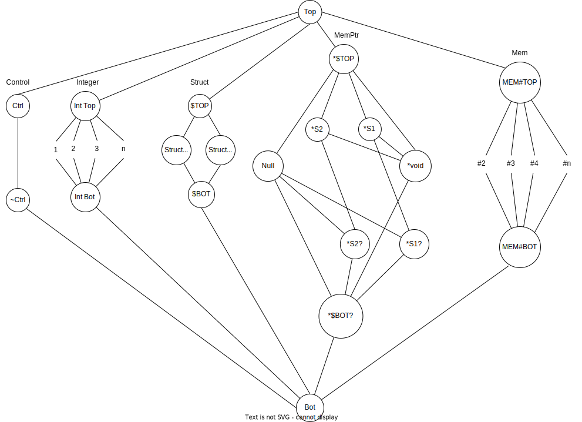
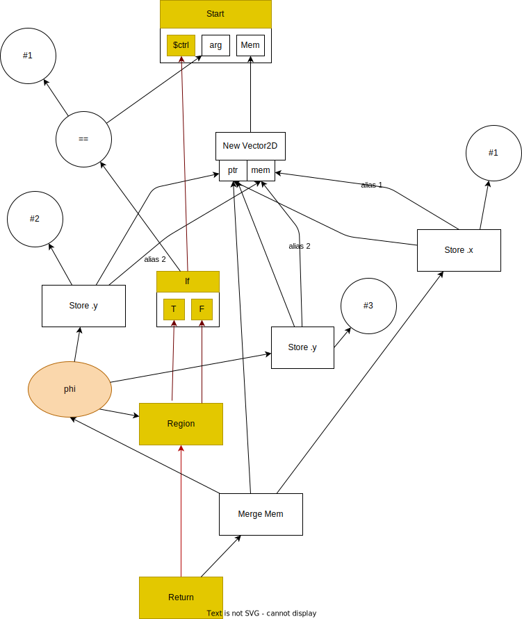
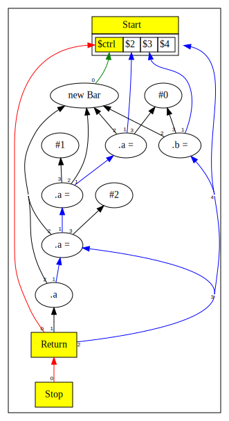
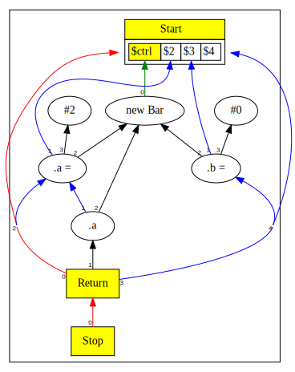
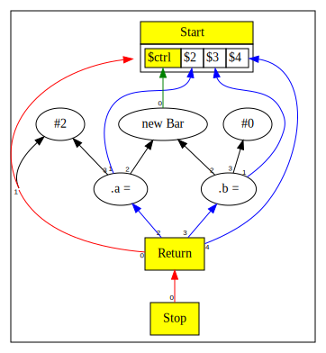

# Chapter 10: Structs and Memory

In this chapter:

* We add user defined struct types in the Simple language.
* We introduce the concept of Memory, Memory Pointers and Aliasing.
* We add new nodes to represent operations on memory - such as creating new instance of a struct, storing and loading struct fields.

Here is the [complete language grammar](docs/10-grammar.md) for this chapter.

## Memory

In previous chapters, we dealt with scalar values that fit into a single
machine register.  We now introduce aggregate values of `struct` type; these
have reference semantics and thus do not behave like register values, even if
the struct would fit into a register.  To support values of such a type, we
need the concept of `Memory`.

The core ideas regarding `Memory` are:

* The program starts and stops with a single `Memory` value that encapsulates
  the whole of available memory; `Start` produces memory and `Return` consumes
  memory.

* Each `struct` and field carves up this memory into "alias classes", a unique
  class for each combination of struct and field.

* Memory in different alias classes *never* aliases; memory in the same alias
  class *always* aliases.  This is sometimes called "equivalence class"
  aliasing.

* Equivalence class aliasing can be directly represented in the Sea of Nodes,
  as such we will not use any other side-structure for aliasing.  This also
  means with normal peepholes we can do alias-based optimizations such as
  load/store bypassing or load forwarding without needing to consult any side
  structure, or make alias tracking modifications when we alter the graph.


### Alias Classes

Aliasing describes a situation in which a data location in memory can be
accessed through multiple symbolic names (variables) in the program.  Modifying
the data through one name implicitly modifies the values associated with all
the aliased names.

Data accesses to the same alias class (struct+field) are serialized as defined
by the source program; data in other classes is allowed to be accessed in
parallel.

Simple, like Java, is a strongly typed language.  Therefore, two variables that
have incompatible types cannot possibly be names to the same location in
memory.  We can use type information to determine which symbols alias,
i.e., potentially reference the same location in memory.  We
divide/slice all memory into disjoint alias classes.

We implement the "alias class" as a unique integer ID assigned to each field in
a struct, where distinct struct types have their own set of ids.  Thus, every
field in every struct type is a new alias class.  In later chapters as we
implement arrays and subtyping, our strategy for assigning alias classes will
be enhanced.

For background information and overview of type based alias analysis, please
refer to the paper `Type Based Alias Analysis`.[^1] Our approach is a form of
TBAA similar to the "FieldTypeDecl" algorithm described in the paper.  We do
not track aliasing by instance of a Struct type.


### Implementation of Alias Classes

For example, suppose we have declared two struct types like so:

```
struct Vec2D { int x; int y; }
struct Vec3D { int x; int y; int z; }
```

Then we can imagine assigning following alias class IDs

| Struct type | Field | Alias |
| ----------- | ----- | ----- |
| Vec2D       | x     | 1     |
| Vec2D       | y     | 2     |
| Vec3D       | x     | 3     |
| Vec3D       | y     | 4     |
| Vec3D       | z     | 5     |

So at this point we have sliced memory into 5 distinct alias classes.
Note that the `x` and `y` in `Vec2D` do not alias `x` and `y` in `Vec3D`.

In this chapter we do not have inheritance or sub-typing. But if we had subtyping and `Vec3D`
was a subtype of `Vec2D` then `x` and `y` would alias and would be given the same alias class.

## Extensions to Intermediate Representation

We add following new Node types to support memory operations:

| Node Name | Type | Description                      | Inputs                                                    | Value                                  |
|-----------|------|----------------------------------|-----------------------------------------------------------|----------------------------------------|
| New       | Mem  | Create ptr to new object         | Control, Struct type                                      | Ptr value                              |
| Store     | Mem  | Stores a value in a struct field | Memory slice (aliased by struct+field), Ptr, Field, Value | Memory slice (aliased by struct+field) |
| Load      | Mem  | Loads a value from a field       | Memory slice (aliased by struct+field), Ptr, Field        | Value loaded                           |
| Cast      | Data | Upcasts a value                  | Control, Data, type                                       | Upcast value                           |


* New takes the current control as an input so that it is pinned correctly in
  the control flow.  Conceptually the control input is also a proxy for all
  memory that originates from the Start node.

* Above, "Ptr" refers to the base address of the allocated object.  Ptrs can represent different values in loops.
* A "Memory Slice" represents a slice of memory where all stores and loads alias.  Different slices do not alias.

Additionally, the following Node types will be enhanced:

| Node Name | Type    | Changes                                                          |
|-----------|---------|------------------------------------------------------------------|
| Start     | Control | Start will produce the initial Memory projections, one per slice |
| Return    | Control | Will merge all memory slices                                     |

## Enhanced Type Lattice

The Type Lattice for Simple has a major revision in this chapter.



Within the Type Lattice, we now have the following type domains:

* Control type - this represents control flow
* Integer type - Integer values
* Tuple type - when a Node results in more than one value
* Struct type (new) - Represents user defined struct types, a struct type is allowed to have members of Integer type only in this chapter
  * `$TOP` represents local Top for struct type; all we know about the type is that it is a struct but, we do not know if it is a specific struct, or all possible structs, etc.
  * `$BOT` represents local Bottom for struct type; we definitely know the value can take all possible struct types.
* Pointer type (new) - Represents a pointer to a struct type
  * `null` is a pointer to non-existent memory object
  * We use the prefix `*` to mean pointer-to. Thus `*S1` means pointer to `S1`, `*$TOP` means pointer to `$TOP`.
  * `*void` is a synonym for `*$BOT` - i.e. it represents a Non-Null pointer to all possible struct types, akin to `void *` in C except not null.
  * `?` suffix represents the union of a pointer to some type and `null`.
  * `null` pointer evaluates to False and non-null pointers evaluate to True, as in C.
* Memory (new) - Represents memory and memory slices
  * `MEM#TOP` - Nothing known about a slice
  * `#n` - refers to a memory slice
  * `MEM#BOT` - all of memory

We make use of following operations on the lattice.

* The `meet` operation takes two types and computes the greatest lower bound
  type.  While not true for all lattices, in the our lattice this can be
  thought of as set union (ORing) of its input types (as sets).
  * Example, meet of `*S1` and `*S2` results in `*void` - there is no lattice
    element for exactly both `{*S1,*S2}`, so we drop down to the nearest
    element containing both (and maybe more), which is `*void*`.
  * Meet of `*S1` and struct `Null` results in `*S1?`
  * Meet of `*void` and `Null` results in `*$BOT?`; bear in mind that `*void` is a synonym for `*$BOT`.
  * Meet of `1` and `2` results in `Int Bot`.
  * Meet of `#1` and `#2` results in `MEM#BOT`.
* The `dual` operation is symmetric across the lattice centerline.  Types directly on the centerline are their own dual.
  * Find the corresponding node of the lattice after inverting the lattice.
    * Thus, dual of `Top` is `Bot`.
    * The dual of `*$TOP` is `*$BOT?`.
  * For structs, the dual is obtained by computing the dual of each struct member. Thus, dual of `*S1` is not `*S1?`.

* The `join` operation takes two types and computes the least upper bound type.
  Similar to `meet` this can thought of as set intersection (ANDing) of its input types.
  Because our lattice structure is simple, we compute `join` with a well known identity:
  `JOIN(x,y) === MEET(x.dual,y.dual).dual`
  * Example, join of `*S1` and `*S2` results in `*$TOP`.
  * Join of `1` and `2` results in `Int Top`.
  * Join of `*void` and `Null` results in `*$TOP`.

As we construct the Sea of Nodes graph, we ensure that values stay inside the
domain they are created in - that is ptr fields will never contain ints
(obviously)... nor even the generic `TOP` and `BOT`.  There are a couple of
nuances worth highlighting.

* When Phis are created, the initial type of the Phi is based on the declared
  type of its first input.  This is a pessimistic type assignment because we do
  not yet know what other types will be met.

* When all the inputs of the Phi are known, we start with the local Top of the
  declared type, and then compute a meet of all the input types.  This
  computation results in a more refined type for the Phi.

## Parser Enhancements

In previous chapters the only available type was Integer.  Now, variables can
be of Integer type or pointer to Struct types.  To support this, the Parser now
tracks the declared type of a variable (used to only be Integer!).  The
declared type of a variable defines the set of values that can be legitimately
assigned to the variable.  The Sea of Nodes graph also tracks the actual type
of values assigned to variables, these type transitions are defined by the Type
lattice described in the previous section.

## Null Pointer Analysis

The Simple language syntax allows a pointer variable to be specified as
Null-able - and it prevents ever throwing a Null Pointer Exception.  The
compiler tries to decide in a null check is needed, and if needed and missing
the compiler rejects the program (asking the user to insert a null check).

When the Parser encounters conditions that test the truthiness of a pointer variable, it uses this knowledge to refine the type information in the branches that follow.

Here are two motivating examples:

```java
struct Bar { int a; }
Bar? bar = new Bar;
if (arg) bar = null;
if( bar ) bar.a = 1;
```

If `bar` is not `null` above, then we would like to allow the assignment to
`bar.a`.  If the final line lacked the null check, e.g. a plain `bar.a = 1;`,
then `Java` would compile this program but throw a NPE, and Simple rejects the
program pointing out a null check is required.


```java
struct Bar { int a; }
Bar? bar = new Bar;
if (arg) bar = null;
int rez = 3;
if( !bar ) rez=4;
else bar.a = 1;
```

If `bar` is `null` then we would like `!bar` to evaluate to `true`. In the else
branch we know `bar` is not null, hence the assignment to `bar.a` should be
allowed.

To enable this behaviour, we make following enhancements.

* We track the null-ness of a pointer in the Type system, and hence in every
  Node that ptr type flows through.

* We "wrap" the predicate of an `If` node with an up-cast when we see that the
  predicate is a ptr value.  The up-cast removes the null possibility on the
  true branch making it legal to use the pointer.

* The up-cast is done using a `Cast` op with the type `*void`.  This does a
  lattice JOIN of the original type and `*void`.  This JOIN operation preserves
  everything we already know about ptr, and also adds the new knowledge that
  the ptr is not-null.

* The up-cast is represented by the `CastNode` op, and if applicable, we
  replace all occurrences of the original predicate with the up-cast in the
  current scope.  The change is local to each branch of the `If`; occuring
  separately for the true and the false branches of the `If` (and the false
  branch inverts the predicate).

* The up-cast peepholes normally; if its input's type is a super type of the
  up-cast, then the `CastNode` can be removed. See `ScopeNode.upcast()` method,
  and `CastNode`.

* When computing a type for Not, we produce an Integer type when its input is a
  ptr.  When the input is a `null` we convert to `1` and when is a not `null`
  ptr value, we convert to `0`.  See `NotNode.compute()`.

## Memory Operations Example

This is a simple example illustrating how loads and stores are ordered based on aliasing.

```java
struct Vec2D { int x; int y; }

Vec2D v = new Vec2D;
v.x = 1;
if (arg)
    v.y = 2;
else
    v.y = 3;
return v;
```

The graph from above will have the shape:



The graph visual has the following enhancements:

* The memory edges are shown in green and blue.
* The green edges occur on New nodes and anchor the ptr to a control flow node.
* The blue edges show the threading of a memory op via the equivalence aliasing.

## Additional Peephole Optimizations

The equivalence aliasing makes it possible to optimize following scenarios:

* Store followed by another Store to the same field inside an object; the first Store is redundant if there are no other references to the first Store
* Load followed by a Store to a field inside an Object; the Load can be eliminated and the input value of the Store passed through.

Both of these examples are illustrated in the example below:

```java
struct Bar {
  int a;
  int b;
}
struct Foo {
  int x;
}
Foo? foo = null;
Bar bar = new Bar;
bar.a = 1;
bar.a = 2;
return bar.a;
```

Before the peephole optimizations, we get:



After enabling Store-Store peephole we get:



After load-after-store elision:



Note that at this stage the `bar` object is dead therefore the allocation of bar can be dropped.


[^1]: Diwan A., McKinley K.S., Moss J.E.B. (1998).
  Type Based Alias Analysis.
