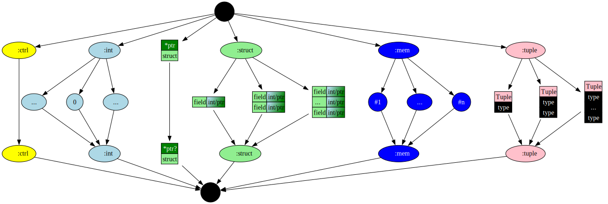
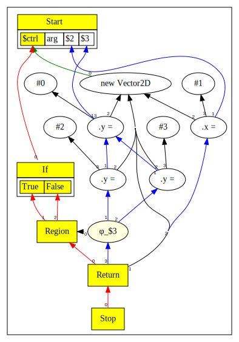

# Chapter 10

In this chapter:

* We add user defined struct types in the Simple language.
* We introduce the concept of Memory, Memory Pointers and Aliasing.
* We add new nodes to represent operations on memory - such as creating new instance of a struct, storing and loading struct fields.

Here is the [complete language grammar](docs/10-grammar.md) for this chapter.

## Memory

In previous chapters, we dealt with scalar values that fit into a single machine register. We now introduce aggregate values of `struct` type; these have reference semantics and thus do not behave like register values, 
even if the struct would fit into a register. To support values of such a type, we need the concept of `Memory`.

The core ideas regarding `Memory` are:

* The program starts with a single `Memory` value that encapsulates the whole of available memory.
* Each `struct` type carves out this memory such that all instances of a particular field in a given struct goes into an "alias class". 

### Alias Classes

Aliasing describes a situation in which a data location in memory can be accessed through multiple symbolic names (variables) in the program. Modifying the data through one name implicitly modifies the values
associated with all the aliased names. 

The compiler's goal is to ensure that data accesses to memory via aliased symbols are serialized as defined by the source program, whereas data that is not aliased is allowed to be accessed in parallel. Moreover, 
knowledge about aliasing helps the compiler eliminate redundant loads and stores.

Simple, like Java, is a strongly typed language. Therefore, two variables that have incompatible types cannot possibly be names to the same location in memory. We can therefore use type information to determine
which symbols alias, i.e., potentially reference the same location in memory. To do this, we divide/slice all memory into disjoint sets called alias classes.

We implement the "alias class" as a unique integer ID assigned to each field in a struct, where distinct struct types have their own set of ids. Thus, every field in every struct type is a new alias class.
In later chapters as we implement arrays and subtyping, our strategy for assigning alias classes will be enhanced.

Alias classes enable the compiler to reorder instructions that do pointer accesses. Our approach combines type and field information so that loads and stores to different fields in
the same or different types can be performed in parallel, while ensuring that loads and stores to the same field of a struct type are serialized.

For background information and overview of type based alias analysis, please refer to the paper `Type Based Alias Analysis`.[^1]
Our approach is a form of TBAA similar to the "FieldTypeDecl" algorithm described in the paper. We do not track aliasing by instance of a Struct type.

### Implementation of Alias Classes

For example, suppose we have declared two struct types like so:

```
struct Vector2D { int x; int y; }
struct Vector3D { int x; int y; int z; }
```

Then we can imagine assigning following alias class IDs

| Struct type | Field | Alias |
| ----------- | ----- | ----- |
| Vector2D    | x     | 1     |
| Vector2D    | y     | 2     |
| Vector3D    | x     | 3     |
| Vector3D    | y     | 4     |
| Vector3D    | z     | 5     |

So at this point we have sliced memory into 5 distinct alias classes.
Note that the `x` and `y` in `Vector2D` do not alias `x` and `y` in `Vector3D`.

In this chapter we do not have inheritance or sub-typing. But if we had subtyping and `Vector3D` 
was a subtype of `Vector2D` then `x` and `y` would alias and would be given the same alias class.

## Extensions to Intermediate Representation

We add following new Node types to support memory operations:

| Node Name | Type | Description                      | Inputs                                                    | Value                                  |
|-----------|------|----------------------------------|-----------------------------------------------------------|----------------------------------------|
| New       | Mem  | Create ptr to new object         | Control, Struct type                                      | Ptr value                              |
| Store     | Mem  | Stores a value in a struct field | Memory slice (aliased by struct+field), Ptr, Field, Value | Memory slice (aliased by struct+field) |
| Load      | Mem  | Loads a value from a field       | Memory slice (aliased by struct+field), Ptr, Field        | Value loaded                           |
| Cast      | ?    | Upcasts a value                  | ?                                                         | ?                                      | 

* New takes the current control as an input so that it is pinned correctly in the control flow. Conceptually the control input is also a proxy for all memory that originates from the Start node.
* Above, "Ptr" refers to the base address of the allocated object. Within the context of a single program (function), each `Ptr` represents a distinct object in memory.
* A "Memory Slice" represents a slice of memory where all stores and loads alias. Different slices do not alias.

Additionally, the following Node types will be enhanced:

| Node Name | Type    | Changes                                                          |
|-----------|---------|------------------------------------------------------------------|
| Start     | Control | Start will produce the initial Memory projections, one per slice |
| Return    | Control | Will merge all memory slices                                     |

## Enhanced Type Lattice

The Type Lattice for Simple has a major revision in this chapter. 



Within the Type Lattice, we now have the following type domains:

* Control type - this represents control flow
* Integer type - Integer values
* Struct type (new) - Represents user defined struct types, a struct type is allowed to have members of Integer type only in this chapter
  * `$TOP` represents local Top for struct type; all we know about the type is that it is a struct but, we do not know if it is a specific struct, or all possible structs, etc.
  * `$BOT` represents local Bottom for struct type; we definitely know the value can take all possible struct types.
* Pointer type (new) - Represents a pointer to a struct type
  * `null` is a pointer to non-existent memory object
  * We use the prefix `*` to mean pointer-to. Thus `*S1` means pointer to `S1`, `*$TOP` means pointer to `$TOP`.
  * `*void` is a synonym for `*$BOT` - i.e. it represents a Non-Null pointer to all possible struct types, akin to `void *` in C except not null.
  * `?` suffix represents the union of a pointer to some type and `null`.
  * `null` pointer evaluates to False and non-null pointers evaluate to True, as in C.
* Memory (new) - Represents memory and memory slices
  * `MEM#TOP` - Nothing known about a slice 
  * `#n` - refers to a memory slice
  * `MEM#BOT` - all of memory

We make use of following operations on the lattice.

* The `meet` operation takes two types and computes the greatest lower bound type. While not generally true, in Simple this approximates to creating a union (ORing) of its input types. 
  * Example, meet of `*S1` and `*S2` results in `*void`.
  * Meet of `*S1` and struct `Null` results in `*S1?`
  * Meet of `*void` and `Null` results in `*$BOT?`; bear in mind that `*void` is a synonym for `*$BOT`.
  * Meet of `1` and `2` results in `Int Bot`.
  * Meet of `#1` and `#2` results in `MEM#BOT`.
* The `join` operation takes two types and computes the least upper bound type. While not generally true, in Simple this approximates to creating an intersection (ANDing) of its input types.
  * Example, join of `*S1` and `*S2` results in `*$TOP`.
  * Join of `1` and `2` results in `Int Top`.
  * Join of `*void` and `Null` results in `*$TOP`.
* The `dual` operation can be described as follows:
  * Find the corresponding node of the lattice after inverting the lattice.
    * Thus, dual of `Top` is `Bot`.
    * The dual of `*$TOP` is `*$BOT?`.
  * However, for structs, the dual is obtained by computing the dual of each struct member. Thus, dual of `*S1` is not `*S1?`.

As we construct the Sea of Nodes graph, we ensure that values stay inside the domain they are created in.
There are a couple of nuances worth highlighting.

* When Phis are created, the initial type of the Phi is based on the declared type of its first input. This is a pessimistic type assignment because we do not yet know what other types will be met. 
* When all the inputs of the Phi are known, we start with the local Top of the declared type, and then compute a meet of all the input types. This computation results in a more refined type for the Phi.

## Parser Enhancements

In previous chapters the only available type was Integer. Now, variables can be of Integer type or pointer to Struct types.
To support this, the Parser now tracks the declared type of a variable.
The declared type of a variable defines the set of values that can be legitimately assigned to the variable.
The Sea of Nodes graph also tracks the actual type of values assigned to variables, these type transitions are defined by the Type lattice described in the previous section.

## Null Pointer Analysis

The Simple language syntax allows a pointer variable to be specified as Null-able.

When the Parser encounters conditions that test the truthiness of a pointer variable, it uses this knowledge to refine the type information in the branches that follow.

Here are two motivating examples:

```java
struct Bar { int a; }
Bar? bar = new Bar;
if (arg) bar = null;
if( bar ) bar.a = 1;
```
If `bar` is not `null` above, then we would like to allow the assignment to `bar.a`.

```java
struct Bar { int a; }
Bar? bar = new Bar;
if (arg) bar = null;
int rez = 3;
if( !bar ) rez=4;
else bar.a = 1;
```
If `bar` is `null` then we would like `!bar` to evaluate to `true`. In the else branch we know `bar` is not null, hence the assignment to `bar.a` should be allowed.

To enable this behaviour, we make following enhancements.

* When computing a type for Not, we produce an Integer type when its input is a ptr. When the input is a `null` we convert to `1` and when is a not `null` ptr value, we convert to `0`. See `NotNode.compute()`.
* We "wrap" the predicate of an `If` node with an up-cast when we see that the predicate is a ptr value. The wrapping occurs separately for the true and the false branches of the `If`; the false branch inverts the predicate. The up-cast is applied
  when we observe that the predicate is a nullable ptr, in which case we join the predicate's type to `*void` thereby lifting the type in the lattice while retaining all the information present in the predicate's type. The up-cast is represented by the
  Cast op, and if applicable, we replace all occurrences of the original predicate with the up-cast in the current scope. The change is local to each branch of the `If`. The up-cast gets peepholed to its input when the input's type is a super type of
  the up-cast target type. See `ScopeNode.upcast()` method, and `CastNode`.

  

## Examples

We now look at some examples.

### Example 1

This is a simple example illustrating how loads and stores are ordered based on aliasing.

```java
struct Vector2D { int x; int y; }

Vector2D v = new Vector2D;
v.x = 1;
if (arg)
    v.y = 2;
else
    v.y = 3;
return v;
```

The graph from above will have the shape:




[^1]: Diwan A., McKinley K.S., Moss J.E.B. (1998).
  Type Based Alias Analysis.