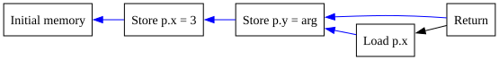
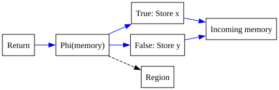
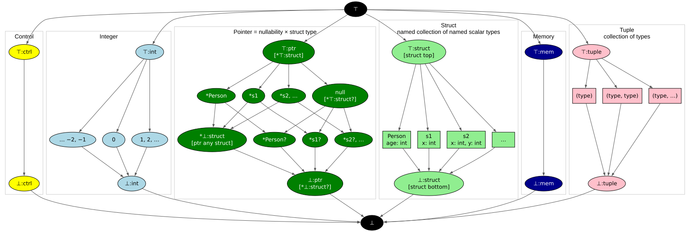
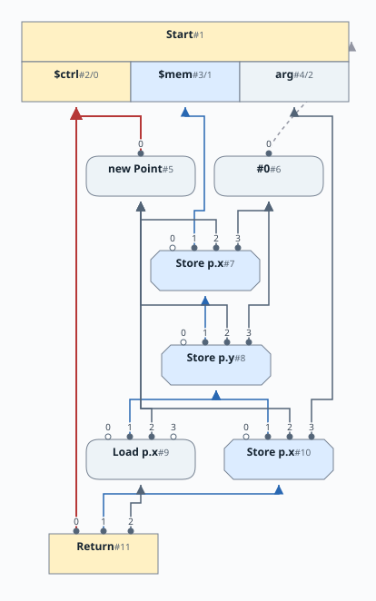

# Chapter 10a: Structs and Memory

[Previous: Chapter 9](../chapter09/README.md) |
[Next: Chapter 10b](../chapter10b/README.md)

This chapter adds user-defined structs, pointers, allocation, field loads and
stores, and null checking. It also introduces an evaluator that executes the
graph, including its memory effects. The [grammar](docs/10-grammar.md) is the
same in 10a and 10b; the next chapter improves the memory representation.

## One memory value

Arithmetic nodes depend on the values they use. A load also depends on when it
observes memory. In this chapter every store consumes the preceding memory
state and produces the next one. A load consumes memory without changing it.
This makes the source program's effect ordering explicit in the graph.

```java
struct Point { int x; int y; }
Point p = new Point;
p.x = 3;
p.y = arg;
return p.x;
```

`NewNode` produces the pointer. The parser emits stores of zero for both fields,
then stores 3 into `x` and `arg` into `y`. The final load observes the memory
after the `y` store. We deliberately keep that dependency here, even though
different fields are independent. Chapter 10b will remove it.



These diagrams are schematic dependency graphs: arrows run from definitions to
uses. Pointer and value inputs are omitted where they do not explain ordering.

| Node | Inputs | Result |
|---|---|---|
| `New` | Control and a struct type | A fresh, non-null object pointer |
| `Store` | Memory, pointer, field name, value | The updated whole-memory state |
| `Load` | Memory, pointer, field name | The value of the field |
| `Start` | External entry | Control, initial memory, and `arg` |
| `Return` | Control, result, memory | Completion with all preceding effects retained |

The memory edge is a dependency token, not a copy of the heap. In the evaluator,
objects contain mutable field arrays; executing a Store changes an array entry.
The graph determines the legal execution order.

## Memory is an SSA variable

The parser keeps one hidden binding named `$mem`. Source identifiers cannot
contain `$`, so user code cannot name it.  Reading and updating memory uses the
same `ScopeNode` lookup and update operations as a local variable.  Start has a
fixed tuple: control at index 0, memory at index 1, and `arg` at index 2.

For an `if`, the two branches can finish with different memory values. An
ordinary Phi selects the memory from the branch that executed:



Loops reuse Chapter 8's lazy Phi construction. Reading or updating `$mem` in a
loop creates an initially incomplete memory Phi. Closing the loop supplies its
backedge. `break`, `continue`, nested loops, and early returns use the same scope
mechanics as scalar variables.


Every Return consumes the current whole-memory value. This keeps stores alive
even when the returned scalar does not depend on them, or when the program
returns the modified object itself.

## Local memory optimizations

A load immediately following a store to the **same pointer and field** can use
the stored value. A store immediately following another store to the same
address can discard the earlier store when no other user needs it. Both the
pointer and field checks matter: two different fields of one object are
different addresses, as are the same fields of two different objects.

A load can also move through a memory Phi when doing so exposes a useful
load-after-store fold. On a loop, the backedge must fold, preventing this rewrite
from repeatedly moving the load around the cycle.

The single chain is conservative. A store to `y` can prevent forwarding an
earlier store to `x`, even when the objects are identical. This is a missed
optimization, not a correctness problem; it motivates the next chapter.

## Enhanced Type Lattice

The Type Lattice for Simple has a major revision in this chapter.



Within the Type Lattice, we now have the following type domains:

* <font style="background-color:yellow">Control type</font> - represents control flow
* <font style="background-color:lightblue">Integer type</font> - Integer values, with a Top, Bottom and constants
* <font style="background-color:green" color="white">Pointer type</font> (new) - Represents a pointer to a struct type
  * We use the prefix `*` to mean pointer-to.  Thus `*S1` means pointer to
    `S1`, `*$TOP` means pointer to `$TOP`.
  * `?` suffix represents the union of a pointer to some type and `null`.
  * The pointer lattice has only 2 entries: null or not-null.  In both cases a struct lattice element is
    included, and can be any member of the struct lattice.
  * `null` is a pointer to non-existent memory object, i.e. `*$TOP?`, and is a
    nullable.  Notice that the null part of the type is low in the lattice,
    while the struct part is the highest struct.
  * `*void` is a synonym for `*$BOT` - i.e. it represents a non-null pointer to
    all possible struct types, akin to `void *` in C except not null.  It is
    the inverse or *dual* of `null`, and the null part is high in the pointer
    lattice, while the struct part is the lowest struct.
  * `null` pointer evaluates to False and non-null pointers evaluate to True, as in C.

* <font style="background-color:lightgreen">Struct type</font> (new) -
  Represents user defined struct types, a struct type is allowed to have
  members of Integer type only in this chapter, later chapters will expand
  this.
  * `⊤:struct` represents local Top for struct type; all we know about the type
    is that it is a struct but, we do not know if it is a specific struct, or
    all possible structs.  In the code, we use a struct with no fields named `$TOP`.
  * `⊥:struct` represents local Bottom for struct type; we definitely know the
    value can take all possible struct types.  In the code, we uise a struct
    with no fields named `$BOT`.
* <font style="background-color:blue" color="white">Memory type</font> (new) - Represents the whole-memory token
  * `⊤:mem` is `TypeMem.TOP`, the high end of the memory domain.
  * `⊥:mem` is `TypeMem.BOT`, our conservative type for the whole-memory state.
  * Neither token describes the values stored in individual fields.
* <font style="background-color:pink">Tuple type</font> - when a Node results in a collection of values

We make use of following operations on the lattice.

* The `meet` operation takes two types and computes the greatest lower bound
  type.  While not true for all lattices, in the our lattice this can be
  thought of as set union (ORing) of its input types (as sets).
  * Example, meet of `*S1` and `*S2` results in `*void` - there is no lattice
    element for exactly both `{*S1,*S2}`, so we drop down to the nearest
    element containing both (and maybe more), which is `*void`.
  * Meet of `*S1` and pointer `null` results in `*S1?`
  * Meet of `*void` and `null` results in `*$BOT?`; bear in mind that `*void` is a synonym for `*$BOT`.
  * Meet of `1` and `2` results in `Int Bot`.
* The `dual` operation is symmetric across the lattice centerline.  Types directly on the centerline are their own dual.
  * Find the corresponding node of the lattice after inverting the lattice.
    * Thus, dual of `Top` is `Bot`.
    * The dual of `*$TOP` is `*$BOT?`.
  * For structs, the dual is obtained by computing the dual of each struct
    member. Thus, dual of `*S1` is not `*S1?`, it is some `*S1?` with dualed
    fields.

* The `join` operation takes two types and computes the least upper bound type.
  Similar to `meet` this can thought of as set intersection (ANDing) of its input types.
  Because our lattice structure is symmetric and complete, we compute `join` with a well known identity:
  `JOIN(x,y) === MEET(x.dual,y.dual).dual`
  * Example, join of `*S1` and `*S2` results in `*$TOP`.
  * Join of `1` and `2` results in `Int Top`.
  * Join of `*void` and `Null` results in `*$TOP`.

As we construct the Sea of Nodes graph, we ensure that values stay inside the
domain they are created in - that is ptr fields will never contain ints
(obviously)... nor even the generic `TOP` and `BOT`.  There are a couple of
nuances worth highlighting.

* When Phis are created, the initial type of the Phi is based on the declared
  type of its first input.  This is a pessimistic type assignment because we do
  not yet know what other types will be met.

* When all the inputs of the Phi are known, we start with the local Top of the
  declared type, and then compute a meet of all the input types.  This
  computation results in a more refined type for the Phi.

## Parser Enhancements

In previous chapters the only available type was Integer.  Now, variables can
be of Integer type or pointer to Struct types.  To support this, the Parser now
tracks the declared type of a variable (used to only be Integer!).  The
declared type of a variable defines the set of values that can be legitimately
assigned to the variable.  The Sea of Nodes graph also tracks the actual type
of values assigned to variables, these type transitions are defined by the Type
lattice described in the previous section.

## Null Pointer Analysis

The Simple language syntax allows a pointer variable to be specified as
null-able - and it prevents ever throwing a Null Pointer Exception.  The
compiler decides if a null check is needed, and if needed and missing
the compiler rejects the program (asking the user to insert a null check).

When the Parser encounters conditions that test the truthiness of a pointer variable, it uses this knowledge to refine the type information in the branches that follow.

Here are two motivating examples:

```java
struct Bar { int a; }
Bar? bar = new Bar;
if (arg) bar = null;
if( bar ) bar.a = 1;
```

If `bar` is not `null` above, then we would like to allow the assignment to
`bar.a`.  If the final line lacked the null check, e.g. a plain `bar.a = 1;`,
then `Java` would compile this program but throw a NPE, and Simple rejects the
program pointing out a null check is required.


```java
struct Bar { int a; }
Bar? bar = new Bar;
if (arg) bar = null;
int rez = 3;
if( !bar ) rez=4;
else bar.a = 1;
```

If `bar` is `null` then we would like `!bar` to evaluate to `true`. In the else
branch we know `bar` is not null, hence the assignment to `bar.a` should be
allowed.

To enable this behaviour, we make following enhancements.

* We track the null-ness of a pointer in the Type system, and hence in every
  Node that ptr type flows through.

* We "wrap" the predicate of an `If` node with an up-cast when we see that the
  predicate is a ptr value.  The up-cast removes the null possibility on the
  true branch making it legal to use the pointer.

* The up-cast is done using a `Cast` op with the type `*void`.  This does a
  lattice JOIN of the original type and `*void`.  This JOIN operation preserves
  everything we already know about ptr, and also adds the new knowledge that
  the ptr is not-null.

* The up-cast is represented by the `CastNode` op, and if applicable, we
  replace all occurrences of the original predicate with the up-cast in the
  current scope.  The change is local to each branch of the `If`; occuring
  separately for the true and the false branches of the `If` (and the false
  branch inverts the predicate).

* The up-cast peepholes normally; if its input's type is a super type of the
  up-cast, then the `CastNode` can be removed. See `ScopeNode.upcast()` method,
  and `CastNode`.

* When computing a type for Not, we produce an Integer type when its input is a
  ptr.  When the input is a `null` we convert to `1` and when is a not `null`
  ptr value, we convert to `0`.  See `NotNode.compute()`.


## Executing the graph

The evaluator includes a small late scheduler. A load must execute before a
later store that consumes the same memory definition, even though there is no
ordinary data edge from the load to that store. These load/store
anti-dependencies supplement the explicit graph edges.



The scheduler is sufficient to execute this chapter. Chapter 11 develops
global code motion and scheduling as a separate topic.

## Build and test

From this directory, with JDK 21 or newer, Make, and a shell:

```sh
make lib
make tests
make release
make view
```

Make builds this snapshot directly, without Maven. `make release` produces
`build/release/simple.jar`; `make view` launches the shared interactive graph
viewer. Maven and IDEA module descriptions are also supplied. Tests include all
earlier chapters, memory ordering, returned object contents, and nested loops.

Next, [Chapter 10b](../chapter10b/README.md) keeps this one parser binding while
splitting the graph into independent memory slices.
