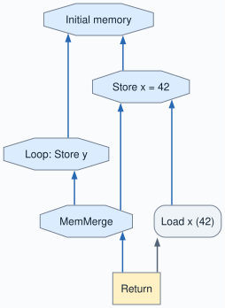
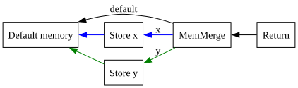
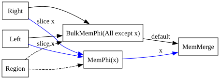
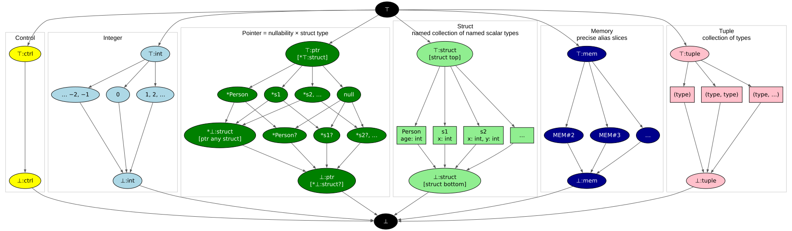
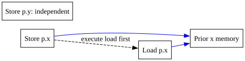

# Chapter 10b: Splitting Memory

[Previous: Chapter 10a](../chapter10a/README.md) |
[Next: Chapter 11](../chapter11/README.md)

Chapter 10a made memory effects explicit with one SSA memory value. This
chapter keeps exactly that parser model and recovers independent memory chains
through graph rewrites. There is no new language syntax; the
[grammar](docs/10-grammar.md), pointer types, and null checks are unchanged.

## Why split memory?

```java
struct Point { int x; int y; }
Point p = new Point;
p.x = 42;
while (arg > 0) {
    p.y = p.y + arg;
    arg = arg - 1;
}
return p.x;
```

The loop changes `y`, so it cannot affect `x`. With one memory chain the load
of `x` follows the loop's stores. Splitting the fields lets ordinary
load-after-store forwarding turn the return value into 42.



## Equivalence-class aliasing

Each struct field has an integer alias identity.  Two different fields receive
different identities, even if they have the same spelling in different structs.
Two instances of the same struct share their field aliases.  Thus different
classes never alias; accesses in the same class **may alias**.  Same-class does
not mean same-address: forwarding still checks pointer identity.

The parser assigns field identities at struct declarations, beginning at 2.
These identities are independent of Start's output indices. The default slot
of a memory aggregate is 1; precise slots are greater than 1.

We do not allocate a Start projection, scope binding, or loop Phi for every
declared field. Start supplies one memory value, Scope holds one `$mem` binding,
and Return consumes `{ctrl, $mem, result}`. As with Start's outputs, control is
in slot 0 and memory in slot 1. The optimizer introduces slices
only where graph operations require them.

## Three memory nodes

| Node | Meaning |
|---|---|
| `MemMerge` | A complete memory state: a default plus precise alias overrides |
| `MemPhi` | One alias selected according to the incoming control path |
| `BulkMemPhi` | All aliases except an explicit exclusion set, selected by control |

`MemMerge` combines independent pieces of memory at one program point. It is
not a control-flow merge. For example, after storing to alias `x`:

```text
prior = current memory
store = Store_x(prior, pointer, value)
current memory = MemMerge(default=prior, x=store)
```

The Store selects its precise input from any incoming MemMerge. Loads and
precise memory Phis do the same. A missing precise entry falls back to the
default, provided that default still covers the requested alias.

The explicit entries override the default: the semantic slices are disjoint,
and their union covers all memory. Flattening stacked aggregates preserves
entries that the outer aggregate has not replaced. This allows an `x` store
and a later `y` store to remain visible together at Return.



## Splitting a memory Phi

Scope initially creates a BulkMemPhi wherever the ordinary SSA algorithm needs
to merge memory. Its empty exclusion set means that it covers every alias.
After the Region is complete, the Phi inspects its memory inputs and users.
When they require a precise alias, it splits out that alias:

```text
BulkPhi(R, left, right)
    becomes
MemMerge(
    default = BulkPhi_except{x}(R, left, right),
    x       = MemPhi_x(R, slice(left,x), slice(right,x)))
```

The new precise Phi and the remaining bulk Phi share a Region and matching
control-path indices. A loop uses the same transformation, with the backedge
among those inputs. Each further split preserves all previously extracted
slices; replacing a bulk Phi must never drop their parallel precise Phis.



A bulk Phi can bypass an incoming aggregate only when all of that aggregate's
explicit slices are already excluded from the Phi. A precise consumer can
select one entry. A whole-memory consumer cannot just select the default:
that would lose the explicit updates.

## Types and the worklist

The type lattice retains Chapter 10a's six domains, colors, and notation:
`⊤` means top, `⊥` means bottom, and a suffix names the domain. The other five
domains are unchanged; memory now adds a flat element `MEM#N` for each precise
alias between memory top (`TypeMem.TOP`) and memory bottom (`TypeMem.BOT`).



The parallel `MEM#2`, `MEM#3`, and further alias elements describe independent
field slices. For the first `Point` declaration above, these two aliases identify
`Point.x` and `Point.y`. Meeting different aliases gives memory bottom; joining
them gives memory top. Each precise alias is its own dual. The ellipsis stands
for more parallel aliases, not a type representing a set of aliases.

Memory bottom covers all memory. The default aggregate slot numbered 1 is a
graph input position, not a precise field alias in this diagram. Types do not
track field values, private objects, or escape information. Bulk exclusion sets
and the default-plus-overrides structure of MemMerge belong to graph nodes,
not to an expanded type lattice. As in Chapter 10a, diagram edges show lattice
order, with top above bottom; field and tuple-element type lattices are elided.

Scalar Phis remain ordinary PhiNodes. The scope's Phi factory chooses a
BulkMemPhi for whole memory; splitting constructs MemPhis explicitly. Generic
arithmetic factoring through Phis must not factor a memory aggregate.

Memory splitting can increase node count. Progress comes from extracting an
alias from a bulk Phi and simplifying its precise chain, rather than from
requiring every rewrite to shrink the graph. Nodes must have conservative
initial types before introducing cyclic inputs. New bulk and precise Phis are
queued, so a recursive peephole cannot start another split halfway through the
first one.

This also extends the worklist lesson from Chapter 9. A bulk Phi inspects its
users, so changes to a user's partition must wake the producer. Selecting a
slice from an aggregate can expose a new bulk-Phi user; that selected definition
must be queued too. The optimizer's worklist completeness assertion remains
enabled and checks these dependencies.

## Evaluation and ordering

MemMerge is a dependency node; it emits no heap operation. Its evaluator result
is a memory token, while Store mutates the object's fields. The scheduler must
distinguish aggregation from overwriting memory. A MemMerge is not a clobber,
and stores in different alias classes do not impose load/store anti-dependencies.



Tests cover independent-field folding, parallel memory Phis, multiple field
updates surviving at Return, early returns, nested loops with break/continue,
and reads before subsequent stores through potentially aliased pointers.

## What remains for later chapters?

Chapter 10b knows every access's alias while parsing. What is lazy here is the
construction of memory partitions. Chapter 25 also allows an existing access's
alias to become known later, using the same representation. Its private
constructor memory, escape tracking, incomplete types, and module alias
remapping are separate extensions and are not needed here.

Chapter 11 schedules this representation, including alias-specific load/store
anti-dependencies. Chapters 12-24 currently retain their older parser-managed
memory chains; forwarding through those snapshots is tracked in the
[backport queue](../docs/chapter-backports.md).

## Build and test

With JDK 21 or newer, from this directory:

```sh
make lib
make tests
make release
make view
```

Make builds this complete snapshot without Maven. `make release` writes
`build/release/simple.jar`; `make view` launches the shared graph viewer.
Both the root Maven reactor and the supplied IDEA module descriptor include
the chapter. From the repository root, test both halves with:

```sh
make tests CHAPTERS="chapter10a chapter10b"
```
