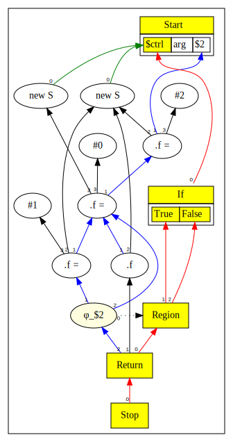
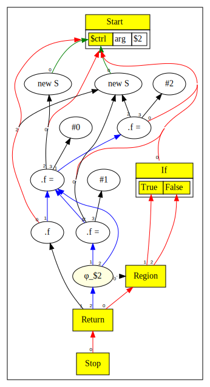
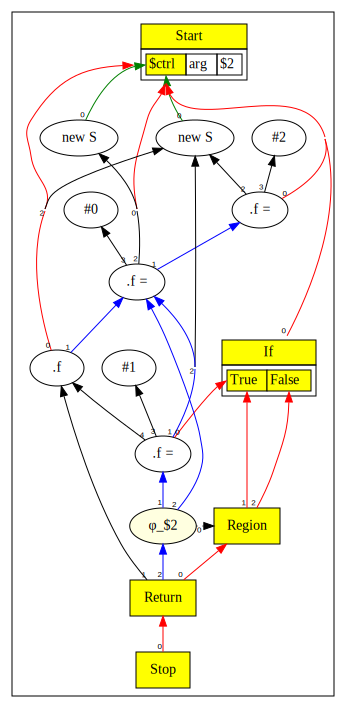
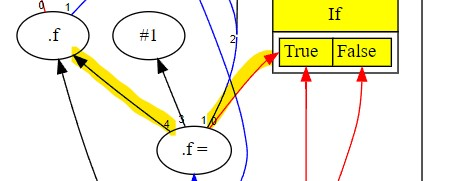
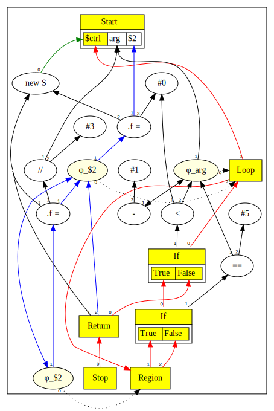
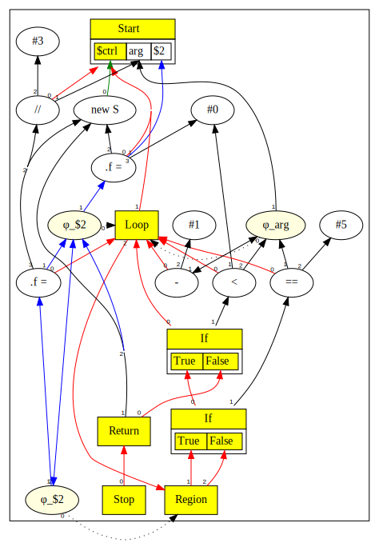
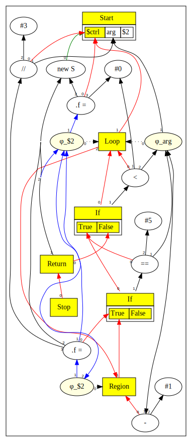
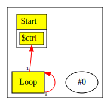
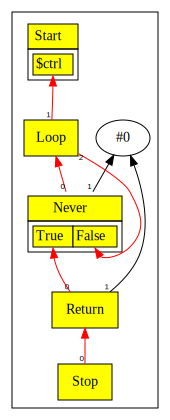

# Chapter 11: Global Code Motion

# Table of Contents

1. [High Level Overview](#high-level-overview)
2. [Scheduling Walk Through](#scheduling-walk-through)
3. [Scheduling a Loop](#scheduling-a-loop)
4. [Components of the Global Code Motion Algorithm ](#components-of-the-global-code-motion-algorithm)
5. [Identification of Basic Blocks in SoN graph](#identification-of-basic-blocks-in-son-graph)
6. [Handling Infinite Loops](#handling-infinite-loops)
7. [Dominators](#dominators)
8. [Loop depth](#loop-depth)
9. [Early Schedule](#early-schedule)
10. [Late Schedule](#late-schedule)
11. [Inserting Anti Dependencies](#inserting-anti-dependencies)
12. [Video Walk Through](#video-walk-through)


You can also read [this chapter](https://github.com/SeaOfNodes/Simple/tree/linear-chapter11) in a linear Git revision history on the [linear](https://github.com/SeaOfNodes/Simple/tree/linear) branch and [compare](https://github.com/SeaOfNodes/Simple/compare/linear-chapter10...linear-chapter11) it to the previous chapter.


The original input source program defines a sequence in which things happen. As we parse the program into Sea of Nodes representation
and perform various optimizations, this sequence is not fully maintained. The optimized Sea of Nodes graph is driven more
by dependencies between nodes rather that the sequence of instructions in the original source program.

Our goal in this chapter is to look at how we can recover a schedule for executing instructions from an
optimized Sea of Nodes graph. This schedule needs to preserve the semantics of the original source program,
but is otherwise allowed to reorder the execution of instructions.

Since the scheduling algorithm works across the implicit Basic Blocks in the SoN Graph,
we call this a Global Code Motion algorithm; the scheduler can move instructions across Basic Block boundaries.

The primary reference for this algorithm is the GCM GVN paper [^1]. However, the implementation in Simple has some
differences compared to the version described in the paper.

Since this is a complex topic, we will present a high level summary first and then delve into the details.

## High Level Overview

The Sea of Nodes graph has two virtual graphs within it.

* There is a control flow graph, represented by certain node types, such as Start, If, Region, etc.
* There is a data graph, primarily driven by Def-Use edges between nodes that produce or consume values or memory.

From a scheduling point of view, the control flow graph is fixed, and immovable.
However, the nodes that consume or produce data values/memory have some flexibility in terms of when they are executed. The goal of the
scheduling algorithm is to find the best placement of these nodes so that they are both optimum and correct.

At its core, the scheduling algorithm works in two phases:

* Schedule Early - in this phase, we do an upward DFS walk on the "inputs" of each Node, starting from the bottom (Stop). We schedule each data node to the
  first control block where they are dominated by their inputs.
* Schedule Late - in this phase we do a downward DFS walk on the "outputs" of each Node starting from the top (Start), and move data nodes to a block between the first block calculated above,
  and the last control block where they dominate all their uses. The placement is subject to the condition that it is in the shallowest loop nest possible, and is as control dependent as possible.
  Additionally, the placement of Load instructions must ensure correct ordering between Loads and Stores of the same memory location.

## Scheduling Walk Through

Before we describe the steps in detail, it is instructive to walk through an example and see the changes that occur to the SoN graph during scheduling.

To motivate the discussion, we will use this example program.

```java
struct S { int f; }
S v=new S;
v.f = 2;
int i=new S.f;
i=v.f;
if (arg) v.f=1;
return i;
```

First lets look at the graph before scheduling.



Observe that

* Control nodes are colored in yellow; these are immovable.
* New nodes have control input and therefore these are already scheduled.
* Ditto for Phi nodes which are attached to the Region nodes.
* So what remains are the "floating" Data nodes that do not have a control input at this stage. In this example, these are the load `.f` and store `.f=` nodes.

Now, lets look at the graph after we run the early schedule.




* Observe that the load `.f` and the stores `.f=` now have control edges to the `$ctrl` projection from Start. Thus, the early schedule has put the Data nodes in the first basic block.
* This is because the inputs to these nodes are have the `$ctrl` projection as the immediate dominator.

The graph below shows the schedule post late scheduling.



The snip below shows the main changes in the graph:



* The store `.f=` now has an anti-dependency on the load `.f`; this ensures that the store is scheduled after the load, as required by program semantics. We discuss anti-dependencies in detail later.
* Observe also that the store `.f=` is now bound to the True branch of the If node.

## Scheduling a Loop

We show another example, this time involving a loop.

```java
struct S { int f; }
S v = new S;
int i = arg;
while (arg > 0) {
    int j = i/3;
    if (arg == 5)
        v.f = j;
    arg = arg - 1;
}
return v;
```

The SoN graph prior to scheduling looks like this:



Following early schedule generation, we get:



Note that the `arg == 5` comparison at this stage is not in the correct place.
This is rectified after we complete late scheduling.



The final execution schedule shows that the expression `i/3` can be performed outside the loop because it only depends on the
original value of `arg`, and hence is loop invariant.

## Components of the Global Code Motion Algorithm

We have already alluded to several components of the GCM algorithm in passing above. Here we list them out as well as others we did not mention:

* The SoN graph has implicit basic blocks in the control flow nodes. For the GCM algo, we need to recognize these nodes more explicitly.
* When a program has an infinite loop, it poses a problem for the algo, as nodes can be unreachable from the Stop node. To work around this issue, we need to discover
  infinite loops and create a dummy edge connecting the loop to the Stop node.
* Loops are already identified in the Simple SoN graph, so we do not need a loop discovery step. However, we need to compute the loop depth associated with each CFG node.
* In [Chapter 6](../chapter06/README.md) we explained the concept of Dominators. Dominators are key to the GCM algo, and we extend our incremental dominator discovery algo to
  ensure that it meets the requirements of the algo.
* We already mentioned the two phases of the algo - the Early Scheduling and the Late Scheduling.
* In addition, we need to add anti-dependency edges between Loads and Stores in certain scenarios to enforce correct execution order.
* There are a few changes to our Node hierarchy to help us implement the GCM algo more conveniently. These changes do not conceptually alter the Node hierarchy we inherited from the previous chapters.

## Identification of Basic Blocks in SoN graph

The Sea of Nodes graph already captures the programs control flow graph. This information is implicit in the control nodes and edges from control nodes to other types of nodes.

To recap, Control starts at the Start node, via a projection that is bound to the name `$ctrl`. As the control flows in the program, this name binding gets updated, and control is
passed around, until it reaches the Stop node.

The Basic Block structure of the CFG can be easily constructed by recognizing that certain control nodes start a Basic Block, whereas certain others end a BB.

Here is the list of all control nodes:

| Node   | Starts a BB                             | Ends a BB |
|--------|-----------------------------------------|-----------|
| Start  | Yes but only via the `$ctrl` projection | No        |
| CProj  | Yes if input control is an If node      | No        |
| Region | Yes                                     | No        |
| If     | No                                      | Yes       |
| Return | No                                      | Yes       |
| Stop   | Yes                                     | Yes       |

Changes to Node hierarchy in this chapter:

* All control nodes above now extend a base class CFG Node. This allows us to place common functionality of control flow nodes in the base class.
* The CProj node extends the regular Proj node and is used in following cases:
  * The `$ctrl` projection off Start
  * The True and False projections off If.
* The Never node is a special sub class of If that is used to handle infinite loops as explained later.
* The XCtrl node represents a dead control.

## Handling Infinite Loops

Here is an example of code that contains an infinite loop:

```java
while (1) {}
return 0;
```

First lets look at the graph resulting from this:



Now, look at the modified graph after we insert an edge from the infinite loop to Stop node.



The implementation is in the Loop node:

```java
    // If this is an unreachable loop, it may not have an exit.  If it does not
    // (i.e., infinite loop), force an exit to make it reachable.
    public void forceExit( StopNode stop ) {
        // Walk the backedge, then immediate dominator tree util we hit this
        // Loop again.  If we ever hit a CProj from an If (as opposed to
        // directly on the If) we found our exit.
        CFGNode x = back();
        while( x != this ) {
            if( x instanceof CProjNode exit )
                return;         // Found an exit, not an infinite loop
            x = x.idom();
        }
        // Found a no-exit loop.  Insert an exit
        NeverNode iff = new NeverNode(back());
        for( Node use : _outputs )
            if( use instanceof PhiNode phi )
                iff.addDef(use);
        CProjNode t = new CProjNode(iff,0,"True" );
        CProjNode f = new CProjNode(iff,1,"False");
        setDef(2,f);
        stop.addDef(new ReturnNode(t,Parser.ZERO,null));
    }
```

## Dominators

In Simple, we compute Dominators incrementally. Our approach relies on the fact that we may delete parts of the graph during peepholes,
but we never introduce new control structure via peepholes. This allows us to use a simple approach described below.

The CFG node is the base class for all control nodes. It maintains a conservative approximation of dominator depth via `_idepth`. This field is a cached value representing
the immediate dominator depth. Its initial value is `0`, which signifies that it has not yet been computed. On request, we compute this as shown below.

```java
class CFGNode {
  public int _idepth;
  public int idepth() { return _idepth==0 ? (_idepth=idom().idepth()+1) : _idepth; }
}
class RegionNode extends CFGNode {
  // Immediate dominator of Region is a little more complicated.
  @Override public int idepth() {
    if( _idepth!=0 ) return _idepth;
    int d=0;
    for( Node n : _inputs )
      if( n!=null )
        d = Math.max(d,((CFGNode)n).idepth()+1);
    return _idepth=d;
  }
}
class LoopNode extends RegionNode {
  // Bypass Region idom, same as the default idom() using use in(1) instead of in(0)
  @Override public int idepth() { return _idepth==0 ? (_idepth=idom().idepth()+1) : _idepth; }
}
class StartNode extends CFGNode {
  @Override public int idepth() { return 0; }
}
class StopNode extends CFGNode {
  @Override public int idepth() {
    if( _idepth!=0 ) return _idepth;
    int d=0;
    for( Node n : _inputs )
      if( n!=null )
        d = Math.max(d,((CFGNode)n).idepth()+1);
    return _idepth=d;
  }
}
```
If portions of the control flow graph are deleted, then there will be gaps in the `_idepth`, but it still correctly reflects the
invariant that the value of `_idepth` increases as we go down the dominator tree.

Alongside the dominator depth, which is cached on first compute, a method is provided to get the immediate Dominator node. This
value is not cached as it is only valid at a point in time, and is invalidated as the graph changes.

We show the code that computes this value:

```java
class CFGNode {
  // Return the immediate dominator of this Node and compute dom tree depth.
  public CFGNode idom() { return cfg(0); }
  // Return the LCA of two idoms
  public CFGNode idom(CFGNode rhs) {
    if( rhs==null ) return this;
    CFGNode lhs = this;
    while( lhs != rhs ) {
      var comp = lhs.idepth() - rhs.idepth();
      if( comp >= 0 ) lhs = lhs.idom();
      if( comp <= 0 ) rhs = rhs.idom();
    }
    return lhs;
  }
}
class RegionNode extends CFGNode {
  @Override public CFGNode idom() {
    CFGNode lca = null;
    // Walk the LHS & RHS idom trees in parallel until they match, or either fails.
    // Because this does not cache, it can be linear in the size of the program.
    for( int i=1; i<nIns(); i++ )
      lca = cfg(i).idom(lca);
    return lca;
  }
}
class LoopNode extends RegionNode {
  // Bypass Region idom, same as the default idom() using use in(1) instead of in(0)
  @Override public CFGNode idom() { return entry(); }
}
class StartNode extends CFGNode {
  @Override public CFGNode idom() { return null; }
}
class StopNode extends CFGNode {
  @Override public CFGNode idom() { return null; }
}
```

## Loop Depth

Simple's Sea of Nodes graph identifies loops explicitly via Loop nodes. Since the language provides a single way to create a loop, using the `while` statement,
it is not necessary to implement a generic loop discovery process.

We do however need to compute a loop depth. This is done similar to how we compute the dominator depth.

```java
class CFGNode {
  // Loop nesting depth
  public int _loopDepth;
  public int loopDepth() { return _loopDepth==0 ? (_loopDepth = cfg(0).loopDepth()) : _loopDepth; }
}
class RegionNode extends CFGNode {
  @Override public int loopDepth() { return _loopDepth==0 ? (_loopDepth = cfg(1).loopDepth()) : _loopDepth; }
}
class LoopNode extends RegionNode {
  @Override public int loopDepth() {
    if( _loopDepth!=0 ) return _loopDepth; // Was already set
    _loopDepth = entry()._loopDepth+1;     // Entry depth plus one
    // One-time tag loop exits
    for( CFGNode idom = back(); idom!=this; idom = idom.idom() ) {
      // Walk idom in loop, setting depth
      idom._loopDepth = _loopDepth;
      // Loop exit hits the CProj before the If, instead of jumping from
      // Region directly to If.
      if( idom instanceof CProjNode proj ) {
        assert proj.in(0) instanceof IfNode; // Loop exit test
        // Find the loop exit CProj, and set loop_depth
        for( Node use : proj.in(0)._outputs )
          if( use instanceof CProjNode proj2 && proj2 != idom )
            proj2._loopDepth = _loopDepth-1;
      }
    }
    return _loopDepth;
  }
}
class StartNode extends CFGNode {
  @Override public int loopDepth() { return (_loopDepth=1); }
}
class StopNode extends CFGNode {
  @Override public int loopDepth() { return (_loopDepth=1); }
}
```

## Early Schedule

The GCM algorithm proper starts with the computation of the early schedule, during which do an upward DFS walk on the "inputs" of each Node, starting from the bottom (Stop). We schedule each data node to the
first control block where they are dominated by their inputs.

A pre-condition of this is to ensure that infinite loops have been "fixed" as described earlier.

The implementation of early schedule is shown below:

```java
    // ------------------------------------------------------------------------
private static void schedEarly() {
  ArrayList<CFGNode> rpo = new ArrayList<>();
  BitSet visit = new BitSet();
  _rpo_cfg(Parser.START, visit, rpo);
  // Reverse Post-Order on CFG
  for( int j=rpo.size()-1; j>=0; j-- ) {
    CFGNode cfg = rpo.get(j);
    cfg.loopDepth();
    for( Node n : cfg._inputs )
      _schedEarly(n,visit);
    // Strictly for dead infinite loops, we can have entire code blocks
    // not reachable from below - so we reach down, from above, one
    // step.  Since _schedEarly modifies the output arrays, the normal
    // region._outputs ArrayList iterator throws CME.  The extra edges
    // are always *added* after any Phis, so just walk the Phi prefix.
    if( cfg instanceof RegionNode region ) {
      int len = region.nOuts();
      for( int i=0; i<len; i++ )
        if( region.out(i) instanceof PhiNode phi )
          _schedEarly(phi,visit);
    }
  }
}

// Post-Order of CFG
private static void _rpo_cfg(Node n, BitSet visit, ArrayList<CFGNode> rpo) {
  if( !(n instanceof CFGNode cfg) || visit.get(cfg._nid) )
    return;             // Been there, done that
  visit.set(cfg._nid);
  for( Node use : cfg._outputs )
    _rpo_cfg(use,visit,rpo);
  rpo.add(cfg);
}

private static void _schedEarly(Node n, BitSet visit) {
  if( n==null || visit.get(n._nid) ) return; // Been there, done that
  visit.set(n._nid);
  // Schedule not-pinned not-CFG inputs before self.  Since skipping
  // Pinned, this never walks the backedge of Phis (and thus spins around
  // a data-only loop, eventually attempting relying on some pre-visited-
  // not-post-visited data op with no scheduled control.
  for( Node def : n._inputs )
    if( def!=null && !def.isPinned() )
      _schedEarly(def,visit);
  // If not-pinned (e.g. constants, projections, phi) and not-CFG
  if( !n.isPinned() ) {
    // Schedule at deepest input
    CFGNode early = Parser.START; // Maximally early, lowest idepth
    for( int i=1; i<n.nIns(); i++ )
      if( n.in(i).cfg0().idepth() > early.idepth() )
        early = n.in(i).cfg0(); // Latest/deepest input
    n.setDef(0,early);              // First place this can go
  }
}
```

* The early schedule populates the control input for data nodes - recall that this is null up to this point as data nodes are not attached to any control flow nodes until now.
* Most of the code above is about walking the graph in the right order. The actual computation of the early schedule is in these lines:

```java
  // If not-pinned (e.g. constants, projections, phi) and not-CFG
  if( !n.isPinned() ) {
    // Schedule at deepest input
    CFGNode early = Parser.START; // Maximally early, lowest idepth
    for( int i=1; i<n.nIns(); i++ )
      if( n.in(i).cfg0().idepth() > early.idepth() )
        early = n.in(i).cfg0(); // Latest/deepest input
    n.setDef(0,early);              // First place this can go
  }
```

## Late Schedule

During this phase we do a downward DFS walk on the "outputs" of each Node starting from the top (Start), and move data nodes to a block between the first block in the early schedule,
and the last control block where they dominate all their uses. The placement is subject to the condition that it is in the shallowest loop nest possible, and is as control dependent as possible.
Additionally, the placement of Load instructions must ensure correct ordering between Loads and Stores of the same memory location.

The code for computing the late schedule is shown below.

```java
    // ------------------------------------------------------------------------
    private static void schedLate(StartNode start) {
        CFGNode[] late = new CFGNode[Node.UID()];
        Node[] ns = new Node[Node.UID()];
        _schedLate(start,ns,late);
        for( int i=0; i<late.length; i++ )
            if( ns[i] != null )
                ns[i].setDef(0,late[i]);
    }

    // Forwards post-order pass.  Schedule all outputs first, then draw a
    // idom-tree line from the LCA of uses to the early schedule.  Schedule is
    // legal anywhere on this line; pick the most control-dependent (largest
    // idepth) in the shallowest loop nest.
    private static void _schedLate(Node n, Node[] ns, CFGNode[] late) {
        if( late[n._nid]!=null ) return; // Been there, done that
        // These I know the late schedule of, and need to set early for loops
        if( n instanceof CFGNode cfg ) late[n._nid] = cfg.blockHead() ? cfg : cfg.cfg(0);
        if( n instanceof PhiNode phi ) late[n._nid] = phi.region();

        // Walk Stores before Loads, so we can get the anti-deps right
        for( Node use : n._outputs )
            if( isForwardsEdge(use,n) &&
                use._type instanceof TypeMem )
                _schedLate(use,ns,late);
        // Walk everybody now
        for( Node use : n._outputs )
            if( isForwardsEdge(use,n) )
                _schedLate(use,ns,late);
        // Already implicitly scheduled
        if( n.isPinned() ) return;
        // Need to schedule n

        // Walk uses, gathering the LCA (Least Common Ancestor) of uses
        CFGNode early = (CFGNode)n.in(0);
        assert early != null;
        CFGNode lca = null;
        for( Node use : n._outputs )
            lca = use_block(n,use, late).idom(lca);

        // Loads may need anti-dependencies, raising their LCA
        if( n instanceof LoadNode load )
            lca = find_anti_dep(lca,load,early,late);

        // Walk up from the LCA to the early, looking for best place.  This is
        // lowest execution frequency, approximated by least loop depth and
        // deepest control flow.
        CFGNode best = lca;
        lca = lca.idom();       // Already found best for starting LCA
        for( ; lca != early.idom(); lca = lca.idom() )
            if( better(lca,best) )
                best = lca;
        assert !(best instanceof IfNode);
        ns  [n._nid] = n;
        late[n._nid] = best;
    }

    // Block of use.  Normally from late[] schedule, except for Phis, which go
    // to the matching Region input.
    private static CFGNode use_block(Node n, Node use, CFGNode[] late) {
        if( !(use instanceof PhiNode phi) )
            return late[use._nid];
        CFGNode found=null;
        for( int i=1; i<phi.nIns(); i++ )
            if( phi.in(i)==n )
                if( found==null ) found = phi.region().cfg(i);
                else Utils.TODO(); // Can be more than once
        assert found!=null;
        return found;
    }

    // Least loop depth first, then largest idepth
    private static boolean better( CFGNode lca, CFGNode best ) {
        return lca._loopDepth < best._loopDepth ||
                (lca.idepth() > best.idepth() || best instanceof IfNode);
    }

    // Skip iteration if a backedge
    private static boolean isForwardsEdge(Node use, Node def) {
        return use != null && def != null &&
            !(use.nIns()>2 && use.in(2)==def && (use instanceof LoopNode || (use instanceof PhiNode phi && phi.region() instanceof LoopNode)));
    }
```

## Inserting Anti Dependencies

To ensure that Loads and Stores to the same memory location are correctly ordered, we insert an edge from the Load to the Store as described below.
We call these edges anti-dependencies because they do not represent the Def-Use dependency that we normally capture in SoN, and are purely present as scheduling constraints.

We compute anti-dependencies DURING running schedule late. This is because we rely on the early-schedule, and the late-schedule of the Load's uses (before scheduling the Load).

Looking backwards from the Load we follow the memory edge to the "memory definer" - a start-mem-projection, or a phi-mem, or a store.
We look forwards from the mem-def to all its mem-def users. There is always at least one; there may be many. These completely (all of it) and exactly (no doubling up) cover the forward memory space, sort of like a network flow problem - but we limit our analysis to same-alias,
because for example, a start-mem-proj produces all aliases. This gives us a candidate set of mem-defs; some of these need the anti-dependency on the Load, but not all.

Since we're in the middle of "schedule late", we have already computed all the late schedules of a Load's users, and we have the Loads "Least Common Ancestor" of uses, the LCA or late position.
We inspect the set of mem-defs that might impact the Load, and either add an anti-dependency from Store to Load, or raise the Loads effective LCA.
For Phi mem-defs, we look at the Phi inputs and place an effective use on that block; this will be used to raise the Load's LCA.
For stores, we do the same - until/unless we find stores with the SAME block as the Load's LCA. Then we add the anti-dependency edge to force ordering within the same block.

The implementation is shown below.

```java
    private static CFGNode find_anti_dep(CFGNode lca, LoadNode load, CFGNode early, CFGNode[] late) {
        // We could skip final-field loads here.
        // Walk LCA->early, flagging Load's block location choices
        for( CFGNode cfg=lca; early!=null && cfg!=early.idom(); cfg = cfg.idom() )
            cfg._anti = load._nid;
        // Walk load->mem uses, looking for Stores causing an anti-dep
        for( Node mem : load.mem()._outputs ) {
            switch( mem ) {
            case StoreNode st:
                lca = anti_dep(load,late[st._nid],st.cfg0(),lca,st);
                break;
            case PhiNode phi:
                // Repeat anti-dep for matching Phi inputs.
                // No anti-dep edges but may raise the LCA.
                for( int i=1; i<phi.nIns(); i++ )
                    if( phi.in(i)==load.mem() )
                        lca = anti_dep(load,phi.region().cfg(i),load.mem().cfg0(),lca,null);
                break;
            case LoadNode ld: break; // Loads do not cause anti-deps on other loads
            case ReturnNode ret: break; // Load must already be ahead of Return
            default: throw Utils.TODO();
            }
        }
        return lca;
    }

    private static CFGNode anti_dep( LoadNode load, CFGNode stblk, CFGNode defblk, CFGNode lca, Node st ) {
        // Walk store blocks "reach" from its scheduled location to its earliest
        for( ; stblk != defblk.idom(); stblk = stblk.idom() ) {
            // Store and Load overlap, need anti-dependence
            if( stblk._anti==load._nid ) {
                lca = stblk.idom(lca); // Raise Loads LCA
                if( lca == stblk && st != null && Utils.find(st._inputs,load) == -1 ) // And if something moved,
                    st.addDef(load);   // Add anti-dep as well
                return lca;            // Cap this stores' anti-dep to here
            }
        }
        return lca;
    }
```

## Video Walk Through

Please watch the following video for a detailed walk through of the implementation.

* [Coffee Compiler Club - 21 June 2024](https://youtu.be/5Po0gxfE7LA?feature=shared).
* [Coffee Compiler Club - 26 June 2024](https://www.youtube.com/watch?v=HnN2YzmFb-8&t=0s)

[^1]: Cliff Click. (1995).
  Global Code Motion Global Value Numbering.
