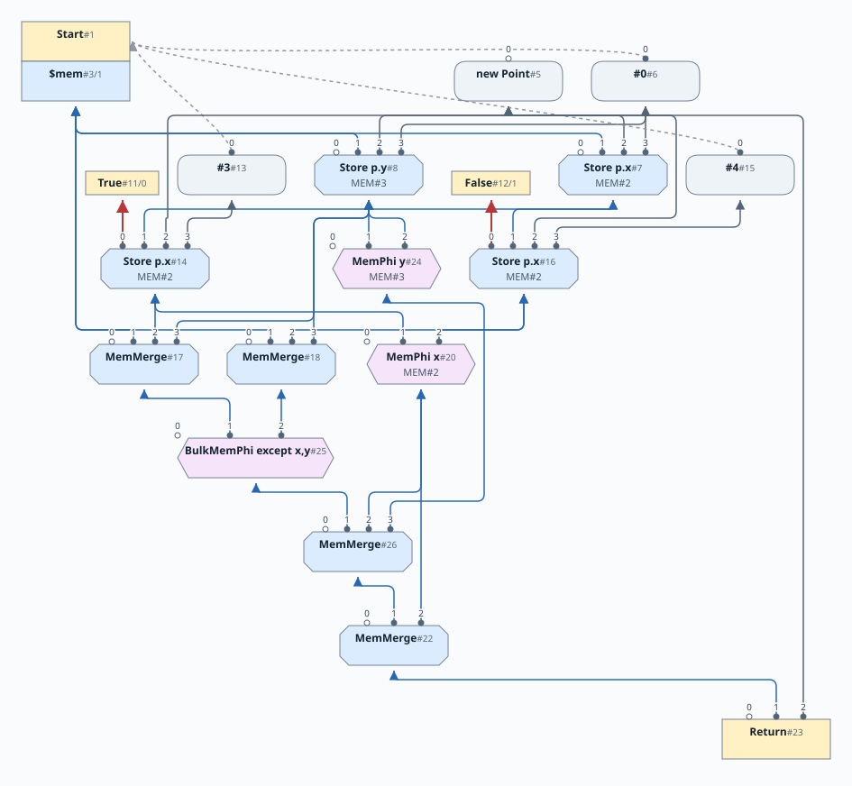
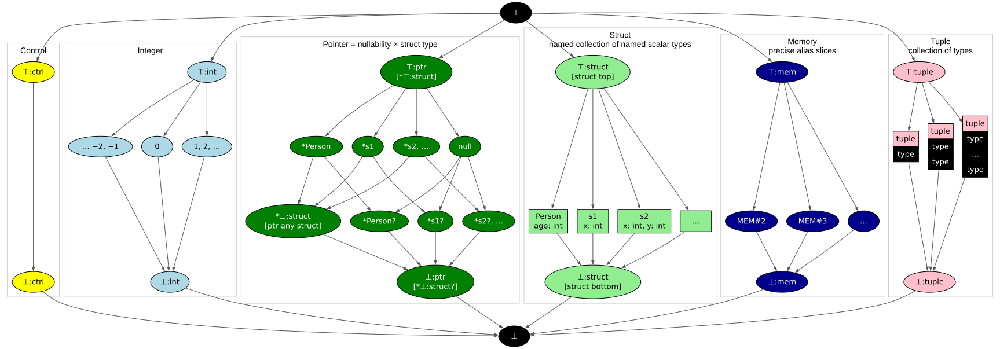
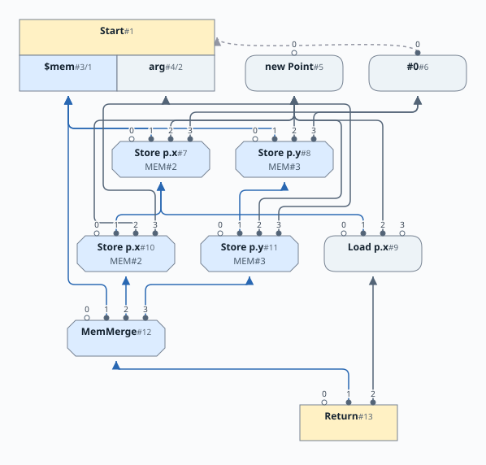

# Chapter 11: Splitting Memory

English | [日本語](README.ja.md)

[Previous: Chapter 10](../chapter10/README.md) |
[Next: Chapter 12](../chapter12/README.md)

Chapter 10 made memory effects explicit with one SSA memory value. This
chapter keeps exactly that parser model and recovers independent memory chains
through graph rewrites.  There is no new language syntax; the
[grammar](../chapter10/docs/10-grammar.md), pointer types, and null checks are unchanged.

## Why split memory?

```java
struct Point { int x; int y; }
Point p = new Point;
p.x = 42;
while (arg > 0) {
    p.y = p.y + arg;
    arg = arg - 1;
}
return p.x;
```

The loop changes `y`, so it cannot affect `x`. With one memory chain the load
of `x` follows the loop's stores. Splitting the fields lets ordinary
load-after-store forwarding turn the return value into 42.


The graph shows the split chains before the final Load folds. Its memory input
goes straight to the Store of 42, bypassing the loop's `y` chain.  As in
Chapter 10, small, detached True/False projections show the source branches
gating Loads and Stores. Other control-flow context, including Loops and their
Phi bindings, is omitted.  The graph shows dependencies, not execution order.

## Equivalence-class aliasing

Each struct field has an integer alias identity.  Two different fields receive
different identities, even if they have the same spelling in different structs.
Two instances of the *same* struct share their field aliases.  Thus different
classes never alias; accesses in the same class **may alias** (same-class does
not mean same-address).  You still need to check for pointer identity.

The parser assigns field identities at struct declarations, beginning at alias#2.

We do not allocate a Start projection, scope binding, or loop Phi for every
declared field or alias.  Start supplies one memory value, Scope holds one
`$mem` binding, and Return consumes all of memory: `{ctrl, $mem, result}`.  As
with Start's outputs, control is in slot 0 and memory in slot 1.  The optimizer
introduces slices only where graph operations require them.

## Three memory nodes

| Node | Meaning |
|---|---|
| `MemMerge` | A complete memory state: a default plus precise alias overrides |
| `MemPhi` | One alias selected according to the incoming control path |
| `BulkMemPhi` | All aliases except an explicit exclusion set, selected by control |

`MemMerge` combines independent pieces of memory at one program point. It is
not a control-flow merge. For example, after storing to alias `x`:

```text
prior = current memory
store = Store_x(prior, pointer, value)
current memory = MemMerge(default=prior, x=store)
```

MemMerges have a default memory in slot 1, and precise aliases in other slots
if they differ from the default.  Loads, Stores and MemPhis select their
precise input from any incoming MemMerge, using a precise alias input if
possible.

The explicit aliases override the default: the alias slices are disjoint,
and their union covers all memory.  Flattening stacked MemMerges preserves
entries that the outer MemMerge has not replaced. 

The graph below shows `p.x = arg; p.y = 42; return p;` after redundant
initialization stores have been removed. MemMerge takes the default memory
in slot 1 and the `x` and `y` overrides in slots 2 and 3.


## Splitting a memory Phi

The Parser initially creates a BulkMemPhi wherever the ordinary SSA algorithm needs
to merge memory.  It starts by covering all aliases and an empty exclusion set
while the merge point is finalized.  Later, peeps will split out precise memory
slices from the bulk memory, lazily on demand.

Precise single aliases can be split out from the bulk by this transformation:

```text
BulkPhi(R, left, right)
    becomes
MemMerge(
    default = BulkPhi_except{x}(R, left, right),
    x       = MemPhi_x(R, slice(left,x), slice(right,x)))
```

"A BulkPhi becomes a Merge of a BulkPhi (minus the alias) and MemPhi (of the alias)".

The new precise Phi and the remaining bulk Phi share a Region (omitted from the
illustrations) and matching control-path indices.  A loop uses the same
transformation, with the backedge among those inputs.  Each further split
preserves all previously extracted slices (and peephole optimizations tidy up
the stacked splits).

Here the two branches store 3 or 4 into `p.x`, then return `p`. The graph shows
the partition immediately after extracting `x`, before further simplification
of the bulk Phi and its incoming aggregates.

```java
struct Point { int x; int y; }
Point p = new Point;
if (arg) p.x = 3;
else     p.x = 4;
return p;
```


Continuing from this graph, here is one order in which the peepholes can fire:

**Flatten the incoming MemMerges, then split `y`.** MemMerges #17 and #18
inherit the `y` slice from #9, but their own `x` overrides win. Both now have
Start's memory as their default, and #9 becomes unused. BulkMemPhi #21 excludes
`x`, but still covers `y`, so it cannot simply bypass these MemMerges. It
extracts MemPhi #24 for `y` and creates BulkMemPhi #25, excluding both fields.
The extra MemMerge #26 combines these slices.



**Fold the unchanged memory.** Both inputs of MemPhi #24 are the same
initializing Store #8, so it becomes that Store. BulkMemPhi #25 can now look
through #17 and #18: their explicit aliases are all excluded from its domain.
Both remaining inputs become Start's memory, so this bulk Phi also folds.
Flattening the outgoing aggregates leaves MemMerge #22 with default memory
from Start, `x` from MemPhi #20, and `y` from Store #8.


**Factor the Stores, then remove the overwritten initialization.** With the
bulk Phi and the incoming aggregates gone, Stores #14 and #16 are used only
by MemPhi #20. They store to the same pointer and alias, and share the same
incoming memory. `PhiNode` can pull the Store below the merge:

```text
MemPhi_x(Store_x(mem, p, 3), Store_x(mem, p, 4))
    becomes
Store_x(mem, p, Phi(3, 4))
```

In general, Phi refactoring can combine Loads or Stores as in Chapter 10 (pushing
up or pulling down).  The Phi new memory operands can use precise MemPhis for
the alias.  This peep requires precise aliases, and is otherwise blocked by
BulkMems - and thus is a trigger for splitting a BulkMem.


Continuing with the example, the new value Phi #28 chooses 3 on the true arm
and 4 on the false arm. Store
#27 replaces both branch Stores and their memory Phi. Now the initial
`p.x = 0` Store #7 has only that one Store as a user, so store-after-store
elimination bypasses it. The `p.y = 0` Store #8 remains: we return the object,
and its `y` field still needs initialization.


Thus the final graph has two Stores, one ordinary value Phi, and one MemMerge;
neither a MemPhi nor a BulkMemPhi remains. Other worklists order can, for
instance, bypass the original incoming MemMerges before flattening them,
avoiding the temporary `y` split.

This memory splitting transform is invasive, and is disallowed from being
called recursively; you can end up splitting around a loop (which is good) but
then trying to split a mid-split loop head (which is bad).  The new nodes from
the split are put on the worklist and visited after the current split
completes - safely allowing memory to be completely sliced around loops.

Since bulk Phis merge a bunch of aliases, they have to take care when
peepholing vs MemMerges: there cannot be any overlap between the MemMerge
precise merges and the bulk Phi.

This also extends the worklist lesson from Chapter 9: a bulk Phi inspects its
users, so changes to a user's partition must wake the producer - job for
`addDep()`.   Selecting a slice from a MemMerge can expose a new bulk-Phi
user; that selected definition must be queued too.  In short, any time we're
working with MemMerge, MemPhi or BulkMemPhi we can expect some non-local
dependencies.

Memory splitting can increase node count - but Phis (Mem, Bulk or otherwise)
make no code. Progress comes from extracting an alias from a bulk Phi and
removing some Loads and Stores, rather than from requiring every rewrite
to shrink the graph.  In other words, the total Load/Store count is going down
even if the MemPhi count is going up.


## Types

The type lattice retains Chapter 10's six domains, colors, and notation:
`⊤` means top, `⊥` means bottom, and a suffix names the domain. The other five
domains are unchanged; however memory now adds a flat element `MEM#N` for each precise
alias between memory top (`TypeMem.TOP`) and memory bottom (`TypeMem.BOT`).



The parallel `MEM#2`, `MEM#3`, and further alias elements describe independent
field slices.  For the first `Point` declaration above, these two aliases identify
`Point.x` and `Point.y`.  Meeting different aliases gives memory bottom; joining
them gives memory top.  Each precise alias is its own dual.  (And the ellipsis stands
for more parallel aliases, not a type representing a set of aliases).


## Evaluation and ordering

MemMerge is a dependency node and not a clobber; it emits no code.  Its
evaluator result is a memory token, while Store actually mutates the object's
fields.  The scheduler must distinguish merging memory from overwriting memory.
Stores in different alias classes do not impose load/store anti-dependencies,
but Loads in the same class require anti-dependencies.

In `int old = p.x; p.x = arg; p.y = arg; return old;`, the Load must precede
the later `x` Store; the `y` Store has an independent memory chain. The graph
retains the Load to show this scheduling requirement before local folding.



There are a lot of tests in this chapter, to cover independent-field folding,
parallel memory Phis, multiple field updates surviving at Return, early
returns, nested loops with break/continue, and reads before subsequent stores
through potentially aliased pointers.

## What remains for later chapters?

Chapter 11 knows every access's alias while parsing.  What is lazy here is the
construction of memory partitions.  Chapter 25 also allows an existing access's
alias to become known *later* (using the same representation) and will allow
more incomplete types, module aliases, seperate compilation and a host of other
benefits.

Chapters 12-24 use this representation. Chapter 13 adds global code motion
and load/store anti-dependencies.  Chapter 15 adds allocation with partial memory and typed
alias contents.  Chapter 16 extends initialization to constructor values, and
Chapter 18 carries whole memory across function calls.

## Build and test

With JDK 21 or newer, from this directory:

```sh
make lib
make tests
make release
make view
```

Make builds this complete snapshot without Maven. `make release` writes
`build/release/simple.jar`; `make view` launches the shared graph viewer.
Both the root Maven reactor and the supplied IDEA module descriptor include
the chapter. From the repository root, test both halves with:

```sh
make tests CHAPTERS="chapter10 chapter11"
```

Next, [Chapter 12](../chapter12/README.md) adds reference fields and recursive
structs while retaining this memory representation.
