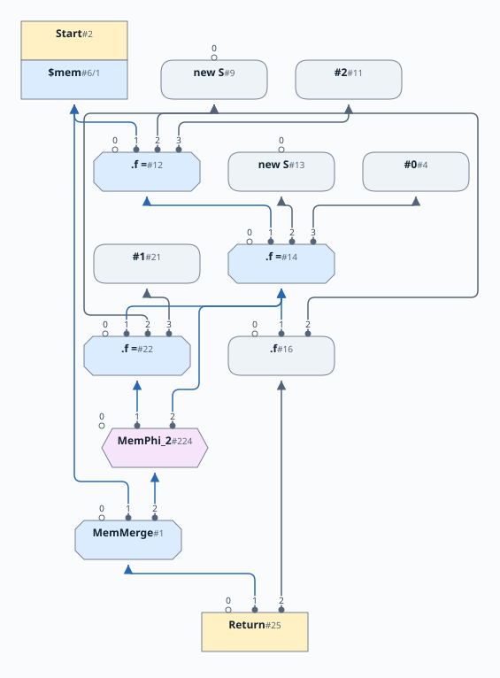
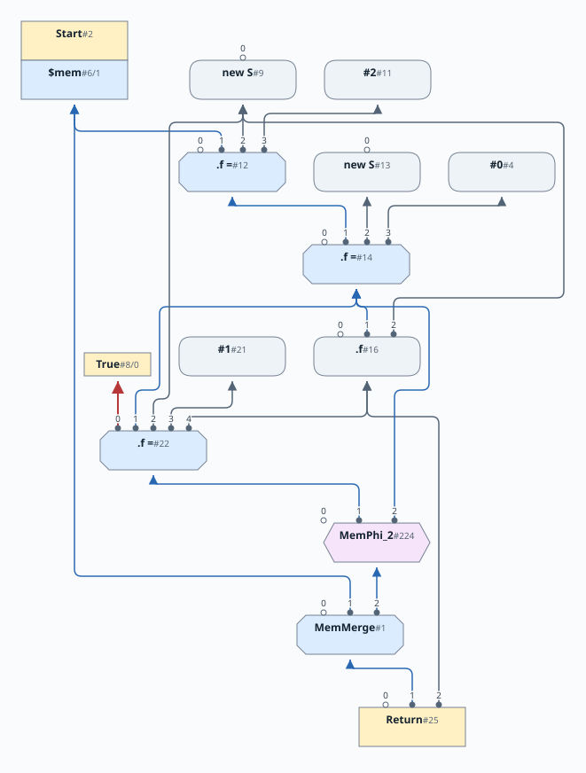
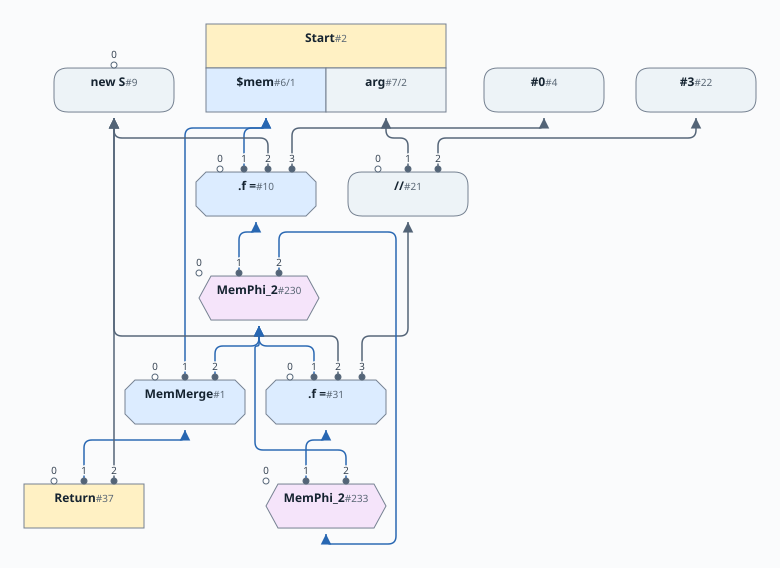
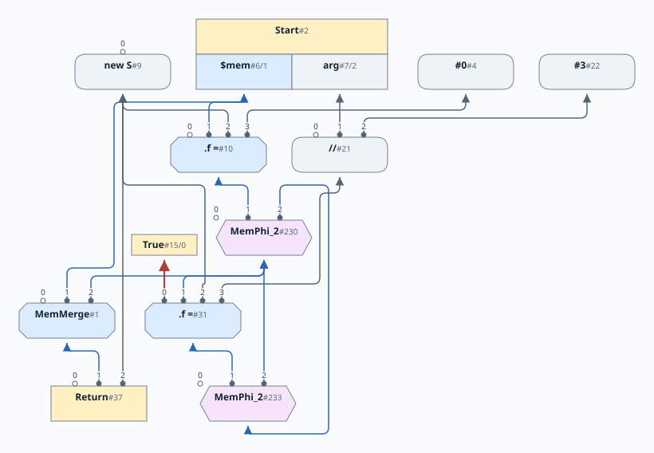

# Chapter 13: Global Code Motion

English | [日本語](README.ja.md)

[Previous: Chapter 12](../chapter12/README.md) |
[Next: Chapter 14](../chapter14/README.md)

This chapter schedules the graphs built in Chapters 10-12, including
reference fields and lazy memory partitions. It chooses a slot-0 control input
for movable operations and preserves the ordering of potentially aliasing
Loads and Stores.

Also in this chapter, we'll be presenting several fairly detailed graph
algorithms.  You might want to brush up on your graph theory!

The grammar is unchanged from [Chapter 12](../chapter12/docs/12-grammar.md).

# Table of Contents

1. [High Level Overview](#high-level-overview)
2. [Scheduling Walk Through](#scheduling-walk-through)
3. [Scheduling a Loop](#scheduling-a-loop)
4. [Components of the Global Code Motion Algorithm](#components-of-the-global-code-motion-algorithm)
5. [Identification of Basic Blocks in SoN graph](#identification-of-basic-blocks-in-son-graph)
6. [Handling Infinite Loops](#handling-infinite-loops)
7. [Dominators](#dominators)
8. [Loop depth](#loop-depth)
9. [Early Schedule](#early-schedule)
10. [Late Schedule](#late-schedule)
11. [Inserting Anti Dependencies](#inserting-anti-dependencies)
12. [Video Walk Through](#video-walk-through)

You can also read [this chapter](https://github.com/SeaOfNodes/Simple/tree/linear-chapter13) in a linear Git revision history on the [linear](https://github.com/SeaOfNodes/Simple/tree/linear) branch and [compare](https://github.com/SeaOfNodes/Simple/compare/linear-chapter12...linear-chapter13) it to the previous chapter.


The original input source program defines a sequence in which things happen. As
we parse the program into Sea of Nodes representation and perform various
optimizations, this sequence is not fully maintained. The optimized Sea of
Nodes graph is driven by the dependencies between nodes rather than the
sequence of instructions in the original source program.

Our goal in this chapter is to look at how we can recover a schedule for executing instructions from an
optimized Sea of Nodes graph. This schedule needs to preserve the semantics of the original source program,
but is otherwise allowed to reorder the execution of instructions.

Since the scheduling algorithm works across the implicit Basic Blocks in the SoN Graph,
we call this a Global Code Motion algorithm; the scheduler can move instructions across Basic Block boundaries.

The primary reference for this algorithm is the GCM GVN paper [^1]. However, the implementation in Simple has some
differences compared to the version described in the paper.

Since this is a complex topic, we will present a high level summary first and then delve into the details.

## High Level Overview

The Sea of Nodes graph has two virtual graphs within it.

* There is a control flow graph, represented by certain node types, such as Start, If, Region, etc.
* There is a data graph, primarily driven by Def-Use edges between nodes that produce or consume values or memory.

From a scheduling point of view, the control flow graph is fixed, and immovable.
However, the nodes that consume or produce data values/memory have some flexibility in terms of when they are executed. The goal of the
scheduling algorithm is to find the best placement of these nodes so that they are both optimum and correct.

At its core, the scheduling algorithm works in two phases:

* Schedule Early - in this phase, we do an upward DFS walk on the "inputs" of each Node, starting from the bottom (Stop). We schedule each data node to the
  first control block where they are dominated by their inputs.
* Schedule Late - in this phase we work backwards from Stop, scheduling uses before definitions, and move data nodes to a block between the first block calculated above,
  and the last control block where they dominate all their uses. The placement is subject to the condition that it is in the shallowest loop nest possible, and is as control dependent as possible.
  Additionally, the placement of Load instructions must ensure correct ordering between Loads and Stores of the same memory location.

## Scheduling Walk Through

Before we describe the steps in detail, it is instructive to walk through an example and see the changes that occur to the SoN graph during scheduling.

To motivate the discussion, we will use this example program.

```java
struct S { int f; }
S v=new S;
v.f = 2;
int i=new S.f;
i=v.f;
if (arg) v.f=1;
return i;
```

First let's look at the graph before scheduling.

These walkthrough diagrams show the precise `S.f` chain and the final
MemMerge consumed by Return. The unchanged default memory comes from Start;
any redundant bulk Phis have folded away. As in Chapters 10 and 11, the diagrams omit
control-flow context, including Regions and their Phi bindings. Small,
detached True/False projections remain where they gate a Load or Store.
Unlike Chapter 10's schematic source gates, these figures show the actual
scheduling inputs at each stage. Entry-block and Loop bindings are omitted.



Observe that

* Control nodes are immovable. Most are omitted here.
* New nodes already have control inputs, and Phis are bound to Regions;
  these bindings remain fixed even though they are not drawn.
* The load `.f` and store `.f=` nodes are still "floating": they have no
  control input at this stage, so scheduling must choose their blocks.

Now, let's look at the graph after we run the early schedule.


The early schedule puts the load `.f` and stores `.f=` in the first basic
block, since their inputs are available there. These entry-block control
bindings are omitted, so the memory view looks unchanged.

The graph below focuses on memory and data dependencies after late scheduling.
The control-flow scaffold, including the Region, is omitted. Store #22's
control input remains visible as the red edge to the standalone True
projection #8; the Store-to-Load anti-dependency and memory Phis are retained.



The snip below shows the main changes in the graph:


* The store `.f=` now has an anti-dependency on the load `.f`; this ensures that the store is scheduled after the load, as required by program semantics. We discuss anti-dependencies in detail later.
* Observe also that the store `.f=` is now bound to the True branch of the If node.

## Scheduling a Loop

We show another example, this time involving a loop.

```java
struct S { int f; }
S v = new S;
int i = arg;
while (arg > 0) {
    int j = i/3;
    if (arg == 5)
        v.f = j;
    arg = arg - 1;
}
return v;
```

The SoN graph prior to scheduling looks like this:



Following early schedule generation, we get:


The early schedule places Store #31 at the loop header (its control binding
is omitted). Late scheduling moves it to the True branch #15 of
`if (arg == 5)`, shown by the red control edge:



The final execution schedule shows that the expression `i/3` can be performed outside the loop because it only depends on the
original value of `arg`, and hence is loop invariant.

## Components of the Global Code Motion Algorithm

We have already alluded to several components of the GCM algorithm in passing above. Here we list them out as well as others we did not mention:

* The SoN graph has implicit basic blocks in the control flow nodes. For the GCM algo, we need to recognize these nodes more explicitly.
* When a program has an infinite loop, it poses a problem for the algo, as nodes can be unreachable from the Stop node. To work around this issue, we need to discover
  infinite loops and create a dummy edge connecting the loop to the Stop node.
* Loops are already identified in the Simple SoN graph, so we do not need a loop discovery step. However, we need to compute the loop depth associated with each CFG node.
* In [Chapter 6](../chapter06/README.md) we explained the concept of Dominators. Dominators are key to the GCM algo, and we extend our incremental dominator discovery algo to
  ensure that it meets the requirements of the algo.
* We already mentioned the two phases of the algo - the Early Scheduling and the Late Scheduling.
* In addition, we need to add anti-dependency edges between Loads and Stores in certain scenarios to enforce correct execution order.
* There are a few changes to our Node hierarchy to help us implement the GCM algo more conveniently. These changes do not conceptually alter the Node hierarchy we inherited from the previous chapters.

## Identification of Basic Blocks in SoN graph

The Sea of Nodes graph already captures the program's control flow graph. This information is implicit in the control nodes and edges from control nodes to other types of nodes.

To recap, Control starts at the Start node, via a projection that is bound to the name `$ctrl`. As the control flows in the program, this name binding gets updated, and control is
passed around, until it reaches the Stop node.

The Basic Block structure of the CFG can be easily constructed by recognizing that certain control nodes start a Basic Block, whereas certain others end a BB.

Here is the list of all control nodes:

| Node   | Starts a BB                             | Ends a BB |
|--------|-----------------------------------------|-----------|
| Start  | Yes but only via the `$ctrl` projection | No        |
| CProj  | Yes if input control is an If node      | No        |
| Region | Yes                                     | No        |
| If     | No                                      | Yes       |
| Return | No                                      | Yes       |
| Stop   | Yes                                     | Yes       |

Changes to Node hierarchy in this chapter:

* All control nodes above now extend a base class CFG Node. This allows us to place common functionality of control flow nodes in the base class.
* The CProj node extends the regular Proj node and is used in following cases:
  * The `$ctrl` projection off Start
  * The True and False projections off If.
* The Never node is a special sub class of If that is used to handle infinite loops as explained later.
* The XCtrl node represents a dead control.

## Handling Infinite Loops

Here is an example of code that contains an infinite loop:

```java
while (1) {}
return 0;
```

First let's look at the graph resulting from this:


Now, look at the modified graph after we insert an edge from the infinite loop to Stop node.


The implementation is in
[`LoopNode.forceExit()`](src/main/java/com/seaofnodes/simple/node/LoopNode.java#L57).
It walks the backedge's dominator chain to look for an exit. If none exists,
it inserts a Never node and a never-taken return path, making the loop
reachable to the scheduler's backward walk.

## Dominators

In Simple, we compute Dominators incrementally. Our approach relies on the fact that we may delete parts of the graph during peepholes,
but we never introduce new control structure via peepholes. This allows us to use a simple approach described below.

The CFG node is the base class for all control nodes. It maintains a conservative approximation of dominator depth via `_idepth`. This field is a cached value representing
the immediate dominator depth. Its initial value is `0`, which signifies that it has not yet been computed. The depth is computed on request.

See [`CFGNode.idepth()`](src/main/java/com/seaofnodes/simple/node/CFGNode.java#L51)
for the default computation and cache. The overrides in
[`RegionNode`](src/main/java/com/seaofnodes/simple/node/RegionNode.java#L94),
[`LoopNode`](src/main/java/com/seaofnodes/simple/node/LoopNode.java#L31),
[`StartNode`](src/main/java/com/seaofnodes/simple/node/StartNode.java#L36), and
[`StopNode`](src/main/java/com/seaofnodes/simple/node/StopNode.java#L58)
handle merges, loop entries, and the graph's endpoints.

If portions of the control flow graph are deleted, then there will be gaps in the `_idepth`, but it still correctly reflects the
invariant that the value of `_idepth` increases as we go down the dominator tree.

Alongside the dominator depth, which is cached on first compute, a method is provided to get the immediate Dominator node. This
value is not cached as it is only valid at a point in time, and is invalidated as the graph changes.

[`CFGNode.idom()` and `domLCA()`](src/main/java/com/seaofnodes/simple/node/CFGNode.java#L60)
provide the default immediate dominator and the walk that finds the least
common ancestor of two dominators.
[`RegionNode.idom()`](src/main/java/com/seaofnodes/simple/node/RegionNode.java#L103)
combines the incoming paths; [`LoopNode.idom()`](src/main/java/com/seaofnodes/simple/node/LoopNode.java#L33)
uses the loop entry. Start and Stop have no immediate dominator.

## Loop Depth

Simple's Sea of Nodes graph identifies loops explicitly via Loop nodes. Since the language provides a single way to create a loop, using the `while` statement,
it is not necessary to implement a generic loop discovery process.

We do however need to compute a loop depth. This is done similarly to how we compute the dominator depth.

[`CFGNode.loopDepth()`](src/main/java/com/seaofnodes/simple/node/CFGNode.java#L78)
inherits depth from its control input, while
[`RegionNode.loopDepth()`](src/main/java/com/seaofnodes/simple/node/RegionNode.java#L116)
uses an incoming path.
[`LoopNode.loopDepth()`](src/main/java/com/seaofnodes/simple/node/LoopNode.java#L35)
adds a nesting level and walks the backedge's dominator chain to mark loop exits.
[`StartNode`](src/main/java/com/seaofnodes/simple/node/StartNode.java#L41) and
[`StopNode`](src/main/java/com/seaofnodes/simple/node/StopNode.java#L68)
establish the outermost depth of 1.

## Early Schedule

The GCM algorithm proper starts with the computation of the early schedule, during which we do an upward DFS walk on the "inputs" of each Node, starting from the bottom (Stop). We schedule each data node to the
first control block where they are dominated by their inputs.

A pre-condition of this is to ensure that infinite loops have been fixed as described earlier.

The implementation starts in
[`GlobalCodeMotion.schedEarly()`](src/main/java/com/seaofnodes/simple/GlobalCodeMotion.java#L62).
[`_rpo_cfg()`](src/main/java/com/seaofnodes/simple/GlobalCodeMotion.java#L85)
builds the CFG traversal order, and
[`_schedEarly()`](src/main/java/com/seaofnodes/simple/GlobalCodeMotion.java#L94)
recursively schedules data inputs. It skips recursion through Phi inputs to
avoid entering a data cycle before its control has been scheduled.

Existing control and Phi/Proj bindings are preserved. Floating nodes receive
the deepest input block as their earliest placement. MemMerge follows this
same rule, ignoring absent entries in its sparse alias table.

## Late Schedule

Late scheduling starts at Stop and uses a worklist to place uses before their
definitions. CFG nodes, Phis, projections, and allocations provide fixed
placements. Other nodes wait until their uses have been scheduled; a Load also
waits for memory users that can overwrite or merge its alias. The chosen block
lies between the early placement and the common dominator of all uses, favoring
shallower loops and then deeper control flow.

The implementation is divided into these steps:

* [`schedLate()`](src/main/java/com/seaofnodes/simple/GlobalCodeMotion.java#L114)
  manages the placement tables and installs the final control inputs;
  [`breadth()`](src/main/java/com/seaofnodes/simple/GlobalCodeMotion.java#L129)
  drives the worklist and wakes definitions and waiting loads as uses finish.
* [`_doSchedLate()`](src/main/java/com/seaofnodes/simple/GlobalCodeMotion.java#L175)
  finds the common dominator of uses, accounts for load anti-dependencies, and
  walks toward the early placement. It calls
  [`better()`](src/main/java/com/seaofnodes/simple/GlobalCodeMotion.java#L215)
  to compare candidate blocks.
* [`use_block()`](src/main/java/com/seaofnodes/simple/GlobalCodeMotion.java#L202)
  handles Phi uses at their matching incoming control paths, rather than at
  the merge itself.

## Inserting Anti Dependencies

To ensure that Loads and Stores to the same memory location are correctly
ordered, we insert an edge from the Store to the Load as described below: the
Store must wait for the earlier Load.  We call these edges anti-dependencies
because they do not represent the Def-Use dependency that we normally capture
in SoN, and are purely present as scheduling constraints.

We compute anti-dependencies DURING running schedule late. This is because we rely on the early-schedule, and the late-schedule of the Load's uses (before scheduling the Load).

Looking backwards from the Load, we follow its memory input to Start's memory
projection, a memory Phi, or a Store. Optimization has already selected the
Load's precise slice through any MemMerge. We inspect users of that memory
definition, keeping only Stores and memory Phis that cover the Load's alias.
Start's single memory projection may supply many aliases, so sharing a memory
input alone does not imply an anti-dependency.

MemMerge only packages slices; it does not overwrite any of them. Treating it
as a write could make a Load wait for an aggregate which itself depends on the
Load's result. The same alias filter is used both when deciding whether a Load
is ready to schedule and when computing its anti-dependencies. A completed
memory user wakes waiting loads even if their shared memory definition has
already been scheduled.

Since we're in the middle of `schedLate`, we have already computed all the late
schedules of a Load's users, and we have the Loads *Least Common Ancestor* of
uses, the LCA or late position.  We inspect the set of mem-defs that might
impact the Load, and either add an anti-dependency from Store to Load, or raise
the Loads effective LCA.  For Phi mem-defs, we look at the Phi inputs and place
an effective use on that block; this will be used to raise the Load's LCA.  For
stores, we do the same - until/unless we find stores with the SAME block as the
Load's LCA. Then we add the anti-dependency edge to force ordering within the
same block.

See [`antiUse()`](src/main/java/com/seaofnodes/simple/GlobalCodeMotion.java#L224)
for the alias filter, and
[`find_anti_dep()`](src/main/java/com/seaofnodes/simple/GlobalCodeMotion.java#L233)
for marking the Load's candidate blocks and inspecting competing memory users.
[`anti_dep()`](src/main/java/com/seaofnodes/simple/GlobalCodeMotion.java#L260)
walks the competing operation's dominator interval, raises the Load's LCA,
and adds a Store-to-Load edge when required. It checks the Store's full interval
because the evaluator's scheduler may place that Store independently of GCM.

## Video Walk Through

Please watch the following video for a detailed walk through of the implementation.

* [Coffee Compiler Club - 21 June 2024](https://youtu.be/5Po0gxfE7LA?feature=shared).
* [Coffee Compiler Club - 26 June 2024](https://www.youtube.com/watch?v=HnN2YzmFb-8&t=0s)

[^1]: Cliff Click. (1995).
  Global Code Motion Global Value Numbering.

Next, [Chapter 14](../chapter14/README.md) adds floating-point arithmetic and
narrow numeric types to this scheduled compiler.
