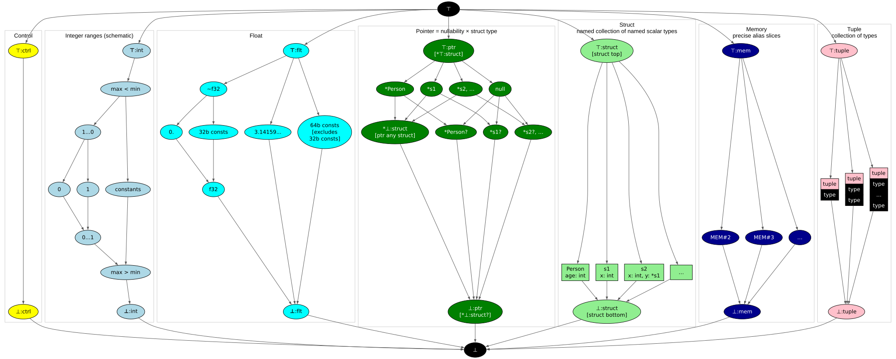

# 第14章: 数値型

[English](README.md) | 日本語

[前: 第13章](../chapter13/README.ja.md) |
[次: 第15章](../chapter15/README.ja.md)

この文書は [原文](README.md) の日本語訳です。

# 目次

1. [浮動小数点演算](#浮動小数点演算)
2. [狭いワード型](#狭い型とサブワード型)
3. [オーバーフローの処理](#オーバーフローの処理)
4. [整数の範囲](#整数の範囲)
5. [ビット演算](#ビット演算)
6. [優先順位](#優先順位)
7. [型の束](#型の実装)

> 訳注: 原文の目次にある「Nodes」に対応する節は、原文本文にはありません。

構造体、参照フィールド、スケジューリングがそろったので、この章では、それらが運ぶ数値を拡張します。浮動小数点演算、狭い整数型と浮動小数点型、整数の範囲を追加します。

[linear](https://github.com/SeaOfNodes/Simple/tree/linear) ブランチの線形の Git リビジョン履歴で[この章](https://github.com/SeaOfNodes/Simple/tree/linear-chapter14)を読むことや、前章との[差分](https://github.com/SeaOfNodes/Simple/compare/linear-chapter13...linear-chapter14)を見ることもできます。

## 浮動小数点演算

浮動小数点値は `flt` 型から始まり、IEEE754 の64ビット演算を行います。整数式は、浮動小数点式に含まれると自動的に浮動小数点へ拡張されます。

```java
flt f = 0.5;
int x = 2;
f = f+x;     // Auto-widen x to 2.0, result is 2.5
f = f+true;  // Since bools are just synonyms for integers 0,1 they auto-widen also
```

今のところ、逆に `flt` を丸めて `int` に戻す方法はありません。

```java
int x = 3.14; // error
```

平方根を計算するニュートン法を示します。

```java
flt guess = arg;  // Initial guess is just argument
while( true ) {
    // Next guess from Newton's method
    flt next = (arg/guess + guess)/2;
    // Break if hit fixed point
    if( next == guess ) break;
    guess = next;
}
return guess;
```

引数 2 で実行すると 1.414213562373095 を生成します。

浮動小数点演算には専用の Node があります。

| ノード | 演算 |
|---|---|
| AddF, SubF, MulF, DivF | 基本的な二項浮動小数点演算 |
| MinusF | 単項の符号反転 |
| EQF, LTF, LEF | 浮動小数点の比較演算子 |

パーサーは [`Node.widen()`](src/main/java/com/seaofnodes/simple/node/Node.java) を使って浮動小数点演算を選び、`ToFloatNode` による変換を挿入します。浮動小数点の束は、範囲導入前の整数の束のように、`TOP` と `BOT` の間に定数を持ちます。[`TypeFloat`](src/main/java/com/seaofnodes/simple/type/TypeFloat.java) は、値が `f32` に収まるかどうかも記録します。`f32` への代入では、その精度に丸めます。浮動小数点から整数への変換は、別の未実装の言語機能として残ります。

## 狭い型とサブワード型

狭い整数型、またはサブワード整数型とは、システムやプログラミング言語が提供する標準的な「全幅」（通常32または64ビット）の整数型よりも、使用するメモリ（ビット数）が少ない整数データ型のことです。

配列、特にあらゆるネットワークコードでよく使うバイト配列の前段階として、Simple にはサブワード整数型を操作する方法が必要です。整数と浮動小数点の演算は、常に64ビットで計算しますが、変数やフィールドへの代入時には切り詰め（丸め）、ロード時には（符号）拡張します。

```java
i8 x = 123456789;
if( x != 21 )
  return false;
return true;
```

変数 `x` は符号付き8ビットに制限されます。非常に大きい値 `123456789`（16進数では `0x75BCD15`）を代入すると、単に8ビットに切り詰めて `21 (0x15)` になります。ロード時には符号拡張されます。

```java
i16 x = 123456789;
if( x != -13035 )
  return false;
return true;
```

変数 `x` は符号付き16ビットに制限されます。非常に大きい値 `0x75BCD15` を代入すると、単に16ビットに切り詰めて `0xCD15` になります。ロード時には符号拡張され、`-13035 (0xFFFF FFFF FFFF CD15)` になります。

```java
u16 x = 123456789;
if( x != 52501 )
  return false;
return true;
```

変数 `x` は符号なし16ビットに制限されます。非常に大きい値 `0x75BCD15` を代入すると、単に16ビットに切り詰めて `0xCD15` になります。ロード時にはゼロ拡張され、`52501 (0x0000 0000 0000 CD15)` になります。

同様に、浮動小数点数を IEEE754 の標準32ビット形式に制限できます。代入時には丸め、ロード時には64ビットに拡張します。

これでプリミティブ型の完全な一覧は次のようになります。

| データ型 | サイズ（ビット） | 説明 |
|---|---|---|
| `int`, `i64` | 64 | 現代のハードウェアに対応する64ビット符号付き整数。 |
| `u64` | 64 | **未実装**。64ビットを超える振る舞いを示唆します。 |
| `i32` | 32 | 32ビット符号付き整数。ロード時に符号拡張。 |
| `u32` | 32 | 32ビット符号なし整数。ロード時にゼロ拡張。 |
| `i16` | 16 | 16ビット符号付き整数。ロード時に符号拡張。 |
| `u16` | 16 | 16ビット符号なし整数。ロード時にゼロ拡張。 |
| `i8` | 8 | 8ビット符号付き整数。ロード時に符号拡張。 |
| `u8` | 8 | 8ビット符号なし整数。ロード時にゼロ拡張。 |
| `i1` | 1 | 1ビット符号付き整数。ロード時に符号拡張。 |
| `u1` | 1 | 1ビット符号なし整数。ロード時にゼロ拡張。 |
| `bool` | 1 | `u1` の別名。 |
| `flt`, `f64` | 64 | IEEE 754 の64ビット浮動小数点数。一般に double と呼ばれます。 |
| `f32` | 32 | IEEE 754 の32ビット浮動小数点数。 |

## オーバーフローの処理

整数変数が保持できる最大値より大きな値を、その変数に格納しようとすると整数オーバーフローが起きます。オーバーフローにはいくつかの場合があります。

#### 符号なし（固定幅）整数のオーバーフロー

```java
u8 a = 255;
u8 b = a + 1; // match u8 type against expr.type
// a = 256
// u8 = [0...255]
return b;
```

式の型は、指定した型に一致しません。expr: ConstantNode(256) t: u8(0, 255)

```java
private Node parseExpressionStatement() {
    Type t = type(); // u8 = [0...255]
    ...
    // expr.type = TypeInteger(256);
    // Auto-narrow wide ints to narrow ints
    expr = zsMask(expr,t);
}
```

符号なしなので、指定した型からあふれる新しい値にビットマスクをかけるだけです。「ビットごとの AND」のオペランドは、値（256）とマスク（255、上限）です。これを切り詰めと呼びます。

`ZsMask:`

```java
    // zero/sign extend.  "i" is limited to either classic unsigned (min==0) or
    // classic signed (min=minus-power-of-2); max=power-of-2-minus-1.
private Node zsMask(Node val, Type t ) {
    if( !(val._type instanceof TypeInteger tval && t instanceof TypeInteger t0 && !tval.isa(t0)) ) {
        if( !(val._type instanceof TypeFloat tval && t instanceof TypeFloat t0 && !tval.isa(t0)) )
            return val;
        // Float rounding
        return new RoundF32Node(val).peephole();
    }
    if( t0._min==0 )        // Unsigned
        return new AndNode(val,new ConstantNode(TypeInteger.constant(t0._max)).peephole()).peephole();
    // Signed extension
    int shift = Long.numberOfLeadingZeros(t0._max)-1;
    Node shf = new ConstantNode(TypeInteger.constant(shift)).peephole();
    if( shf._type==TypeInteger.ZERO )
        return val;
    return new SarNode(new ShlNode(val,shf.keep()).peephole(),shf.unkeep()).peephole();
}
```

切り詰めは `AndNode` が行います。

```java
...
if( t0._min==0 )       // Unsigned
        return new AndNode(val,con(t0._max)).peephole();
```

これらは定数なので、peephole を呼ぶと `256 & 255` = 0 になります。出力は次の通りです。

```
return 0;
```

#### 最大整数のオーバーフロー

```java
i64 a = 9223372036854775807;
i64 b = a + 1;
return b;
```

加算の計算時には、オーバーフローしないことを確認します。

`AddNode.overflow:`

```java
private static boolean overflow( long x, long y ) {
    if(    (x ^      y ) < 0 ) return false; // unequal signs, never overflow
    return (x ^ (x + y)) < 0; // sum has unequal signs, so overflow
}
```

`AddNode.compute`

```java
...
// Fold ranges like {0-1} + {2-3} into {2-4}.
if( !overflow(i1._min,i2._min) &&
    !overflow(i1._max,i2._max) )
    return TypeInteger.make(i1._min+i2._min,i1._max+i2._max);
```

ここで **x + y** はオーバーフローして**負**になり、x ^ 負の値 = 負の値になります。負の数はすべて 0 より小さいので、true を返します。**オーバーフロー**する場合、TypeInteger のボトム型を返すだけです。

```
       return TypeInteger.BOT; // []
```

ただし、この例では定数を扱っているので、ここではそのまま自然にオーバーフローさせます。

```java
// i1: 9223372036854775807
// i2: 1
// i1 + i2 will overflow.
return TypeInteger.constant(i1.value()+i2.value()); // -9223372036854775808;
```

#### 定数の範囲の加算

```java
u8 a = 12;
u8 b = 13;
u8 c = 124;
u8 d = a + b + c;
return d;
```

`is_con` が true なら、一般に `min = max` と言えます。したがって次のようになります。

```java
public static TypeInteger make(boolean is_con, long con) {
    return make(is_con ? con : (con==0 ? Long.MAX_VALUE : Long.MIN_VALUE),
                is_con ? con : (con==0 ? Long.MIN_VALUE : Long.MAX_VALUE));
```

- この結果は次の通りです。

```java
return make(con, con);
```

`value()` は定数に対してだけ呼ばれます。つまり `_min == _max;` という不変条件が成り立つため、`min_` と `max_` は等しく、どちらを返してもかまいません。

これは通常の加算と同じです。

```java
public long value() { assert isConstant(); return _min; }
```

#### さらに切り詰める

```java
u8 a = arg;  // arg & 255
u8 b = arg;  // arg & 255 (same as a)
u8 c = a + b; // (arg&255)*2, type = TypeInteger.BOT
return c; // (((arg&255)*2)&255), type = TypeInteger.U8
```

前と同じく、**arg** は **(arg&255)** になります。このノードを **GVN** テーブルに挿入し、**b** はその値を取得します。AddNode のピープホール最適化はこれらを `((arg&255)*2)` に変え、式に追加のマスクをかけて有効な境界内に保ちます。

## 整数の範囲

一般的な範囲の計算については、Hacker's Delight を参照してください。[^1]

## ビット演算

次のビット演算子をサポートします。
AND `&`、OR `|`、XOR `^`、左シフト `<<`、右シフト `>>`、ゼロ埋め右シフト `>>>`

| 演算子 | 記号 | 説明 |
|---|---|---|
| **AND** | `&` | ビットごとの AND 演算。 |
| **OR** | `\|` | ビットごとの OR（包含的論理和）演算。 |
| **XOR** | `^` | ビットごとの XOR（排他的論理和）演算。 |
| **左シフト** | `<<` | ビットを左にずらし、ゼロで埋めます。 |
| **右シフト** | `>>` | ビットを右にずらし、空いた位置に符号ビットの値を複製して埋めます。 |
| **符号なし右シフト** | `>>>` | ビットを右にずらし、空いた位置を常にゼロで埋めます。 |

`>>>` は算術シフトではなく論理シフトです。

これらの論理演算のピープホール最適化の例を示します。

#### AndNode:

##### lhs & -1 = lhs;

```java
// And of -1.  We do not check for (-1&x) because this will already
// canonicalize to (x&-1)
if( t2.isConstant() && t2 instanceof TypeInteger i && i.value()==-1 )
return lhs;

```

#### OrNode:

##### lhs | 0 = lhs;

```java
// Or of 0.  We do not check for (0|x) because this will already
// canonicalize to (x|0)
if( t2.isConstant() && t2 instanceof TypeInteger i && i.value()==0 )
return lhs;

```

#### 右シフト

lhs >> 0 = lhs;

```java
// Sar of 0.
if( t2.isConstant() && t2 instanceof TypeInteger i && (i.value()&63)==0 )
    return lhs;
```

#### 左シフト

lhs << 0 = lhs;

```java
// Shl of 0.
if( t2.isConstant() && t2 instanceof TypeInteger i && (i.value()&63)==0 )
    return lhs;

```

#### 符号なし右シフト

lhs >>> 0 = lhs;

```java
// Shr of 0.
if( t2.isConstant() && t2 instanceof TypeInteger i && (i.value()&63)==0 )
return lhs;
```

#### XorNode:

##### lhs ^ 0 = lhs;

```java
// Xor of 0.  We do not check for (0^x) because this will already
// canonicalize to (x^0)
if( t2.isConstant() && t2 instanceof TypeInteger i && i.value()==0 )
    return lhs;

```

### 優先順位

ビット演算子の優先順位は最も低くなります。たとえば次のようになります。

```
arg + 123 & 3 = (arg + 123) & 3
```

## 型の実装

の `TypeInteger` クラスを作り直し、min/max 値のあらゆる範囲をサポートします。今のところ、プログラマーに公開するのはサイズが2のべき乗になる一部の範囲だけですが、最適化器の内部ではすべての範囲をサポートします。MEET 操作は最小値の最小と最大値の最大を取ります。DUAL 操作は最小値と最大値を入れ替えます。

例: 定数 `0` は `[0...0]` です。

例: `bool` 型は範囲 `[0...1]` を持ちます。

例: `u8` 型は範囲 `[0...255]` を持ちます。

例: `i8` 型は範囲 `[-128...127]` を持ちます。

例: `bool` の `dual` は `[1...0]` です（最小値と最大値を交換するだけです）。

ここで導入するの `TypeFloat` クラスは、32ビットと64ビットの両方のサイズをサポートします。

整数範囲の図は模式図で、取り得る範囲の例としてブール値の範囲とその双対を示しています。ほかの領域は、前の章の名前付き構造体、null 許容ポインタ、精密なメモリエイリアスを維持します。



### meet:

2つの範囲の Meet は次の通りです。

```java
@Override
public Type xmeet(Type other) {
// Invariant from caller: 'this' != 'other' and same class (TypeInteger)
TypeInteger i = (TypeInteger)other; // Contract
return make(Math.min(_min,i._min), Math.max(_max,i._max));
}
```

これによって、どちらかの範囲内に起こり得るすべての値を組み合わせます。また、実装もごく単純です。

[^1]: Hacker's delight.
    4-2 Propagating Bounds through Adds and Subtracts

次の章では、これらの数値型を配列の長さ、添字、バイト配列を含む要素の格納に使います。
