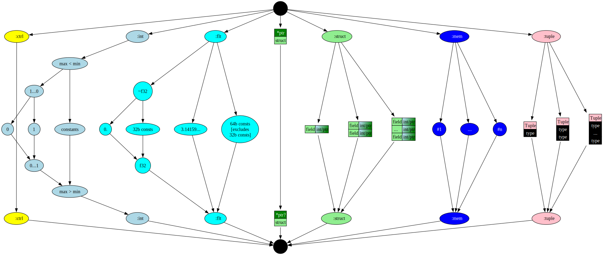

# Chapter 14: Narrow types

In this chapter, we add sub-word integer types.

You can also read [this chapter](https://github.com/SeaOfNodes/Simple/tree/linear-chapter14) in a linear Git revision history on the [linear](https://github.com/SeaOfNodes/Simple/tree/linear) branch and [compare](https://github.com/SeaOfNodes/Simple/compare/linear-chapter13...linear-chapter14) it to the previous chapter.

## Narrow or sub-word types

As a prelude to arrays, especially arrays of bytes common in all networking
codes, Simple needs some way to manipulate sub-word integer types.
Computations are always done in 64 bits for both integer and float ops, but
will be truncated (rounded) on a variable or field assignment, and (sign)
extended on a load.

```java
i8 x = 123456789;
if( x != 21 ) 
  return false;
return true;
```

The variable `x` is limited to 8 bits signed.  Assigning the vary large value
`123456789` (hex `0x75BCD15`) simply truncates to 8 bits yielding `21 (0x15)`.
The value is sign-extended on a load.

```java
i16 x = 123456789;
if( x != -13035 ) 
  return false;
return true;
```

The variable `x` is limited to 16 bits signed.  Assigning the vary large value
`0x75BCD15` simply truncates to 16 bits yielding `0xCD15`.  The value is
sign-extended on a load yielding `-13035 (0xFFFF FFFF FFFF CD15)`.

```java
u16 x = 123456789;
if( x != 52501 ) 
  return false;
return true;
```

The variable `x` is limited to 16 bits unsigned.  Assigning the vary large value
`0x75BCD15` simply truncates to 16 bits yielding `0xCD15`.  The value is
zero-extended on a load yielding `52501 (0x0000 0000 0000 CD15)`.

Similarly, floats can be limited to IEEE754 32-bit standard format and will be
rounded when assigned, and inflated to 64-bits when loaded.

The complete list of primitive types is now:
```java
int, i64  // 64-bits, matching modern hardware
// u64    // NOT implemented, as it hints at some kind of >64 bit behavior
i32, u32  // 32 bits, sign or zero extended on load
i16, u16  // 16 bits, sign or zero extended on load
 i8,  u8  //  8 bits, sign or zero extended on load
 i1,  u1  //  1 bit , sign or zero extended on load
bool      // Same as u1 
flt, f64  // IEEE 754 64-bit float, sometimes called a "double"
f32       // IEEE 754 32-bit float
```


## Type Implementation

The <font style="background-color:lightblue">TypeInteger type</font> class is
reworked to support a full range of min/max values.  At this time, only some
power-of-2 sized ranges are exposed to the programmer but the optimizer
internally supports all ranges.  The MEET operation takes the min-of-mins and
max-of-maxes.  The DUAL operation inverts the min and max.

Example: the constant `0` has `[0...0]`.

Example: the `bool` type has the range `[0...1]`.

Example: the `u8` type has the range `[0...255]`.

Example: the `i8` type has the range `[-128...127]`.

Example: the `dual` of `bool` is `[1...0]` (just swap min and max).

The <font style="background-color:aqua">TypeFloat</font> class is also reworked to support 32-bit and 64-bit sizes.




## Nodes

Added this Chapter are some bit-manipulation Nodes representing common hardware
ops to mask, shift, sign-extend and round bits.  The truncation and extension
logic uses these.  They are otherwise very similar to the previous
`Add/Sub/Mul/Div` Nodes but with slightly different constant math and
slightly different `idealize()` calls.


