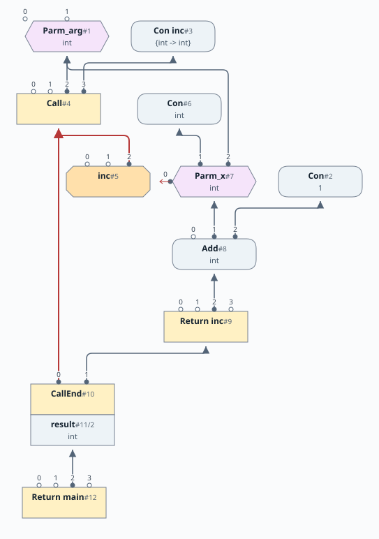
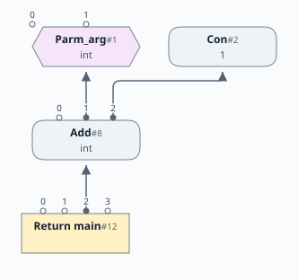

# 第18章: 関数と呼び出し

[English](README.md) | 日本語

[前: 第17b章](../chapter17b/README.ja.md) |
[次: 第19章](../chapter19/README.ja.md)

この文書は [原文](README.md) の日本語訳です。

第17b章までは、プログラムは入力 `arg` と結果を持つ1つの本体からなっていました。分岐、ループ、オブジェクトの割り当て、メモリの更新はできますが、まだ関数に分割できません。この章では、再帰呼び出しも含めた関数値と呼び出しを追加します。

グラフ表現には、なじみのある部品を使います。関数の入口は Region、パラメータは Phi で、出口は1つの Return に合流します。呼び出しは関数境界を越えてこれらを結びます。関数の呼び出し元が1つだけなら、境界を取り除くことで通常のピープホール最適化が結合されたグラフを簡略化できます。これが最初の形のインライン化です。

この章の[完全な言語文法](docs/18-grammar.ja.md)はこちらです。

## 目次

1. [関数を書く](#関数を書く)
2. [グラフ内の関数](#グラフ内の関数)
3. [呼び出しをまたぐメモリ](#呼び出しをまたぐメモリ)
4. [関数型と呼び出し先](#関数型と呼び出し先)
5. [インライン化](#インライン化)
6. [スケジューリングと実行](#スケジューリングと実行)

[linear](https://github.com/SeaOfNodes/Simple/tree/linear) ブランチの線形の Git リビジョン履歴で[この章](https://github.com/SeaOfNodes/Simple/tree/linear-chapter18)を読むことや、前章との[差分](https://github.com/SeaOfNodes/Simple/compare/linear-chapter17b...linear-chapter18)を見ることもできます。

## 関数を書く

関数式は型付きのパラメータを列挙し、`->` と本体を続けます。

```simple
val sq = { int x -> x*x; };
return sq(arg);
```

初期化子は関数値を作り、宣言がそれを `sq` に束縛します。呼び出し `sq(arg)` は引数を評価し、その値を `x` に束縛して本体を実行し、結果を返します。実行が本体の末尾に到達すると、最後の式が結果を供給します。明示的な `return` なら途中で終了できます。

関数型は、パラメータ名を含めず、パラメータ型と結果型を列挙します。同じ平方関数を明示的な型で宣言できます。

```simple
{int -> int} sq = { int x -> x*x; };
return sq(4); // 16
```

関数は匿名の値です。変数に代入すれば診断用の名前を付けられますが、束縛はほかの変数と同じ規則に従います。`val` は固定の束縛、`var` は再代入可能な束縛を推論します。関数を引数として渡したり、結果として返したり、式で選んだりできます。

パラメータは[第17a章](../chapter17a/README.ja.md)の明示的な宣言構文を使います。`!Point p` は固定されたパラメータ束縛を通じた書き込みを許し、`Point !p` は読み取り専用参照の再代入を許し、`int ~limit` はプリミティブのパラメータを固定します。パラメータ型は必須です。`var` と `val` は、関数を保持する変数に適用するもので、パラメータには適用しません。

### 戻り値とスコープ

本体には周囲の言語と同じ文が使えます。ここでは早期 return で、最初の一致する配列要素を探します。

```simple
val find = { int[] es, int e ->
    for( int i=0; i<es#; i++ )
        if( es[i] == e )
            return i;
    return -1;
};
val es = new int[3];
es[0] = 7;
es[1] = 9;
return find(es,9); // 1
```

1つの関数の、到達可能なすべての結果には共通の型が必要です。これは最適化後にチェックするので、到達不能な return は型エラーを起こしません。`void` 型はありませんが、関数は構文を何も書かずに `null` を返せ、呼び出し元は呼び出しを文として使って結果を無視できます。

関数は、囲んでいる関数の局所変数を捕捉しません。外側の束縛にアクセスできるのは、それが固定され、値がコンパイル時定数の場合だけです。たとえば次のようになります。

```simple
val offset = 2;
val addOffset = { int x -> x+offset; };
return addOffset(arg);
```

`val offset` を `int offset` に変えると束縛が可変になり、関数定義は拒否されます。同様に `val offset = arg` は固定ですが定数ではないので、入れ子の関数から使えません。固定された関数定数はこの規則を満たすため、フレームを捕捉せずに、ある関数から別の関数を参照できます。

### 再帰

関数は自身の束縛を参照できます。

```simple
val fact = { int n ->
    n <= 1 ? 1 : n*fact(n-1);
};
return fact(arg);
```

パーサーは、本体をパースする前に関数の入口を登録します。`fact` への前方参照は、宣言がその関数値を受け取ると解決されます。それによって再帰呼び出しも、外からの呼び出しと同じ入口を見つけられます。この章では戻り値の型推論はまだ悲観的です。相互再帰する定義には、[第24章](../chapter24/README.ja.md)の SCCP で導入する、より強力な解析が必要なことがあります。

## グラフ内の関数

これまでは `Start` が1つのプログラム本体への入力を供給していました。今度はその本体を、整数パラメータ `arg` を持つ暗黙の `main` としてパースします。評価器は `Start` から `main` に入り、結果を外の世界に渡します。そのため既存のプログラムは、ソース構文を維持したまま、明示的に宣言された関数と同じ関数表現を得ます。

### 入口、パラメータ、出口

[FunNode](src/main/java/com/seaofnodes/simple/node/FunNode.java) は `RegionNode` を継承します。Region が異なる分岐からの制御を合流するのに対し、Fun は異なる呼び出し元からの制御を合流します。リンクされた呼び出しが、1本の流入制御エッジを供給します。

[ParmNode](src/main/java/com/seaofnodes/simple/node/ParmNode.java) は `PhiNode` を継承します。Phi が流入分岐に属する値を選ぶのと同じように、各パラメータは流入呼び出しに属する引数を選びます。パラメータの添字が、呼び出し元の供給するものを識別します。

| パラメータの添字 | 値 |
|---|---|
| 0 | 復帰地点: 呼び出し元の実行再開位置 |
| 1 | メモリ全体 |
| 2 以降 | ソース言語の引数 |

各関数は、`Start` で表される暗黙の未知の呼び出し元も持ちます。これは宣言されたパラメータ型と未知のメモリを供給します。呼び出しをまだ発見している間、これによって入口を保守的に保ちます。

ソース上のすべての `return` は、1つの出口 Region に寄与します。値の Phi が結果を合流し、BulkMemPhi がそのメモリ状態を合流します。結果の [ReturnNode](src/main/java/com/seaofnodes/simple/node/ReturnNode.java) の入力は `{control, memory, value, return point}` です。出口が1つなら、Region と Phi はしばしば畳み込まれて消えます。`Stop` は、`main` のものも含め、関数の Return を保持します。

これにより、本体に分岐、ループ、複数の return 文があっても、各関数は1つの入口と1つの合流した出口を持ちます。

### 呼び出しと復帰地点

[CallNode](src/main/java/com/seaofnodes/simple/node/CallNode.java) の入力は `{control, memory, arguments..., function pointer}` です。最後の入力が呼び出し先を決めます。定数の関数でも、関数値を持つ式の結果でもかまいません。引数式は、Call が制御とメモリの入力を取る前に評価します。

各 Call には [CallEndNode](src/main/java/com/seaofnodes/simple/node/CallEndNode.java) があり、呼び出し元が継続する地点となります。CallEnd は Call と、リンクされた呼び出し先の Return を入力に取ります。その射影は、それぞれスロット 0、1、2 に制御、メモリ、結果を供給します。

呼び出される側は、どの CallEnd に戻るかを知る必要があります。隠れたパラメータ 0 が、本体を通じて Return までその復帰地点を運びます。*return program counter*（復帰プログラムカウンタ）の略である `TypeRPC` は、関数ポインタ型が取り得る入口の集合を記述するのと同じように、取り得る復帰地点の集合を記述します。これらは内部値であり、ソースプログラムは RPC 変数を宣言しません。

呼び出しグラフのエッジは、呼び出しがどの関数に到達し得るかを記述します。これは1つの関数内の制御フローとは別です。通常グラフをたどるときには、呼び出しと関数の付近で注意が必要です。多くの探索は、単一の関数内でだけ有効だからです。

## 呼び出しをまたぐメモリ

前の章では、フィールドのエイリアスごとにメモリを遅延的に分割しました。関数内では今もそうしますが、関数入口のメモリは未知です。引数が、呼び出し元で割り当てて変更したオブジェクトを参照するかもしれません。流入するヒープが空だとは、もう仮定できません。

Call は、MemMerge に包まれたスライスも含め、完全なメモリ状態を受け取ります。その CallEnd は新しいメモリ全体の値を生成します。この章では、すべての呼び出しがすべてのエイリアスを変更し得ると扱います。呼び出される関数がわかっていても、どのフィールドに書くかという要約はまだ得られません。

```simple
struct Counter { int n; };
val bump = { !Counter p -> p.n++; return null; };
val p = new Counter;
int before = p.n;
bump(p);
bump(p);
return before*10+p.n; // 2
```

最初の `p.n` の読み出しは、初期化された値を観測します。最後の読み出しは両方の呼び出し後のメモリを使う必要があり、最初の読み出しを再利用できません。2つの呼び出しも、メモリの入出力によって順序が維持されます。書き込み可能なパラメータ権限が更新を許し、メモリエッジがその時点を記録します。

関数内では、MemMerge、MemPhi、BulkMemPhi が引き続き精密なスライスを露出し、分岐やループの状態を合流します。境界では、メモリ Parm 1 と CallEnd のメモリ結果は不透明なままです。大域的コード移動は、Load を配置するときに呼び出しを潜在的な書き込みとして扱います。呼び出しはブロックを終了するため、Call より前である必要がある Load は、その終端命令より前にスケジュールします。

インライン化は呼び出しの境界を取り除き、実際の Load と Store を既存のエイリアス最適化に露出します。グラフに残る呼び出しの作用をより精密に扱うには、後のエスケープ解析が必要です。

## 関数型と呼び出し先

[TypeFunPtr](src/main/java/com/seaofnodes/simple/type/TypeFunPtr.java) は、引数タプル、結果型、null 許容性、関数添字の集合（`fidxs`）を記録します。ある引数シグネチャ内で、各関数は小さな整数の添字を得ます。ビット集合は、そのシグネチャを持つ1つの既知の関数や、複数の可能な関数を記述できます。`CodeGen` は具体的な関数の識別情報を FunNode に対応付けます。この章の IR の実行に、機械語コードのアドレスは不要です。

たとえば、以下の両分岐は型 `{int -> int}` を持ちますが、関数添字は異なります。

```simple
val f = arg ? { int x -> x+x; } : { int x -> x*x; };
return f(3); // 6 when arg is nonzero, otherwise 9
```

`f` の Phi は、2つの関数ポインタ型を組み合わせます。呼び出し先の集合は両方の関数を含みます。関数を選ぶことは、その本体の実行ではありません。

関数ポインタも、なじみのある接尾辞 `?` で null を許容できます。

```simple
{int -> int}? f = arg ? { int x -> x*x; } : null;
if( f ) return f(3);
return 0;
```

ガードは、呼び出し時にポインタが null でないことを証明します。呼び出しは、引数の個数、型、アクセス権限もチェックします。構造体ポインタと関数ポインタは、`Type.NIL` で表される特別な `null` 値を共有します。`TypeNil` が、共通の null 許容性の仕組みを供給します。

### 既知の呼び出し先のリンク

ここで*リンク*とは、呼び出しと関数の間に IR エッジを追加することです。オブジェクトファイルのリンクではありません。既知の各呼び出し先について、コンパイラは Call を Fun の入力として追加し、引数をその Parm に追加し、その Return を CallEnd の入力として追加します。対応する入力位置が、呼び出し元と引数の関係を保ちます。

この章ではすでに、上の条件式の例にある両方の関数も含め、既知の呼び出し先の有限集合をリンクします。未知の関数をまだ含む無限集合は列挙できません。この不確実性を、すべての呼び出しからすべての関数へのエッジで表すのは避けます。二次的に増大するためです。

代わりに Fun は*未知の呼び出し元*の入力を保持します。これまでに見つかった呼び出しが定数を渡していても、パラメータは宣言型を受け入れる必要があります。呼び出し元が1つ見つかっても、ほかにないという証明にはなりません。同様に、CallEnd は関数ポインタ型から結果型を得て、メモリ結果を未知のままにします。リンクされた Return エッジだけでは、これらの保守的な仮定を取り除きません。

インライン化は、関数の呼び出し元が1つだけであるという局所的な証明に依存します。後の SCCP の章では、どの関数や呼び出しに到達可能かについて、より強力な解析を構築し、残る境界を越えてより多くの情報を流せるようにします。

## インライン化

関数値をちょうど1つの呼び出しが使う関数を考えます。

```simple
val inc = { int x -> x+1; };
return inc(arg);
```

この呼び出しが `inc` にリンクすると、CallEnd は、呼び出し先が1つで、その関数ポインタにほかの使用がないことを証明できます。引数が有効で自己再帰呼び出しがなければ、関数本体を呼び出し元の一部にできます。

| インライン化前 | インライン化後 |
|---|---|
|  |  |

これらはグラフの模式的な断片で、書き換え前後でノード ID は変わりません。引数、結果、リンクのエッジを示し、周囲の制御フロー、メモリ、RPC の配線は省略しています。`Parm_x` への `int` 入力は、インライン化前の未知の呼び出し元の引数を表します。

書き換えは未知の呼び出し元の経路を取り除き、関数入口を呼び出しの流入制御につなぎます。その後、通常の Region と Phi の簡略化がパラメータを実引数に置き換えます。CallEnd の射影は、呼び出された関数の返す制御、メモリ、値になります。Call、関数境界、復帰地点の仕組みは、使用が消えるにつれて消えます。

Add は残りますが、今度は `arg` を直接消費します。引数が `3` なら、第2章から使っている同じ定数畳み込み規則によって `4` を生成します。インライン化で露出した Load と Store も、既存のメモリ規則で同じように簡略化できます。

この形のインライン化は、呼び出し元が1つの本体をその呼び出し元へ移動します。複数の呼び出し箇所のために本体を複製するわけではありません。`fact` のような再帰関数は呼び出しを保持し、評価器が処理します。

## スケジューリングと実行

この章で新しく導入する [CodeGen](src/main/java/com/seaofnodes/simple/CodeGen.java) は、コンパイル処理と関数の検索テーブルを所有します。次のフェーズ順序を強制します。

| フェーズ | 目的 |
|---|---|
| Parse | 関数と呼び出しを直接 IR に構築する。 |
| Opto | 呼び出しのリンクと自明なインライン化を含め、ピープホール最適化を反復する。 |
| TypeCheck | 型と死んだ制御が落ち着いた後で、生き残ったグラフをチェックする。 |
| Schedule | 大域的コード移動で演算を基本ブロックに配置する。 |
| LocalSched | 実行のために各ブロック内の演算を順序付ける。 |

例:

```java
CodeGen code = new CodeGen("val sq = { int x -> x*x; }; return sq(arg);");
code.parse().opto().typeCheck().GCM().localSched();
```

大域的コード移動は、[第13章](../chapter13/README.ja.md)の処理を複数の関数に拡張します。関数本体を別々に保ち、共有される定数式には、それを使う各関数内に局所的なコピーを与え、呼び出しをまたぐメモリへの作用を尊重します。

その後 [ListScheduler](src/main/java/com/seaofnodes/simple/ListScheduler.java) が各ブロックを順序付けます。未スケジュールの局所依存を数え、準備のできた演算を選び、依存が満たされるにつれてそのユーザーを準備済みにします。Phi は入口に、制御移動は出口に属します。ここには機械のタイミングモデルがなく、さまざまな改善の余地がありますが、この章の範囲外です。目標は、引き続き合法な実行順序です。

[Eval2](src/test/java/com/seaofnodes/simple/Eval2.java) はそのスケジュールを実行し、IR の演算を、無制限の値スロットを持つ命令として扱います。各呼び出しには独自のフレームがあるため、同じノードの再帰的な呼び出しも異なる値を保持します。呼び出し時には、呼び出し元のフレームと復帰地点を保存し、呼び出される側のフレームを作り、選ばれた関数に移ります。return 時には呼び出し元を復元し、その CallEnd に値を渡します。Region では、結果を代入する前に、選ばれたすべての Phi 入力を読みます。そのため並列代入は正しさを保ちます。

これでスケジュールされた関数からなる実行可能なプログラムができましたが、演算はまだ機械に依存しません。[第19章](../chapter19/README.ja.md)では、スケジューリング前に命令選択を挿入します。これらの理想的な演算は、選んだ CPU のレジスタ制約と呼び出し規約を持つ命令になります。
