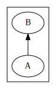
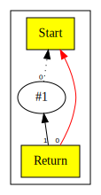

# Chapter 1: Introduction

# Table of Contents

1.  [Implementation Language](#implementation-language)
2.  [Assumptions](#assumptions)
3.  [Architecture](#architecture)
4.  [Data Structures](#data-structures)
5.  [Intermediate Representation as a Graph of Nodes](#intermediate-representation-as-a-graph-of-nodes)
6.  [Nodes are in a Graph](#nodes-are-in-a-graph)
7.  [Types of Nodes](#types-of-nodes)
8.  [Unique Node ID](#unique-node-id)
9.  [Start Node](#start-node)
10. [Constant Node](#constant-node)
11. [Return Node](#return-node)
12. [Representation](#representation)


You can also read [this chapter](https://github.com/SeaOfNodes/Simple/tree/linear-chapter01) in a linear Git revision history on the [linear](https://github.com/SeaOfNodes/Simple/tree/linear) branch.


In this chapter we aim to compile simple scripts such as:

```
return 1;
```

We implement the `return` statement.
The `return` statement accepts an `expression` as an argument.
The only `expression` type is an integer literal, as shown in the example above.

To implement this simple language, we introduce a few key components and data structures.

Here is the [complete language grammar](01-grammar.md) for this chapter.


## Implementation Language

Our implementation language is Java. We chose Java as it is widely available and understood.

## Assumptions

We assume that the reader is familiar with traditional linear intermediate representations, and is familiar with terms such as Basic Block, Control Flow Graph, etc. No attempt is made to explain these topics.
If necessary the reader can consult a standard compiler text book.

## Architecture

We construct the intermediate Sea of Nodes (SoN) representation directly as we parse the language. There is no Abstract Syntax Tree representation. The reason for this is to demonstrate a key benefit of the SoN IR:
a number of pessimistic peephole optimizations can be performed while parsing a language. This aspect is more fully explored from [Chapter 2](../chapter02/README.md) onwards.

## Data Structures

Our data structures are based upon the descriptions provided in following papers:

* [From Quads to Graphs: An Intermediate Representation's Journey](http://softlib.rice.edu/pub/CRPC-TRs/reports/CRPC-TR93366-S.pdf)
* [Combining Analyses, Combining Optimizations](https://dl.acm.org/doi/pdf/10.1145/201059.201061)
* [A Simple Graph-Based Intermediate Representation](https://www.oracle.com/technetwork/java/javase/tech/c2-ir95-150110.pdf)
* [Global Code Motion Global Value Numbering](https://courses.cs.washington.edu/courses/cse501/06wi/reading/click-pldi95.pdf)
* [EasySSA](https://www.dropbox.com/scl/fi/0ww4sgl3ynep9hhe3i4xn/EasySSA.pdf?rlkey=2cp78hzxke62flkmyneiebzoz&dl=0)
* [SeaOfNodes](https://www.dropbox.com/scl/fi/cxykfvlzsmlcatyg6rlbt/SeaOfNodes.pdf?rlkey=z6o7y3rwr6atrejilcze6r8x0&e=1&dl=0)

Following the lead from above, we represent our intermediate representation using an object oriented data model. Details of the
representation follow.

### Intermediate Representation as a Graph of Nodes

The intermediate representation is a graph of Node objects. The `Node` class is the base type for objects in the IR graph.
The `Node` class provides common capabilities that are inherited by all subtypes.
Each subtype implements semantics relevant to that subtype.

Each `Node` represents an "instruction" as it may appear in traditional IRs.

### Nodes are in a Graph

The key idea of the Sea of Nodes IR is that each Node is linked to other Nodes by def-use dependencies.
As this is such an important and fundamental aspect of the IR, it is important to understand how we implement this, and depict in graph visuals.

The base `Node` class maintains a list of Nodes that are inputs to it. An input is an edge from a "def" to a "use". What this means is that if `B` is definition, and `A` uses `B`,
then there is a def-use edge from `B` to `A`.

Visually we show an arrow from the "use" to the "def". Here is an example:



From an implementation point of view, our `Node` type also maintains a reverse link.
This means that in the above scenario:

* Since `A` is a "use" of `B`, then `B` will appear in `A`'s list of inputs.
* Conversely, `B` maintains a list of outputs, and `A` will appear in this list.
* A key invariant is that these edges must be in sync at all times.

Here is how this looks in the `Node` class:

```java
public abstract class Node {

    /**
     * Inputs to the node. These are use-def references to Nodes.
     * <p>
     * Generally fixed length, ordered, nulls allowed, no unused trailing space.
     * Ordering is required because e.g. "a/b" is different from "b/a".
     * The first input (offset 0) is often a Control node.
     */
    public final ArrayList<Node> _inputs;

    /**
     * Outputs reference Nodes that are not null and have this Node as an
     * input.  These nodes are users of this node, thus these are def-use
     * references to Nodes.
     * <p>
     * Outputs directly match inputs, making a directed graph that can be
     * walked in either direction.  These outputs are typically used for
     * efficient optimizations but otherwise have no semantics meaning.
     */
    public final ArrayList<Node> _outputs;
}
```

### Types of Nodes

There are two categories of Nodes in the intermediate representation.

* **Control Nodes** - these represent the control flow subgraph (CFG) of the compiled program
* **Data Nodes** - these capture the data semantics

The following control and data nodes appear in this chapter.

| Node Name | Type    | Description                                   | Inputs                                                           | Value                                                 |
|-----------|---------|-----------------------------------------------|------------------------------------------------------------------|-------------------------------------------------------|
| Start     | Control | Start of function                             | None                                                             | None for now as we do not have function arguments yet |
| Return    | Control | Represents the termination of a function      | Predecessor control node, Data node value                        | Return value of the function                          |
| Constant  | Data    | Represents constants such as integer literals | None, however Start node is set as input to enable graph walking | Value of the constant                                 |

Within a traditional basic block, instructions are executed in sequence. In the Sea of Nodes model, the correct sequence of instructions is determined by a scheduling
algorithm that depends only on dependencies between nodes (including control dependencies) that are explicit as edges in the graph. This enables a number of optimizations
at very little cost (nearly always small constant time) because all dependencies are always available.

### Unique Node ID

Each node is assigned a unique dense integer Node ID when created. This ID is
useful for debugging, efficiently computing equality and e.g. as an index into
a bit vector, which in turn is used to efficiently visit a (possibly cyclic)
graph.  We discuss Node equality in [Chapter 9](../chapter09/README.md).

### Start Node

The Start node represents the start of the function.  For now, we do not have any inputs to Start because our function does not
yet accept parameters.  When we add parameters the value of Start will be a tuple, and will require Projections to extract the values.
We discuss this in detail in [Chapter 4](../chapter04/README.md).

### Constant Node

A Constant node represents a constant value.  At present, the only constants
that we allow are integer literals; therefore Constants contain an integer
value. As we add other types of constants, we will refactor how we represent
Constants.

Constants have no semantic inputs. However, we set Start as an input to
Constants to enable a forward graph walk.  This edge carries no semantic
meaning, and it is present _solely_ to allow visitation.

The Constant's value is the value stored in it.

### Return Node

The Return node has two inputs.  The first input is a control node and the
second is the data node that supplies the return value.

In this presentation, Return functions as a Stop node, since multiple `return` statements are not possible.
The Stop node will be introduced in [Chapter 5](../chapter05/README.md) when we implement `if` statements.

The Return's output is the value from the data node.

### Representation

Here is visualization of the program:

```
return 1;
```



* Control nodes appear as square boxes with yellow background
* Control edges are in bold red
* The edges from Constants to Start are shown in dotted lines as these are not true control edges
* We label each edge with its position in the `_inputs` array, thus `0` means the edge is `_inputs[0]`.
