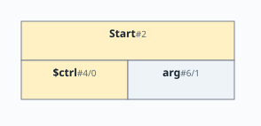
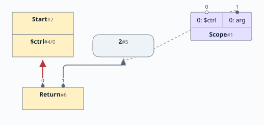
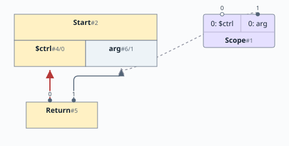
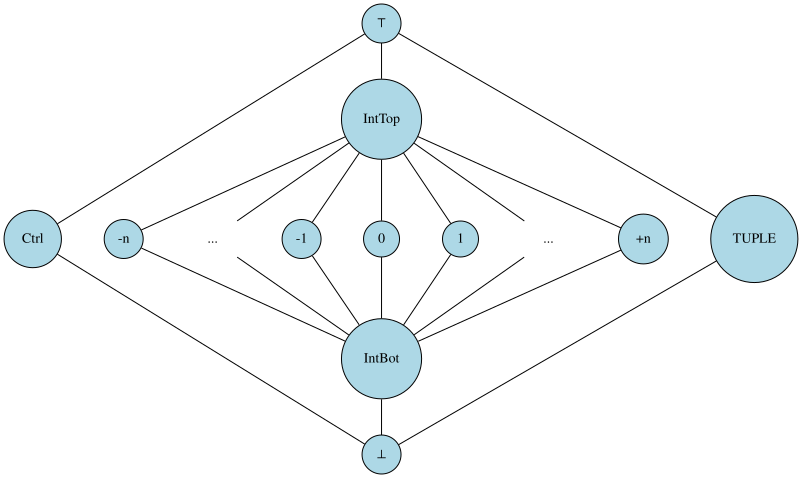
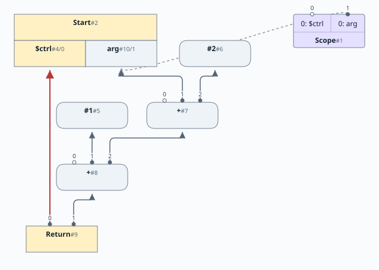
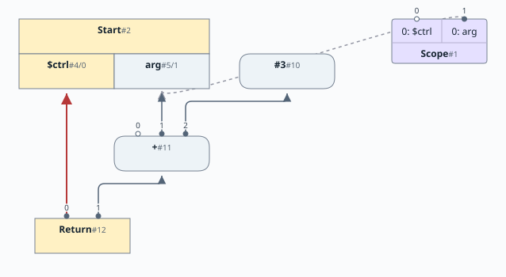

# 第4章: 外部からの引数と比較

[English](README.md) | 日本語

この文書は [原文](README.md) の日本語訳です。

[前の章: 第3章](../chapter03/README.ja.md) |
[次の章: 第5章](../chapter05/README.ja.md)

# 目次

1. [中間表現の拡張](#中間表現の拡張)
2. [射影ノード](#射影ノード)
3. [可視化](#可視化)
4. [初期値](#初期値)
5. [制御が null でないのはいつか](#制御が-null-でないのはいつか)
6. [可視化についての注記](#可視化についての注記)
7. [型システムの変更](#型システムの変更)
8. [タプル型](#タプル型)
9. [$ctrl の名前の束縛](#ctrl-の名前の束縛)
10. [ピープホール最適化の追加](#ピープホール最適化の追加)
11. [ピープホール最適化の処理を追う](#ピープホール最適化の処理を追う)
12. [デッドコード除去（DCE）](#デッドコード除去dce)

[linear](https://github.com/SeaOfNodes/Simple/tree/linear) ブランチの直線的な Git のリビジョン履歴で [この章](https://github.com/SeaOfNodes/Simple/tree/linear-chapter04) を読み、前の章と [比較](https://github.com/SeaOfNodes/Simple/compare/linear-chapter03...linear-chapter04) することもできます。

この章では、言語の文法を拡張して次の機能を追加します。

* プログラムは、外部環境から整数型の引数 `arg` を1つ受け取ります。
* 式で比較演算子をサポートします。
* 現在入ってくる制御ノードに対し、スコープを考慮する名前の束縛 `$ctrl` を導入します。これにより Return は Start に固定的につながるのではなく、スコープ内の `$ctrl` の束縛を追跡します。

この章の [完全な言語文法](04-grammar.ja.md) はこちらです。

## 中間表現の拡張

この章では、新しいノードを追加し、既存のノードの一部を変更します。変更するノードと新しいノードは次のとおりです。

| ノード名 | 種類 | 説明 | 入力 | 値 |
|-----------|----------------|------------------------------------------------|-----------------------|----------------------------------------------------------------------------|
| MultiNode | 抽象クラス | 結果がタプルであるノード | | タプル |
| Start | 制御 | 関数の開始点。今回から MultiNode になる | | 制御トークンと `arg` データノードを含むタプル |
| Proj | データ / 制御 | MultiNode から値を取り出す射影ノード | MultiNode とインデックス | 入力 MultiNode のインデックス位置から取り出した値 |
| Bool | データ | 比較演算子の結果を表す | 2つのデータノード | 比較結果を整数値で表す。1=true、0=false |
| Not | データ | 論理否定 | 1つのデータノード | 0を1に、1を0に変換する |

> `Proj` は制御スロットを射影するとき、すなわち `Start` の `Proj#0` のときに制御ノードです。それ以外の射影はすべてデータノードです。`ProjNode.isCFG()` を参照してください。

前の章までのほかのすべてのノードも引き続き使います。

## 射影ノード

複数の値を返すノードから、特定のタプル要素を取り出す射影ノードを追加します。各射影ノードは、入力ノードから取り出すフィールドのインデックスを持ちます。射影ノードによって、ラベル付きの使用・定義（use-def）エッジを単純なノード参照として管理できます。

図では、射影ノードを、接続先ノードの内側にある長方形の箱として示します。

### 可視化



この図では、Start ノードの出力に対応する名前を射影ノードのラベルにしています。制御を含む MultiNode と制御ノードは、どちらも黄色です。`$ctrl` と `arg` は StartNode（`START`）の出力（利用側）であり、唯一の入力としてスロット0に MultiNode を持ちます。`label` に意味上の役割はなく、デバッグ出力で使います。

```java
public ProjNode(MultiNode ctrl, int idx, String label) {
    super(ctrl);
```

```java
_scope.define(ScopeNode.CTRL, new ProjNode(START, 0, ScopeNode.CTRL).peephole());
_scope.define(ScopeNode.ARG0, new ProjNode(START, 1, ScopeNode.ARG0).peephole());
```

これらの射影ノードは、`START` MultiNode から `CTRL` と `ARG0` の型を取り出します。MultiNode は型を TypeTuple として保持します。

```java
public StartNode(Type[] args) {
    super();
    _args = new TypeTuple(args);
```

型の取り出しには `_idx` を使います。

```java
return t instanceof TypeTuple tt ? tt._types[_idx] : Type.BOTTOM;
```

### 初期値

引数は常に与えられ、デフォルトは `TypeInteger.BOT` です。個々のテストでは、引数を指定して `new Parser` を呼ぶことで、ほかの整数値を渡すことができますし、実際にそうしています。

```java
Parser parser = new Parser("return arg; ", TypeInteger.constant(2));
```

グラフは次のようになります。



* `$ctrl` と `arg` はどちらも最外側のシンボルテーブル、レキシカルな深さ0で定義されます。
* 深さ1には空のグローバルスコープのシンボルテーブルを作ります。将来、ここでグローバル変数を定義します。
* return の後では制御が死ぬため、スコープの `$ctrl` の線はありません。明示的に null を設定すると `setDef` が呼ばれてノードが削除されます（削除されたノードはプログラムの一部ではなく、可視化にも現れません）。

```
    ctrl(null);             // Kill control
```

* `arg` は定数なので、`arg` 射影ノードはクラスタに含まれません。もともと `arg` は ProjNode により定義されていましたが、ピープホール最適化の呼び出しで計算された型が定数となるため、ProjNode を ConstantNode に置き換えます。

```java
public final Node peephole( ) {
    Type type = _type = compute();
    /*   type = {TypeInteger@1527} "2"  */

    // ProjNode is not a constant unlike its type.
    if (!(this instanceof ConstantNode) && type.isConstant())
        /* Create Constant(2) */
        return deadCodeElim(new ConstantNode(type).peephole());

    /* won't get called */
    ...
```

引数を渡さなければ、`TypeInteger.BOT` になります。

```java
    Parser parser = new Parser("return arg; ");
    ...

public Parser(String source) {
    this(source, TypeInteger.BOT);
}

```

これが定数ではないことは明らかです。

```java
public final static TypeInteger BOT = new TypeInteger(false, 1);
   /* _is_con = false */
```

そのため、`arg` 射影ノードはクラスタ内に残ります。



#### 制御が null でないのはいつか

後の章では、`$ctrl` は `If` や `Region`（さらに `Loop`）などのほかの制御ノードを指すようになります。現時点ではほかの制御フローがないため、`Return` の後には必ず null を設定します。

#### 可視化についての注記

この章以降は、定数から Start ノードへのエッジを省略します。主な目的は図の混雑を減らし、グラフのより重要な部分に読者の注意を向けることです。

## 型システムの変更

[第2章](../chapter02/README.ja.md) で型システムを導入しました。

ノードには型を付けています。この型の注釈には2つの目的があります。

* そのノードで許される演算の集合を定義すること。
* そのノードが取りうる値の集合を定義すること。

[第2章](../chapter02/README.ja.md) では、特定のノードにおいて型に対応する値の集合を、[束](https://en.wikipedia.org/wiki/Lattice_(order)) として便利に表せることを述べました。

型そのものは Java の `Type` クラスとそのサブタイプで識別します。型の実装では、型の内部構造を扱う便利な方法として Java のクラスを使っています。ただし、Java のクラスと束の中での型の位置に関連はありません。

この章では、型の階層を次のように拡張します。

```
Type              (Enhanced - now has Control, and a global Top and Bottom)
+-- TypeInteger   (Enhanced - now has Top and Bottom types)
+-- TypeTuple     (New - represents multi-valued result)
```

拡張した束は次のようになります。



この章では、`arg` という名前のプログラム入力変数を導入します。この変数についてわかるのは、何らかの整数値だということだけで、定数かどうかはわかりません。

定数でない整数値を扱うため、`TypeInteger` を拡張し、これまでの定数値に加えて整数型 `IntTop` と `IntBot` も表せるようにします。

整数値が定数の場合と定数でない場合を持つようになったため、束に *meet* 演算子を導入する必要があります。`meet` 演算子は、整数値を組み合わせたときの結果の型を決める規則を表します。束の図では、`meet` を取る2つの要素から始めて、矢印を下向きにたどり、最初に合流する地点を見つけます。

|        | IntBot | Con1   | Con2   | IntTop |
|--------|--------|--------|--------|--------|
| IntBot | IntBot | IntBot | IntBot | IntBot |
| Con1   | IntBot | Con1   | IntBot | Con1   |
| IntTop | IntBot | Con1   | Con2   | IntTop |

この表の `Con1` と `Con2` は2つの異なる整数値を表し、次の規則を説明するためのものです。

* `IntTop` と任意の整数定数の `meet` は、その定数です。
* `IntBot` と任意の整数値の `meet` は `IntBot` です。
* 任意の整数とそれ自身の `meet` は、その整数です。
* 互いに異なる2つの整数定数の `meet` は `IntBot` です。

現時点では、整数値を持つノードはすべて、定数か `IntBot` 整数型のどちらかです。ループの最適化を始めると、`IntTop` の値も現れるようになります。

### タプル型

タプル型にはもう少し説明が必要です。型を固定数まとめたもので、文字どおり `Type[]` です。タプルは、ほかの点では互いに無関係な型の集まりを表し、`MultiNode` から得られます。`ProjNode` は、タプルから適切な `Type` 配列要素を取り出します。StartNode は今回から、制御と `arg` の型からなる2要素の `TypeTuple`、`[ctrl, TypeInteger.INTBOT]` を生成します。

タプルに対する束の `meet` 演算子は、要素ごとに適用します。各配列要素で再帰的に `meet` を呼び出します。異なるサイズのタプルを組み合わせるのはコンパイラ内部エラーであり、その場合 `meet` はボトムを使います。

## `$ctrl` の名前の束縛

前の章までは、Start から Return への制御入力エッジを固定していました。この章では、そのような固定エッジを使いません。代わりに `$ctrl` という名前で、現在のスコープ内の制御ノードを追跡します。したがって、先行する制御ノードへのエッジを作る必要があるときは、現在のスコープでこの名前を検索するだけです。

## ピープホール最適化の追加

定数でない整数値を扱えるようになったので、代数式を並べ替えて定数畳み込みを可能にする追加の最適化を行えます。たとえば、次の式です。

```
return 1 + arg + 2;
```

ここではコンパイラに `arg+3` を出力してほしいのですが、現状では次のようになります。



よりよい結果を得るには、代数的な簡約が必要です。たとえば、式を次のように並べ替えます。

```
arg + (1 + 2)
```

これで定数畳み込みが可能になり、最終的な結果は次のようになります。式を正規形にすることで、よく使われるアドレス計算の定数を畳み込み、代数的な恒等式を取り除き、全般的にコードを簡単にします。



この章で導入するピープホール最適化を次に示します。後の章ではさらに追加します。

| 変更前 | 変更後 | 説明 |
|-----------------------|-----------------------|------------------------------------------------|
| (arg + 0 ) | arg | 0の加算の恒等式 |
| (arg - 0 ) | arg | 0の減算の恒等式 |
| (arg * 1 ) | arg | 1の乗算の恒等式 |
| (con + arg) | (arg + con) | 畳み込みを促すため定数を右に移す |
| (con * arg) | (arg * con) | 畳み込みを促すため定数を右に移す |
| (con1 + (arg + con2)) | (arg + (con1 + con2)) | 畳み込みを促すため定数を右に移す |
| ((arg1 + con) + arg2) | ((arg1 + arg2) + con) | 畳み込みを促すため定数を右に移す |
| (arg + arg) | (arg * 2) | 積の和の形式 |
| (arg - arg) | 0 | 同じ値の減算は0 |
| (0 - arg) | (-arg) | 0からの減算は符号反転 |
| (arg1 - (-arg2)) | (arg1 + arg2) | 符号反転した値の減算は加算 |
| ((-arg1) - arg2) | -(arg1 + arg2) | 符号反転した値からの減算は和の符号反転 |
| (con / 1) | con | 1による除算 |
| (arg == arg) | 1 | 同じ値の比較 |
| (arg != arg) | 0 | 同じ値の比較 |
| (arg < arg) | 0 | 同じ値の比較 |
| (arg > arg) | 0 | 同じ値の比較 |
| (arg <= arg) | 1 | 同じ値の比較 |
| (arg >= arg) | 1 | 同じ値の比較 |

## ピープホール最適化の処理を追う

この章で導入するピープホール最適化は、すべて局所的です。解析中に新しいノードを作ったとき、そのノードがまだどこからも使われていない段階で実行します。

たとえば、単項式を解析してその式のノードを作ると、新しく作った `MinusNode` に対して `peephole()` を呼び出します。

```java
private Node parseUnary() {
    if (match("-")) return new MinusNode(parseUnary()).peephole();
    return parsePrimary();
}
```

もう1つの例として、この章で導入した比較演算子の解析を示します。

```java
private Node parseComparison() {
    var lhs = parseAddition();
    if (match("==")) return new BoolNode.EQNode(lhs, parseComparison()).peephole();
    if (match("!=")) return new BoolNode.NENode(lhs, parseComparison()).peephole();
    if (match("<=")) return new BoolNode.LENode(lhs, parseComparison()).peephole();
    if (match("<" )) return new BoolNode.LTNode(lhs, parseComparison()).peephole();
    if (match(">=")) return new BoolNode.GENode(lhs, parseComparison()).peephole();
    if (match(">" )) return new BoolNode.GTNode(lhs, parseComparison()).peephole();
    return lhs;
}
```

`peephole()` は基底の `Node` クラスで実装しているため、`Node` のすべてのサブクラスが共有します。

```java
public final Node peephole( ) {
    // Compute initial or improved Type
    Type type = _type = compute();

    // Replace constant computations from non-constants with a constant node
    if (!(this instanceof ConstantNode) && type.isConstant())
        return deadCodeElim(new ConstantNode(type).peephole());

    // Ask each node for a better replacement
    Node n = idealize();
    if( n != null )         // Something changed
        // Recursively optimize
        return deadCodeElim(n.peephole());

    return this;            // No progress
}
```

ピープホールメソッドは次の処理を行います。

* ノードの型を計算します。
* 型が定数で、ノードが ConstantNode でなければ、ConstantNode に置き換え、新しい定数に対してピープホール最適化を再帰的に呼び出します。
* そうでなければ、`idealize()` を呼び、ノードによりよい置き換えを求めます。「よりよい置き換え」とは、`(1+2)` を `3` に、`1+(x+2)` を `(x+(1+2))` にするようなものです。
* `idealize()` の処理内容を決めるのは、各 Node サブタイプの責任です。よりよい置き換えがあれば、ノードは `null` ではない値を返します。
* `null` ではない値が返ったら何かが変わったので、もう一度 `peephole()` を呼び、その後、（置き換えられて死んだ）`this` ノードにデッドコード除去を行います。

`peephole()` は、次に示す `deadCodeElim()` を呼び出します。

## デッドコード除去（DCE）

グラフの編集時に、ノードの利用側が1つから0になるたびに `kill` を呼びます。ピープホール最適化による置き換えや、スコープを抜けるときによく起こります。この再帰的な `kill` は、ほかの多くのコンパイラでいうデッドコード除去に相当します。ここでは、それを非常に細かな単位で呼び出します。パーサーが作った多くのノードは、次の字句を解析するより前に削除されます。

詳しくは、デッドコード除去の [付録](appendix/dce.ja.md#付録) を読んでください。

名前が示唆するとおり、`deadCodeElim` 関数は `kill` の薄いラッパーです。利用側が一時的に1から0になるだけのノードを早まって削除しないよう、`peepholeOpt` が使います。

```java
// m is the new Node, self is the old.
// Return 'm', which may have zero uses but is alive nonetheless.
// If self has zero uses (and is not 'm'), {@link #kill} self.
private Node deadCodeElim(Node m) {
    // If self is going dead and not being returned here (Nodes returned
    // from peephole commonly have no uses (yet)), then kill self.
    if( m != this && isUnused() ) {
        // Killing self - and since self recursively kills self's inputs we
        // might end up killing 'm', which we are returning as a live Node.
        // So we add a bogus extra null output edge to stop kill().
        m.addUse(null); // Add bogus null use to keep m alive
        kill();            // Kill self because replacing with 'm'
        m.delUse(null);    // Remove bogus null.
    }
    return m;
}
```

ノード `m` にダミーの利用側を一時的に追加していることに注目してください。`m` は新しい置き換え先であり、生きているとわかっていますが、まだグラフにつないでいないため、利用側がありません。ダミーの利用側を加えることで、死んだと誤認されて削除されるのを防ぎます。
