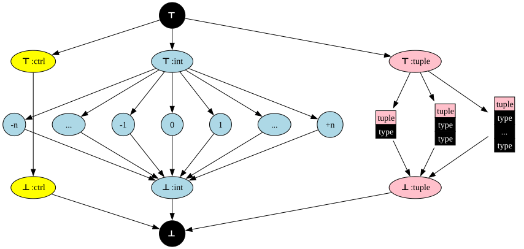
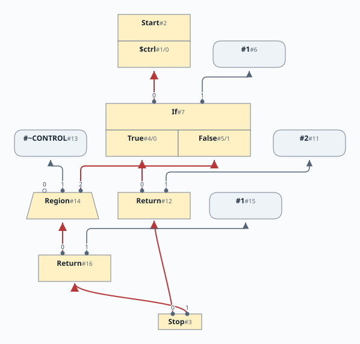
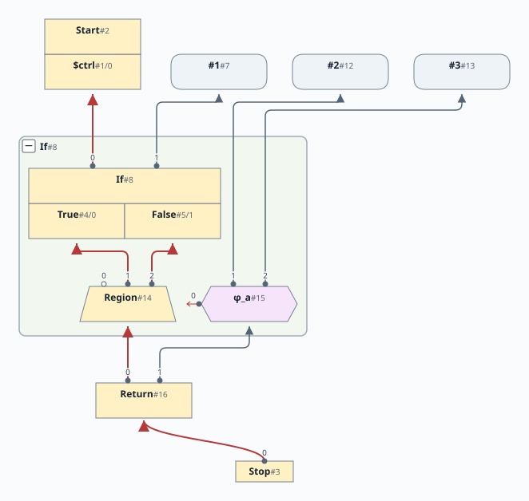
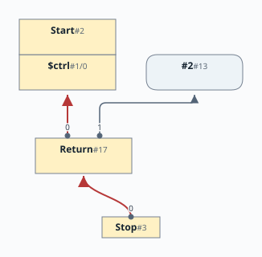
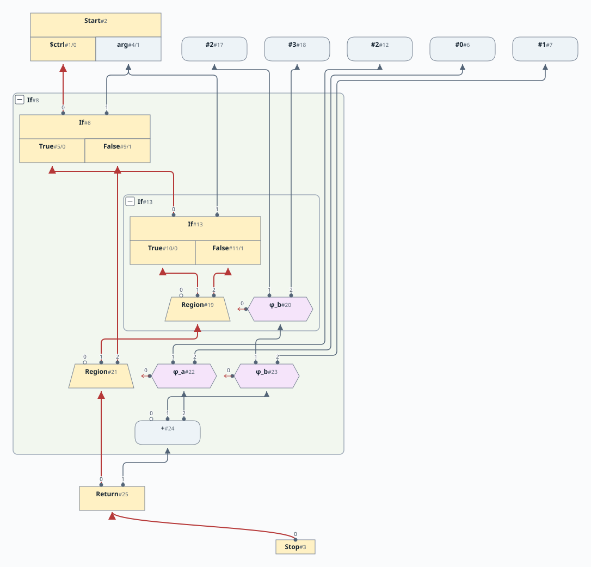
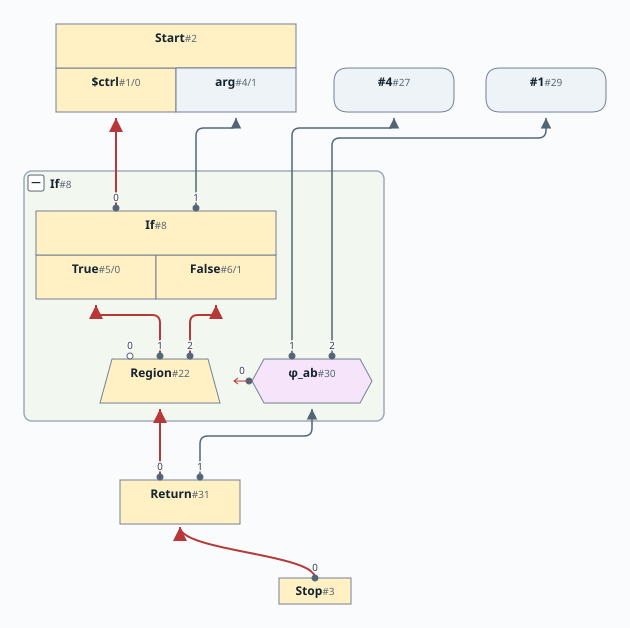

# 第6章: If のピープホール最適化

[English](README.md) | 日本語

この文書は [原文](README.md) の日本語訳です。

[前の章: 第5章](../chapter05/README.ja.md) |
[次の章: 第7章](../chapter07/README.ja.md)

文法は[第5章](../chapter05/05-grammar.ja.md)から変わりません。

# 目次

1. [型システムの改訂](#型システムの改訂)
2. [`if` のピープホール最適化](#if-のピープホール最適化)
3. [`Region` と `Phi`](#region-と-phi)
4. [考察](#考察)
5. [定数式以外へのピープホール最適化の拡張](#定数式以外へのピープホール最適化の拡張)
6. [支配ノード](#支配ノード)

[linear](https://github.com/SeaOfNodes/Simple/tree/linear) ブランチの直線的な Git のリビジョン履歴で [この章](https://github.com/SeaOfNodes/Simple/tree/linear-chapter06) を読み、前の章と [比較](https://github.com/SeaOfNodes/Simple/compare/linear-chapter05...linear-chapter06) することもできます。

この章では新しい言語機能は追加しません。目標は、`if` 文にピープホール最適化を追加することです。

## 型システムの改訂

整数の部分束に加えて、別の束構造を導入するよう型システムを拡張する必要があります。これまでと同じく、「トップ」を T、「ボトム」を ⊥ と表記します。

* 「Ctrl」は生きた制御を、「~Ctrl」は死んだ制御を表します。
* 「INT」は整数値を表します。整数値は独自の部分束を持つことに注意してください。

|       | ⊥ | Ctrl | ~Ctrl | T     | INT |
|-------|---|------|-------|-------|-----|
| T     | ⊥ | Ctrl | ~Ctrl | T     | INT |
| Ctrl  | ⊥ | Ctrl | Ctrl  | Ctrl  | ⊥   |
| ~Ctrl | ⊥ | Ctrl | ~Ctrl | ~Ctrl | ⊥   |
| ⊥     | ⊥ | ⊥    | ⊥     | ⊥     | ⊥   |

* 「トップ」と任意の型の meet は、その型です。
* 「ボトム」と任意の型の meet は、「ボトム」です。
* 「トップ」「ボトム」「Ctrl」「~Ctrl」は単純型に分類します。
* 「Ctrl」と「~Ctrl」の meet は「Ctrl」です。
* 上記で扱っていない場合、単純型と非単純型の meet の結果は「ボトム」です。

改訂した束の全体を次に示します。



## `if` のピープホール最適化

* 基本方針は、一方の分岐が死んでいるとわかっていても、`if` 文全体の解析を続けることです。
* この方法では死んだノードを作り、デッドコード除去で片付けます。解析時に特別なロジックを導入せず、通常のグラフ構築の仕組みで死んだノードを片付けられるという利点があります。
* `If` ノードをピープホール最適化するとき、条件が定数かどうかを調べます。定数なら、それが `0` かどうかによって、どちらか一方の分岐が死にます。
* この場合、`Proj` ノードを追加する時点で一方の射影が死んでいるとわかっています。その `Proj` ノードのピープホール最適化では、`Proj` を、死んだ制御を示す「~Ctrl」型の `Constant` に置き換えます。
* この時点では `If` ノードに利用側がないため、デッドコード除去はそれを削除しようとします。しかし解析を続ける必要があるので、まだ削除できません。重要なのは、*両方の `Proj` ノードを作った後なら `If` ノードを削除できる* ということです。その後の制御フローから見えるのは `Proj` ノードだけだからです。
* これを保証するため、最初の `Proj` を作る前に `If` にダミーの利用側を追加し、作成直後に取り除きます。こうして2つ目の `Proj` が `If` のデッドコード除去を引き起こせるようにします。
* 生きた `Proj` は `If` の親に、死んだ `Proj` は「~Ctrl」に置き換えます。
* その後、解析は通常どおり続きます。
* ほかに変わるのは、死んだ制御を伴ってマージ地点に到達したときです。
* 同じ方針に従い、`Phi` ノードの作成も含めて通常どおりマージします。
* `Region` の入力の1つが「~Ctrl」になっている場合があります。`Phi` はこれを見て自身を最適化します。生きた入力が1つだけなら、`Phi` のピープホール最適化は自身を残りの入力に置き換えます。
* 最後に `Region` ノードをピープホール最適化するとき、生きた入力が1つしかなく、Phi の利用側もないとわかれば、その1つの生きた入力に置き換えられます。

## `Region` と `Phi`

維持する不変条件の1つは、`Region` の各制御入力が、すべての `Phi` のデータ入力と1対1に対応することです。したがって、`Region` が制御入力を失ったら、各 `Phi` の対応するデータ入力も削除しなければなりません。逆に、依存する `Phi` がなくなるまでは Region を簡約できません。

`If` を処理するときは `Region` の制御入力を取り除かず、死んだ制御入力に単に `Constant(~Ctrl)` を設定します。`Phi` のピープホールロジックはそれに気付き、自身を生きた入力に置き換えます。

## 考察

上記の変更により、`if` 文の条件がコンパイル時に `true` または `false` に評価される場合、ピープホール最適化でデッドコードを畳み込めるようになります。

次の単純な例を見てみましょう。

```java
if( true ) return 2;
return 1;
```

ピープホール最適化前:



ピープホール最適化後:


別の例:

```java
int a=1;
if( true )
  a=2;
else
  a=3;
return a;
```

ピープホール最適化前:



ピープホール最適化後:



## 定数式以外へのピープホール最適化の拡張

`CFG` のピープホール最適化は、式がコンパイル時の定数ならデッドコードを簡約します。しかし、次の例では可能な最適化を十分に行えていません。

```java
int a = 0;
int b = 1;
if( arg ) {
    a = 2;
    if( arg ) { b = 2; }
    else b = 3;
}
return a+b;
```

この例では `arg` が外部で定義されるため、定数ではないと仮定しなければなりません。ただし、内側の `if` 文で `if( arg )` という条件を繰り返しています。外側の `if( arg )` が true なら、*内側の `if` も必ず true に評価される* とわかります。

現在のピープホール最適化には、これが見えません。



ピープホール最適化に、内側の `if` が外側の `if` によって完全に決定されると認識させ、コードを次のように簡単にしたいのです。

```java
int a = 0;
int b = 1;
if ( arg ) {
    a = 2;
    b = 2;
}
return a+b;
```

つまり、最終結果は、`arg` が true なら `4`、false なら `1` です。

## 支配ノード

このピープホール最適化を実装する鍵は、内側の `if` が外側の `if` によって完全に決定されるという観察です。コンパイラの用語では、外側の `if` が内側の `if` を支配するといいます。

この種の支配関係を判定する一般的な方法は、支配木（dominator tree）を構築することです。その詳細は論文 `A Simple, Fast Dominance Algorithm` を参照してください。[^1]

ただし、支配木の構築は高コストで、解析の途中では行いたくありません。幸い、まだループがないので、制御フローグラフにバックエッジもありません。制御フローグラフは本質的に階層的で、木のような形です。そのため、単純な方法で支配ノードを特定できます。

基本的な考えは、各制御ノードに、階層内での深さを表す `depth` を付けることです。必要に応じて、この深さを漸進的に計算できます。階層の深い位置にあるノードは、上にあるノードより大きな深さを持ちます。

次に、`Region` 以外の制御ノードには入ってくる制御エッジが1つしかないので、ほとんどの制御ノードには直接支配ノード（immediate dominator）が1つだけあるとわかります。`Region` ノードは制御エッジを1本以上持ちうるため異なります。ただし `if` 文の場合、`Region` ノードは `if` の各分岐から1つずつ、ちょうど2つの制御入力を持ちます。この `if` に限った状況で `Region` ノードの直接支配ノードを見つけるには、各分岐の直接支配ノードをたどり、両方の分岐を支配する共通の祖先ノードを見つけます。

この祖先ノードも `if` で、条件が現在の `if` と同じなら、現在の `if` の結果は完全に決定されるとわかります。

この確認を行うコードは、[`If` の `compute` メソッド](https://github.com/SeaOfNodes/Simple/blob/main/chapter06/src/main/java/com/seaofnodes/simple/node/IfNode.java#L38-L45) にあります。

`Node` の `idom` メソッドは、深さに基づく直接支配ノードの計算のデフォルト実装を提供します。`Region` は [これをオーバーライド](https://github.com/SeaOfNodes/Simple/blob/main/chapter06/src/main/java/com/seaofnodes/simple/node/RegionNode.java#L57-L74) し、上記のより複雑な探索を実装します。

上の例を簡約するには、[`Add` ノードにさらにピープホール最適化を追加](https://github.com/SeaOfNodes/Simple/blob/main/chapter06/src/main/java/com/seaofnodes/simple/node/AddNode.java#L64-L67) する必要もあるとわかります。

これらすべての変更によって、ピープホール最適化の結果は望んでいたとおりになります！



[^1]: Cooper, K. D. Cooper, Harvey, T. J., and Kennedy, K. (2001).
  A Simple, Fast Dominance Algorithm.
