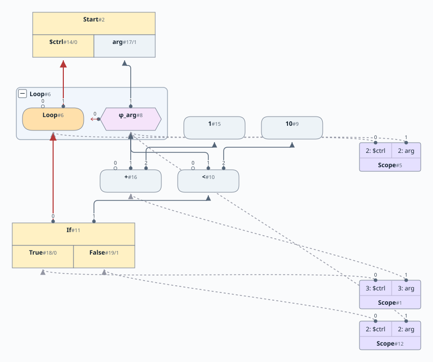
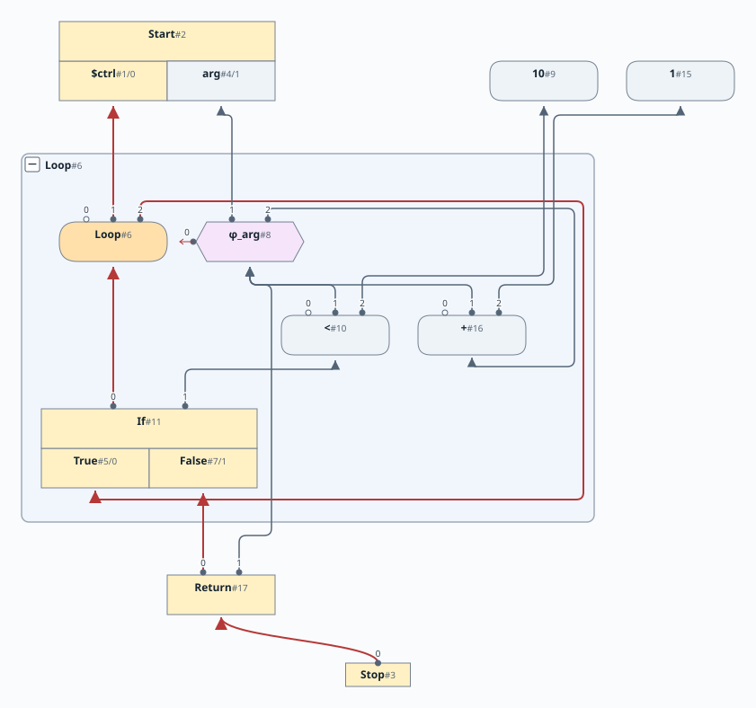
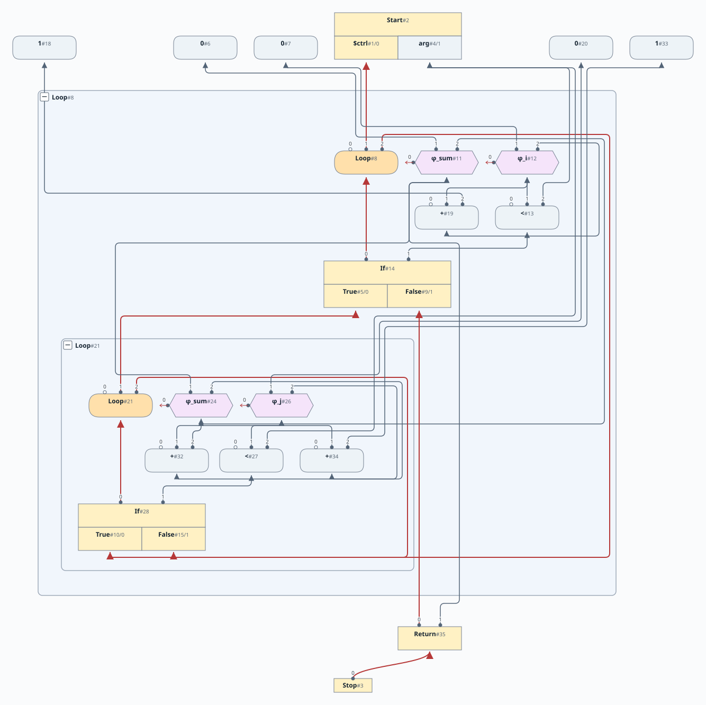
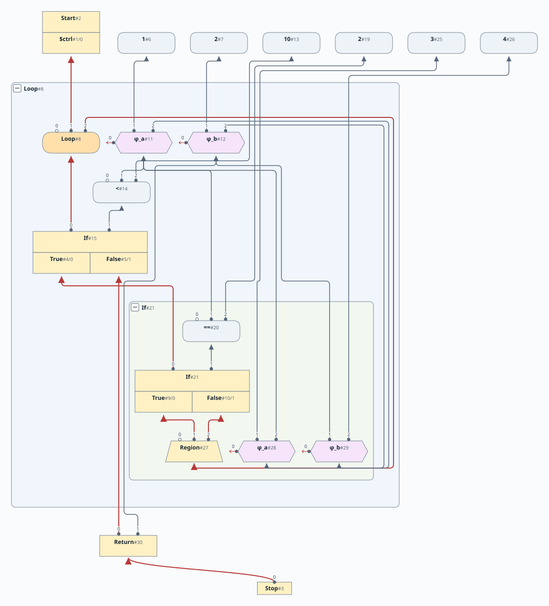

# 第7章: While 文

[English](README.md) | 日本語

この文書は [原文](README.md) の日本語訳です。

[前の章: 第6章](../chapter06/README.ja.md) |
[次の章: 第8章](../chapter08/README.ja.md)

# 目次

1. [バックエッジの扱い](#バックエッジの扱い)
2. [新しいノード型](#新しいノード型)
3. [詳細な手順](#詳細な手順)
4. [可視化](#可視化)
5. [入れ子のループ](#入れ子のループ)
6. [If を内包するループ](#if-を内包するループ)

[linear](https://github.com/SeaOfNodes/Simple/tree/linear) ブランチの直線的な Git のリビジョン履歴で [この章](https://github.com/SeaOfNodes/Simple/tree/linear-chapter07) を読み、前の章と [比較](https://github.com/SeaOfNodes/Simple/compare/linear-chapter06...linear-chapter07) することもできます。

この章では `while` 文を導入します。

この章の [完全な言語文法](07-grammar.ja.md) はこちらです。

## バックエッジの扱い

ループ構造によって生じる難しさは、反復時に変数がループ本体へ戻ってくることです。たとえば、次のコードです。

```java
while(arg < 10) {
    arg = arg + 1;
}
return arg;
```

変数 `arg` にはループ本体内で新しい値が代入され、その値がループ本体へ戻ります。

一般に、ループ構造を次のように書き換えます。

```java
loop_head:
if( !(arg < 10) )
    goto loop_exit;
arg = arg + 1;
goto loop_head;

loop_exit:
```

これは説明のためのもので、この言語にはラベルや `goto` 文はありません。

SSA[^1] の観点では、`arg` が戻ってくるため、先頭に `phi` ノードが必要です。概念的には、次のような結果にしたいのです。

```java
// arg1 represents incoming arg
//
loop_head:
arg2 = phi(arg1, arg3);
if( !(arg2 < 10) )
    goto loop_exit;
arg3 = arg2 + 1;
goto loop_head;

loop_exit:
```

`arg2` の phi が `arg3` を参照することに注目してください。`while` ループの条件を解析する時点では、`arg3` はまだわかりません。常に SSA 形式である Sea of Nodes グラフを正しく構築するために解決すべき問題の核心は、ここにあります。

[第5章](../chapter05/README.ja.md) を思い出してください。`if` 文の解析では、`if` の条件を過ぎるときにシンボルテーブルを複製します。後で2組のシンボルテーブルを `Region` でマージし、`if` 文の2つの分岐内で定義が変わったすべての名前に phi を作ります。`if` 文の場合、マージする定義がすでにわかっているマージ地点で phi を作ります。

ループ構造に対する基本的な考えは、ループ本体内でどの名前が再定義されるかわからないため、ループの `if` 条件に入る *前に*、シンボルテーブル内のすべての名前に対して積極的に phi を作ることです。ループが終わると、さかのぼって不要な phi を削除します。これを「eager phi（先行生成する phi）」方式と呼びます。[^2]

[第8章](../chapter08/README.ja.md) では、名前の再定義に遭遇したときだけ phi を作る「lazy phi（遅延生成する phi）」方式を実装します。

## 新しいノード型

ノードの一覧は [第5章](../chapter05/README.ja.md) と同じですが、必要な追加ロジックの一部をより適切にカプセル化するため、`Region` のサブタイプ `Loop` を作ります。Loop と Phi のピープホール最適化では、バックエッジが必要な書き換えを、ループ本体の解析が完了するまで延期します。ほかのノードは通常どおり最適化を続けます。

## 詳細な手順

1. まず、`Region` の新しいサブクラス `Loop` を作ります。`Loop` は2つの制御入力を取ります。最初は入口、すなわち `$ctrl` の現在の束縛です。2つ目（`null`）は、ループ解析後に設定するバックエッジのためのプレースホルダーです。バックエッジの欠如は、Loop と対応する Phi が未完成であることを示します。そのため、それらのピープホール最適化は、各書き換えに必要な入力がそろうまで待ちます。

    ```java
    ctrl(new LoopNode(ctrl(),null).peephole());
    ```

   新しく作った Region が現在の制御になります。

2. 現在の Scope ノードを複製します。スコープ内のすべての階層のシンボルを複製し、`$ctrl` の束縛を除くすべてのシンボルに phi を作ります。

    ```java
    // Make a new Scope for the body.
    _scope = _scope.dup(true);
    ```

   `dup` の呼び出しに引数 `true` を渡すことに注目してください。これが phi の作成を引き起こします。`dup()` メソッドで phi を作るコードを次に示します。

    ```java
    // boolean loop=true if this is a loop region

    String[] names = reverseNames(); // Get the variable names
    dup.add_def(ctrl());      // Control input is just copied
    for( int i=1; i<nIns(); i++ ) {
       if ( !loop ) { dup.add_def(in(i)); }
       else {
          // Loop region
          // Create a phi node with second input as null - to be filled in
          // by endLoop() below
          dup.add_def(new PhiNode(names[i], ctrl(), in(i), null).peephole());
          // Ensure our node has the same phi in case we created one
          set_def(i, dup.in(i));
       }
    }
    ```

   `else` ブロック内では、複製したスコープと元のスコープの両方に同じ phi ノードを設定します。

3. 次に、通常の if とほぼ同じように `if` 条件を設定します。

    ```java
    // Parse predicate
    var pred = require(parseExpression(), ")");
    // IfNode takes current control and predicate
    IfNode ifNode = (IfNode)new IfNode(ctrl(), pred).<IfNode>keep().peephole();
    // Setup projection nodes
    Node ifT = new ProjNode(ifNode, 0, "True" ).peephole();
    ifNode.unkeep();
    Node ifF = new ProjNode(ifNode, 1, "False").peephole();
    ```

4. 現在のスコープをもう一度複製します。これはループ終了後に生き続ける出口スコープなので、出口スコープの `$ctrl` を `False` 射影に設定します。出口スコープは、ループの条件式の副作用も取り込みます。

    ```java
    // The exit scope, accounting for any side effects in the predicate
    var exit = _scope.dup();
    exit.ctrl(ifF);
    ```

5. 制御を `True` 射影に設定し、ループ本体を解析します。

    ```java
    // Parse the true side, which corresponds to loop body
    ctrl(ifT);              // set ctrl token to ifTrue projection
    parseStatement();       // Parse loop body
    ```

6. ループ本体の解析後、先ほど作ったすべての phi に戻って処理します。

    ```java
    // The true branch loops back, so whatever is current control gets
    // added to head loop as input
    head.endLoop(_scope, exit);
    ```

   `endLoop` メソッドは、ループ Region の2つ目の制御をバックエッジの制御に設定します。続いてすべての phi をたどり、それぞれの2つ目のデータ入力をループ本体の対応する項目に設定します。使われなかった phi はピープホール最適化され、元の入力に置き換わります。

    ```java
    Node ctrl = ctrl();
    ctrl.set_def(2,back.ctrl());
    for( int i=1; i<nIns(); i++ ) {
       PhiNode phi = (PhiNode)in(i);
       assert phi.region()==ctrl && phi.in(2)==null;
       phi.set_def(2,back.in(i));
       // Do an eager useless-phi removal
       Node in = phi.peephole();
       if( in != phi )
          phi.subsume(in);
    }
    ```

7. 最後に、最初の元のスコープ（head）と、本体用に作った複製の両方を削除します。出口では false の制御が現在の制御（手順4）であり、出口スコープを現在のスコープに設定します。

   ```java
   // At exit the false control is the current control, and
   // the scope is the exit scope after the exit test.
   return (_scope = exit);
   ```

### 可視化

上の例の途中の状態を次に示します。



* ループ先頭、出口、本体の3つの Scope を示しています。それぞれの `$ctrl` の束縛は Loop、False、True を指します。

最終的なグラフは次のようになります。



## より複雑な例

### 入れ子のループ

```java
int sum = 0;
int i = 0;
while(i < arg) {
    i = i + 1;
    int j = 0;
    while( j < arg ) {
        sum = sum + j;
        j = j + 1;
    }
}
return sum;
```



### If を内包するループ

```java
int a = 1;
int b = 2;
while(a < 10) {
    if (a == 2) a = 3;
    else b = 4;
}
return b;
```



[^1]: Cytron, R. et al (1991).
    Efficiently computing static single assignment form and the control dependence graph, in ACM Transactions on Programming Languages and Systems, 13(4):451-490, 1991.

[^2]: Click, C. (1995).
    Combining Analyses, Combining Optimizations, 103.
