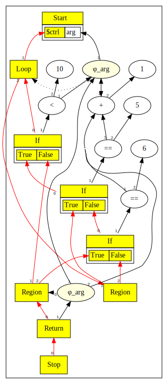
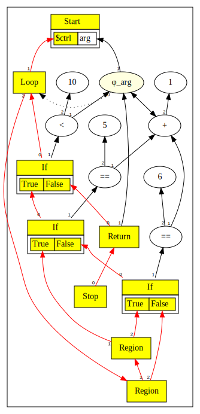
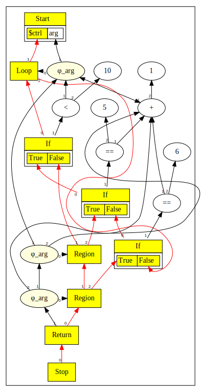

# Chapter 8: Lazy Phis, Break, Continue, and Evaluator

# Table of Contents

1. [Lazy Phi Creation](#lazy-phi-creation)
2. [Continue statement](#continue-statement)
3. [Break statement](#break-statement)
4. [Parser Considerations ](#parser-considerations)
5. [Identification of Basic Blocks in SoN graph](#identification-of-basic-blocks-in-son-graph)
6. [Examples](#examples)
   -[Example 1](#example-1)
   -[Example 2](#example-2)
   -[Example 3](#example-3)

7. [Sea of Nodes Graph Evaluator](#sea-of-nodes-graph-evaluator)

You can also read [this chapter](https://github.com/SeaOfNodes/Simple/tree/linear-chapter08) in a linear Git revision history on the [linear](https://github.com/SeaOfNodes/Simple/tree/linear) branch and [compare](https://github.com/SeaOfNodes/Simple/compare/linear-chapter07...linear-chapter08) it to the previous chapter.


In this chapter:

* We move from eager to lazy `Phi` creation in loops.
* We add support for `break` and `continue` statements.
* We implement a Sea of Nodes Graph Evaluator.

Here is the [complete language grammar](08-grammar.md) for this chapter.


## Lazy Phi Creation

In [chapter 7](../chapter07/README.md), we created `PhiNode`s for all variables
in the loop head eagerly.  This approach creates some unnecessary Phis but the
redundant Phis get cleaned up later.

In this chapter we add support for creating the `PhiNode`s lazily.

The main complication with creating `PhiNode`s lazily is that when we create a
Phi, it must be created in the innermost loop head scope where it would have
been created had we done it eagerly.  Since scopes get duped in `if` and
`while` statements, we cannot just create Phis in the current scope.

It turns out that the easiest way to create the `PhiNode`s lazily is to hook
them up to name lookup.  But how do we know that a Phi must be created when we
access a name?  We need a way to flag that a particular name mapping must be
converted to a `PhiNode` on lookup.

We do this as follows:

* In `ScopeNode.dup()`, if the Scope is being duplicated for a loop head, then
  instead of setting the name's definition to the original node, we set it to
  the Scope itself.  This acts like a sentinel.

    ```java
            // For lazy phis on loops we use a sentinel
            // that will trigger phi creation on update
            dup.addDef(loop ? this : in(i));
    ```

* Subsequently, when a lookup accesses a name, we notice that the def is set to
  the Scope node, and we create a `PhiNode` at this point.  The relevant
  implementation is in `ScopeNode.update()`.

    ```java
        if( old instanceof ScopeNode loop ) {
            // Lazy Phi!
            old = loop.in(idx) instanceof PhiNode phi && loop.ctrl()==phi.region()
                // Loop already has a real Phi, use it
                ? loop.in(idx)
                // Set real Phi in the loop head
                // The phi takes its one input (no backedge yet) from a recursive
                // lookup, which might have insert a Phi in every loop nest.
                : loop.setDef(idx,new PhiNode(name,loop.ctrl(),loop.update(name,null,nestingLevel),null).peephole());
            setDef(idx,old);
        }
    ```

* When we merge scopes, we ensure lazy `PhiNode` creation at the correct inner
  scope level by invoking lookup by name instead of directly accessing the
  defs.

    ```java
           if( in(i) != that.in(i) ) // No need for redundant Phis
                // If we are in lazy phi mode we need to a lookup
                // by name as it will trigger a phi creation
                setDef(i, new PhiNode(ns[i], r, this.lookup(ns[i]), that.lookup(ns[i])).peephole());
    ```

* Finally, in `ScopeNode.endLoop()` we clean up any leftover sentinels, replacing the sentinel with the input from loop head.

    ```java
        for( int i=1; i<nIns(); i++ ) {
            if( back.in(i) != this ) {
                PhiNode phi = (PhiNode)in(i);
                assert phi.region()==ctrl && phi.in(2)==null;
                phi.setDef(2,back.in(i));
                // Do an eager useless-phi removal
                Node in = phi.peephole();
                if( in != phi )
                    phi.subsume(in);
            }
            if( exit.in(i) == this ) // Replace a lazy-phi on the exit path also
                exit.setDef(i,in(i));
        }
    ```

## `continue` Statement

In chapter7, we had a single backedge from the loop's end flowing back to the
loop head.

With the addition of a `continue` statement, we can have multiple backedges
flowing back to the loop head.

We have several ways of implementing these backedges.

1. The traditional way would be to let each backedge from `continue` merge into
   the loop head.  Phis would require as many inputs as there are edges.  The
   downside is now are Loops are not simply nested.  This makes it difficult to
   do many kinds of peephole-based loop optimizations, such as "partially
   rolling" the loop to allow more loop invariants to get hoisted.
2. An alternative is collect all `continue`s at a single merge point (`Region`)
   and then create a single backedge flowing from the continue `Region` to the
   loop head.
3. A third approach is to create a stack of continue `Region`s rather than a
   single continue `Region`.  This has the benefit of keeping our Phis simple
   with just two inputs as they are now, whereas the other approaches require
   Phis with more than 2 inputs.  On the other hand we end up with as many
   continue `Region`s as there are `continue` statements, and corresponding
   Phis that are stacked.

In this chapter we adopt option 3 as it is the simplest implementation on top
of our basic `while` loop architecture.  We also experimented with
option 2.  For readers who would like to see this alternative solution, we
provide a separate branch with such an implementation.

The implementation requires some careful handling of scopes.  This is because
we would like to only generate `PhiNode/RegionNode`s for continues if necessary.

In our [basic loop architecture](../chapter07/README.md), by the time we get to
the loop backedge, we have already exited all nested blocks/scopes, we just
need to stitch together the current scope+ctrl into the Loop scope+ctrl and
create `PhiNode`s as needed.

A `continue` however, can occur inside nested scopes (such as nested `if`
statement).  Since we want to lazily create the continue `Region`, the first
time we see a `continue`, we need to dupe the head scope and merge the current
scope into it to generate a continue Scope and `Region`.  Subsequently, when we
see another `continue`, we need to construct a new `Region` and merge the
previous continue Scope with the current Scope.

The implementation is a variation of above.

* The first `continue` triggers a dupe of the current scope; we prune any
  nested lexical scopes deeper than the head scope, removing any name bindings
  that were not visible in the head scope.  This is essentially ensuring that
  we "exit" any nested scopes.

    We set the continue scope initially to null.

    ```java
        // No continues yet
        _continueScope = null;
    ```
    When we parse continue, the first time `_continueScope` is null.

    ```java
        private Node parseContinue() { return (_continueScope = require(jumpTo( _continueScope ),";"));  }

        private ScopeNode jumpTo(ScopeNode toScope) {
            ScopeNode cur = _scope.dup();
            ctrl(new ConstantNode(Type.XCONTROL).peephole()); // Kill current scope
            // Prune nested lexical scopes that have depth > than the loop head
            // We use _breakScope as a proxy for the loop head scope to obtain the depth
            while( cur._scopes.size() > _breakScope._scopes.size() )
                cur.pop();
            // If this is a continue then first time the target is null
            // So we just use the pruned current scope as the base for the
            // continue
            if (toScope == null)
                return cur;
            // toScope is either the break scope, or a scope that was created here
            assert toScope._scopes.size() <= _breakScope._scopes.size();
            toScope.mergeScopes(cur);
            return toScope;
        }
    ```

* The continue scope becomes the base scope for the subsequent `continue`
  statement, thus forming a stack of continue scopes/regions.
* After the loop is done, if we find that a continue scope was created within
  the loop, we must merge the current scope into the continue scope, and make
  the continue scope the active scope.

    ```java
        // Merge the loop bottom into other continue statements
        if (_continueScope != null) {
            _continueScope = jumpTo(_continueScope);
            _scope.kill();
            _scope = _continueScope;
        }
    ```

## `break` Statement

Implementing `break` is simpler than `continue`, because the exit scope is
created before we parse the loop body, and this becomes the initial `break`
scope.  When we see `break`, we merge the current scope, after pruning any
nested lexical scopes, to the current break scope, and the resulting new scope
becomes the active break scope.

## Parser Considerations

Since a `continue` or `break` targets the immediate surrounding `while` loop,
we maintain a stack of the `continue` and `break` scopes.  This is done by
saving the previous `continue` or `break` scope before parsing a `while` loop
and restoring afterward.

## Examples

### Example 1

```java
while(arg < 10) {
    arg = arg + 1;
    if (arg == 5)
        continue;
    if (arg == 6)
        break;
}
return arg;
```




### Example 2

```java
while(arg < 10) {
    arg = arg + 1;
    if (arg == 5)
        continue;
    if (arg == 6)
        continue;
}
return arg;
```



### Example 3

```java
while(arg < 10) {
    arg = arg + 1;
    if (arg == 5)
        break;
    if (arg == 6)
        break;
}
return arg;
```




## Sea of Nodes Graph Evaluator

The evaluator directly evaluates the given graph by walking forward through the control flow from the program start until it either encounters a Return node or it passes the maximum loop count.

When called, the evaluator sets itself up by first traversing the graph to find the Start node. Then, if a program uses the special `arg` parameter, the passed-in parameter value will be bound to the node that represents it.

With that brief setup done, the control projection from the Start node is traversed and the program can begin "execution".

At this point, control flow is at the first region of the program, but it is treated just the same as any other region. There are two things that must be done at each region. First, resolve all phis to a specific value; and second to determine where control flow will continue to.

It may seem like more than that should be done, but by resolving phi nodes, any logic that is specific to the control flow path for the given will be resolved. Any other work will eventually be resolved later on as-needed. This is sufficient for the program to run!

Finding the next place control flow will move to after a region is straightforward because any region only has a single control node that uses it. So we search for that node in the Region's users.

Once we have that node, our behavior depends on what type of control flow node we've landed on. There are only 3 options: `RegionNode`, `IfNode`, and `ReturnNode`. If it is another `RegionNode`, we do the same again. If it's a `ReturnNode`, we can resolve the returned expression and return the program's value. Finally, for an `IfNode`, we must first resolve the test expression so that we can choose the false (projection 0) or true (projection 1) branch. Whichever projection from the `IfNode` is chosen, we step through that projection on to the control node (a `RegionNode`) that uses it.

We talk about resolving nodes above, but what does that mean? A node will either have a value (for instance a constant), will already be resolved with the resolved value cached, or it will operate on nodes that it uses, which must be resolved. Once a node's inputs are resolved, its operation may be performed on them. For instance, an `AddNode`'s value will be the sum of its two inputs. Once the value is resolved, the resolved value is returned.

With that, a simple non-looping program can be evaluated.

Looping is almost functional with that, too, with only a couple of small extra details. Whenever control moves through a `LoopNode`, the evaluator checks that it hasn't run out of loop iterations. If it has, a timeout RuntimeException will be thrown.

Finally, while calculating the value of `PhiNode`s in the loop region, we must be careful to compute all of their new values before we update any of their cached values. That's because as a loop iterates, we must ensure that all `PhiNode` values are consistently the value from the same point in time. Once all of the new values are calculated, we can update the cache for all of them at once. To illustrate this, consider the following code:

```java
t = 0;
while(arg < 10) {
    t = arg;
    arg = arg + 1;
}
return t;
```

In this code, the two statements within the loop may be evaluated in either order by the graph, so we must ensure that the new value `arg` is not cached before the value of `t` can be set to the previous value of `arg`.

This approach to evaluation is useful for testing because it allows a program to be executed without worrying about instruction selection, register allocation or code generation. It can execute on any valid Sea of Nodes graph, as well, so execution results of unoptimized code can be checked against the results of optimized code! This fact lends itself to some interesting automated / regression testing ideas. For instance, the result of execution could be checked after every optimization step, possibly helping isolate some types of errors.

``` java
arg=arg+arg;
arg=arg+arg;
...
arg=arg+arg;
return arg;
```

On the other hand, this engine is not designed to be particularly fast! Because not all expressions are cached, it's possible to construct programs like the preceeding one which have exponential runtime.
