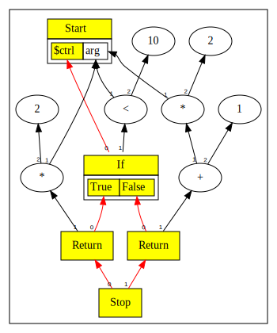
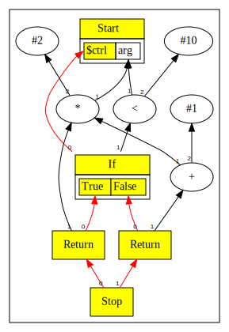
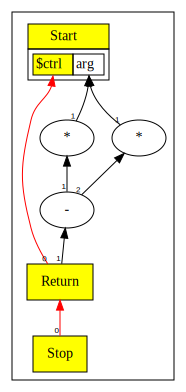
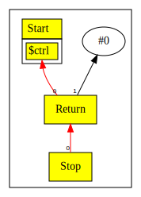
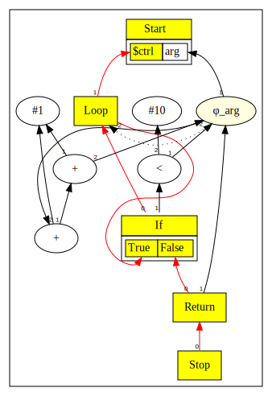
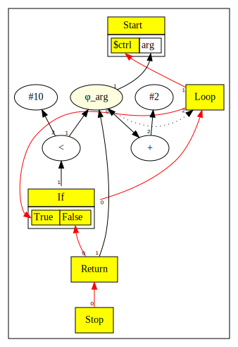

# Chapter 9: Global Value Numbering and Iterative Peepholes

# Table of Contents

1. [Engineering Peepholes](#engineering-peepholes)
2. [Global Value Numbering](#global-value-numbering)
3. [Post-Parse Iterative Peepholes](#post-parse-iterative-peepholes)
4. [Distant Neighbors](#distant-neighbors)
5. [Identification of Basic Blocks in SoN graph](#identification-of-basic-blocks-in-son-graph)
6. [Other Concerns](#other-concerns)
7. [Common SubExpressions via GVN](#common-subexpressions-via-gvn)
    - [Example 1](#example-1)
    - [Example 2](#example-2)
8. [Post Parse Iterative Optimizations](#post-parse-iterative-optimizations)

You can also read [this chapter](https://github.com/SeaOfNodes/Simple/tree/linear-chapter09) in a linear Git revision history on the [linear](https://github.com/SeaOfNodes/Simple/tree/linear) branch and [compare](https://github.com/SeaOfNodes/Simple/compare/linear-chapter08...linear-chapter09) it to the previous chapter.

In this chapter:

* We add Global Value Numbering (Common Subexpression Elimination)
* We add a post-parse iterate-peepholes-to-fixed-point optimization

No language changes in this chapter, just adding optimizations.


## Engineering Peepholes

The goal for Ch 9 is to "finish out" the Peepholes.  Not that no more peeps will
appear, on the contrary lots will - but this is the infrastructure to organize
them, engineer them safe and sane; to apply them until a fixed point is reached.

Really the goal here is to be fearless about adding a new peephole; if you got
it wrong you'll assert pretty fast.  If you got it right, that new peep will
just run alongside all the others and they will all mutually benefit each other.


## Global Value Numbering

Global Value Numbering works via a classic hash table, hashing on a Node's
opcode and inputs.  If two Nodes do the same function on the same inputs, they
get the same result - and can be shared.

* We add a global static hash table `GVN` in Node.
* We add a `Node.equals` call.  Two Nodes are equals if they have the same
  opcode - same Java class - on the same inputs.
* We add a `hashCode` on the Node opcode (proxy: Node string name) and inputs.
* `ConstantNode` and a few others need some extra custom bits here: the
  constant 17 is not the same as 99, but both are the same `ConstantNode` class
  and label.  The `eq` and `hash` calls check (or hash) these extra bits.

Since we edit the graph a lot, Nodes can have their inputs change which changes
their hash which means they can't be found in the GVN table.  E.g. we swap out
the `Add` for a `Con` in:

    (Mul (Add 4 8) x) // Fold the constant
    (Mul    12     x) // The `Mul` changes hash and inputs

The fix for this is to require Nodes NOT be in the `GVN` table when their edges
modify; they need some sort of "edge lock".  If "edges are locked", we need to
remove the Node from `GVN` first, before modifying the edges.

* We use the `_hash` field as both a cached hash code and as the edge lock.  If
  zero the Node is unlocked and NOT in `GVN`.  If non-zero, the Node is
  "edge-locked" and IS in `GVN`.
* The `hashCode` function uses the cached hash if available and disallows an
  accidental zero hash.
* We add a `unlock()` call to remove a Node from `GVN` before any edge is
  changed.  This is inserted in front of all calls which hack Node edges.  All
  edge modify code paths already ensure the Node is re-peepholed, and during
  this revisit the Node will get re-inserted in the `GVN` table.

This new `GVN` table is used in `peepholeOpt()` (and `peephole()`) to look for common
subexpressions on every peephole'd Node.  If the Node has a zero hash, we look
for a hit against some previous identical Node.  If found, we use the prior
Node and dead-code-eliminate this one.  If not found, we insert this Node
into `GVN` as the "golden instance".  If a Node already has a non-zero hash
we know it IS the "golden instance" and do not need to look in `GVN`.

This entire optimization takes about a dozen lines in `iter()`, plus the common
shared `equals` and `hashCode` (about 50 more lines counting comments).

One of our invariants is that Types monotonically increase while running
peepholes.  GVN can break this briefly: of the two equivalent Nodes one has
already had its `_type` lifted but not the other.  Depending on which of the
two Nodes is kept, we might choose the Node with the "lower" `_type`.  This is
"lower" in the Type lattice sense.  Both types must be correct, and a
`compute()` call on both nodes must produce the same Type, which must be equal
to the JOIN.  A fix is to compute a JOIN (not a MEET) over the two Nodes' types.


## Post-Parse Iterative Peepholes

The post-Parse `IterPeeps` iterates the peepholes to a fixed point - so
no more peepholes apply.  This should be linear because peepholes rarely
(never?)  increase code size.  The graph should monotonically reduce in some
dimension, which is usually size.  It might also reduce in e.g. number of
MulNodes or Load/Store nodes, swapping out more "expensive" Nodes for cheaper
ones.

The theoretical overall worklist is mindless just grabbing the next thing and
doing it.  If the graph changes, put the neighbors on the worklist.  Lather,
Rinse, Repeat until the worklist runs dry.

The main issues we have to deal with:

* Nodes have uses; replacing some set of Nodes with another requires more graph
  reworking.  Not rocket science, but it can be fiddly.  Its helpful to have a
  small set of graph munging utilities, and the strong invariant that the graph
  is stable and correct between peepholes.  In our case `Node.subsume` does
  most of the munging, building on our prior stable Node utilities.

* Changing a Node also changes the graph "neighborhood".  The neigbors need to
  be checked to see if THEY can also peephole, and so on.  After any peephole
  or graph update we put a Nodes uses and defs on the worklist.

* Our strong invariant is that for all Nodes, either they are on the worklist
  OR no peephole applies.  This invariant is easy to check, although expensive.
  Basically the normal "iterate peepholes to a fixed point" is linear, and this
  check is linear at each peephole step... so quadratic overall.  Its a useful
  assert, but one we can disable once the overall algorithm is stable - and
  then turn it back on again when some new set of peepholes is misbehaving.
  The code for this is turned on in `IterPeeps.iterate` as `assert
  progressOnList(stop);`


## Distant Neighbors

For some peepholes the "neighborhood" is farther away than just the immediate
uses or defs, and for these we need a longer range plan.  E.g. some peephole
inspects "this -> A -> B -> C" and will swap itself for "D"; however it fails
some test at "B".  Should "B" ever update we want to revisit "this" and recheck
his peepholes.  So we will need to record a dependence of "this" in "B".
Updating "B" throws the dependent list ("this") onto the "todo" list.

An example of a distant neighbor check is in `AddNode`, where we check for
stacked constants: `(Add (Add x 2) 1)` and we'd like `(Add x 3)` instead.
Suppose we're doing this check and we find instead `(Add (Phi (Add x 2) self)
1)` The check naturally bails out at the `Phi` since its not an `Add`, but the
`(Phi y self)` only has one unique input, and will itself peephole to `y`
eventually.  When it does, our stacked `Add` peephole can apply.  So the
failing Add peephole calls `phi.addDep(Add)` and registers a dependency on the
`Phi`.  If the `Phi` indeed later optimizes, we add its depencencies (e.g. the
`Add`) back on our `IterPeeps` worklist and retry the stacked Add peephole.

The general rule is:
* **If a peephole pattern inspects a remote node, it must go on the dependency list!**
* `node.in(1).in(2)` becomes `node.in(1).in(2).addDep(node)`


In this chapter we trigger on following patterns

* Some peeps interact with `Phi` inputs; this can be direct or indirect,
  e.g. `(Add Add( (Phi x) 2 ) 1)`.  The peep can progress if all of the `Phi`'s
  inputs are `Constant`'s.  Thus, we make the node a dependent on the `Phi`'s
  input.  We also make the node a dependent of the `Phi`'s region.  See
  `Node.allCons()` and `PhiNode.allCons()`.
* The pattern `(Add (Add x 1) 2)` adds the outer `Add` as dependency of `x`
  because `x` becoming a constant would enable progress.  See
  `AddNode.idealize()`
* When computing a `Phi`'s type, if we observe that the associated region's
  corresponding control is live, we add the `Phi` as a dependent of the
  region's control input, because if that control goes dead, it would allow the
  `Phi` to undergo peephole.  See `PhiNode.compute()` and
  `PhiNode.singleUniqueInput()`.

Changes:

* We add a `ArrayList<Node> _deps` field to Node; initially null.
* Some peepholes (see above) add dependencies if they fail a remote check, by calling
  `distant.addDep(this)`.  The `addDep` call creates `_deps` and
  filters for various kinds of duplicate adds.
* The `IterPeeps` loop, when it finds a change, also moves all the
  dependents onto the worklist.


## Other Concerns

There are more issues we will want to deal with in a later Chapter:

* Blindly running peepholes in any order has some drawbacks:

  - Dead and dying stuff might get peepholes done... and then die.  Wasted work.
  - Dead infinite loops often lead to infinite peephole cycles... if only we
    would get around to working on the "base" of the dead loop it would fold
    up.
  - Some peepholes naturally reduce the graph directly; while some keeps its
    size the same but reduce other things (e.g. swapping a Mul-by-2 with a
    Shift), and we might end up with a few which try to grow the graph briefly
    before collapsing.

* All this means is there's some benefit to running peepholes that reduce the
  graph directly (e.g. Dead Code Eliminate), before running peeps that reduce
  other things, before running all other peeps.  This implies a sorted
  worklist, but the count of unique orders is really limited - a radix sort is
  all that is needed.  We'll have to break up the peepholes into some
  categories like
  - "strictly reducing" vs
  - "same Nodes but swapping e.g. `Mul` for `Shift`, vs
  - getting more freedom (edge bypass), vs
  - "grow now because shrink later" (inlining lands in this camp).

* Also there's a benefit to not always grabbing from either end of the list -
  many peep patterns might go quadratic if approached from one end or another,
  because they modify something then push it back onto the list where it
  immediately gets pulled again.  I.e., you end up spinning in a loop repeating
  the same peeps while slowly migrating a e.g. left-spine add-tree into a
  right-spine add-tree.  A psuedo-random pull uses randomization to defeat bad
  peep patterns.

* Why isn't `IterPeeps` just passing over all of the Nodes once or twice,
  instead of using a worklist with the `addDeps` mechanism?  We could even
  visit them in a defs-before-uses order (e.g. Reverse Post Order).

  In the absense of loops exactly one such pass will find all local peepholes,
  and indeed the Parser already does this.  However, this will fail to find
  opportunities at loops and farther remote cases - and to get those peepholes
  around loops will require another visit.  It is easy to construct a case
  requiring O(N) passes, each of cost O(N) and the algorithm quickly goes
  quadratic.

  The `addDeps` solution avoids this quadratic cost, in exchange for some more
  costs in writing peepholes.


# Examples

## Common SubExpressions via GVN

### Example 1

Here is a small example that illustrates how GVN enables finding common sub-expressions.

```java
int x = arg + arg;
if(arg < 10) {
    return arg + arg;
}
else {
    x = x + 1;
}
return x;
```

Prior to GVN, this would result in following graph. Note that the `arg+arg` is translated to `arg*2`.



Adding GVN, we get below. Note how the `arg*2` expression is now reused rather than appearing twice.



### Example 2

Being able to reuse common expressions, enables additional optimizations. Here is a simple example:

```java
return arg*arg-arg*arg;
```

Without GVN the peepholes cannot see that both sides of the subtraction have the same value.



- Each multiplication(*) node has two edges going to `arg`. 
- In the example above, we fused them to make the graph more readable.

With GVN, the peepholes can do a better job:



## Post Parse Iterative Optimizations

The worklist based post parse optimization enables certain optimizations that are not available
during parsing. For example:

```java
int step = 1;
while (arg < 10) {
    arg = arg + step + 1;
}
return arg;
```

While parsing the `while` loop it is not yet known that `step` is a constant and will not change. Therefore,
without the post parse optimization we get following:



Enabling the post parse worklist based optimization yields below. Notice that now the graph shows `arg+2` inside the
loop body:


