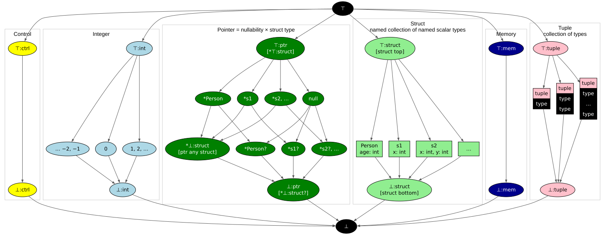
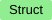
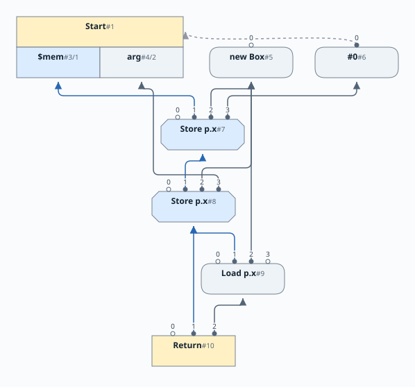
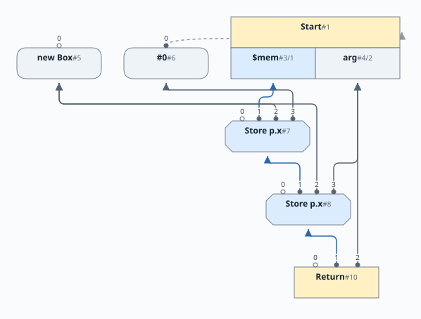

# Chapter 10: Structs and Memory

English | [日本語](README.ja.md)

[Previous: Chapter 9](../chapter09/README.md) |
[Next: Chapter 11](../chapter11/README.md)

This chapter adds user-defined structs, pointers, allocation, field loads and
stores, and null checking. It also introduces an evaluator that executes the
graph, including its memory effects. The [grammar](10-grammar.md) is the
same in Chapters 10 and 11; the next chapter improves the memory representation.

## References

Structs are a collection of named and typed fields; very classically similar to
C or Java.  New structs are made with the `new` keyword; this allocates memory
and produces a reference.  Freeing memory awaits a later chapter.  Fields are
accessed with the `.` notation.  The fields can hold any scalar value,
including reference to other structs and be mutually recursive.  Any reference
field can allow null or not, same as a normal variable.

```java
struct Person {
   String last;    // Last name, must exist
   String? middle; // Optional middle name
   int age;
};
```

Here we have fields `last`, a not-null final String, and `middle` a nullable
and final String, and an `int age`.  Like all `int` declared fields, it is
mutable.  Later chapters will allow both mutable reference fields and immutable
integer fields; for now this choice covers most of the common ground.

You have to have a reference to get at the fields, static fields are added in a later chapter.

All field references have to be against not-null pointers, and this is directly
checked in the type system.  I.e., Simple disallows null-pointer-exceptions by
design.  Some examples of null checking before using:

```java
print(ptr.age); // ERROR!  ptr might be null

if( ptr ) print(ptr.age); // Test before use

// Field use can be far removed, as long as the check dominates
if( ptr ) { 
    S1;   // Other statements
    while( other ) { ...ptr.age... } 
}; 
```

Allocation, as well as Stores, means we now have memory effects to deal with.


## One memory value

Arithmetic nodes depend on the values they use, similarly a load also depends
on when it observes memory.  In this chapter every store consumes the preceding
memory state and produces the next one, and a load consumes memory without
changing it.  This makes the source program's memory ordering explicit in the
graph.

```java
struct Point { int x; int y; }
Point p = new Point;
p.x = 3;
p.y = arg;
return p.x;
```

`NewNode` produces the pointer. The parser emits stores of zero for both fields,
then stores 3 into `x` and `arg` into `y`. The final load observes the memory
after the `y` store. We deliberately keep that dependency here, even though
different fields are independent. Chapter 11 will remove it.


The graphs show dependencies before local folding.  To focus on memory, remove
most control edges leaving behind minimal True/False nodes when merges are
important.  Also, the layout shows dependencies, not an execution schedule.

| Node     | Inputs | Result |
|----------|---|---|
| `New`    | Control and a struct type | A fresh, non-null object pointer |
| `Store`  | Memory, pointer, field name, value | The updated whole-memory state |
| `Load`   | Memory, pointer, field name | The value of the field |
| `Start`  | External entry | Control, initial memory, and `arg` |
| `Return` | Control, memory, result | Completion with all preceding effects retained |

For nodes consuming or producing both control and memory, control occupies slot
0 and memory slot 1. Start's outputs are `{ctrl, $mem, arg}`; Return's inputs
are `{ctrl, $mem, result}`.

The memory edge is a dependency, not a copy of the heap.  The graph determines
the legal execution order.  In hardware, a Store updates physical memory
directly.  In the evaluator, a Store updates an object's attached memory array.

## Memory is an SSA variable

The parser keeps one hidden binding named `$mem`. Source identifiers cannot
contain `$`, so user code cannot name it.  Reading and updating memory uses the
same `ScopeNode` lookup and update operations as a local variable.

For an `if`, the two branches can finish with different memory values. An
ordinary Phi selects the memory from the branch that executed:

```java
struct Point { int x; int y; }
Point p = new Point;
if( arg ) p.x = 3; else p.x = 4;
return p.x;
```


Loops reuse Chapter 8's lazy Phi construction. Reading or updating `$mem` in a
loop creates an initially incomplete memory Phi. Closing the loop supplies its
backedge. `break`, `continue`, nested loops, and early returns use the same scope
mechanics as scalar variables.

```java
struct Point { int x; int y; }
Point p = new Point;
while( arg ) {
    p.x = arg;
    arg = arg-1;
};
return p.x;
```


Every Return consumes the current whole-memory value. This keeps stores alive
even when the returned scalar does not depend on them, or when the program
returns the modified object itself.

## Enhanced Type Lattice

The Type Lattice for Simple has a major revision in this chapter.



The diagram uses `⊤` for **top** and `⊥` for **bottom**. A suffix names the
domain: `⊤:struct` is *struct top*, while the bare `⊤` is global top. In the
prose we use those words; in code examples we use the actual Java constants.
The implementation's `$TOP` and `$BOT` names need not appear in the diagram:

| Diagram | Prose | Java constant | Internal struct name |
|---|---|---|---|
| `⊤:struct` | struct top | `TypeStruct.TOP` | `$TOP` |
| `⊥:struct` | struct bottom | `TypeStruct.BOT` | `$BOT` |

Edges in this diagram show lattice order, with top above bottom.  Boxes
containing an ellipsis abbreviate further parallel alternatives; they are not
extra union types. Field and tuple-element type lattices are elided in the
diagram.  Field types can be any scalar type (Integer or Pointer), Tuple types
can be *any* lattice type, including Control and Memory.

Within the type lattice, we now have the following domains:

*  represents control flow: unreachable control
  at control top, and reachable control at control bottom.
*  has integer top, integer bottom, and parallel
  constants between them. The ellipses stand for the other integer constants.
*  (new) combines a struct type with nullability.
  * The prefix `*` means pointer-to: `*Person` is a non-null pointer to a Person.
    The suffix `?` includes null, so `*Person?` permits a Person pointer or null.
  * The pointer domain contains the whole struct lattice twice, once without
    null and once with it. The diagram expands named alternatives in both
    copies. It is not just two individual pointer types.
  * `null` combines struct top with the nullable flag: it has no non-null
    object alternative. The diagram labels it `*⊤:struct?` as well as `null`.
  * A pointer to struct bottom can point to any struct. The diagram shows the
    non-null form as `*⊥:struct` and the nullable form as `*⊥:struct?`.
    The latter is pointer bottom; pointer top is `*⊤:struct`.
  * Null evaluates to false; non-null pointers evaluate to true.

  > C analogy: the non-null pointer to struct bottom is akin to `void *`, except
  > that C's `void *` may also be null. Simple names this constant
  > `TypeMemPtr.VOIDPTR` and prints it as `*void`. Struct bottom itself is the
  > common lower bound of struct types, not C's `void` type.

*  (new) represents user-defined named structs.
  Fields have integer types in this chapter.
  * Struct top lies above every named struct; struct bottom lies below every
    named struct. Top is the high/empty struct alternative, while bottom
    conservatively includes any struct name.
  * `Person`, `s1`, `s2`, and further names are parallel alternatives. There is
    no inheritance, so different named structs do not nest beneath one another,
    even if they have identical fields.
  * There is no fixed bound on the names a program can declare. The diagram's
    ellipsis stands for more named alternatives, not a distinguished unnamed
    struct. Each named box abbreviates its own field-type lattice.
*  (new) represents the whole-memory token.
  Memory top and memory bottom are `TypeMem.TOP` and `TypeMem.BOT`. Neither
  records the values stored in individual fields.
*  represents a collection of results from one node,
  such as Start's control, memory, and argument. The pink headers identify tuples
  of different lengths; each vertically stacked black `type` cell stands for
  the full type lattice again, including the possibility of another tuple.

We use the following operations on the lattice:

* **Meet** computes the greatest lower bound. For these examples, think of
  combining the alternatives represented by its inputs.
  * The meet of `Person` and `s1` is struct bottom. There is no separate type
    representing exactly those two names.
  * The meet of `*Person` and `*s1` is the non-null pointer to struct bottom.
  * The meet of `*Person` and `null` is `*Person?`.
  * The meet of the non-null pointer to struct bottom and `null` is pointer bottom.
  * The meet of `1` and `2` is integer bottom.
* **Dual** reflects the lattice about its centerline: top and bottom exchange
  places, and applying dual twice returns the original type.
  * Struct top and struct bottom are duals.
  * `null` and the non-null pointer to struct bottom are duals.
  * A pointer's dual also duals its struct's fields and flips nullability. Thus
    the dual of `*Person` is not generally the original `*Person?`: the field
    types must be dualed too. Those field details are omitted in the diagram.
* **Join** computes the least upper bound. It is defined through meet and dual:
  `JOIN(x,y) = MEET(x.dual(),y.dual()).dual()`.
  * The join of `Person` and `s1` is struct top.
  * The join of `*Person` and `*s1` is pointer top.
  * The join of the non-null pointer to struct bottom and `null` is pointer top.
  * The join of `1` and `2` is integer top.

As we construct the Sea of Nodes graph, we ensure that values stay inside the
domain they are created in - that is pointer fields will never contain integers
(obviously)... nor even the generic `TOP` and `BOT`.  There are a couple of
nuances worth highlighting.

* When Phis are created, the initial type of the Phi is based on the declared
  type of its first input.  This is a pessimistic type assignment because we do
  not yet know what other types will be met.

* When all the inputs of the Phi are known, we start with the local Top of the
  declared type, and then compute a meet of all the input types.  This
  computation results in a more refined type for the Phi.

## Parser Enhancements

In previous chapters the only available type was Integer.  Now, variables can
be of Integer type or pointer to Struct types.  To support this, the Parser now
tracks the declared type of a variable (used to only be Integer!).  The
declared type of a variable defines the set of values that can be legitimately
assigned to the variable.  The Sea of Nodes graph also tracks the actual type
of values assigned to variables, these type transitions are defined by the Type
lattice described in the previous section.

## Null Pointer Analysis

The Simple language syntax allows a pointer variable to be specified as
null-able - and it prevents ever throwing a Null Pointer Exception.  The
compiler decides if a null check is needed, and if needed and missing
the compiler rejects the program (asking the user to insert a null check).

When the Parser encounters conditions that test the truthiness of a pointer variable, it uses this knowledge to refine the type information in the branches that follow.

Here are two motivating examples:

```java
struct Bar { int a; }
Bar? bar = new Bar;
if (arg) bar = null;
if( bar ) bar.a = 1;
```

If `bar` is not `null` above, then we would like to allow the assignment to
`bar.a`.  If the final line lacked the null check, e.g. a plain `bar.a = 1;`,
then `Java` would compile this program but throw a NPE, and Simple rejects the
program pointing out a null check is required.


```java
struct Bar { int a; }
Bar? bar = new Bar;
if (arg) bar = null;
int rez = 3;
if( !bar ) rez=4;
else bar.a = 1;
```

If `bar` is `null` then we would like `!bar` to evaluate to `true`. In the else
branch we know `bar` is not null, hence the assignment to `bar.a` should be
allowed.

To enable this behaviour, we make the following enhancements.

* We track the null-ness of a pointer in the Type system, and hence in every
  Node that ptr type flows through.

* We "wrap" the predicate of an `If` node with an up-cast when we see that the
  predicate is a ptr value.  The up-cast removes the null possibility on the
  true branch making it legal to use the pointer.

* The up-cast uses a `Cast` with the non-null pointer to struct bottom
  (`TypeMemPtr.VOIDPTR`). It joins the original pointer type with that type,
  corresponding to `*⊥:struct` in the diagram. This JOIN operation preserves
  everything we already know about ptr, and also adds the new knowledge that
  the ptr is not-null.

* The up-cast is represented by the `CastNode` op, and if applicable, we
  replace all occurrences of the original predicate with the up-cast in the
  current scope.  The change is local to each branch of the `If`; occurring
  separately for the true and the false branches of the `If` (and the false
  branch inverts the predicate).

* The up-cast peepholes normally; if its input's type is a super type of the
  up-cast, then the `CastNode` can be removed. See `ScopeNode.upcast()` method,
  and `CastNode`.

* When computing a type for Not, we produce an Integer type when its input is a
  ptr.  When the input is a `null` we convert to `1` and when it is a non-null
  ptr value, we convert to `0`.  See `NotNode.compute()`.


## Local memory optimizations

A load immediately following a store to the **same pointer and field** can use
the stored value. We just wrote `arg` into `p.x`, so reading it back needs no
memory access:

```java
struct Box { int x; }
Box p = new Box;
p.x = arg;
return p.x;  // Can return arg directly.
```

| Before: read back the stored value | After: use the value directly |
|---|---|
|  |  |

Return's result input changes from the Load to `arg`, and the unused Load
disappears.  Return still consumes the Store's memory, so the write is retained.

A store immediately following another store to the same address can also
discard the earlier store when no other user needs it. That separate rewrite
can remove the zero-initialization store still shown above. Again, both the
pointer and field checks matter.

A load can also move up through a memory Phi. This extends
[Chapter 5's push-through-Phi optimization](../chapter05/README.md#pushing-addition-up-through-a-phi):
there, arithmetic folds on the incoming paths; here, a load can fold against a
matching store. "A Load of a Phi becomes a Phi of Loads".  In graph notation:

```text
Load(Phi(r, m0, m1), p.x)
    -> Phi(r, Load(m0, p.x), Load(m1, p.x))
```

The Phi of memory becomes a Phi of loaded values.  Since this peep increases
the overall Node count, the profit heurstic requires at least one Load to fold.
On a loop, that Load must be the **backedge**: folding only on entry would
leave a load that could be pushed around the cycle indefinitely.  As with the
arithmetic rewrite, exposing a fold is part of deciding to transform the
graph, not just a hoped-for cleanup afterward. See
[`LoadNode.idealize()`](../../src/main/java/com/seaofnodes/simple/node/LoadNode.java).

The reverse direction extends
[Chapter 5's common-operation pull-down](../chapter05/README.md#example-3):
"A Phis of Loads becomes a Load of a Phi".  A Phi of matching Loads or Stores
can become one operation after the join.  For example, these two writes:

```java
if (arg) s.x = arg+1;
else     s.x = arg+2;
```

can become `s.x = Phi(arg+1,arg+2)` and eventually `s.x = arg+Phi(1,2)`.  The
general rewrite creates a separate, correctly typed Phi for each differing
operand, including memory and pointers.  We must be more careful here with
memory ops; it is possible to lose some type precision, so we check for that as
part of the profitability.

Also, a Store must have no other users, so moving it removes the original
effect.  A Load must have no possible conflicting writes or memory merges among
its memory's users; otherwise delaying the read could change its value.  Much 
later, we will be adding anti-dependences, but for now we do a conservative
check.

### Missing an easy one

The single memory chain is correct but conservative.  A store to `y` can
prevent forwarding an earlier store to `x`, even when the objects are
identical.  This is a missed optimization and it motivates the next chapter.

## Executing the graph

The evaluator includes a small late scheduler. A load must execute before a
later store that consumes the same memory definition, even though there is no
ordinary data edge from the load to that store. These load/store
anti-dependencies supplement the explicit graph edges.

For example, after allocating `p`, `int old = p.x; p.x = arg; return old;`
reads the value before the final store. In the graph below, Load and Store
consume the same memory state. The scheduler must execute the Load first;
there is no ordinary data edge between them.


The scheduler is sufficient to execute this chapter. Chapter 13 develops
global code motion and scheduling as a separate topic.

## Build and test

From this directory, with JDK 21 or newer, Make, and a shell:

```sh
make lib
make tests
make release
make view
```

Make builds this snapshot directly, without Maven. `make release` produces
`build/release/simple.jar`; `make view` launches the shared interactive graph
viewer. Maven and IDEA module descriptions are also supplied. Tests include all
earlier chapters, memory ordering, returned object contents, and nested loops.

Next, [Chapter 11](../chapter11/README.md) keeps this one parser binding while
splitting the graph into independent memory slices.
