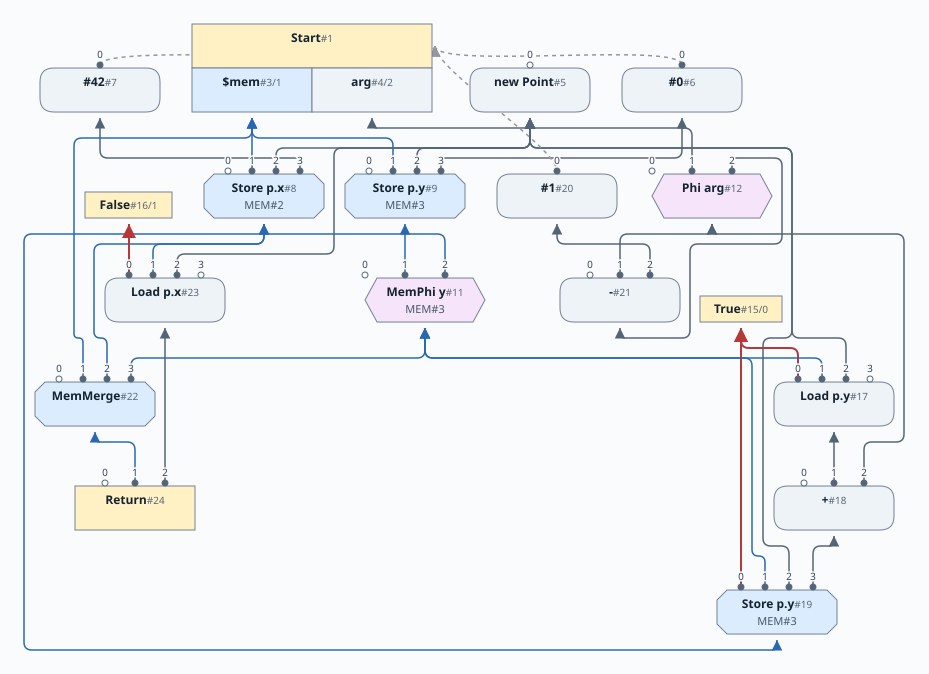
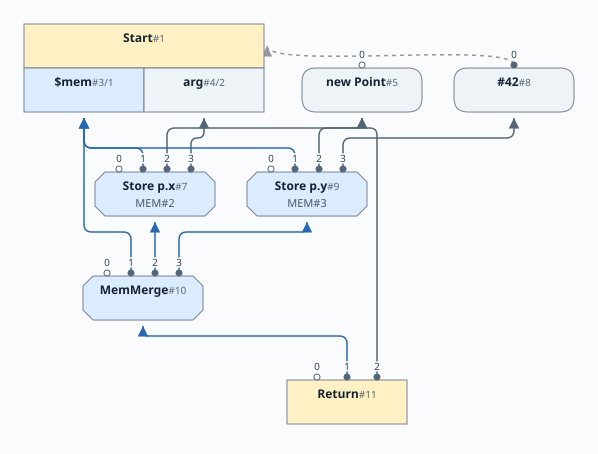
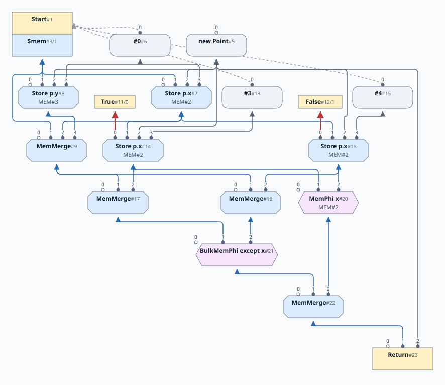
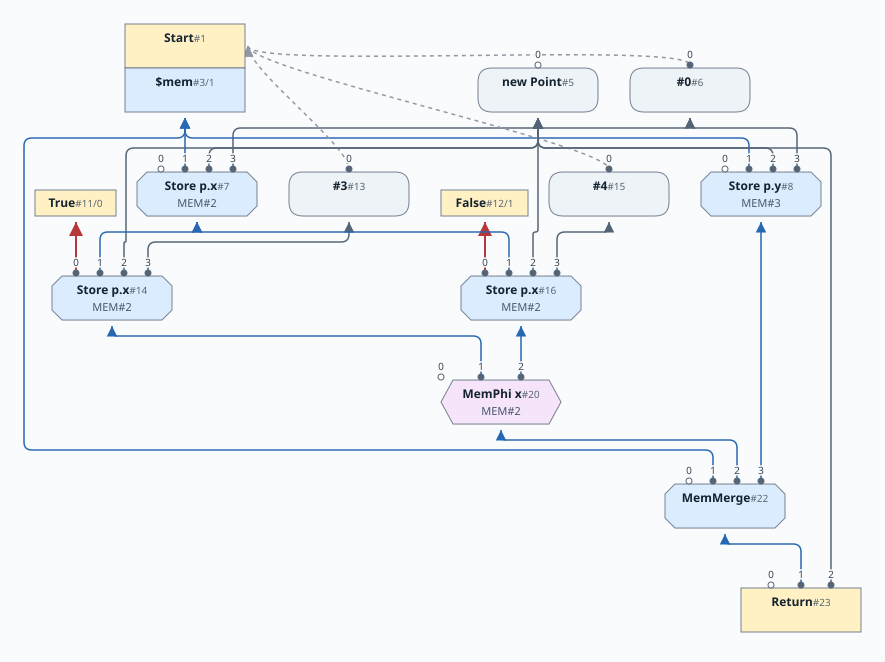
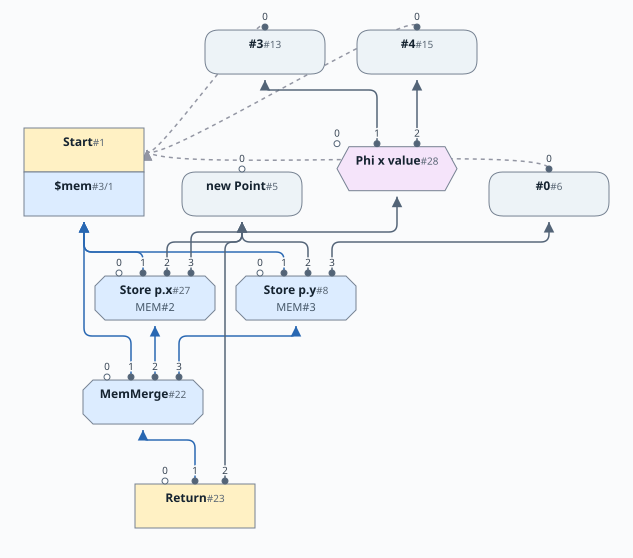

# 第11章: メモリの分割

[English](README.md) | 日本語

[前: 第10章](../chapter10/README.ja.md) |
[次: 第12章](../chapter12/README.ja.md)

この文書は [原文](README.md) の日本語訳です。

第10章では、1つの SSA メモリ値でメモリへの作用を明示しました。この章ではパーサーのモデルをそのまま維持し、グラフの書き換えによって独立したメモリ鎖を復元します。新しい言語構文はありません。[文法](../chapter10/10-grammar.ja.md)、ポインタ型、null チェックは変わりません。

## なぜメモリを分割するのか

```java
struct Point { int x; int y; }
Point p = new Point;
p.x = 42;
while (arg > 0) {
    p.y = p.y + arg;
    arg = arg - 1;
}
return p.x;
```

ループが変更するのは `y` なので、`x` に影響できません。メモリ鎖が1本だと、`x` のロードはループのストアの後に続きます。フィールドを分割すれば、通常のストア後のロードへの値の転送によって、戻り値を 42 にできます。



グラフは、最後の Load を畳み込む前の分割された鎖を示します。そのメモリ入力は、ループの `y` の鎖を迂回して 42 の Store に直接つながります。第10章と同様、小さく切り離された True/False 射影は、Load と Store を制御するソースの分岐を示します。Loop とその Phi 束縛を含む、ほかの制御フローの文脈は省略しています。グラフが示すのは実行順序ではなく依存関係です。

## 同値類によるエイリアシング

各構造体フィールドは整数のエイリアス識別子を持ちます。別のフィールドには、異なる構造体で同じ綴りを持っていても、別の識別子を与えます。*同じ*構造体の2つのインスタンスは、フィールドのエイリアスを共有します。したがって異なるクラス間では決してエイリアスしませんが、同じクラス内のアクセスは**エイリアスする可能性があります**（同じクラスであることは同じアドレスを意味しません）。ポインタの同一性は、依然として確認する必要があります。

パーサーは構造体の宣言時に、alias#2 から始めてフィールドの識別子を割り当てます。

宣言されたフィールドやエイリアスのそれぞれについて、Start 射影、スコープの束縛、ループ Phi を割り当てることはしません。Start が1つのメモリ値を供給し、Scope が1つの `$mem` 束縛を保持し、Return がメモリ全体を消費します: `{ctrl, $mem, result}`。Start の出力と同様、制御はスロット 0、メモリはスロット 1 にあります。最適化器は、グラフの演算が必要とする箇所にだけスライスを導入します。

## 3つのメモリノード

| ノード | 意味 |
|---|---|
| `MemMerge` | デフォルトと精密なエイリアスごとの上書きからなる完全なメモリ状態 |
| `MemPhi` | 流入する制御経路に従って選択される1つのエイリアス |
| `BulkMemPhi` | 明示した除外集合を除くすべてのエイリアスを、制御によって選択する |

`MemMerge` は、あるプログラム位置でメモリの独立した部分を組み合わせます。制御フローの合流ではありません。たとえばエイリアス `x` へのストア後は、次のようになります。

```text
prior = current memory
store = Store_x(prior, pointer, value)
current memory = MemMerge(default=prior, x=store)
```

MemMerge はスロット 1 にデフォルトのメモリを持ち、それと異なる場合にはほかのスロットに精密なエイリアスを持ちます。Load、Store、MemPhi は、入力の MemMerge から精密な入力を選択し、可能なら精密なエイリアス入力を使います。

明示的なエイリアスはデフォルトを上書きします。エイリアスのスライスは互いに交わらず、その和集合はすべてのメモリを覆います。積み重なった MemMerge を平坦化するときは、外側の MemMerge が置き換えていないエントリを保持します。

以下のグラフは、冗長な初期化ストアを除去した後の `p.x = arg; p.y = 42; return p;` を示します。MemMerge はスロット 1 にデフォルトのメモリを、スロット 2 と 3 に `x` と `y` の上書きを受け取ります。



## メモリ Phi の分割

パーサーは最初に、通常の SSA アルゴリズムでメモリの合流が必要な箇所に BulkMemPhi を作ります。合流点の確定中は、除外集合を空としてすべてのエイリアスを覆うところから始めます。その後、ピープホール最適化によって、必要に応じて遅延的に、ひとまとめのメモリから精密なメモリスライスを分離します。

この変換により、ひとまとめのメモリから精密な単一エイリアスを分離できます。

```text
BulkPhi(R, left, right)
    becomes
MemMerge(
    default = BulkPhi_except{x}(R, left, right),
    x       = MemPhi_x(R, slice(left,x), slice(right,x)))
```

「BulkPhi は、（そのエイリアスを除いた）BulkPhi と（そのエイリアスの）MemPhi をまとめる Merge になる」。

新しい精密な Phi と残りのひとまとめの Phi は、Region（図では省略）と一致する制御経路の添字を共有します。ループでも同じ変換を使い、入力の中に後退エッジが含まれます。さらに分割しても、すでに抽出したスライスをすべて保持します（積み重なった分割はピープホール最適化で整理します）。

ここでは2つの分岐が `p.x` に 3 または 4 を格納してから `p` を返します。グラフは、ひとまとめの Phi とその入力の集約をさらに簡略化する前、`x` を抽出した直後の分割を示します。

```java
struct Point { int x; int y; }
Point p = new Point;
if (arg) p.x = 3;
else     p.x = 4;
return p;
```



このグラフから先に進めると、たとえば次の順でピープホール最適化が発動します。

**入力の MemMerge を平坦化してから、`y` を分割します。** MemMerge #17 と #18 は #9 から `y` のスライスを継承しますが、それぞれ自身の `x` の上書きが優先します。両者のデフォルトは Start のメモリとなり、#9 は使われなくなります。BulkMemPhi #21 は `x` を除外しますが、まだ `y` を覆うので、これらの MemMerge を単に迂回することはできません。`y` の MemPhi #24 を抽出し、両フィールドを除外した BulkMemPhi #25 を作ります。追加の MemMerge #26 がこれらのスライスを組み合わせます。


**変更のないメモリを畳み込みます。** MemPhi #24 の両入力は同じ初期化 Store #8 なので、その Store になります。BulkMemPhi #25 は、今度は #17 と #18 を透かして見ることができます。それらの明示的なエイリアスはすべて、その領域から除外されているためです。残る両入力は Start のメモリになり、このひとまとめの Phi も畳み込まれます。出力側の集約を平坦化すると、MemMerge #22 には Start からのデフォルトメモリ、MemPhi #20 からの `x`、Store #8 からの `y` が残ります。



**Store をくくり出してから、上書きされた初期化を取り除きます。** ひとまとめの Phi と入力の集約がなくなると、Store #14 と #16 を使うのは MemPhi #20 だけになります。これらは同じポインタとエイリアスに格納し、同じ入力メモリを共有します。`PhiNode` は Store を合流の下に引き下げられます。

```text
MemPhi_x(Store_x(mem, p, 3), Store_x(mem, p, 4))
    becomes
Store_x(mem, p, Phi(3, 4))
```

一般に Phi の組み替えでは、第10章と同じく、Load や Store を押し上げたり引き下げたりして組み合わせられます。Phi の新しいメモリオペランドには、そのエイリアスの精密な MemPhi を使えます。このピープホール変換は精密なエイリアスを必要とし、BulkMem があると妨げられます。そのため、BulkMem を分割するきっかけにもなります。

例の続きを見ると、新しい値の Phi #28 は true 側で 3、false 側で 4 を選びます。Store #27 が両分岐の Store とそのメモリ Phi を置き換えます。初期の `p.x = 0` の Store #7 は、この1つの Store だけをユーザーに持つようになり、連続するストアの除去で迂回されます。`p.y = 0` の Store #8 は残ります。オブジェクトを返すので、その `y` フィールドは引き続き初期化が必要です。



したがって最終グラフには、2つの Store、通常の値の Phi が1つ、MemMerge が1つあり、MemPhi も BulkMemPhi も残りません。ワークリストの順序が違えば、たとえば元の入力 MemMerge を平坦化前に迂回し、一時的な `y` の分割を避けられる場合もあります。

このメモリ分割変換は大きくグラフに介入するため、再帰的に呼び出すことを禁止します。ループの周囲を分割することはよいのですが、その途中にあるループ先頭を分割しようとすると問題になります。分割で生まれた新しいノードをワークリストに入れ、現在の分割が完了してから訪問します。これによって、ループを巡るメモリを安全に完全分割できます。

ひとまとめの Phi は複数のエイリアスを合流するため、MemMerge に対してピープホール最適化をするときに注意が必要です。MemMerge の精密な合流と、ひとまとめの Phi が重複してはいけません。

これは第9章のワークリストの教訓も拡張します。ひとまとめの Phi は自分のユーザーを調べるので、ユーザーの分割が変わったら生成側を起こす必要があります。それが `addDep()` の仕事です。MemMerge からスライスを選ぶと、新しいひとまとめの Phi のユーザーが露出することがあります。その選択された定義もキューに入れなければなりません。つまり MemMerge、MemPhi、BulkMemPhi を扱うときには、非局所的な依存関係を想定する必要があります。

メモリ分割でノード数が増えることもありますが、Phi（Mem、Bulk、その他）はコードを生成しません。前進は、ひとまとめの Phi からエイリアスを抽出し、一部の Load と Store を除去することで得られます。すべての書き換えにグラフの縮小を求めるのではありません。言い換えれば、MemPhi 数が増えても、Load/Store の総数は減っています。

## 型

型の束は、第10章の6つの領域、色、記法を維持します。`⊤` はトップ、`⊥` はボトムを意味し、接尾辞は領域を示します。ほかの5領域は変わりませんが、メモリには、メモリトップ（`TypeMem.TOP`）とメモリボトム（`TypeMem.BOT`）の間に、精密なエイリアスごとの平坦な要素 `MEM#N` が加わります。


並列の `MEM#2`、`MEM#3`、さらにほかのエイリアス要素は、独立したフィールドスライスを表します。上の最初の `Point` 宣言では、この2つのエイリアスは `Point.x` と `Point.y` を識別します。異なるエイリアスの meet はメモリボトム、join はメモリトップです。精密なエイリアスはそれぞれ自分自身の双対です。（省略記号は並列なエイリアスがさらにあることを示し、エイリアスの集合を表す型ではありません。）

## 評価と順序付け

MemMerge は依存関係のノードであり、メモリを上書きしません。コードも出力しません。評価器での結果はメモリトークンですが、Store は実際にオブジェクトのフィールドを変更します。スケジューラは、メモリをまとめることと上書きすることを区別しなければなりません。異なるエイリアス類の Store はロード/ストアの反依存を課しませんが、同じ類の Load には反依存が必要です。

`int old = p.x; p.x = arg; p.y = arg; return old;` では、Load は後続の `x` の Store より前でなければならず、`y` の Store は独立したメモリ鎖を持ちます。グラフでは、局所的な畳み込み前のこのスケジューリング要件を示すため、Load を残しています。


この章には多くのテストがあります。独立したフィールドの畳み込み、並列のメモリ Phi、複数のフィールド更新が Return で保持されること、早期 return、break/continue を伴う入れ子のループ、エイリアスする可能性のあるポインタ経由の後続ストアより前の読み出しを扱います。

## 後の章に残ること

第11章では、パース中にすべてのアクセスのエイリアスがわかっています。ここで遅延するのは、メモリ分割の構築です。第25章では（同じ表現を使いながら）既存のアクセスのエイリアスが*後になって*わかることも許し、さらに不完全な型、モジュールのエイリアス、分割コンパイルなど、多くの利点を可能にします。

第12〜24章はこの表現を使います。第13章では大域的コード移動とロード/ストアの反依存を追加します。第15章では部分メモリと型付きエイリアス内容を伴う割り当てを追加します。第16章では初期化をコンストラクタの値に拡張し、第18章では関数呼び出しをまたいでメモリ全体を運びます。

## ビルドとテスト

JDK 21 以降を使い、このディレクトリで実行します。

```sh
make lib
make tests
make release
make view
```

Make は Maven を使わず、この完全なスナップショットをビルドします。`make release` は `build/release/simple.jar` を書き出し、`make view` は共通のグラフビューアを起動します。ルートの Maven reactor と提供される IDEA のモジュール記述の両方に本章が含まれます。リポジトリのルートから、前後両方をテストするには次を実行します。

```sh
make tests CHAPTERS="chapter10 chapter11"
```

次の[第12章](../chapter12/README.ja.md)では、このメモリ表現を維持したまま参照フィールドと再帰構造体を追加します。
