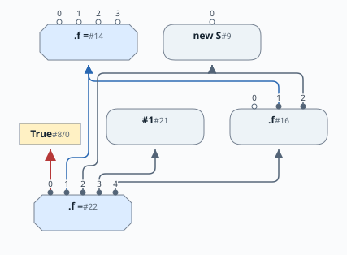
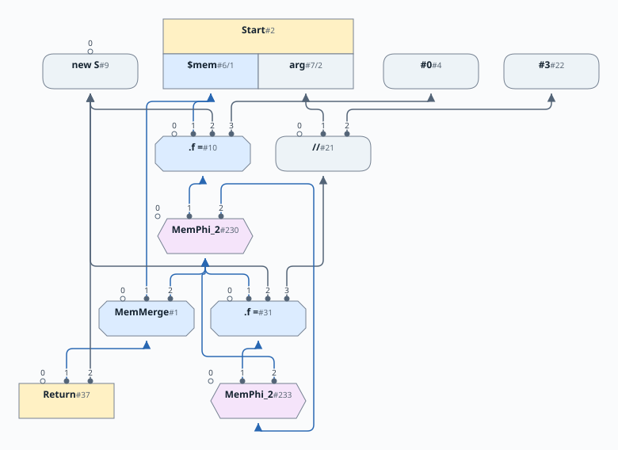
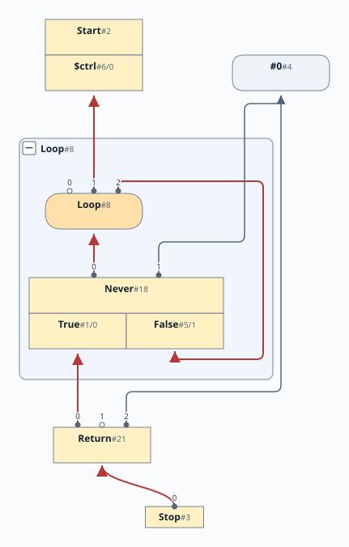

# 第13章: 大域的コード移動

[English](README.md) | 日本語

[前: 第12章](../chapter12/README.ja.md) |
[次: 第14章](../chapter14/README.ja.md)

この文書は [原文](README.md) の日本語訳です。

この章では、第10〜12章で構築した、参照フィールドと遅延的なメモリ分割を含むグラフをスケジュールします。移動可能な演算のスロット 0 の制御入力を選び、エイリアスする可能性がある Load と Store の順序を維持します。

また、この章ではかなり詳しいグラフアルゴリズムをいくつか紹介します。グラフ理論を復習しておくとよいでしょう。

文法は[第12章](../chapter12/12-grammar.ja.md)から変わりません。

# 目次

1. [概要](#概要)
2. [スケジューリングの例を追う](#スケジューリングの例を追う)
3. [ループのスケジューリング](#ループのスケジューリング)
4. [大域的コード移動アルゴリズムの構成要素](#大域的コード移動アルゴリズムの構成要素)
5. [SoN グラフ内の基本ブロックの識別](#son-グラフ内の基本ブロックの識別)
6. [無限ループの処理](#無限ループの処理)
7. [支配ノード](#支配ノード)
8. [ループ深度](#ループ深度)
9. [早期スケジュール](#早期スケジュール)
10. [遅延スケジュール](#遅延スケジュール)
11. [反依存の挿入](#反依存の挿入)
12. [動画での解説](#動画での解説)

[linear](https://github.com/SeaOfNodes/Simple/tree/linear) ブランチの線形な Git リビジョン履歴で[この章](https://github.com/SeaOfNodes/Simple/tree/linear-chapter13)を読み、前章との[差分](https://github.com/SeaOfNodes/Simple/compare/linear-chapter12...linear-chapter13)を見ることもできます。

元の入力ソースプログラムは、物事が起こる順序を定義します。プログラムを Sea of Nodes 表現にパースし、さまざまな最適化を行うと、その順序は完全には維持されません。最適化された Sea of Nodes グラフを動かすのは、元のソースプログラムの命令列ではなく、ノード間の依存関係です。

この章の目標は、最適化された Sea of Nodes グラフから、命令を実行するスケジュールをどう復元するかを見ることです。このスケジュールは、元のソースプログラムの意味論を保持する必要がありますが、それ以外は命令の実行を並べ替えてかまいません。

スケジューリングアルゴリズムは SoN グラフ内の暗黙の基本ブロックをまたいで働くため、大域的コード移動アルゴリズムと呼びます。スケジューラは基本ブロックの境界を越えて命令を移動できます。

このアルゴリズムの主な参考文献は GCM GVN 論文 [^1] です。ただし Simple の実装には、論文で説明された版と異なる点があります。

複雑な話題なので、まず概要を示してから詳しく見ていきます。

## 概要

Sea of Nodes グラフには、2つの仮想的なグラフが含まれています。

* Start、If、Region など、特定のノード型が表す制御フローグラフがあります。
* 主として、値やメモリを生成・消費するノード間の定義と使用のエッジ（Def-Use）によって成り立つデータグラフがあります。

スケジューリングの観点では、制御フローグラフは固定され、動かせません。一方、データ値やメモリを消費・生成するノードには、実行する時点にある程度の自由があります。スケジューリングアルゴリズムの目標は、これらのノードについて、最適かつ正しい配置を見つけることです。

中心となるスケジューリングアルゴリズムは2段階で働きます。

* 早期スケジュール: この段階では末端（Stop）から始めて、各 Node の「入力」を上向きに DFS でたどります。各データノードを、その入力に支配される最初の制御ブロックに配置します。
* 遅延スケジュール: この段階では Stop から逆向きに、定義より先に使用をスケジュールします。そしてデータノードを、上で計算した最初のブロックと、すべての使用を支配する最後の制御ブロックの間に移動します。配置は、可能な限り浅いループの入れ子に置き、かつできるだけ制御に依存させるという条件に従います。さらに Load 命令の配置では、同じメモリ位置に対する Load と Store の順序を正しくする必要があります。

## スケジューリングの例を追う

各手順を詳しく説明する前に、例を追ってスケジューリング中に SoN グラフがどう変わるかを見ると理解の助けになります。

説明のために、次のプログラムを使います。

```java
struct S { int f; }
S v=new S;
v.f = 2;
int i=new S.f;
i=v.f;
if (arg) v.f=1;
return i;
```

まずスケジューリング前のグラフを見ましょう。

この説明用の図は、精密な `S.f` の鎖と、Return が消費する最後の MemMerge を示します。変更されないデフォルトのメモリは Start から来ており、冗長なひとまとめの Phi は畳み込まれて消えています。第10章・第11章と同じく、Region とその Phi 束縛を含む制御フローの文脈は省略しています。Load や Store を制御する箇所には、小さく切り離された True/False 射影が残っています。第10章の模式的なソース上の制御とは異なり、これらの図は各段階の実際のスケジューリング入力を示します。入口ブロックと Loop の束縛は省略しています。


次の点に注目してください。

* 制御ノードは動かせません。ここでは大部分を省略しています。
* New ノードにはすでに制御入力があり、Phi は Region に束縛されています。これらの束縛は図示していなくても固定のままです。
* ロード `.f` とストア `.f=` のノードはまだ「浮いて」います。この段階では制御入力がないため、スケジューリングでそのブロックを選ぶ必要があります。

次に、早期スケジュール実行後のグラフを見ましょう。


早期スケジュールは、入力がそこで利用できるため、ロード `.f` とストア `.f=` を最初の基本ブロックに置きます。この入口ブロックへの制御束縛は省略しているので、メモリの図は変わっていないように見えます。

以下のグラフは、遅延スケジューリング後のメモリとデータの依存関係に注目しています。Region を含む制御フローの骨組みは省略しています。Store #22 の制御入力は、独立した True 射影 #8 への赤いエッジとして見えます。Store から Load への反依存とメモリ Phi は残しています。


以下の抜粋は、グラフの主な変更を示します。



* ストア `.f=` は、ロード `.f` に対する反依存を持つようになりました。これにより、プログラムの意味論が要求する通り、ストアがロードより後にスケジュールされます。反依存は後で詳しく扱います。
* ストア `.f=` が If ノードの True 分岐に束縛されたことにも注目してください。

## ループのスケジューリング

今度はループを含む別の例を示します。

```java
struct S { int f; }
S v = new S;
int i = arg;
while (arg > 0) {
    int j = i/3;
    if (arg == 5)
        v.f = j;
    arg = arg - 1;
}
return v;
```

スケジューリング前の SoN グラフは次のようになります。


早期スケジュールを生成すると、次を得ます。



早期スケジュールは Store #31 をループ先頭に配置します（制御束縛は省略）。遅延スケジューリングは、それを `if (arg == 5)` の True 分岐 #15 に移します。赤い制御エッジがそれを示します。


最終的な実行スケジュールでは、式 `i/3` はループの外で実行できます。`arg` の元の値だけに依存するため、ループ不変だからです。

## 大域的コード移動アルゴリズムの構成要素

上では GCM アルゴリズムの構成要素のいくつかに触れました。ここで、まだ触れていないものも含めて列挙します。

* SoN グラフの制御フローノードには、暗黙の基本ブロックがあります。GCM アルゴリズムでは、これらのノードをもっと明示的に認識する必要があります。
* プログラムに無限ループがあると、Stop ノードから到達できないノードが生じ、アルゴリズムに問題をもたらします。対処するため、無限ループを発見し、ループから Stop ノードへのダミーエッジを作る必要があります。
* Simple の SoN グラフではループをすでに識別しているため、ループ発見の手順は不要です。ただし、各 CFG ノードに関連するループ深度を計算する必要があります。
* [第6章](../chapter06/README.ja.md)で支配ノードの概念を説明しました。支配ノードは GCM アルゴリズムの要なので、段階的な支配ノード発見アルゴリズムを、その要件を満たすように拡張します。
* アルゴリズムの2段階、早期スケジューリングと遅延スケジューリングはすでに述べました。
* さらに、特定の場面では、正しい実行順序を強制するため Load と Store の間に反依存エッジを追加する必要があります。
* GCM アルゴリズムの実装を容易にするため、Node 階層にいくつか変更を加えます。これらは、前の章から引き継いだ Node 階層を概念的に変えるものではありません。

## SoN グラフ内の基本ブロックの識別

Sea of Nodes グラフは、プログラムの制御フローグラフをすでに捉えています。この情報は、制御ノードと、制御ノードからほかの型のノードへのエッジに暗黙に含まれます。

復習すると、制御は Start ノードで、`$ctrl` という名前に束縛された射影を介して始まります。プログラム中を制御が流れるにつれて、この名前の束縛は更新され、制御が受け渡され、最終的に Stop ノードに到達します。

ある制御ノードは基本ブロックを開始し、別のものは基本ブロック（BB）を終了すると認識すれば、CFG の基本ブロック構造を簡単に構築できます。

すべての制御ノードを列挙します。

| ノード | BB を開始する | BB を終了する |
|---|---|---|
| Start | はい。ただし `$ctrl` 射影を介してのみ | いいえ |
| CProj | 入力制御が If ノードなら、はい | いいえ |
| Region | はい | いいえ |
| If | いいえ | はい |
| Return | いいえ | はい |
| Stop | はい | はい |

この章における Node 階層の変更は次の通りです。

* 上のすべての制御ノードは、基底クラス CFG Node を継承するようになります。これによって、制御フローノードの共通機能を基底クラスに置けます。
* CProj ノードは通常の Proj ノードを継承し、次の場合に使います。
  * Start からの `$ctrl` 射影
  * If からの True と False の射影
* Never ノードは If の特別なサブクラスで、後述するように無限ループの処理に使います。
* XCtrl ノードは死んだ制御を表します。

## 無限ループの処理

無限ループを含むコードの例です。

```java
while (1) {}
return 0;
```

まず、その結果のグラフを見ましょう。


次に、無限ループから Stop ノードへのエッジを挿入した後の、変更されたグラフを見てください。



実装は [`LoopNode.forceExit()`](../../src/main/java/com/seaofnodes/simple/node/LoopNode.java#L57) にあります。後退エッジの支配ノードの鎖をたどり、出口を探します。出口がなければ Never ノードと、決して通らない return 経路を挿入し、スケジューラの逆向きの探索でループに到達できるようにします。

## 支配ノード

Simple では支配ノードを段階的に計算します。ピープホール最適化でグラフの一部を削除することはあっても、新しい制御構造を導入することはないという性質を利用します。これにより、以下の単純な方法を使えます。

CFG ノードはすべての制御ノードの基底クラスです。`_idepth` を通して、支配深度の保守的な近似を保持します。このフィールドは直近の支配ノードの深度を表すキャッシュ値です。初期値 `0` は未計算を意味し、要求時に深度を計算します。

デフォルトの計算とキャッシュは [`CFGNode.idepth()`](../../src/main/java/com/seaofnodes/simple/node/CFGNode.java#L51) を参照してください。[`RegionNode`](../../src/main/java/com/seaofnodes/simple/node/RegionNode.java#L94)、[`LoopNode`](../../src/main/java/com/seaofnodes/simple/node/LoopNode.java#L31)、[`StartNode`](../../src/main/java/com/seaofnodes/simple/node/StartNode.java#L36)、[`StopNode`](../../src/main/java/com/seaofnodes/simple/node/StopNode.java#L58) のオーバーライドは、合流、ループ入口、グラフの端点を扱います。

制御フローグラフの一部を削除すると、`_idepth` に飛びが生じますが、支配木を下るにつれて `_idepth` の値が増えるという不変条件は依然として正しく反映されます。

最初の計算時にキャッシュする支配深度とともに、直近の支配ノードを得るメソッドを提供します。この値は、ある時点でのみ有効であり、グラフが変わると無効になるためキャッシュしません。

[`CFGNode.idom()` と `domLCA()`](../../src/main/java/com/seaofnodes/simple/node/CFGNode.java#L60) は、デフォルトの直近の支配ノードと、2つの支配ノードの最小共通祖先を見つける探索を提供します。[`RegionNode.idom()`](../../src/main/java/com/seaofnodes/simple/node/RegionNode.java#L103) は流入する経路を組み合わせ、[`LoopNode.idom()`](../../src/main/java/com/seaofnodes/simple/node/LoopNode.java#L33) はループ入口を使います。Start と Stop に直近の支配ノードはありません。

## ループ深度

Simple の Sea of Nodes グラフは、Loop ノードによってループを明示的に識別します。言語が提供するループの作り方は `while` 文だけなので、汎用的なループ発見処理を実装する必要はありません。

ただし、ループ深度を計算する必要はあります。支配深度の計算と似た方法で行います。

[`CFGNode.loopDepth()`](../../src/main/java/com/seaofnodes/simple/node/CFGNode.java#L78) は制御入力の深度を継承し、[`RegionNode.loopDepth()`](../../src/main/java/com/seaofnodes/simple/node/RegionNode.java#L116) は流入する経路を使います。[`LoopNode.loopDepth()`](../../src/main/java/com/seaofnodes/simple/node/LoopNode.java#L35) は入れ子を1段増やし、後退エッジの支配ノードの鎖をたどってループ出口に印を付けます。[`StartNode`](../../src/main/java/com/seaofnodes/simple/node/StartNode.java#L41) と [`StopNode`](../../src/main/java/com/seaofnodes/simple/node/StopNode.java#L68) は最も外側の深度を 1 にします。

## 早期スケジュール

GCM アルゴリズム本体は、早期スケジュールの計算から始まります。末端（Stop）から各 Node の「入力」を上向きに DFS でたどり、各データノードを、その入力に支配される最初の制御ブロックに配置します。

前提として、前述した方法で無限ループを修正しておく必要があります。

実装は [`GlobalCodeMotion.schedEarly()`](../../src/main/java/com/seaofnodes/simple/GlobalCodeMotion.java#L62) から始まります。[`_rpo_cfg()`](../../src/main/java/com/seaofnodes/simple/GlobalCodeMotion.java#L85) は CFG の走査順序を構築し、[`_schedEarly()`](../../src/main/java/com/seaofnodes/simple/GlobalCodeMotion.java#L94) はデータ入力を再帰的にスケジュールします。制御をスケジュールする前にデータのサイクルへ入ることを避けるため、Phi 入力を通る再帰は飛ばします。

既存の制御および Phi/Proj の束縛は維持します。浮いているノードには、最も深い入力ブロックを最も早い配置として与えます。MemMerge も、疎なエイリアステーブル内の存在しないエントリを無視して、同じ規則に従います。

## 遅延スケジュール

遅延スケジューリングは Stop から始め、ワークリストを使って定義より先に使用を配置します。CFG ノード、Phi、射影、割り当ては固定の配置を与えます。ほかのノードは、自分の使用がスケジュールされるまで待ちます。Load は、自分のエイリアスを上書きしたり合流したりできるメモリユーザーも待ちます。選ぶブロックは、早期配置とすべての使用の共通支配ノードとの間にあり、浅いループを優先し、その次に深い制御フローを優先します。

実装は次の手順に分かれます。

* [`schedLate()`](../../src/main/java/com/seaofnodes/simple/GlobalCodeMotion.java#L114) は配置テーブルを管理し、最終的な制御入力を設定します。[`breadth()`](../../src/main/java/com/seaofnodes/simple/GlobalCodeMotion.java#L129) はワークリストを駆動し、使用が完了すると定義と待機中のロードを起こします。
* [`_doSchedLate()`](../../src/main/java/com/seaofnodes/simple/GlobalCodeMotion.java#L175) は使用の共通支配ノードを見つけ、ロードの反依存を考慮して、早期配置に向かってたどります。[`better()`](../../src/main/java/com/seaofnodes/simple/GlobalCodeMotion.java#L215) を呼び出し、候補ブロックを比較します。
* [`use_block()`](../../src/main/java/com/seaofnodes/simple/GlobalCodeMotion.java#L202) は Phi の使用を、合流そのものではなく、対応する流入制御経路で扱います。

## 反依存の挿入

同じメモリ位置への Load と Store を正しく順序付けるため、以下のように Store から Load へのエッジを挿入します。Store は、先行する Load を待たなければなりません。これらのエッジは、通常 SoN で捉える Def-Use の依存関係を表さず、純粋にスケジューリングの制約として存在するため、反依存と呼びます。

反依存は、遅延スケジュールの実行**中**に計算します。早期スケジュールと、Load をスケジュールする前に得られる Load の使用の遅延スケジュールに依存するためです。

Load から後ろを見て、そのメモリ入力を Start のメモリ射影、メモリ Phi、または Store までたどります。最適化によって、MemMerge を通る Load の精密なスライスはすでに選択されています。そのメモリ定義のユーザーを調べ、Load のエイリアスを覆う Store とメモリ Phi だけを残します。Start の1つのメモリ射影は多数のエイリアスを供給する可能性があるので、メモリ入力を共有するだけで反依存があるとは限りません。

MemMerge はスライスを包むだけで、どれも上書きしません。これを書き込みとして扱うと、Load 自身の結果に依存する集約を Load が待つことになり得ます。Load をスケジュールする準備ができたかどうかの判断と、反依存の計算には、同じエイリアスのフィルタを使います。完了したメモリユーザーは、共有するメモリ定義がすでにスケジュールされていても、待機中のロードを起こします。

`schedLate` の途中なので、Load のすべてのユーザーの遅延スケジュールはすでに計算済みで、Load の使用の*最小共通祖先*、すなわち LCA または遅い位置を持っています。Load に影響し得るメモリ定義の集合を調べ、Store から Load への反依存を追加するか、Load の実効的な LCA を上げます。Phi のメモリ定義では Phi の入力を調べ、そのブロックに実効的な使用を置きます。これを Load の LCA を上げるために使います。ストアでも同じことを行いますが、Load の LCA と**同じ**ブロックのストアが見つかったら、同一ブロック内の順序を強制する反依存エッジを追加します。

エイリアスのフィルタは [`antiUse()`](../../src/main/java/com/seaofnodes/simple/GlobalCodeMotion.java#L224)、Load の候補ブロックへの印付けと競合するメモリユーザーの調査は [`find_anti_dep()`](../../src/main/java/com/seaofnodes/simple/GlobalCodeMotion.java#L233) を参照してください。[`anti_dep()`](../../src/main/java/com/seaofnodes/simple/GlobalCodeMotion.java#L260) は、競合する演算の支配区間をたどり、Load の LCA を上げ、必要なら Store から Load へのエッジを追加します。評価器のスケジューラは GCM と独立してその Store を配置する可能性があるため、Store の区間全体をチェックします。

## 動画での解説

実装を詳しくたどるには、以下の動画をご覧ください。

* [Coffee Compiler Club - 2024年6月21日](https://youtu.be/5Po0gxfE7LA?feature=shared)
* [Coffee Compiler Club - 2024年6月26日](https://www.youtube.com/watch?v=HnN2YzmFb-8&t=0s)

[^1]: Cliff Click. (1995).
  Global Code Motion Global Value Numbering.

次の[第14章](../chapter14/README.ja.md)では、このスケジュール済みコンパイラに浮動小数点演算と狭い数値型を追加します。
