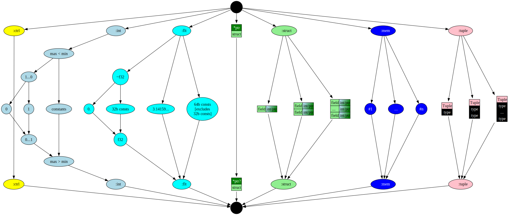

# Chapter 14: Narrow types

# Table of Contents

1. [Narrow Word Types](#narrow-or-sub-word-types)
2. [OverFlow handling](#overflow-handling)
3. [Integer ranges](#integer-ranges)
4. [Bitwise operations](#examples)
5. [Precedence](#precedence)
6. [Type lattice](#type-implementation)
7. [Nodes](#nodes)


In this chapter, we add sub-word integer types.

You can also read [this chapter](https://github.com/SeaOfNodes/Simple/tree/linear-chapter14) in a linear Git revision history on the [linear](https://github.com/SeaOfNodes/Simple/tree/linear) branch and [compare](https://github.com/SeaOfNodes/Simple/compare/linear-chapter13...linear-chapter14) it to the previous chapter.

## Narrow or sub-word types

Narrow or sub-worded integer types refer to integer data types that occupy less memory (fewer bits) than the standard or "full-width"(Typically 32, or 64 bits) integer types provided by a system or programming language.


As a prelude to arrays, especially arrays of bytes common in all networking
codes, Simple needs some way to manipulate sub-word integer types.
Computations are always done in 64 bits for both integer and float ops, but
will be truncated (rounded) on a variable or field assignment, and (sign)
extended on a load.

```java
i8 x = 123456789;
if( x != 21 ) 
  return false;
return true;
```

The variable `x` is limited to 8 bits signed.  Assigning the vary large value
`123456789` (hex `0x75BCD15`) simply truncates to 8 bits yielding `21 (0x15)`.
The value is sign-extended on a load.

```java
i16 x = 123456789;
if( x != -13035 ) 
  return false;
return true;
```

The variable `x` is limited to 16 bits signed.  Assigning the vary large value
`0x75BCD15` simply truncates to 16 bits yielding `0xCD15`.  The value is
sign-extended on a load yielding `-13035 (0xFFFF FFFF FFFF CD15)`.

```java
u16 x = 123456789;
if( x != 52501 ) 
  return false;
return true;
```

The variable `x` is limited to 16 bits unsigned.  Assigning the vary large value
`0x75BCD15` simply truncates to 16 bits yielding `0xCD15`.  The value is
zero-extended on a load yielding `52501 (0x0000 0000 0000 CD15)`.

Similarly, floats can be limited to IEEE754 32-bit standard format and will be
rounded when assigned, and inflated to 64-bits when loaded.

The complete list of primitive types is now:

| Data Type | Size (Bits) | Description                                                  |
|-----------|-------------|--------------------------------------------------------------|
| `int`, `i64` | 64          | 64-bit signed integer, matching modern hardware.           |
| `u64`       | 64          | **Not implemented**, hints at behavior beyond 64-bit.      |
| `i32`       | 32          | 32-bit signed integer, sign-extended on load.              |
| `u32`       | 32          | 32-bit unsigned integer, zero-extended on load.            |
| `i16`       | 16          | 16-bit signed integer, sign-extended on load.              |
| `u16`       | 16          | 16-bit unsigned integer, zero-extended on load.            |
| `i8`        | 8           | 8-bit signed integer, sign-extended on load.               |
| `u8`        | 8           | 8-bit unsigned integer, zero-extended on load.             |
| `i1`        | 1           | 1-bit signed integer, sign-extended on load.               |
| `u1`        | 1           | 1-bit unsigned integer, zero-extended on load.             |
| `bool`      | 1           | Alias for `u1`.                                            |
| `flt`, `f64`| 64          | IEEE 754 64-bit floating-point number, often called a double. |
| `f32`       | 32          | IEEE 754 32-bit floating-point number.                     |

## Overflow handling

An integer overflow occurs when you attempt to store inside an integer variable a value that is larger than the maximum value the variable can hold.
There are several cases of overflow:

#### Unsigned(fixed-width) integer overflow:

```java 
u8 a = 255; 
u8 b = a + 1; // match u8 type against expr.type
// a = 256 
// u8 = [0...255]
return b;
```
The expression type does not match the type that was provided. expr: ConstantNode(256) t: u8(0, 255)
```java
private Node parseExpressionStatement() {
    Type t = type(); // u8 = [0...255]
    ...
    // expr.type = TypeInteger(256);
    // Auto-narrow wide ints to narrow ints
    expr = zsMask(expr,t);
}
```
Since it is unsigned we just do a bitmask on the new value that overflows the specified type:
The operands to the "bitwise AND" are the values(256) and the mask(255, max boundary).
This is called truncating.

`ZsMask:`
```java 
    // zero/sign extend.  "i" is limited to either classic unsigned (min==0) or
    // classic signed (min=minus-power-of-2); max=power-of-2-minus-1.
private Node zsMask(Node val, Type t ) {
    if( !(val._type instanceof TypeInteger tval && t instanceof TypeInteger t0 && !tval.isa(t0)) ) {
        if( !(val._type instanceof TypeFloat tval && t instanceof TypeFloat t0 && !tval.isa(t0)) )
            return val;
        // Float rounding
        return new RoundF32Node(val).peephole();
    }
    if( t0._min==0 )        // Unsigned
        return new AndNode(val,new ConstantNode(TypeInteger.constant(t0._max)).peephole()).peephole();
    // Signed extension
    int shift = Long.numberOfLeadingZeros(t0._max)-1;
    Node shf = new ConstantNode(TypeInteger.constant(shift)).peephole();
    if( shf._type==TypeInteger.ZERO )
        return val;
    return new SarNode(new ShlNode(val,shf.keep()).peephole(),shf.unkeep()).peephole();
}
```

The truncation is done by the `AndNode`:
```java
...
if( t0._min==0 )       // Unsigned
        return new AndNode(val,con(t0._max)).peephole();
```
Since they are constants, after calling peephole it truns into`256 & 255` = 0;
Output:
```
return 0; 
```

#### Maximum integer overflow
```java 
i64 a = 9223372036854775807; 
i64 b = a + 1;
return b;
```
When we are computing the addition, we make sure they don't overflow:

`AddNode.overflow:`
```java 
private static boolean overflow( long x, long y ) {
    if(    (x ^      y ) < 0 ) return false; // unequal signs, never overflow
    return (x ^ (x + y)) < 0; // sum has unequal signs, so overflow
}
```
`AddNode.compute`
```java 
...
// Fold ranges like {0-1} + {2-3} into {2-4}.
if( !overflow(i1._min,i2._min) &&
    !overflow(i1._max,i2._max) )
    return TypeInteger.make(i1._min+i2._min,i1._max+i2._max);
```
Here **x + y** overflows and becomes **negative**, x ^ negative = negative. Any negative number is less than 0, so it returns true.
If it **overflows** we just return the bottom type of TypeInteger.
```
       return TypeInteger.BOT; // []
```
However, in our case we are dealing with constants, so we just allow the overflow naturally here:
```java
// i1: 9223372036854775807
// i2: 1
// i1 + i2 will overflow.
return TypeInteger.constant(i1.value()+i2.value()); // -9223372036854775808;
```

#### Adding constant ranges
```java 
u8 a = 12; 
u8 b = 13;
u8 c = 124;
u8 d = a + b + c;
return d;
```
if `is_con` is true, then generally we can state: `min = max`.
Such that:
```java
public static TypeInteger make(boolean is_con, long con) {
    return make(is_con ? con : (con==0 ? Long.MAX_VALUE : Long.MIN_VALUE),
                is_con ? con : (con==0 ? Long.MIN_VALUE : Long.MAX_VALUE));
```
- This results in: 
```java
return make(con, con);
```

`value()` is only called in constants, e.g  `_min == _max;` invariants holds, then since
both `min_` and `max_` are equal, we can return either one.

This is the same as regular additions:
```java 
public long value() { assert isConstant(); return _min; } 
```

#### Truncate(2)

```java 
u8 a = arg;  // arg & 255
u8 b = arg;  // arg & 255(same as a)
u8 c = a + b; // (arg&255)*2, type = TypeInteger.BOT
return c; // (((arg&255)*2)&255), type = TypeInteger.U8 
```

Same as before, **arg** turns into **(arg&255)**, this node is then inserted into the **GVN** table and  **b** retrieves this value.
The AddNode peephole will change them into `((arg&255)*2`, and put on extra mask 
on the expression to keep it in the valid boundaries.


## Integer ranges
Link hacker's delight here.

For range math, visit:[^1]
## Bitwise operations
We support the following bitwise operators:
And `&`, Or `|`, Xor `^`, Shift left `<<`, Shift right `>>`, Shift right zero `>>>`

| Operator                 | Symbol  | Description                                                                                             |
|--------------------------|---------|---------------------------------------------------------------------------------------------------------|
| **And**                  | `&`     | Performs a bitwise AND operation.                                                                       |
| **Or**                   | `\|`        | Performs a bitwise OR (inclusive OR) operation.                                                         |
| **Xor**                  | `^`     | Performs a bitwise XOR (exclusive OR) operation.                                                        |
| **Shift Left**           | `<<`    | Shifts bits to the left, filling with zeros.                                                            |
| **Shift Right**          | `>>`    | Shifts bits to the right, any vacated bit postions are filled by replicating the value of the sign bit. |
| **Unsigned Right Shift** | `>>>`   | Shifts bits to the right, any vacated bit postions are always filled with zero                          |

Note `>>>` is a logical shift and not an arithmetic shift.

####  AndNode:

##### lhs & -1 = lhs;
```java 
// And of -1.  We do not check for (-1&x) because this will already
// canonicalize to (x&-1)
if( t2.isConstant() && t2 instanceof TypeInteger i && i.value()==-1 )
return lhs;

```

#### OrNode:
##### lhs | 0 = lhs;
```java
// Or of 0.  We do not check for (0|x) because this will already
// canonicalize to (x|0)
if( t2.isConstant() && t2 instanceof TypeInteger i && i.value()==0 )
return lhs;

```

#### Shift right
lhs >> 0 = lhs;
```java
// Sar of 0.
if( t2.isConstant() && t2 instanceof TypeInteger i && (i.value()&63)==0 )
    return lhs;
```

#### Shift left
lhs << 0 = lhs;
```java
// Shl of 0.
if( t2.isConstant() && t2 instanceof TypeInteger i && (i.value()&63)==0 )
    return lhs;

```
#### Unsigned right shift
lhs >>> 0 = lhs;
```java
// Shr of 0.
if( t2.isConstant() && t2 instanceof TypeInteger i && (i.value()&63)==0 )
return lhs;
```

#### XorNode:
##### lhs ^ 0 = lhs;
```java
// Xor of 0.  We do not check for (0^x) because this will already
// canonicalize to (x^0)
if( t2.isConstant() && t2 instanceof TypeInteger i && i.value()==0 )
    return lhs;

```
### precedence

Bitwise operators have the lowest precedence, e.g
```
arg + 123 & 3 = (arg + 123) & 3
```

## Type Implementation

The <font style="background-color:lightblue">TypeInteger type</font> class is
reworked to support a full range of min/max values.  At this time, only some
power-of-2 sized ranges are exposed to the programmer but the optimizer
internally supports all ranges.  The MEET operation takes the min-of-mins and
max-of-maxes.  The DUAL operation inverts the min and max.

Example: the constant `0` has `[0...0]`.

Example: the `bool` type has the range `[0...1]`.

Example: the `u8` type has the range `[0...255]`.

Example: the `i8` type has the range `[-128...127]`.

Example: the `dual` of `bool` is `[1...0]` (just swap min and max).

The <font style="background-color:aqua">TypeFloat</font> class is also reworked to support 32-bit and 64-bit sizes.



### meet:

Meet of two ranges:
```java
@Override
public Type xmeet(Type other) {
// Invariant from caller: 'this' != 'other' and same class (TypeInteger)
TypeInteger i = (TypeInteger)other; // Contract
return make(Math.min(_min,i._min), Math.max(_max,i._max));
}
```
Combine all values that could possibly occur within either range.

## Nodes

Added this Chapter are some bit-manipulation Nodes representing common hardware
ops to mask, shift, sign-extend and round bits.  The truncation and extension
logic uses these.  They are otherwise very similar to the previous
`Add/Sub/Mul/Div` Nodes but with slightly different constant math and
slightly different `idealize()` calls.


[^1]:  Hacker's delight.
    4-2 Propagating Bounds through Add's and Subtract's

